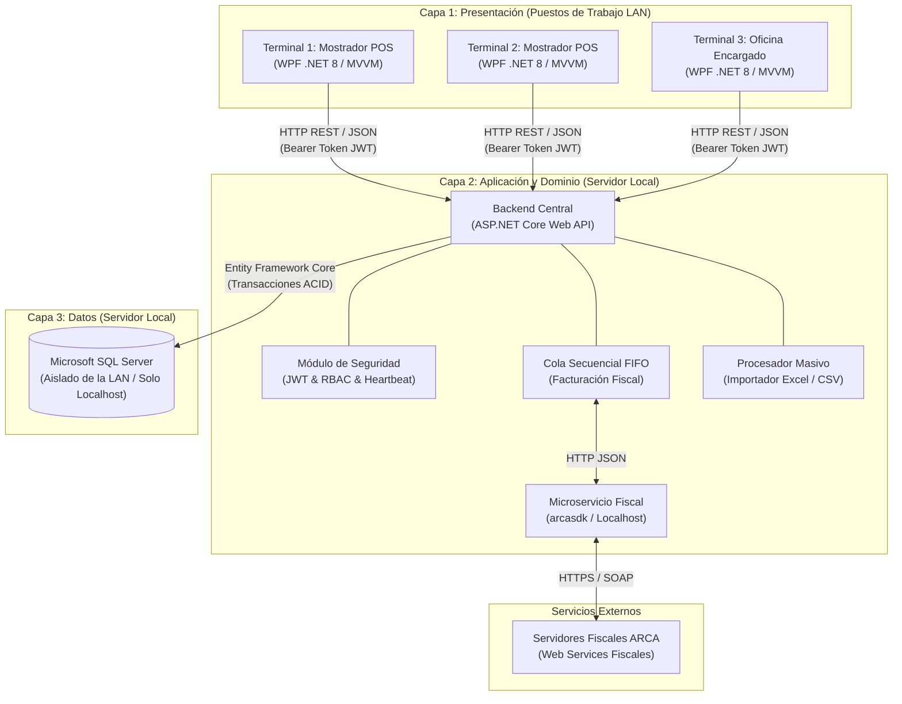
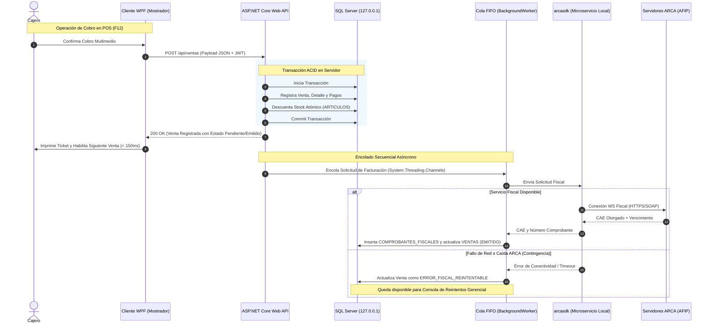

# Propuesta de Arquitectura y Estructura Global del Proyecto

### Proyecto: Retail (Sistema ERP & Punto de Venta para Librería)
**Fecha:** Agosto de 2026  
**Documentos de Referencia:** [DER.mmd](file:///c:/Users/lucas/Proyectos/retail/DER.mmd) y [ERS - Libreria POS.md](file:///c:/Users/lucas/Proyectos/retail/ERS%20-%20Libreria%20POS.md)  
**Estado:** Propuesta de Diseño Técnico y Arquitectura de Software

---

## 1. Justificación Arquitectónica: Servidor Web API vs. Cliente WPF Separados

En estricto cumplimiento con la **Arquitectura en 3 Capas (3-Tier)** especificada en la ERS, el sistema debe segregarse formalmente en un **Backend Servidor (ASP.NET Core Web API)** y un **Cliente de Escritorio (WPF .NET 8 / MVVM)** desacoplado:



### Razones Técnicas y Normativas:

1. **Aislamiento y Seguridad de Persistencia (`RNF-05`, `IC-02`):**
   * Microsoft SQL Server residirá en el servidor local y escuchará únicamente en `127.0.0.1:1433`.
   * Las terminales de mostrador de la LAN no tienen acceso directo ni credenciales a la base de datos, evitando riesgos de seguridad y fugas de datos.
2. **Centralización de la Cola Secuencial FIFO Fiscal (`RF-17`, `RF-18`, `IS-03`):**
   * La normativa tributaria de ARCA exige **correlatividad numérica estricta** en comprobantes fiscales.
   * La Web API centraliza las solicitudes de facturación encolándolas secuencialmente hacia el microservicio local `arcasdk`, evitando colisiones de números de comprobante o inconsistencias con el CAE si múltiples puestos facturan a la vez.
3. **Gestión Centralizada de Sesiones y Desalojo (*Kick-Out*) (`RF-02`, `RNF-04`):**
   * El backend valida credenciales, emite tokens JWT y supervisa en la tabla `SESIONES_ACTIVAS` que cada cuenta de usuario opere en una única terminal física, gestionando el *kick-out* y los pulsos periódicos de *heartbeat*.
4. **Procesamiento Masivo Asíncrono en Segundo Plano (`RF-07`, `RNF-02`):**
   * La importación de planillas de distribuidores (listas de $\ge 10.000$ filas) se procesa mediante un `BackgroundService` en el servidor, manteniendo la ventana del POS responsiva e interactiva sin sobrecargar las terminales.
5. **Transacciones Atómicas ACID y Control de Stock (`RF-10`, `RF-20`):**
   * Las ventas, devoluciones y compras ejecutan descuentos o incrementos atómicos en la base de datos relacional, evitando condiciones de carrera entre terminales concurrentes.

---

## 2. Estructura Global del Directorio y Proyectos .NET 8

Se define una solución única (`Retail.sln`) organizada bajo el enfoque de **Clean Architecture** (Arquitectura Limpia / Multicapa desacoplada), con un proyecto compartido para DTOs, Enums y Contratos de API:

```text
retail/
├── docs/                                # Documentación, especificaciones y diagramas
│   ├── DER.mmd
│   ├── ERS - Libreria POS.md
│   ├── ERS - Libreria POS.docx
│   └── Arquitectura y Estructura del Proyecto.md
│
├── src/
│   ├── Shared/
│   │   └── Retail.Shared/               # Biblioteca Compartida: DTOs, Enums, Contratos
│   │
│   ├── Backend/
│   │   ├── Retail.Domain/               # Entidades de Dominio, Reglas Puras, Enums
│   │   ├── Retail.Application/          # Casos de Uso, Servicios de Negocio, Validadores
│   │   ├── Retail.Infrastructure/       # EF Core, DbContext, arcasdk Client, Workers
│   │   └── Retail.Server.Api/           # ASP.NET Core Web API, Controladores, JWT Auth
│   │
│   └── Frontend/
│       └── Retail.Client.Wpf/           # Cliente de Escritorio WPF (.NET 8 con MVVM)
│
├── tests/
│   ├── Retail.Domain.UnitTests/
│   ├── Retail.Application.UnitTests/
│   ├── Retail.Server.Api.IntegrationTests/
│   └── Retail.Client.Wpf.UnitTests/
│
├── Retail.sln                           # Archivo de solución de Visual Studio / .NET CLI
├── .gitignore
└── README.md
```

---

## 3. Desglose Detallado por Componente

### 3.1. `Retail.Shared` (Biblioteca de Clases .NET 8)
*Capa transversal compartida sin dependencias de infraestructura ni UI. Define el contrato entre el Servidor y el Cliente.*

```text
src/Shared/Retail.Shared/
├── DTOs/
│   ├── Auth/
│   │   ├── LoginRequestDto.cs
│   │   ├── LoginResponseDto.cs
│   │   ├── KickOutRequestDto.cs
│   │   └── HeartbeatRequestDto.cs
│   ├── Ventas/
│   │   ├── CrearVentaDto.cs
│   │   ├── DetalleVentaDto.cs
│   │   ├── PagoVentaDto.cs
│   │   ├── VentaResponseDto.cs
│   │   └── DevolucionVentaDto.cs
│   ├── Presupuestos/
│   │   ├── CrearPresupuestoDto.cs
│   │   └── PresupuestoResponseDto.cs
│   ├── Articulos/
│   │   ├── ArticuloDto.cs
│   │   ├── CrearArticuloDto.cs
│   │   ├── ActualizarArticuloDto.cs
│   │   └── CatalogoProveedorDto.cs
│   ├── Proveedores/
│   │   ├── ProveedorDto.cs
│   │   └── ImportacionCatalogoRequestDto.cs
│   ├── Compras/
│   │   ├── CrearCompraDto.cs
│   │   └── DetalleCompraDto.cs
│   ├── Caja/
│   │   ├── AperturaTurnoDto.cs
│   │   ├── MovimientoCajaDto.cs
│   │   ├── ArqueoCiegoDto.cs
│   │   └── CierreTurnoResponseDto.cs
│   ├── Fiscal/
│   │   ├── ComprobanteFiscalDto.cs
│   │   └── ReintentoFiscalDto.cs
│   └── Usuarios/
│       ├── UsuarioDto.cs
│       ├── CrearUsuarioDto.cs
│       └── SesionActivaDto.cs
├── Enums/
│   ├── RolUsuarioEnum.cs                # Cajero, Encargado, Gerente
│   ├── EstadoTurnoEnum.cs               # ABIERTO, CERRADO
│   ├── TipoMovimientoCajaEnum.cs        # INGRESO, EGRESO
│   ├── TipoOperacionVentaEnum.cs        # VENTA_DIRECTA, PRESUPUESTO
│   ├── EstadoFiscalEnum.cs              # EMITIDO, ERROR_FISCAL_REINTENTABLE, NO_APLICA
│   ├── TipoComprobanteFiscalEnum.cs     # FACTURA_A, FACTURA_B, NOTA_CREDITO_A, NOTA_CREDITO_B
│   └── MedioPagoEnum.cs                 # EFECTIVO, TARJETA_DEBITO, TARJETA_CREDITO, TRANSFERENCIA_QR
└── Constants/
    ├── ApiRoutes.cs                     # Rutas estandarizadas de endpoints
    └── SecurityConstants.cs             # Claims, Nombres de Roles
```

---

### 3.2. `Retail.Domain` (Biblioteca de Clases .NET 8)
*Entidades del dominio, reglas de negocio e invariantes del modelo relacional según el DER.*

```text
src/Backend/Retail.Domain/
├── Entities/
│   ├── Usuario.cs
│   ├── Rol.cs
│   ├── SesionActiva.cs
│   ├── TurnoCaja.cs
│   ├── MovimientoCaja.cs
│   ├── Categoria.cs
│   ├── Marca.cs
│   ├── Articulo.cs
│   ├── Proveedor.cs
│   ├── CatalogoProveedor.cs
│   ├── Venta.cs
│   ├── DetalleVenta.cs
│   ├── PagoVenta.cs
│   ├── ComprobanteFiscal.cs
│   ├── Compra.cs
│   └── DetalleCompra.cs
├── Exceptions/
│   ├── DomainException.cs
│   ├── StockInsuficienteException.cs
│   ├── SesionActivaException.cs
│   ├── CajaCerradaException.cs
│   └── PresupuestoVencidoException.cs
└── Common/
    ├── BaseEntity.cs                    # id, created_at, deleted_at (Soft Delete)
    └── IAggregateRoot.cs
```

---

### 3.3. `Retail.Application` (Biblioteca de Clases .NET 8)
*Orquestación de casos de uso, lógica de aplicación y validaciones.*

```text
src/Backend/Retail.Application/
├── Interfaces/
│   ├── Persistence/
│   │   ├── IRetailDbContext.cs
│   │   ├── IUnitOfWork.cs
│   │   └── IRepository.cs
│   ├── Services/
│   │   ├── IAuthService.cs
│   │   ├── IVentaService.cs
│   │   ├── IPresupuestoService.cs
│   │   ├── IInventarioService.cs
│   │   ├── ICajaService.cs
│   │   ├── ICompraService.cs
│   │   └── IFiscalService.cs
│   └── Infrastructure/
│       ├── IArcaClient.cs
│       └── IPasswordHasher.cs
├── Services/
│   ├── AuthService.cs                   # Login, Validación de Token, Kick-out
│   ├── VentaService.cs                  # Descuento atómico de stock, Cobro multimedio
│   ├── PresupuestoService.cs            # Guardado sin reserva de stock (15 días)
│   ├── InventarioService.cs             # ABM Artículos, Markup %, Stock mínimo
│   ├── CajaService.cs                   # Apertura, Arqueo Ciego, balance teórico vs real
│   ├── CompraService.cs                 # Ingreso de facturas, aumento de stock y costo
│   └── FiscalService.cs                 # Despacho y reintentos contra la cola FIFO
└── Validators/
    ├── CrearVentaValidator.cs
    ├── AperturaTurnoValidator.cs
    ├── ArqueoCiegoValidator.cs
    └── CrearArticuloValidator.cs
```

---

### 3.4. `Retail.Infrastructure` (Biblioteca de Clases .NET 8)
*Persistencia en SQL Server mediante EF Core, comunicación externa y servicios en background.*

```text
src/Backend/Retail.Infrastructure/
├── Persistence/
│   ├── Context/
│   │   └── RetailDbContext.cs           # Fluent API, Global Query Filters (Soft Delete)
│   ├── Configurations/                  # Mapeo de tablas e índices del DER
│   │   ├── UsuarioConfiguration.cs
│   │   ├── TurnoCajaConfiguration.cs
│   │   ├── ArticuloConfiguration.cs
│   │   ├── VentaConfiguration.cs
│   │   ├── ComprobanteFiscalConfiguration.cs
│   │   └── CompraConfiguration.cs
│   └── Repositories/
│       └── UnitOfWork.cs
├── ExternalServices/
│   ├── ArcaSdk/
│   │   ├── ArcaClient.cs                # Cliente HTTP hacia arcasdk (localhost)
│   │   └── ArcaOptions.cs
│   └── Excel/
│       └── ExcelCatalogParser.cs        # Lectura eficiente de .xlsx y .csv
├── BackgroundWorkers/
│   ├── FiscalInvoiceQueueWorker.cs      # BackgroundService procesador de la cola FIFO ARCA
│   └── CatalogImportWorker.cs           # BackgroundService para listas masivas
└── Security/
    ├── PasswordHasher.cs                # Hashing con PBKDF2 / BCrypt
    └── JwtTokenGenerator.cs             # Emisión y firma de JWT
```

---

### 3.5. `Retail.Server.Api` (ASP.NET Core Web API .NET 8)
*Punto de exposición HTTP en la red local LAN.*

```text
src/Backend/Retail.Server.Api/
├── Controllers/
│   ├── AuthController.cs                # /api/auth (login, kick-out, heartbeat)
│   ├── VentasController.cs              # /api/ventas, /api/ventas/devolucion
│   ├── PresupuestosController.cs        # /api/presupuestos
│   ├── ArticulosController.cs            # /api/articulos, /api/articulos/stock-minimo
│   ├── ProveedoresController.cs         # /api/proveedores, /api/proveedores/importar
│   ├── CajaController.cs                # /api/caja/apertura, /api/caja/movimientos, /api/caja/cierre
│   ├── ComprasController.cs             # /api/compras
│   ├── FiscalController.cs              # /api/fiscal/reintentos
│   └── UsuariosController.cs            # /api/usuarios, /api/usuarios/sesiones
├── Middlewares/
│   ├── ExceptionHandlingMiddleware.cs   # Manejador global de errores y formato ProblemDetails
│   └── SessionValidationMiddleware.cs   # Verificación de token activo en tabla de sesiones
├── Program.cs                           # Inyección de dependencias, CORS, JWT, Swagger
└── appsettings.json                     # Conexión SQL Server (localhost), JWT Secret, arcasdk URL
```

---

### 3.6. `Retail.Client.Wpf` (WPF .NET 8 / MVVM)
*Aplicación de escritorio para terminales de mostrador y administración.*

```text
src/Frontend/Retail.Client.Wpf/
├── ViewModels/                          # Utilizando CommunityToolkit.Mvvm
│   ├── MainViewModel.cs
│   ├── LoginViewModel.cs
│   ├── PosViewModel.cs                  # Venta rápida, lector de códigos, atajos F1-F12
│   ├── CobroModalViewModel.cs           # Cobro multimedio y vuelto
│   ├── CajaViewModel.cs                 # Apertura y Arqueo Ciego
│   ├── ArticulosViewModel.cs            # ABM Artículos y cálculo visual de Markup
│   ├── ImportadorCatalogosViewModel.cs  # Mapeo de columnas y barra de progreso
│   ├── ComprasViewModel.cs              # Registro de facturas/remitos
│   ├── ConsolaFiscalViewModel.cs        # Panel Gerencial de reintentos ARCA
│   └── UsuariosViewModel.cs             # Administración de perfiles y sesiones
├── Views/
│   ├── Windows/
│   │   ├── MainWindow.xaml
│   │   └── LoginWindow.xaml
│   ├── Pages/                           # o UserControls para navegación
│   │   ├── PosView.xaml
│   │   ├── CajaView.xaml
│   │   ├── ArticulosView.xaml
│   │   ├── ImportadorView.xaml
│   │   ├── ComprasView.xaml
│   │   ├── ConsolaFiscalView.xaml
│   │   └── UsuariosView.xaml
│   └── Dialogs/
│       ├── CobroModalDialog.xaml
│       ├── KickOutDialog.xaml
│       ├── ArqueoCiegoDialog.xaml
│       └── DevolucionDialog.xaml
├── Services/
│   ├── ApiClient/
│   │   ├── IRetailApiClient.cs
│   │   ├── RetailApiClient.cs           # HttpClient tipado con Polly (Resiliencia LAN)
│   │   └── PollyPolicies.cs             # Retry con backoff exponencial para microcortes
│   ├── Navigation/
│   │   └── NavigationService.cs         # Navegación entre vistas según rol
│   ├── Dialog/
│   │   └── DialogService.cs             # Diálogos modales no bloqueantes
│   ├── Session/
│   │   ├── SessionManager.cs            # Almacenamiento seguro del token JWT en memoria
│   │   └── HeartbeatTimerService.cs     # Emisión de heartbeat periódico a la API
│   └── Hardware/
│       └── TicketPrinterService.cs      # Impresión térmica ESC/POS para tickets internos
├── Styles/
│   ├── Colors.xaml                      # Paleta visual contemporánea
│   ├── Typography.xaml                  # Tipografía moderna
│   ├── Controls.xaml                    # Estilos de botones, inputs, tablas y modales
│   └── Icons.xaml                       # Vectores de íconos XAML
├── App.xaml
└── App.xaml.cs                          # Configuración de Host / DI en WPF
```

---

## 4. Diagrama de Flujo de Datos e Integración



---

## 5. Decisiones Técnicas y Librerías Recomendadas

| Necesidad | Solución / Librería | Justificación |
| :--- | :--- | :--- |
| **Framework Base** | .NET 8 LTS (C# 12) | Máximo rendimiento, soporte a largo plazo y características modernas de lenguaje. |
| **Patrón UI Cliente** | `CommunityToolkit.Mvvm` | Paquete oficial de Microsoft para MVVM con *Source Generators*, libre de boilerplate y de alto rendimiento. |
| **Resiliencia en Red LAN** | `Polly` | Reintentos automáticos con retroceso exponencial ante microcortes transitorios en cables o switches (`RNF-08`). |
| **Acceso a Datos** | `Entity Framework Core 8` | Mapeo tipado, migraciones automáticas, soporte de transacciones ACID y *Global Query Filters* para *Soft Delete*. |
| **Validaciones** | `FluentValidation` | Reglas de validación desacopladas y reutilizables en los DTOs de entrada. |
| **Cola FIFO Fiscal** | `System.Threading.Channels` | Estructura asíncrona de alto rendimiento y bajo consumo en memoria para procesamiento secuencial en `BackgroundService`. |
| **Seguridad de Passwords**| `BCrypt.Net-Next` o `PBKDF2` | Hashing unidireccional con salting seguro (`RNF-04`). |
| **Autenticación** | `Microsoft.AspNetCore.Authentication.JwtBearer` | Estándar de la industria para tokens de sesión desacoplados. |
| **Procesamiento Excel** | `ClosedXML` o `MiniExcel` | Lectura rápida y eficiente de planillas masivas de distribuidores con bajo consumo de RAM. |
