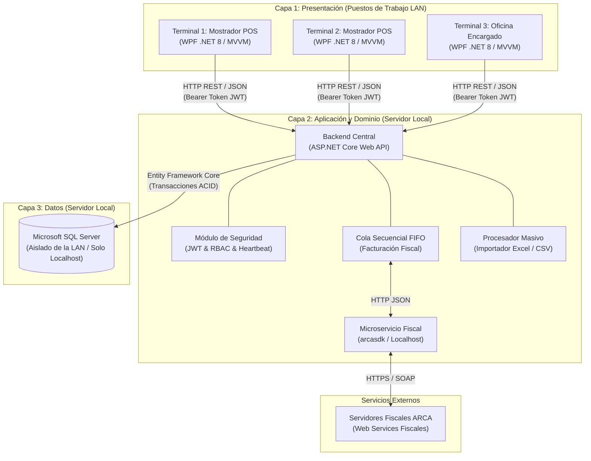
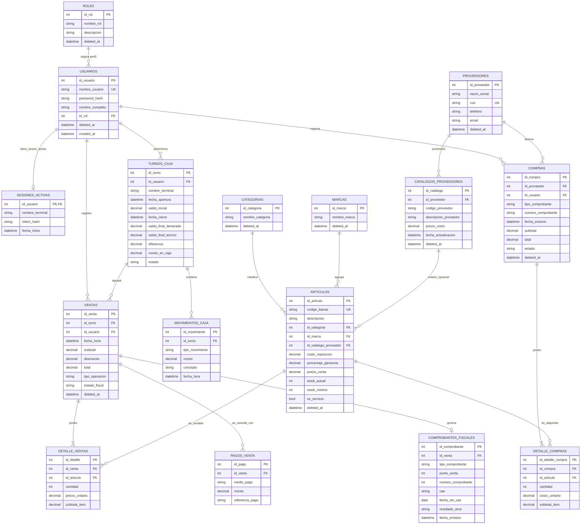

# Especificación de Requisitos de Software (ERS)

### Proyecto: Retail (Sistema ERP & Punto de Venta para Librería)
**Fecha:** Agosto de 2026  
**Versión:** 2.0 (Arquitectura en 3 Capas)

---

# Contenido {#contenido}

1. [Introducción](#1-introducción)
   - 1.1 [Propósito](#11-propósito)
   - 1.2 [Alcance del Producto](#12-alcance-del-producto)
   - 1.3 [Personal Involucrado](#13-personal-involucrado)
   - 1.4 [Definiciones, Acrónimos y Abreviaturas](#14-definiciones-acrónimos-y-abreviaturas)
2. [Descripción General](#2-descripción-general)
   - 2.1 [Perspectiva del Producto y Arquitectura del Sistema](#21-perspectiva-del-producto-y-arquitectura-del-sistema)
   - 2.2 [Funcionalidad del Producto (Módulos)](#22-funcionalidad-del-producto-módulos)
   - 2.3 [Características de los Usuarios](#23-características-de-los-usuarios)
   - 2.4 [Restricciones](#24-restricciones)
3. [Requisitos Específicos](#3-requisitos-específicos)
   - 3.1 [Requisitos Comunes de los Interfaces](#31-requisitos-comunes-de-los-interfaces)
     - 3.1.1 [Interfaces de Usuario (IU)](#311-interfaces-de-usuario-iu)
     - 3.1.2 [Interfaces de Software (IS)](#312-interfaces-de-software-is)
     - 3.1.3 [Interfaces de Comunicación (IC)](#313-interfaces-de-comunicación-ic)
   - 3.2 [Requisitos Funcionales (RF)](#32-requisitos-funcionales-rf)
   - 3.3 [Requisitos No Funcionales (RNF)](#33-requisitos-no-funcionales-rnf)
     - 3.3.1 [Requisitos de Rendimiento](#331-requisitos-de-rendimiento)
     - 3.3.2 [Seguridad](#332-seguridad)
     - 3.3.3 [Disponibilidad y Tolerancia a Fallos](#333-disponibilidad-y-tolerancia-a-fallos)
4. [Apéndice](#4-apéndice)
   - 4.1 [Diagrama Entidad-Relación (DER)](#41-diagrama-entidad-relación-der)
   - 4.2 [Matriz de Trazabilidad de Requisitos](#42-matriz-de-trazabilidad-de-requisitos)

---

# 1. Introducción {#1-introducción}

## 1.1. Propósito {#11-propósito}
El propósito del presente documento es especificar de manera formal y rigurosa los requisitos funcionales, no funcionales, reglas de negocio, interfaces y arquitectura técnica para el diseño y desarrollo de la aplicación **"Retail"**, un sistema de gestión comercial y Punto de Venta (POS) diseñado para librerías y comercios minoristas.

Este documento actúa como el contrato de diseño definitivo y la única fuente de verdad técnica para los ingenieros de desarrollo, arquitectos de software, testers y la Gerencia general del comercio, bajo los lineamientos de las normas **IEEE 830** e **ISO/IEC/IEEE 29148**.

## 1.2. Alcance del Producto {#12-alcance-del-producto}
El producto a desarrollar se denomina **"Retail"**. Consiste en un sistema de planificación de recursos empresariales (ERP) y Punto de Venta (POS) distribuido bajo una **arquitectura de 3 capas (3-Tier)** sobre una Red de Área Local (LAN). 

El sistema centraliza la lógica de negocio y las transacciones en una Web API alojada en el servidor de la tienda, la persistencia en Microsoft SQL Server (aislado de la LAN) y ofrece interfaces de usuario enriquecidas en terminales de mostrador mediante clientes ligeros nativos de Windows (WPF). Asimismo, centraliza la emisión de facturación electrónica hacia el organismo fiscal (ARCA) mediante una cola secuencial FIFO conectada al microservicio `arcasdk`.

## 1.3. Personal Involucrado {#13-personal-involucrado}

| Nombre | Fernandez, Pablo |
| :---- | :---- |
| Rol | Líder Técnico / Desarrollador Backend |
| Email | pablofernandez.12@gmail.com |

| Nombre | Kruzolek, Lucas |
| :---- | :---- |
| Rol | Desarrollador Frontend / UI Designer |
| Email | lucaskruzolek@gmail.com |

| Nombre | Gerencia del Comercio |
| :---- | :---- |
| Rol | Product Owner / Stakeholder |
| Email | gerencia@retail-libreria.local |

## 1.4. Definiciones, Acrónimos y Abreviaturas {#14-definiciones-acrónimos-y-abreviaturas}

Para facilitar la correcta interpretación de la arquitectura y la lógica descritas en este documento, se definen los siguientes términos clave:

* **Arquitectura 3-Tier (3 Capas):** Patrón arquitectónico que segrega estrictamente el sistema en Capa de Presentación (WPF), Capa de Lógica de Negocio y Aplicación (ASP.NET Core Web API) y Capa de Persistencia (Microsoft SQL Server).
* **WPF (Windows Presentation Foundation):** Subsistema gráfico de Microsoft basado en DirectX para la creación de interfaces de usuario enriquecidas en aplicaciones de escritorio de Windows.
* **MVVM (Model-View-ViewModel):** Patrón de arquitectura obligatorio para WPF que separa estrictamente el diseño de la interfaz gráfica (Vista) de la lógica operativa (ViewModel) y de los modelos de transporte (DTOs).
* **WPF Dispatcher:** Mecanismo responsable de intercalar la ejecución de tareas en el hilo único de interfaz gráfica de WPF, requiriendo el uso de programación asíncrona (`async/await`) para no congelar la ventana del POS durante llamadas de red o procesamiento.
* **REST API:** Interfaz de servicios web basada en el protocolo HTTP/HTTPS y formato de intercambio JSON que expone los endpoints del backend centralizado.
* **JWT (JSON Web Token):** Estándar abierto (RFC 7519) utilizado para la autenticación y autorización segura basada en tokens firmados criptográficamente.
* **DTO (Data Transfer Object):** Objeto plano utilizado para transferir datos serializados en JSON entre el cliente WPF y la Web API.
* **RBAC (Role-Based Access Control):** Modelo de seguridad que restringe o habilita las funcionalidades del sistema a partir de permisos asignados a roles definidos (Cajero, Encargado, Gerente).
* **ARCA:** Agencia de Recaudación y Control Aduanero (organismo regulador tributario de la República Argentina, ex-AFIP).
* **arcasdk:** Microservicio local que actúa como intermediario independiente para la comunicación, firma digital y obtención de CAE con los servidores del organismo tributario.
* **CAE (Código de Autorización Electrónico):** Identificador otorgado por el fisco que valida legalmente la emisión de una factura electrónica.
* **Arqueo Ciego:** Procedimiento de control de caja donde el cajero declara los valores físicos recaudados sin conocer el saldo teórico calculado por el sistema, previniendo manipulaciones.
* **Markup sobre Costo:** Porcentaje de recargo aplicado sobre el costo de compra para determinar el precio de venta sugerido: $\text{Precio} = \text{Costo} \times (1 + \frac{\text{Margen}}{100})$.

---

# 2. Descripción General {#2-descripción-general}

## 2.1. Perspectiva del Producto y Arquitectura del Sistema {#21-perspectiva-del-producto-y-arquitectura-del-sistema}

El sistema "Retail" está estructurado bajo una **Arquitectura en 3 Capas**, eliminando el acoplamiento directo entre las terminales de mostrador y la base de datos relacional.

### Principios de la Arquitectura:
1. **Capa 1 (Presentación):** Clientes de escritorio ligeros en WPF (.NET 8) orientados a alta velocidad de interacción mediante teclado y lector de códigos de barra. Se comunican exclusivamente con la Capa 2 vía peticiones HTTP asíncronas con payloads JSON.
2. **Capa 2 (Lógica de Negocio y Aplicación):** Web API centralizada en ASP.NET Core que valida inventario, autentica credenciales con tokens JWT, orquesta transacciones ACID, procesa importaciones masivas en segundo plano y gestiona una cola secuencial FIFO hacia `arcasdk`.
3. **Capa 3 (Datos y Persistencia):** Motor Microsoft SQL Server configurado para escuchar exclusivamente en `127.0.0.1` (localhost), permaneciendo invisible e inaccesible para la subred LAN general.

---

## 2.2. Funcionalidad del Producto (Módulos) {#22-funcionalidad-del-producto-módulos}

El sistema "Retail" se organiza en módulos de negocio independientes:

### Módulo I: Gestión de Catálogo e Inventario
* **Mantenimiento de Artículos (CRUD):** Creación y edición de productos propios de librería y servicios (fotocopias, anillados, impresiones) con atributos: Código de Barras (opcional o autogenerado), Descripción, Categoría, Marca, Costo de Reposición, Margen de Ganancia (*Markup* %), Precio de Venta, Stock Actual y Stock Mínimo.
* **Integración Opcional con Catálogos de Distribuidores:** Enlace configurable de artículos propios a artículos de catálogos de proveedores para heredar costos y actualizaciones automáticas de precios.
* **Motor Masivo de Importación:** Procesamiento asíncrono en el servidor de planillas de cálculo (Excel/CSV) con mapeo dinámico de columnas para actualizar costos de miles de artículos en un solo proceso en segundo plano.

### Módulo II: Punto de Venta (POS) y Presupuestos
* **Terminal de Ventas:** Interfaz de alta velocidad para el cobro rápido en mostrador mediante lectura de códigos de barra o búsqueda por descripción, cálculo dinámico de subtotales, totales y cobros multimedio (efectivo con cálculo de vuelto, tarjetas, transferencias/QR).
* **Presupuestador:** Generación de presupuestos con validez temporal de 15 días. **No afecta ni descuenta stock físico** al crearse; el descuento ocurre únicamente si el presupuesto es recuperado y cobrado en mostrador.
* **Devoluciones de Mercadería:** Gestión de devoluciones con reintegro automático de stock y emisión de Notas de Crédito o comprobantes de saldo a favor.

### Módulo III: Gestión de Compras y Proveedores
* **Registro de Compras (Remitos y Facturas):** Interfaz para el ingreso de comprobantes de distribuidores con detalle a nivel de artículo (ítem, cantidad, costo unitario). Al confirmarse, el backend incrementa el stock físico y actualiza los costos de reposición.
* **Cuentas Corrientes de Proveedores:** Seguimiento de facturas de compra a crédito y gestión de órdenes de pago/recibos.

### Módulo IV: Caja y Tesorería
* **Apertura de Turno:** Registro obligatorio del monto de saldo inicial de caja previo a habilitar las operaciones de venta.
* **Movimientos Varios:** Registro justificado de ingresos extraordinarios y retiros de efectivo (gastos menores, retiros de seguridad).
* **Arqueo Ciego y Cierre de Turno:** Declaración física del dinero por parte del cajero sin conocer el saldo teórico del sistema, calculando diferencias (faltante/sobrante) y emitiendo el acta de cierre.

### Módulo V: Facturación Fiscal Centralizada (ARCA)
* **Emisión Secuencial FIFO:** Despacho de comprobantes electrónicos a través del backend hacia `arcasdk` en orden de llegada para preservar la correlatividad numérica estricta.
* **Venta en Contingencia Resiliente:** Si el servicio fiscal no responde o falla Internet, la venta se cobra normalmente, se descuenta el stock, se guarda localmente con estado `ERROR_FISCAL_REINTENTABLE` y se emite un comprobante interno no fiscal.
* **Consola de Reintentos:** Panel exclusivo para el Gerente que lista comprobantes en contingencia y permite reintentar su emisión en lote en estricto orden cronológico.

### Módulo VI: Seguridad y Control de Acceso (RBAC)
* **Autenticación Basada en Tokens JWT:** Validación de credenciales con hashing criptográfico y control de sesiones activas.
* **Mecanismo de Heartbeat:** Emisión de señales periódicas desde las terminales cliente para liberar sesiones automáticamente ante cortes de luz o cierres abruptos de terminales.

---

## 2.3. Características de los Usuarios {#23-características-de-los-usuarios}

| Tipo de usuario | Cajero |
| :---- | :---- |
| Actividades | Perfil asignado al personal operativo encargado de la atención al público en la línea de cajas. Permisos Autorizados: Acceso exclusivo al terminal de Punto de Venta (POS) para el registro y cobro de ventas rápidas, lectura de códigos de barra o búsqueda por texto, generación de presupuestos temporales, apertura de turno y ejecución del arqueo físico de caja ciego al finalizar su turno. Restricciones: No tiene acceso a la visualización de costos de reposición ni márgenes de ganancia, ni puede acceder a módulos de compras, catálogos ni reportes globales. |

| Tipo de usuario | Encargado |
| :---- | :---- |
| Actividades | Perfil destinado a los supervisores del salón de ventas, responsables del abastecimiento físico, inventarios y relación diaria con distribuidores. Permisos Autorizados: Mantenimiento integral (ABM) del catálogo de productos propios y servicios. Ejecución del importador asíncrono de listas de precios de proveedores (Excel/CSV). Carga y registro operativo de facturas o remitos de compra (con incremento automático en el stock físico y actualización de costos de reposición). Supervisión de aperturas y cierres de caja, autorización de devoluciones de mercadería y acceso a reportes analíticos operativos. |

| Tipo de usuario | Gerente |
| :---- | :---- |
| Actividades | Perfil reservado para la máxima autoridad o propietario del comercio, encargado de la toma de decisiones impositivas, financieras y de seguridad. Permisos Autorizados: Administración integral (ABM) de Usuarios, permitiendo crear credenciales, asignar o revocar contraseñas, configurar roles y gestionar sesiones activas. Acceso exclusivo a la Consola de Monitoreo Fiscal y Reintentos de Facturación ARCA. Visualización de reportes gerenciales de rentabilidad, márgenes de ganancia y libros de IVA. |

---

## 2.4. Restricciones {#24-restricciones}

Las restricciones técnicas y de diseño que condicionan el desarrollo del sistema son:

* **Patrón MVVM y Desacoplamiento Estricto:** La interfaz gráfica WPF debe desacoplarse mediante el patrón Model-View-ViewModel. Ninguna clase de la capa visual contendrá lógica de negocio ni referencias directas a bases de datos o Entity Framework Core.
* **Hilo de Interfaz de Usuario Único (WPF Dispatcher):** Toda operación de red (llamadas a la Web API) o de procesamiento pesado debe ejecutarse en hilos secundarios asíncronos (`async/await`), utilizando el Dispatcher de WPF exclusivamente para actualizar elementos visuales sin congelar la ventana del POS.
* **Aislamiento de Persistencia en Servidor:** Microsoft SQL Server residirá en el servidor local y escuchará únicamente en `127.0.0.1`. Las terminales de la LAN no tendrán acceso directo al puerto `1433`.
* **Criptografía de Contraseñas:** Las contraseñas de los usuarios no deben almacenarse en texto plano bajo ninguna circunstancia; deben persistirse aplicando hashes con salting mediante algoritmos seguros (PBKDF2 con SHA-256 o BCrypt con factor $\ge 12$).
* **Control de Sesión Única por Terminal:** El sistema debe restringir el inicio de sesión concurrente a una única terminal física por cuenta de usuario, incorporando un mecanismo de *heartbeat* para liberar sesiones huérfanas.

---

# 3. Requisitos Específicos {#3-requisitos-específicos}

## 3.1. Requisitos Comunes de los Interfaces {#31-requisitos-comunes-de-los-interfaces}

### 3.1.1. Interfaces de Usuario (IU) {#311-interfaces-de-usuario-iu}

| Número de requisito | IU-01 |
| :---- | :---- |
| Nombre de requisito | Vista de Autenticación de Usuarios |
| Tipo | Requisito |
| Prioridad del requisito | Alta |
| Descripción del requisito | Interfaz para el ingreso seguro de credenciales locales en la red LAN. Permite al usuario introducir su nombre y contraseña mediante controles de WPF (`PasswordBox`) que ocultan los caracteres. Envía la solicitud de autenticación a la Web API y recibe el token JWT. Si el usuario ya posee una sesión activa en otra terminal física, la interfaz despliega un cuadro de diálogo modal informativo (*"Existe una sesión abierta en '[Terminal]' desde las [Hora] hs. ¿Deseas cerrar la sesión anterior e iniciar aquí?"*); ante la confirmación del usuario, instruye a la API la ejecución del *kick-out* para desloguear la terminal previa e ingresar de inmediato. |

| Número de requisito | IU-02 |
| :---- | :---- |
| Nombre de requisito | Vista del Punto de Venta (POS) |
| Tipo | Requisito |
| Prioridad del requisito | Alta |
| Descripción del requisito | Pantalla de alta velocidad diseñada para operar al 100% mediante teclado y atajos rápidos (F1-F12), integrada con lectores de códigos de barra e ingreso incremental por texto para búsqueda de artículos. Muestra los productos cargados, cantidades, precios unitarios y totales. Oculta estrictamente los datos de costos al rol Cajero. Ofrece un modal de cobro multimedio (efectivo con cálculo de vuelto, tarjetas, transferencias/QR) y botones para guardar como presupuesto o registrar devoluciones. |

| Número de requisito | IU-03 |
| :---- | :---- |
| Nombre de requisito | Vista de Gestión de Turnos y Arqueo Ciego de Caja |
| Tipo | Requisito |
| Prioridad del requisito | Alta |
| Descripción del requisito | Interfaz que permite al Cajero registrar la apertura de turno ingresando el monto de saldo inicial de efectivo. Al finalizar el turno, despliega el formulario de **Arqueo Ciego**, donde el cajero declara el desglose físico de dinero en efectivo y cupones de tarjeta sin visualizar el saldo teórico del sistema. Tras la confirmación, genera el informe de cierre para el Encargado/Gerente detallando el balance y las diferencias (sobrante/faltante). |

| Número de requisito | IU-04 |
| :---- | :---- |
| Nombre de requisito | Vista de Catálogo de Artículos y Servicios |
| Tipo | Requisito |
| Prioridad del requisito | Alta |
| Descripción del requisito | Pantalla para la administración del inventario activo del comercio. Permite dar de alta artículos propios y servicios (fotocopias, anillados) requiriendo: Código de Barras (opcional/autogenerado), Descripción, Categoría, Marca, Stock Actual, Stock Mínimo y Precio de Venta. Permite establecer de forma opcional un enlace con un artículo de `CatalogosProveedores` y definir el porcentaje de ganancia (*Markup* %), recalculando visualmente en tiempo real el precio sugerido a partir del costo del proveedor. |

| Número de requisito | IU-05 |
| :---- | :---- |
| Nombre de requisito | Vista de Proveedores y Catálogos (Importador Masivo) |
| Tipo | Requisito |
| Prioridad del requisito | Alta |
| Descripción del requisito | Interfaz exclusiva para el Encargado y el Gerente que gestiona el padrón de distribuidores y sus listas de precios. Ofrece un asistente interactivo para subir catálogos en formato Excel (.xlsx o .csv), permitiendo mapear visualmente las columnas del archivo (Código, Descripción y Precio de Costo) y enviarlas a la Web API para su procesamiento asíncrono en segundo plano en el servidor, mostrando un indicador de progreso en tiempo real. |

| Número de requisito | IU-06 |
| :---- | :---- |
| Nombre de requisito | Vista de Registro de Facturas y Remitos de Compra |
| Tipo | Requisito |
| Prioridad del requisito | Alta |
| Descripción del requisito | Interfaz operativa para que el Encargado ingrese los comprobantes recibidos de distribuidores al entregar mercadería. Permite seleccionar el proveedor, cargar la cabecera del documento y añadir el detalle de artículos (cantidades y costos de reposición). Al guardar la compra, envía la orden a la Web API para ejecutar una transacción atómica que incrementa el stock físico y actualiza los costos en el catálogo general. |

| Número de requisito | IU-07 |
| :---- | :---- |
| Nombre de requisito | Vista de Consola de Monitoreo Fiscal y Reintentos ARCA |
| Tipo | Requisito |
| Prioridad del requisito | Alta |
| Descripción del requisito | Panel exclusivo del Gerente que lista cronológicamente las ventas registradas en estado `ERROR_FISCAL_REINTENTABLE`. Muestra fecha, número de comprobante interno, total y motivo del error de red/fiscal. Dispone de un botón para reintentar la emisión fiscal en lote respetando el orden secuencial estricto (FIFO) contra el servicio local de `arcasdk`. |

| Número de requisito | IU-08 |
| :---- | :---- |
| Nombre de requisito | Vista de Administración de Usuarios y Sesiones |
| Tipo | Requisito |
| Prioridad del requisito | Alta |
| Descripción del requisito | Panel de seguridad de acceso exclusivo del Gerente para administrar las cuentas locales del comercio. Permite dar de alta, modificar y aplicar bajas lógicas a los usuarios, asignar uno de los tres perfiles del sistema (Cajero, Encargado, Gerente), blanquear contraseñas y visualizar las sesiones activas por terminal física con capacidad de liberación forzada. |

---

### 3.1.2. Interfaces de Software (IS) {#312-interfaces-de-software-is}

| Número de requisito | IS-01 |
| :---- | :---- |
| Nombre de requisito | Interfaz de API REST del Sistema Retail (Capa 1 a Capa 2) |
| Tipo | Requisito |
| Prioridad del requisito | Alta |
| Descripción del requisito | Define el contrato de servicios web RESTful entre el cliente WPF y el backend centralizado ASP.NET Core. Toda la comunicación se realiza mediante peticiones HTTP/HTTPS con payloads JSON. La autenticación se valida mediante la cabecera `Authorization: Bearer <token_jwt>`. La API expone endpoints estructurados para autenticación (`/api/auth`), ventas (`/api/ventas`), inventario (`/api/articulos`), compras (`/api/compras`), caja (`/api/caja`) y fiscal (`/api/fiscal`). |

| Número de requisito | IS-02 |
| :---- | :---- |
| Nombre de requisito | Interfaz de Acceso a Datos Relacional (Capa 2 a Capa 3) |
| Tipo | Requisito |
| Prioridad del requisito | Alta |
| Descripción del requisito | Especifica la conexión entre el backend ASP.NET Core y Microsoft SQL Server utilizando Entity Framework Core. Debe implementar *Connection Pooling* optimizado, políticas de reintento ante fallos transitorios y manejo de transacciones atómicas explícitas para operaciones críticas de venta, compras y ajustes de stock. |

| Número de requisito | IS-03 |
| :---- | :---- |
| Nombre de requisito | Interfaz con el Servicio Local de Facturación (Capa 2 a arcasdk) |
| Tipo | Requisito |
| Prioridad del requisito | Alta |
| Descripción del requisito | Especifica el contrato de comunicación asíncrona entre el backend centralizado y el microservicio local de `arcasdk`. El intercambio se realiza en formato JSON a través de un cliente HTTP dedicado (`IHttpClientFactory`). El backend despacha los datos de la venta y recibe la respuesta con el número de comprobante fiscal, CAE y fecha de vencimiento. |

---

### 3.1.3. Interfaces de Comunicación (IC) {#313-interfaces-de-comunicación-ic}

| Número de requisito | IC-01 |
| :---- | :---- |
| Nombre de requisito | Protocolo de Aplicación LAN (HTTP/HTTPS sobre TCP/IP) |
| Tipo | Requisito |
| Prioridad del requisito | Alta |
| Descripción del requisito | Regula el tráfico de datos entre las terminales cliente WPF y el servidor de backend en la red local. Se utiliza el protocolo HTTP/HTTPS sobre un puerto configurable (por defecto `5000`/`5001`). Se establece un timeout máximo de 10 segundos por solicitud para operaciones de mostrador. |

| Número de requisito | IC-02 |
| :---- | :---- |
| Nombre de requisito | Protocolo de Red de Base de Datos (TDS Localhost) |
| Tipo | Requisito |
| Prioridad del requisito | Alta |
| Descripción del requisito | Regula la comunicación entre la Web API y Microsoft SQL Server en el servidor local utilizando el protocolo Tabular Data Stream (TDS) sobre la interfaz loopback `127.0.0.1:1433`. El puerto de SQL Server permanece cerrado a cualquier dirección IP externa a la máquina servidora. |

---

## 3.2. Requisitos Funcionales (RF) {#32-requisitos-funcionales-rf}

| Número de requisito | RF-01 |
| :---- | :---- |
| Nombre de requisito | Autenticación y Generación de Tokens JWT |
| Tipo | Requisito |
| Prioridad del requisito | Alta |
| Descripción del requisito | El sistema debe proveer un endpoint de autenticación en la API que valide el nombre de usuario y contraseña contra el hash PBKDF2/BCrypt almacenado en la base de datos. Tras la autenticación exitosa, la API debe generar y retornar un token JWT firmado que contenga los claims de identidad, rol asignado y tiempo de expiración. |

| Número de requisito | RF-02 |
| :---- | :---- |
| Nombre de requisito | Gestión de Sesiones Únicas y Desalojo por Kick-Out |
| Tipo | Requisito |
| Prioridad del requisito | Alta |
| Descripción del requisito | El sistema debe garantizar que un usuario opere en una única terminal a la vez mediante la tabla `SESIONES_ACTIVAS` (`id_usuario` como PK). Si el usuario intenta iniciar sesión en una terminal B mientras figura una sesión en la terminal A, la API responderá informando la terminal previa y hora de inicio. Si el usuario confirma el traspaso en el modal, la API sobrescribirá la sesión (*Upsert*) emitiendo un nuevo token JWT y actualizando `nombre_terminal`, `token_hash` y `fecha_inicio`; el token anterior quedará invalidado de forma inmediata (*Kick-Out*), bloqueando a la terminal A con error HTTP 401. Al realizar un logout voluntario, el sistema eliminará físicamente el registro de la tabla. |

| Número de requisito | RF-03 |
| :---- | :---- |
| Nombre de requisito | Administración de Cuentas de Usuario y Asignación de Roles |
| Tipo | Requisito |
| Prioridad del requisito | Alta |
| Descripción del requisito | El sistema debe permitir al Gerente crear, modificar, aplicar bajas lógicas y restablecer contraseñas de las cuentas de usuario, asignando de forma restrictiva uno de los tres perfiles del sistema: Cajero, Encargado o Gerente. |

| Número de requisito | RF-04 |
| :---- | :---- |
| Nombre de requisito | Alta y Mantenimiento de Artículos y Servicios |
| Tipo | Requisito |
| Prioridad del requisito | Alta |
| Descripción del requisito | El sistema debe permitir el registro y modificación de artículos minoristas y servicios (fotocopias, impresiones), requiriendo: Descripción, Código de Barras (opcional o autogenerado), Categoría, Marca, Stock Actual (para artículos físicos), Stock Mínimo y Precio de Venta. No se exige la vinculación obligatoria a un catálogo de proveedor. |

| Número de requisito | RF-05 |
| :---- | :---- |
| Nombre de requisito | Vinculación Opcional con Catálogos de Proveedores |
| Tipo | Requisito |
| Prioridad del requisito | Alta |
| Descripción del requisito | El sistema debe permitir enlazar opcionalmente un artículo propio con un registro de la tabla `CatalogosProveedores` y configurar un porcentaje de ganancia (*Markup* %). Al actualizarse el costo del proveedor, el sistema actualizará automáticamente el precio de venta sugerido del artículo propio. |

| Número de requisito | RF-06 |
| :---- | :---- |
| Nombre de requisito | Modificación y Baja Lógica de Artículos |
| Tipo | Requisito |
| Prioridad del requisito | Alta |
| Descripción del requisito | El sistema debe permitir la actualización de los atributos de un artículo y ejecutar su baja lógica (`Activo = FALSE`), impidiendo su selección en el Punto de Venta pero conservando intacto su historial en ventas pasadas. |

| Número de requisito | RF-07 |
| :---- | :---- |
| Nombre de requisito | Importación Masiva Asíncrona de Listas de Precios |
| Tipo | Requisito |
| Prioridad del requisito | Alta |
| Descripción del requisito | El sistema debe permitir la carga de archivos Excel (.xlsx) o CSV mapeando las columnas del proveedor (Código, Descripción y Costo). La API debe procesar el archivo en segundo plano (*Background Worker*) actualizando masivamente la tabla del distribuidor y recalculando los precios de venta de los artículos vinculados sin degradar la respuesta del mostrador. |

| Número de requisito | RF-08 |
| :---- | :---- |
| Nombre de requisito | Control y Alertas de Stock Mínimo |
| Tipo | Requisito |
| Prioridad del requisito | Alta |
| Descripción del requisito | El sistema debe comparar en tiempo real el stock actual de cada artículo físico frente a su stock mínimo configurado, disparando una advertencia visual en el dashboard del Encargado y Gerente cuando las unidades sean iguales o inferiores al umbral de seguridad. |

| Número de requisito | RF-09 |
| :---- | :---- |
| Nombre de requisito | Terminal de Ventas y Cobros Multimedio |
| Tipo | Requisito |
| Prioridad del requisito | Alta |
| Descripción del requisito | El sistema debe permitir el cobro ágil en mostrador mediante lectura de códigos de barra o búsqueda por texto. Debe admitir múltiples métodos de pago (efectivo con cálculo de vuelto, tarjetas de débito/crédito, transferencias/QR y cobros combinados), registrando los importes imputados a cada medio. |

| Número de requisito | RF-10 |
| :---- | :---- |
| Nombre de requisito | Descuento Atómico de Stock en Ventas Cobradas |
| Tipo | Requisito |
| Prioridad del requisito | Alta |
| Descripción del requisito | Al confirmarse y cobrarse una venta en el POS, el backend debe descontar de forma síncrona la cantidad exacta de unidades del stock actual de cada artículo vendido, ejecutando la operación dentro de una transacción atómica ACID en SQL Server. |

| Número de requisito | RF-11 |
| :---- | :---- |
| Nombre de requisito | Registro de Presupuestos sin Afectación de Stock |
| Tipo | Requisito |
| Prioridad del requisito | Alta |
| Descripción del requisito | El sistema debe permitir generar y guardar presupuestos con una validez temporal de 15 días, emitiendo un comprobante impreso con la leyenda obligatoria *"Documento No Válido como Factura"*. El presupuesto se guardará con estado `PRESUPUESTO` **sin reservar ni descontar stock físico del inventario**. |

| Número de requisito | RF-12 |
| :---- | :---- |
| Nombre de requisito | Conversión de Presupuesto a Venta en Mostrador |
| Tipo | Requisito |
| Prioridad del requisito | Alta |
| Descripción del requisito | El sistema debe permitir recuperar un presupuesto activo mediante su identificador en el POS, cargar sus ítems en la grilla de venta y, una vez cobrado por el cliente, registrar la venta en firme descontando el stock correspondiente en ese instante. |

| Número de requisito | RF-13 |
| :---- | :---- |
| Nombre de requisito | Devoluciones de Mercadería y Emisión de Notas de Crédito |
| Tipo | Requisito |
| Prioridad del requisito | Alta |
| Descripción del requisito | El sistema debe permitir registrar devoluciones totales o parciales de ítems de una venta previa (requiriendo autorización del Encargado/Gerente). La transacción debe reincorporar las unidades devueltas al stock físico e instruir al backend la emisión de una Nota de Crédito fiscal o comprobante de crédito a favor del cliente. |

| Número de requisito | RF-14 |
| :---- | :---- |
| Nombre de requisito | Apertura de Turno de Caja y Validación de Saldo Inicial |
| Tipo | Requisito |
| Prioridad del requisito | Alta |
| Descripción del requisito | El sistema debe exigir al Cajero registrar la apertura de turno ingresando el monto de saldo inicial de efectivo antes de habilitar cualquier operación de cobro en el POS. El turno queda asociado al usuario, terminal física y fecha/hora de inicio. |

| Número de requisito | RF-15 |
| :---- | :---- |
| Nombre de requisito | Registro de Movimientos Varios de Caja (Ingresos y Egresos) |
| Tipo | Requisito |
| Prioridad del requisito | Alta |
| Descripción del requisito | El sistema debe permitir el registro justificado de ingresos extraordinarios y egresos/retiros de efectivo durante el turno (gastos menores de librería, pagos de fletes, retiros de recaudación por seguridad). |

| Número de requisito | RF-16 |
| :---- | :---- |
| Nombre de requisito | Arqueo Ciego y Cierre de Turno de Caja |
| Tipo | Requisito |
| Prioridad del requisito | Alta |
| Descripción del requisito | Al finalizar el turno, el sistema debe solicitar al cajero la declaración física del dinero en efectivo y cupones de tarjeta en su poder (**Arqueo Ciego**). La API comparará los valores declarados contra el balance teórico del sistema, calculando diferencias (faltante/sobrante) y emitiendo el acta de cierre de turno. |

| Número de requisito | RF-17 |
| :---- | :---- |
| Nombre de requisito | Cola Secuencial FIFO de Facturación ARCA |
| Tipo | Requisito |
| Prioridad del requisito | Alta |
| Descripción del requisito | La API debe encolar todas las solicitudes de emisión fiscal de comprobantes recibidas desde las terminales de caja y procesarlas secuencialmente contra `arcasdk` en orden de llegada (FIFO), garantizando la correlatividad numérica estricta exigida por la normativa tributaria. |

| Número de requisito | RF-18 |
| :---- | :---- |
| Nombre de requisito | Venta en Contingencia y Registro Desconectado Resiliente |
| Tipo | Requisito |
| Prioridad del requisito | Alta |
| Descripción del requisito | Si durante la emisión fiscal `arcasdk` no responde (timeout) o no hay conexión a Internet, la aplicación no debe cancelar la venta comercial. El sistema procesará el cobro, registrará la venta localmente con estado `ERROR_FISCAL_REINTENTABLE`, descontará el stock e imprimirá un ticket de control interno no fiscal para liberar la caja de inmediato. |

| Número de requisito | RF-19 |
| :---- | :---- |
| Nombre de requisito | Consola de Reintentos de Facturación en Lote |
| Tipo | Requisito |
| Prioridad del requisito | Alta |
| Descripción del requisito | El sistema debe proveer una interfaz visual exclusiva para el Gerente que liste los comprobantes en estado `ERROR_FISCAL_REINTENTABLE` y permita disparar su emisión en lote hacia ARCA en estricto orden cronológico ascendente para regularizar el CAE. |

| Número de requisito | RF-20 |
| :---- | :---- |
| Nombre de requisito | Registro de Compras e Incremento de Inventario |
| Tipo | Requisito |
| Prioridad del requisito | Alta |
| Descripción del requisito | El sistema debe permitir registrar las facturas o remitos de compras de mercadería detallando distribuidor, número de comprobante e ítems con cantidades y costos de adquisición. Al guardar el documento, el sistema ejecutará una transacción que incrementará el stock físico y actualizará los costos de reposición en el catálogo. |

---

## 3.3. Requisitos No Funcionales (RNF) {#33-requisitos-no-funcionales-rnf}

### 3.3.1. Requisitos de Rendimiento {#331-requisitos-de-rendimiento}

| Número de requisito | RNF-01 |
| :---- | :---- |
| Nombre de requisito | Tiempo de Respuesta en Terminal de Mostrador |
| Tipo | Requisito |
| Prioridad del requisito | Alta |
| Descripción del requisito | La consulta y adición de artículos a la grilla de venta en el POS mediante lectura de código de barras o búsqueda incremental por texto debe responder en un tiempo inferior a **150 milisegundos** bajo condiciones normales de red local. |

| Número de requisito | RNF-02 |
| :---- | :---- |
| Nombre de requisito | Responsividad de Interfaz (WPF Dispatcher) y Procesamiento en Servidor |
| Tipo | Requisito |
| Prioridad del requisito | Alta |
| Descripción del requisito | Las tareas de alta latencia (importación masiva de listas de precios de $\ge 10.000$ filas, reportes de ventas, llamadas al servicio fiscal) deben ejecutarse en segundo plano en el backend o en hilos asíncronos en el cliente, manteniendo la ventana del POS responsiva e interactiva mediante indicadores de progreso (*spinners/progress bars*). |

| Número de requisito | RNF-03 |
| :---- | :---- |
| Nombre de requisito | Concurrencia Transaccional Multipuesto |
| Tipo | Requisito |
| Prioridad del requisito | Alta |
| Descripción del requisito | El sistema debe soportar un mínimo de 10 terminales de mostrador operando concurrentemente sin bloqueos de contención de tablas (*deadlocks*) ni degradación de rendimiento en SQL Server. |

---

### 3.3.2. Seguridad {#332-seguridad}

| Número de requisito | RNF-04 |
| :---- | :---- |
| Nombre de requisito | Protección Criptográfica de Credenciales (Hashing) |
| Tipo | Requisito |
| Prioridad del requisito | Alta |
| Descripción del requisito | Las contraseñas de los usuarios deben persistirse en la base de datos aplicando funciones hash unidireccionales seguras con salting (PBKDF2 con HMAC-SHA256 o BCrypt con factor de costo $\ge 12$). Queda estrictamente prohibido el almacenamiento en texto plano o cifrado reversible. |

| Número de requisito | RNF-05 |
| :---- | :---- |
| Nombre de requisito | Seguridad en Transporte y Aislamiento de Base de Datos |
| Tipo | Requisito |
| Prioridad del requisito | Alta |
| Descripción del requisito | Toda comunicación entre las terminales cliente y la Web API debe estar autenticada mediante tokens JWT firmados. El puerto de escucha de SQL Server (`1433`) debe permanecer aislado de la red LAN, aceptando conexiones únicamente desde el proceso de la Web API en `localhost`. |

| Número de requisito | RNF-06 |
| :---- | :---- |
| Nombre de requisito | Control de Acceso Granular en API (RBAC) |
| Tipo | Requisito |
| Prioridad del requisito | Alta |
| Descripción del requisito | La Web API debe validar los roles y permisos en cada endpoint mediante atributos de autorización (`[Authorize(Roles = "...")]`), bloqueando con código HTTP 403 Forbidden cualquier intento de ejecución no autorizado para el rol del usuario. |

---

### 3.3.3. Disponibilidad y Tolerancia a Fallos {#333-disponibilidad-y-tolerancia-a-fallos}

| Número de requisito | RNF-07 |
| :---- | :---- |
| Nombre de requisito | Tolerancia a Caídas del Servicio Fiscal y Conectividad Externa |
| Tipo | Requisito |
| Prioridad del requisito | Alta |
| Descripción del requisito | El sistema debe garantizar la continuidad operativa de cobros en mostrador aun ante la caída de los servidores fiscales de ARCA o cortes del servicio de Internet externo, operando de forma transparente bajo el flujo de contingencia (RF-18). |

| Número de requisito | RNF-08 |
| :---- | :---- |
| Nombre de requisito | Resiliencia ante Microcortes en la Red LAN |
| Tipo | Requisito |
| Prioridad del requisito | Alta |
| Descripción del requisito | El cliente WPF debe implementar políticas de reintento automático (*retry policies* con retroceso exponencial) mediante Polly en el cliente HTTP para absorber microcortes transitorios en la red cableada de la tienda sin abortar la interacción del usuario. |

---

# 4. Apéndice {#4-apéndice}

## 4.1. Diagrama Entidad-Relación (DER) {#41-diagrama-entidad-relación-der}

---

## 4.2. Matriz de Trazabilidad de Requisitos {#42-matriz-de-trazabilidad-de-requisitos}

| Requisito Funcional | Interfaz de Usuario (IU) | Interfaz de Software (IS) | Tablas Principales Afectadas |
| :--- | :--- | :--- | :--- |
| **RF-01, RF-02** | `IU-01` (Autenticación) | `IS-01` (`/api/auth`) | `USUARIOS`, `SESIONES_ACTIVAS`, `ROLES` |
| **RF-03** | `IU-08` (Gestión Usuarios) | `IS-01` (`/api/usuarios`) | `USUARIOS`, `ROLES` |
| **RF-04, RF-05, RF-06** | `IU-04` (Catálogo Propio) | `IS-01` (`/api/articulos`) | `ARTICULOS`, `CATALOGOS_PROVEEDORES` |
| **RF-07** | `IU-05` (Importador Masivo) | `IS-01` (`/api/proveedores/importar`) | `CATALOGOS_PROVEEDORES`, `ARTICULOS` |
| **RF-08** | `IU-04` (Catálogo / Dashboard) | `IS-01` (`/api/articulos/stock-minimo`) | `ARTICULOS` |
| **RF-09, RF-10** | `IU-02` (Punto de Venta) | `IS-01` (`/api/ventas`), `IS-03` | `VENTAS`, `DETALLE_VENTAS`, `PAGOS_VENTA`, `ARTICULOS` |
| **RF-11, RF-12** | `IU-02` (Presupuestador) | `IS-01` (`/api/presupuestos`) | `VENTAS` (estado `PRESUPUESTO`), `DETALLE_VENTAS` |
| **RF-13** | `IU-02` (Devoluciones) | `IS-01` (`/api/ventas/devolucion`) | `VENTAS`, `DETALLE_VENTAS`, `ARTICULOS`, `COMPROBANTES_FISCALES` |
| **RF-14, RF-15, RF-16** | `IU-03` (Turnos y Arqueo) | `IS-01` (`/api/caja`) | `TURNOS_CAJA`, `MOVIMIENTOS_CAJA` |
| **RF-17, RF-18, RF-19** | `IU-07` (Consola Fiscal) | `IS-01` (`/api/fiscal`), `IS-03` | `COMPROBANTES_FISCALES`, `VENTAS` |
| **RF-20** | `IU-06` (Compras) | `IS-01` (`/api/compras`) | `COMPRAS`, `DETALLE_COMPRAS`, `ARTICULOS` |
