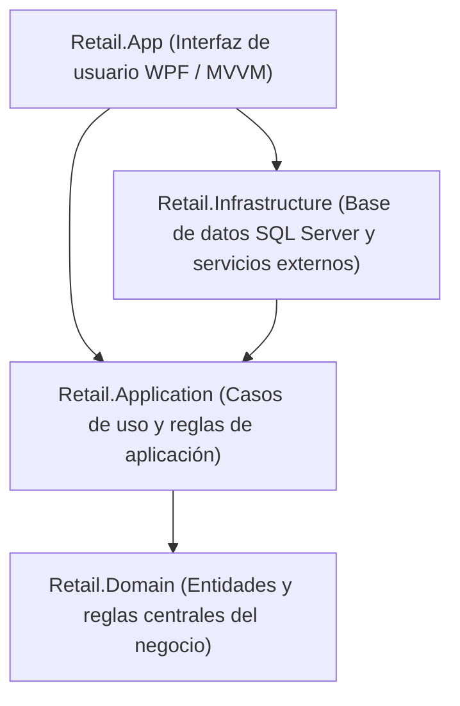

# Retail - Sistema de Gestión y Punto de Venta (POS)

¡Bienvenido al repositorio de **Retail**! Este proyecto es un sistema de escritorio para la administración integral de una librería y comercio minorista. Permite gestionar ventas en mostrador, control de stock, compras a distribuidores, padrón de clientes con cuentas corrientes y facturación.

Está desarrollado sobre **.NET 8 LTS** y **C# 12**, utilizando **WPF** para la interfaz visual y **SQL Server** con **Entity Framework Core 8** para el almacenamiento de datos.

---

## 🏛️ Arquitectura del Sistema

El proyecto está organizado siguiendo principios de arquitectura limpia para mantener el código ordenado, mantenible y fácil de entender:



### Proyectos de la solución

* **[`src/Retail.Domain`](file:///c:/Users/lucas/Proyectos/retail/src/Retail.Domain/):** Contiene las entidades principales (`Articulo`, `Venta`, `Cliente`, `TurnoCaja`, `Compra`, etc.) y las reglas del negocio. No depende de ninguna librería externa.
* **[`src/Retail.Application`](file:///c:/Users/lucas/Proyectos/retail/src/Retail.Application/):** Servicios de aplicación que coordinan las acciones del usuario, validaciones con FluentValidation y transferencia de datos (DTOs).
* **[`src/Retail.Infrastructure`](file:///c:/Users/lucas/Proyectos/retail/src/Retail.Infrastructure/):** Acceso a base de datos con Entity Framework Core 8, consultas SQL optimizadas, importación de planillas Excel y seguridad de contraseñas.
* **[`src/Retail.App`](file:///c:/Users/lucas/Proyectos/retail/src/Retail.App/):** La aplicación de escritorio WPF, sus ventanas, estilos visuales y la configuración de inicio.

---

## 📋 Requisitos Previos

Antes de comenzar, asegúrate de contar con lo siguiente en tu equipo:

1. **Windows 10 o Windows 11 (64 bits).**
2. **[.NET 8.0 SDK](https://dotnet.microsoft.com/download/dotnet/8.0)** (versión 8.0.x o superior).
3. **Un motor de base de datos SQL Server.** Puedes usar cualquiera de estas dos opciones:
   * **SQL Server Express LocalDB:** Muy liviano y recomendado para desarrollo (suele instalarse automáticamente con Visual Studio).
   * **SQL Server Express:** La versión gratuita tradicional de SQL Server, ideal si quieres simular una instalación real de mostrador o en red local.

---

## 🚀 Guía de Puesta en Marcha y Despliegue

Sigue estos pasos para dejar el sistema funcionando en pocos minutos:

### 1. Clonar el repositorio
Abre una terminal y clona el proyecto en tu carpeta preferida:
```bash
git clone https://github.com/tu-usuario/retail.git
cd retail
```

### 2. Configurar la Base de Datos en `appsettings.json`
Abre el archivo [`src/Retail.App/appsettings.json`](file:///c:/Users/lucas/Proyectos/retail/src/Retail.App/appsettings.json) y define tu cadena de conexión en la propiedad `DefaultConnection`.

#### Opción A: Usar LocalDB (Recomendado para desarrollo rápido)
Es la opción más simple porque no requiere tener un servicio de SQL Server corriendo todo el tiempo:
```json
{
  "ConnectionStrings": {
    "DefaultConnection": "Server=(localdb)\\mssqllocaldb;Database=RetailDb;Trusted_Connection=True;MultipleActiveResultSets=true;TrustServerCertificate=True"
  }
}
```

#### Opción B: Usar SQL Server Express
Si tienes instalado SQL Server Express en tu máquina:

* **Con tu usuario de Windows (Autenticación integrada):**
```json
{
  "ConnectionStrings": {
    "DefaultConnection": "Server=localhost\\SQLEXPRESS;Database=RetailDb;Trusted_Connection=True;MultipleActiveResultSets=true;TrustServerCertificate=True"
  }
}
```

* **Con usuario y contraseña de SQL (por ejemplo, `sa`):**
```json
{
  "ConnectionStrings": {
    "DefaultConnection": "Server=localhost\\SQLEXPRESS;Database=RetailDb;User Id=sa;Password=TuPasswordSegura!;MultipleActiveResultSets=true;TrustServerCertificate=True"
  }
}
```

> **Nota:** El parámetro `TrustServerCertificate=True` es necesario para evitar errores de certificados al conectarte a instancias locales de SQL Server.

---

### 3. Ejecutar la Aplicación
Compila y ejecuta la aplicación con el siguiente comando:
```bash
dotnet run --project src/Retail.App/Retail.App.csproj
```

> **¿Qué pasa en el primer arranque?**  
> No necesitas crear tablas ni ejecutar scripts SQL manualmente. Al iniciar, el sistema detecta si la base de datos existe, aplica automáticamente todas las migraciones necesarias y carga datos iniciales de prueba (roles, categorías, artículos y un usuario administrador).

---

### 4. Iniciar Sesión
Al abrirse el sistema, verás la pantalla de inicio de sesión. Puedes ingresar con el usuario creado por defecto:

* **Usuario:** `admin`
* **Contraseña:** `Admin123!`
* **Rol:** Gerente

---

### 5. Generar el Ejecutable para Mostrador (Publicación)
Si quieres empaquetar el sistema para instalarlo en la computadora de la librería sin necesidad de instalar .NET SDK en esa máquina, puedes generar un ejecutable único y auto-contenido:

```bash
dotnet publish src/Retail.App/Retail.App.csproj -c Release -r win-x64 --self-contained true -p:PublishSingleFile=true
```

El ejecutable listo para usar se generará en la carpeta:  
`src/Retail.App/bin/Release/net8.0-windows/win-x64/publish/`

---

## 🛠️ Tecnologías Utilizadas

* **C# 12 / .NET 8 LTS**
* **WPF** (Windows Presentation Foundation) con `CommunityToolkit.Mvvm`
* **Entity Framework Core 8** (SQL Server / LocalDB)
* **FluentValidation** para validación de datos
* **MiniExcel** para importación ágil de listas de proveedores
* **BCrypt.Net-Next** para encriptación de contraseñas
* **Serilog** para registro de eventos y logs locales

---

## 📚 Documentación Adicional

Si quieres profundizar en el diseño y los requerimientos del sistema:
* [Especificación de Requisitos de Software (ERS)](file:///c:/Users/lucas/Proyectos/retail/docs/ERS%20-%20Libreria%20POS.md)
* [Mapa Semántico y Guía del Repositorio](file:///c:/Users/lucas/Proyectos/retail/docs/MAPA_DEL_PROYECTO.md)
* [Manual del Sistema de Persistencia](file:///c:/Users/lucas/Proyectos/retail/docs/SISTEMA_DE_PERSISTENCIA.md)
* [Manual del Sistema de Diseño UI](file:///c:/Users/lucas/Proyectos/retail/docs/SISTEMA_DE_DISENO.md)
* [Estrategia de Integración Continua (CI/CD)](file:///c:/Users/lucas/Proyectos/retail/docs/SISTEMA_DE_CI_CD.md)
