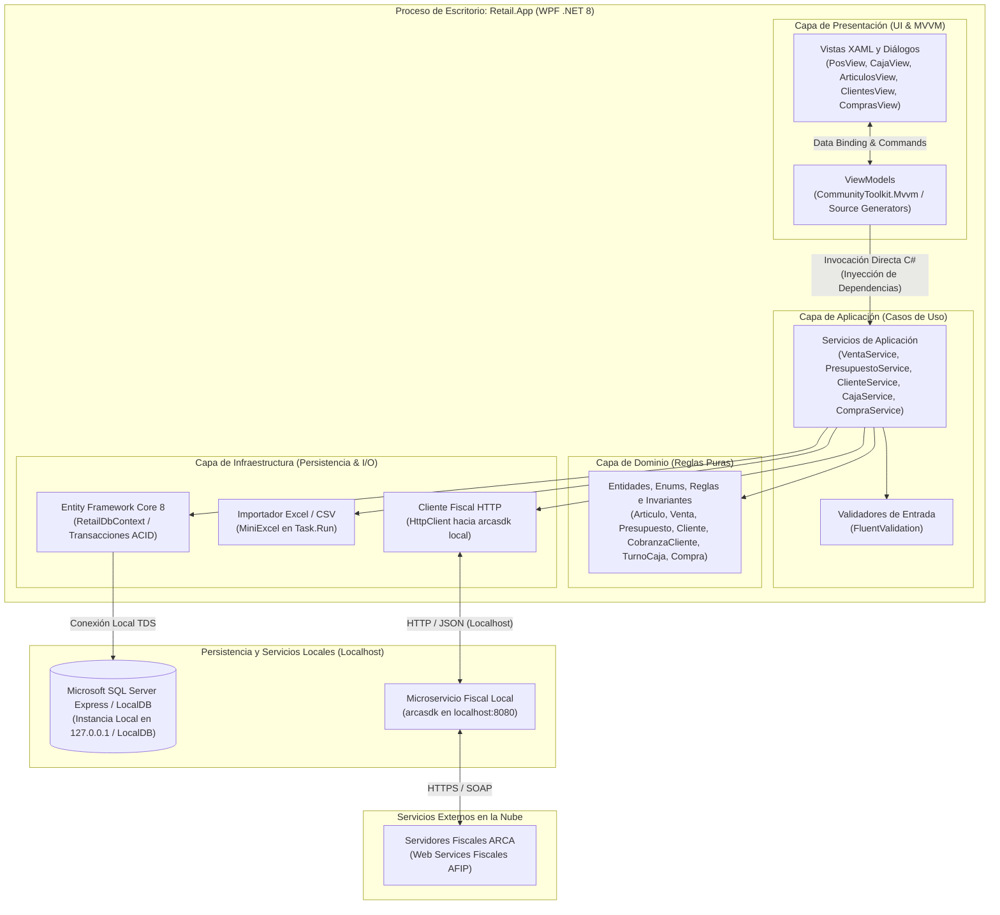

# Retail - Sistema ERP & Punto de Venta para Librería

Sistema integral de gestión comercial, Punto de Venta (POS), inventario, facturación electrónica y padrón de clientes para librerías y comercios minoristas, desarrollado bajo **.NET 8 LTS** y **C# 12** estructurado como un **Monolito Limpio de Escritorio (Clean Desktop Monolith)** en Windows.

---

## 🏛️ Arquitectura Global del Sistema

El sistema consolida en un único proceso de escritorio ejecutable la interfaz visual en WPF (.NET 8), los casos de uso del negocio y el acceso a datos sobre un motor relacional local (**Microsoft SQL Server Express / LocalDB**), comunicándose de forma asíncrona con el microservicio local de facturación electrónica:

---

## 📁 Estructura del Repositorio y Proyectos de la Solución

| Directorio | Capa / Proyecto | Responsabilidad y Contenido |
| :--- | :--- | :--- |
| [`src/Retail.Domain/`](file:///c:/Users/lucas/Proyectos/retail/src/Retail.Domain/README.md) | **Domain Layer** | Entidades (`Articulo`, `Venta`, `Presupuesto`, `Cliente`, `CobranzaCliente`, `TurnoCaja`), reglas puras, invariantes (recálculo automático de precios por compras, índice filtrado de código de barras para artesanías). |
| [`src/Retail.Application/`](file:///c:/Users/lucas/Proyectos/retail/src/Retail.Application/README.md) | **Application Layer** | Casos de uso (`VentaService`, `PresupuestoService`, `ClienteService`, `CajaService`, `CompraService`), DTOs de transporte, validadores FluentValidation e interfaces de persistencia. |
| [`src/Retail.Infrastructure/`](file:///c:/Users/lucas/Proyectos/retail/src/Retail.Infrastructure/README.md) | **Infrastructure Layer** | Persistencia con Entity Framework Core 8 (`RetailDbContext`), índices filtrados en SQL Server, cliente HTTP `arcasdk`, lector masivo Excel (`MiniExcel`) y hashing de contraseñas. |
| [`src/Retail.App/`](file:///c:/Users/lucas/Proyectos/retail/src/Retail.App/README.md) | **Presentation (Desktop App)** | Aplicación de escritorio WPF (.NET 8) con MVVM (`CommunityToolkit.Mvvm`), Host de Inyección de Dependencias, modales de cobro y cobranza multimedio, e impresión térmica ESC/POS. |
| [`tests/`](file:///c:/Users/lucas/Proyectos/retail/tests/README.md) | **Test Suites** | Pruebas unitarias de dominio y aplicación, y pruebas de integración de infraestructura con base de datos local. |

---

## 🛠️ Stack Tecnológico

- **Lenguaje & Plataforma:** C# 12 / .NET 8 LTS
- **Frontend de Escritorio:** WPF (Windows Presentation Foundation) con `CommunityToolkit.Mvvm`
- **Inyección de Dependencias:** `Microsoft.Extensions.DependencyInjection`
- **Acceso a Datos & ORM:** Entity Framework Core 8 con SQL Server Express / LocalDB
- **Validaciones:** `FluentValidation`
- **Facturación Electrónica:** Microservicio local `arcasdk` (Factura A automática para Responsables Inscriptos, Factura B y Contingencia Resiliente)
- **Procesamiento de Planillas:** `MiniExcel` (Streaming de bajo consumo de RAM)
- **Criptografía de Contraseñas:** `BCrypt.Net-Next` o `PBKDF2`
- **Pruebas Automatizadas:** xUnit, FluentAssertions, NSubstitute

---

## 📄 Documentos de Especificación y Diseño

- [Especificación de Requisitos de Software (ERS v3.2)](file:///c:/Users/lucas/Proyectos/retail/docs/ERS%20-%20Libreria%20POS.md)
- [Propuesta de Arquitectura y Estructura Global](file:///c:/Users/lucas/Proyectos/retail/docs/Arquitectura%20y%20Estructura%20del%20Proyecto.md)
- [Diagrama Entidad-Relación (DER)](file:///c:/Users/lucas/Proyectos/retail/docs/DER.mmd)
- [Roadmap de Implementación y Acciones Inmediatas](file:///c:/Users/lucas/Proyectos/retail/docs/Roadmap%20de%20Implementacion.md)
- [Estrategia y Directrices de CI/CD (GitHub Actions)](file:///c:/Users/lucas/Proyectos/retail/docs/Estrategia%20de%20CI-CD.md)
- [Mapa Semántico del Proyecto (Índice para Humanos y Agentes)](file:///c:/Users/lucas/Proyectos/retail/docs/MAPA_DEL_PROYECTO.md)
- [Directivas y Barandillas para Agentes de Código (AGENTS.md)](file:///c:/Users/lucas/Proyectos/retail/AGENTS.md)
- [Guía de Presentación y Defensa Técnica](file:///c:/Users/lucas/Proyectos/retail/docs/Presentacion%20-%20Defensa%20de%20Dise%C3%B1o%20Tecnico.md)
