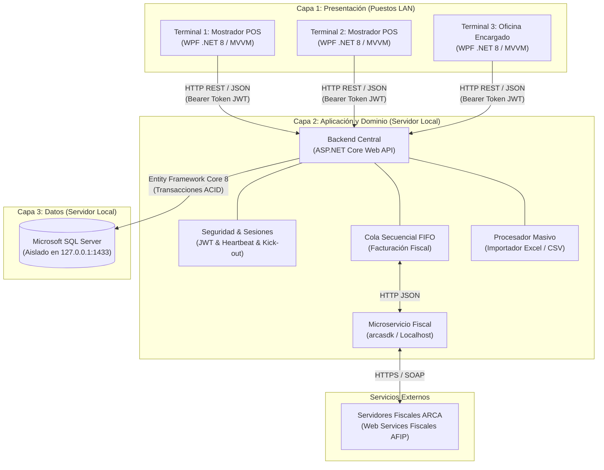

# Retail - Sistema ERP & Punto de Venta para Librería

Sistema integral de gestión comercial, Punto de Venta (POS) y facturación electrónica para librerías y comercios minoristas, desarrollado bajo **.NET 8 LTS** siguiendo los principios de **Clean Architecture** y **Arquitectura en 3 Capas (3-Tier)** sobre Red de Área Local (LAN).

---

## 🏛️ Arquitectura Global del Sistema

El sistema segrega formalmente la interfaz de usuario en puestos de trabajo LAN, la lógica de negocio centralizada en un servidor local y el motor de base de datos aislado:

---

## 📁 Estructura del Repositorio y Documentación por Capa

Cada directorio del proyecto cuenta con su propia documentación técnica exhaustiva que detalla sus objetivos, estructura interna, responsabilidades y funcionamiento:

| Directorio | Capa / Módulo | Descripción y Documentación Detallada |
| :--- | :--- | :--- |
| [`src/Shared/Retail.Shared/`](file:///c:/Users/lucas/Proyectos/retail/src/Shared/Retail.Shared/README.md) | **Shared Kernel** | DTOs de transporte, enumeraciones del sistema, contratos de API y constantes de seguridad. |
| [`src/Backend/Retail.Domain/`](file:///c:/Users/lucas/Proyectos/retail/src/Backend/Retail.Domain/README.md) | **Domain Layer** | Entidades de negocio puras, reglas e invariantes del DER, excepciones de dominio y tipos base. |
| [`src/Backend/Retail.Application/`](file:///c:/Users/lucas/Proyectos/retail/src/Backend/Retail.Application/README.md) | **Application Layer** | Orquestación de casos de uso, servicios de negocio, validadores FluentValidation e interfaces. |
| [`src/Backend/Retail.Infrastructure/`](file:///c:/Users/lucas/Proyectos/retail/src/Backend/Retail.Infrastructure/README.md) | **Infrastructure Layer** | Persistencia EF Core 8, cliente HTTP `arcasdk`, Background Workers FIFO y procesamiento Excel. |
| [`src/Backend/Retail.Server.Api/`](file:///c:/Users/lucas/Proyectos/retail/src/Backend/Retail.Server.Api/README.md) | **Presentation (Server API)** | ASP.NET Core Web API, controladores REST, middlewares de seguridad/excepciones y Swagger. |
| [`src/Frontend/Retail.Client.Wpf/`](file:///c:/Users/lucas/Proyectos/retail/src/Frontend/Retail.Client.Wpf/README.md) | **Presentation (Desktop Client)** | Cliente de mostrador WPF (.NET 8) con MVVM CommunityToolkit, Polly para resiliencia LAN e impresión térmica ESC/POS. |
| [`tests/`](file:///c:/Users/lucas/Proyectos/retail/tests/README.md) | **Test Suites** | Pruebas unitarias de dominio y aplicación, pruebas de integración de API y pruebas de UI. |

---

## 🛠️ Stack Tecnológico

- **Lenguaje & Framework:** C# 12 / .NET 8 LTS
- **Frontend de Escritorio:** WPF (Windows Presentation Foundation) con `CommunityToolkit.Mvvm`
- **Resiliencia en Red LAN:** `Polly` (Políticas de Retry con Exponential Backoff)
- **Backend API:** ASP.NET Core Web API (.NET 8)
- **Acceso a Datos:** Entity Framework Core 8 con SQL Server
- **Validaciones:** `FluentValidation`
- **Facturación Electrónica:** Microservicio `arcasdk` + `System.Threading.Channels` (Cola FIFO Asíncrona)
- **Procesamiento Masivo:** `ClosedXML` / `MiniExcel`
- **Seguridad:** JWT Bearer Auth + Hashing con PBKDF2 / BCrypt
- **Pruebas:** xUnit, FluentAssertions, NSubstitute / Moq, Microsoft.AspNetCore.Mvc.Testing

---

## 📄 Documentos de Especificación y Diseño

- [Especificación de Requisitos de Software (ERS v2.0)](file:///c:/Users/lucas/Proyectos/retail/ERS%20-%20Libreria%20POS.md)
- [Propuesta de Arquitectura y Estructura Global](file:///c:/Users/lucas/Proyectos/retail/Arquitectura%20y%20Estructura%20del%20Proyecto.md)
- [Diagrama Entidad-Relación (DER)](file:///c:/Users/lucas/Proyectos/retail/DER.mmd)
