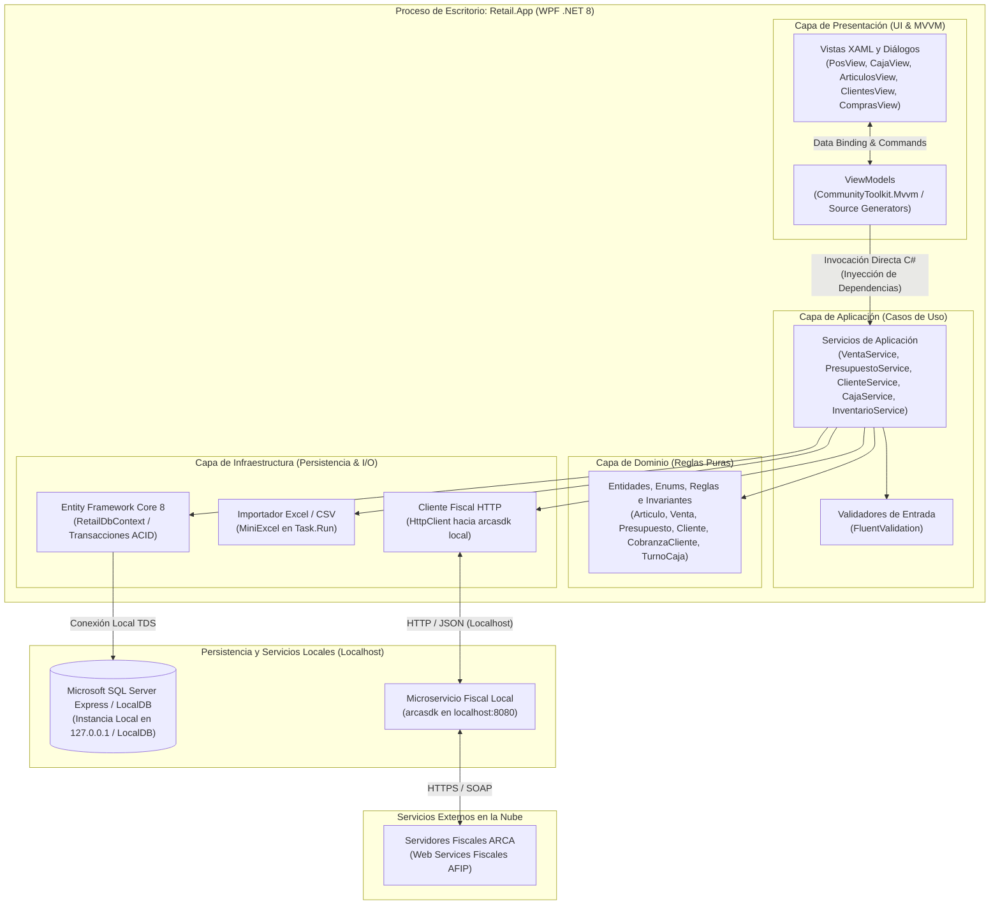
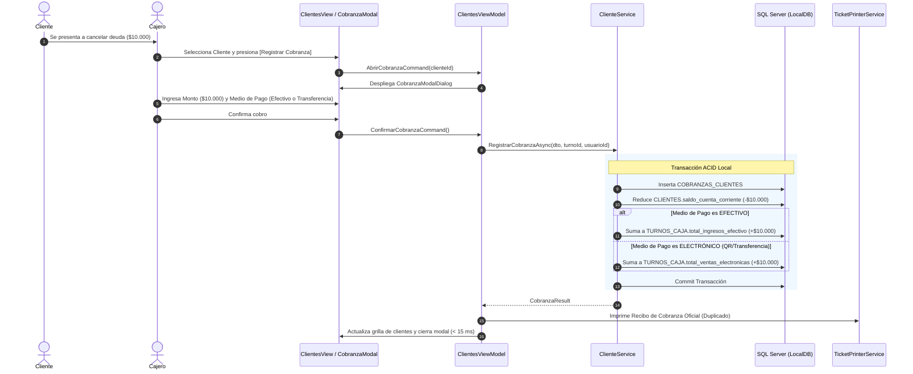

# Propuesta de Arquitectura y Estructura Global del Proyecto

### Proyecto: Retail (Sistema ERP & Punto de Venta para Librería)
**Fecha:** Septiembre de 2026  
**Versión:** 3.2 (Clean Desktop Monolith con Cobranzas Multimedio y Recálculo Automático de Precios)  
**Documentos de Referencia:** [DER.mmd](file:///c:/Users/lucas/Proyectos/retail/docs/DER.mmd), [ERS - Libreria POS.md](file:///c:/Users/lucas/Proyectos/retail/docs/ERS%20-%20Libreria%20POS.md) y [Roadmap de Implementacion.md](file:///c:/Users/lucas/Proyectos/retail/docs/Roadmap%20de%20Implementacion.md)  
**Estado:** Documento de Diseño Técnico y Arquitectura de Software

---

## 1. Justificación Arquitectónica: Clean Desktop Monolith

El sistema **Retail** se estructura bajo una **arquitectura monolítica de escritorio limpia (Clean Desktop Monolith)** en **.NET 8 (WPF / MVVM)**. Todas las capas lógicas residen en un único proceso ejecutable optimizado para el equipo de mostrador, combinando llamadas directas en memoria con persistencia relacional local en **Microsoft SQL Server Express / LocalDB**:



### Reglas e Invariantes de Negocio Consolidadas:

1. **Recálculo Automático de Precios por Compras (`RF-19`):**
   * Al registrar una factura de proveedor, si el `costo_unitario` supera o difiere del `costo_reposicion` del artículo, el sistema recalcula de forma automática e inmediata el `precio_venta` según su margen:
     $$\text{PrecioVenta} = \text{CostoReposicion} \times \left(1 + \frac{\text{PorcentajeGanancia}}{100}\right)$$
   * Esto protege el margen comercial automáticamente frente a la inflación de reposición.
2. **Circuito de Cobranzas Multimedio de Cuentas Corrientes (`RF-20`):**
   * El pago de deuda de un cliente se registra en la entidad `COBRANZAS_CLIENTES`.
   * Si el cliente abona en `EFECTIVO`, suma al saldo teórico de efectivo de la caja activa (`TURNOS_CAJA.total_ingresos_efectivo`).
   * Si abona mediante `TRANSFERENCIA_QR` o `TARJETA`, suma a las operaciones electrónicas del turno para cotejo con el reporte bancario/POS.
   * En ambos casos, reduce en la misma transacción el `CLIENTES.saldo_cuenta_corriente` e imprime un recibo no fiscal.
3. **Conversión de Presupuestos con Control de Stock y Conciliación Adaptativa (`RF-12`):**
   * Dado que los presupuestos no descuentan stock físico al crearse (`RF-11`), al convertirlos a venta se audita disponibilidad física ($\text{StockActual} \ge \text{CantidadPresupuestada}$). Si el presupuesto venció, el sistema no aborta destructivamente la venta sino que concilia y advierte discrepancias frente al catálogo vigente vía modal interactivo.
4. **Soporte de Múltiples Códigos de Barra `NULL` para Artesanías (`RF-04`):**
   * Mediante un índice filtrado en SQL Server (`[codigo_barras] IS NOT NULL`), se permite que múltiples productos artesanales y servicios coexistan con código nulo sin violar la unicidad de los productos con código comercial asignado.

---

## 2. Estructura Global del Directorio y Proyectos .NET 8

```text
retail/
├── docs/
│   ├── DER.mmd
│   ├── ERS - Libreria POS.md
│   ├── Arquitectura y Estructura del Proyecto.md
│   ├── Roadmap de Implementacion.md
│   └── Presentacion - Defensa de Diseño Tecnico.md
│
├── src/
│   ├── Retail.Domain/                   # Entidades del DER, Reglas de Negocio, Enums
│   ├── Retail.Application/              # Casos de Uso, DTOs, Validadores FluentValidation
│   ├── Retail.Infrastructure/           # EF Core, DbContext, Cliente arcasdk, MiniExcel
│   └── Retail.App/                      # Aplicación de Escritorio WPF (.NET 8 + MVVM)
│
├── tests/
│   ├── Retail.Domain.UnitTests/
│   ├── Retail.Application.UnitTests/
│   ├── Retail.Infrastructure.IntegrationTests/
│   └── Retail.App.UnitTests/
│
├── Retail.sln
├── .gitignore
└── README.md
```

---

## 3. Desglose Detallado por Proyecto

### 3.1. `Retail.Domain` (Biblioteca de Clases .NET 8)

```text
src/Retail.Domain/
├── Entities/
│   ├── Usuario.cs                       # Cuentas locales con hash y rol
│   ├── Rol.cs                           # Cajero, Encargado, Gerente
│   ├── Cliente.cs                       # CUIT/DNI, Condición IVA y Cuenta Corriente
│   ├── CobranzaCliente.cs               # Cobro de deudas (efectivo, transferencia, tarjeta)
│   ├── TurnoCaja.cs                     # Apertura, cierre y balance de efectivo
│   ├── MovimientoCaja.cs                # Ingresos extraordinarios y retiros de mostrador
│   ├── Categoria.cs                     # Clasificación de artículos
│   ├── Marca.cs                         # Fabricantes / Editoriales
│   ├── Articulo.cs                      # Productos físicos y artesanías (código nulable)
│   ├── Proveedor.cs                     # Distribuidores y CUIT
│   ├── CatalogoProveedor.cs             # Listas de costos de distribuidores
│   ├── Venta.cs                         # Cabecera de venta cobrada
│   ├── DetalleVenta.cs                  # Ítems vendidos con subtotal
│   ├── PagoVenta.cs                     # Imputación de pagos (efectivo, tarjeta, QR, cta cte)
│   ├── Presupuesto.cs                   # Cotización independiente (15 días de validez)
│   ├── DetallePresupuesto.cs            # Ítems cotizados con precio unitario pactado
│   ├── ComprobanteFiscal.cs             # Datos fiscales ARCA (CAE, PV, Número, motivo_error)
│   ├── Compra.cs                        # Facturas y remitos de distribuidores
│   └── DetalleCompra.cs                 # Ítems adquiridos y actualización de costos
├── Enums/
│   ├── RolUsuarioEnum.cs
│   ├── EstadoTurnoEnum.cs
│   ├── TipoMovimientoCajaEnum.cs
│   ├── EstadoPresupuestoEnum.cs
│   ├── EstadoFiscalEnum.cs
│   ├── TipoComprobanteFiscalEnum.cs     # FACTURA_A, FACTURA_B, NO_APLICA
│   ├── CondicionIvaEnum.cs
│   ├── TipoDocumentoEnum.cs
│   └── MedioPagoEnum.cs                 # EFECTIVO, TARJETA_DEBITO, TARJETA_CREDITO, TRANSFERENCIA_QR, CUENTA_CORRIENTE
├── Exceptions/
│   ├── DomainException.cs
│   ├── StockInsuficienteException.cs
│   ├── CajaCerradaException.cs
│   ├── PresupuestoVencidoException.cs
│   └── LimiteCreditoExcedidoException.cs
└── Common/
    ├── BaseEntity.cs
    └── IAggregateRoot.cs
```

#### 3.1.1. Patrones Tácticos DDD y Fronteras de Agregados

La capa de dominio implementa formalmente los patrones tácticos de **Domain-Driven Design (DDD)** para garantizar cohesión y consistencia transaccional:

1. **Jerarquía Base y Borrado Lógico (`BaseEntity.cs`):**
   * Todas las entidades de negocio derivan de `BaseEntity`.
   * En sistemas comerciales y tributarios, el **borrado físico (`DELETE`) está prohibido** para evitar la corrupción de balances pasados y violaciones de integridad referencial.
   * `BaseEntity` encapsula `CreatedAt` (auditoría temporal UTC), `DeletedAt`, `IsDeleted`, `MarkAsDeleted()` y `Restore()`. En Entity Framework Core se aplica un *Global Query Filter* (`HasQueryFilter(e => !e.IsDeleted)`).

2. **Raíces de Agregado e Interfaz Marcadora (`IAggregateRoot.cs`):**
   * Un Agregado es un clúster de entidades tratadas como una unidad de consistencia atómica.
   * `IAggregateRoot` es una *Marker Interface* que clasifica en tiempo de compilación a la única entidad autorizada como puerta de entrada al agregado.
   * **Restricción de Repositorios:** La persistencia solo expone repositorios para raíces de agregado (`IRepository<T> where T : BaseEntity, IAggregateRoot`). Las entidades subordinadas (como `DetalleVenta` o `PagoVenta`) no tienen repositorio propio y solo se manipulan a través de su raíz.

| Agregado | Raíz de Agregado (`IAggregateRoot`) | Entidades Internas Subordinadas | Invariante Principal Custodiada por la Raíz |
| :--- | :--- | :--- | :--- |
| **Venta** | `Venta.cs` | `DetalleVenta.cs`, `PagoVenta.cs`, `ComprobanteFiscal.cs` | Total atómico: $\text{Total} = \sum \text{Subtotales} = \sum \text{Pagos}$. Ningún ítem o pago se altera fuera de la raíz `Venta`. |
| **Presupuesto** | `Presupuesto.cs` | `DetallePresupuesto.cs` | Congela precios pactados durante su vigencia (15 días por defecto) sin alterar stock. Al expirar, concilia variaciones de catálogo sin bloqueo destructivo. |
| **Compra** | `Compra.cs` | `DetalleCompra.cs` | Incrementa stock y recalcula de inmediato el precio de venta en base al markup. |
| **Turno Caja** | `TurnoCaja.cs` | `MovimientoCaja.cs` | Balance teórico de dinero físico: $\text{SaldoTeorico} = \text{Inicial} + \text{VentasEfectivo} + \text{CobranzasEfectivo} + \text{Ingresos} - \text{Egresos}$. |
| **Clientes** | `Cliente.cs` | — | Límite de crédito y saldo de cuenta corriente. Cobranzas auditadas vía `CobranzaCliente`. |
| **Artículos** | `Articulo.cs` | — | Control de markup, stock mínimo y código de barras nullable (índice filtrado). |
| **Usuarios** | `Usuario.cs` | — | Hashing de contraseña (BCrypt) y roles RBAC. |
| **Proveedores** | `Proveedor.cs` | `CatalogoProveedor.cs` | Padrón de distribuidores y listas de costos para actualización masiva. |

---

### 3.2. `Retail.Application` (Biblioteca de Clases .NET 8)

```text
src/Retail.Application/
├── Interfaces/
│   ├── Persistence/
│   │   ├── IRetailDbContext.cs
│   │   ├── IUnitOfWork.cs
│   │   └── IRepository.cs
│   ├── Services/
│   │   ├── IAuthService.cs
│   │   ├── IVentaService.cs
│   │   ├── IPresupuestoService.cs        # Conversión con validación de stock y precios
│   │   ├── IClienteService.cs            # ABM y RegistrarCobranzaAsync
│   │   ├── IInventarioService.cs
│   │   ├── ICajaService.cs
│   │   ├── ICompraService.cs            # Ingreso y recálculo automático de precio
│   │   └── IFiscalService.cs
│   └── Infrastructure/
│       ├── IArcaClient.cs
│       ├── IExcelCatalogParser.cs
│       └── IPasswordHasher.cs
├── DTOs/
│   ├── Ventas/                          # CrearVentaDto, DetalleVentaDto, PagoVentaDto, VentaResponseDto
│   ├── Presupuestos/                    # CrearPresupuestoDto, PresupuestoDto, DetallePresupuestoDto
│   ├── Clientes/                        # ClienteDto, CrearClienteDto, RegistrarCobranzaDto, CobranzaDto
│   ├── Articulos/                       # ArticuloDto, CrearArticuloDto, ActualizarArticuloDto
│   ├── Proveedores/                     # ProveedorDto, MapeoColumnasCatalogoDto
│   ├── Compras/                         # CrearCompraDto, DetalleCompraDto
│   ├── Caja/                            # AperturaTurnoDto, MovimientoCajaDto, ArqueoCiegoEfectivoDto, CierreTurnoDto
│   └── Fiscal/                          # ComprobanteFiscalDto, ReintentoFiscalDto
├── Services/
│   ├── AuthService.cs
│   ├── VentaService.cs
│   ├── PresupuestoService.cs
│   ├── ClienteService.cs
│   ├── InventarioService.cs
│   ├── CajaService.cs
│   ├── CompraService.cs
│   └── FiscalService.cs
└── Validators/
    ├── CrearVentaValidator.cs
    ├── CrearPresupuestoValidator.cs
    ├── CrearClienteValidator.cs
    ├── RegistrarCobranzaValidator.cs
    ├── AperturaTurnoValidator.cs
    └── ArqueoCiegoEfectivoValidator.cs
```

---

### 3.3. `Retail.Infrastructure` (Biblioteca de Clases .NET 8)

```text
src/Retail.Infrastructure/
├── Persistence/
│   ├── Context/
│   │   └── RetailDbContext.cs
│   ├── Configurations/
│   │   ├── UsuarioConfiguration.cs
│   │   ├── RolConfiguration.cs
│   │   ├── ClienteConfiguration.cs
│   │   ├── CobranzaClienteConfiguration.cs # Relación con Cliente y TurnoCaja
│   │   ├── TurnoCajaConfiguration.cs
│   │   ├── MovimientoCajaConfiguration.cs
│   │   ├── ArticuloConfiguration.cs        # Filtered Index: [codigo_barras] IS NOT NULL
│   │   ├── VentaConfiguration.cs
│   │   ├── PresupuestoConfiguration.cs
│   │   ├── DetallePresupuestoConfiguration.cs
│   │   ├── ComprobanteFiscalConfiguration.cs
│   │   └── CompraConfiguration.cs
│   ├── Repositories/
│   │   ├── Repository.cs
│   │   └── UnitOfWork.cs
│   └── Migrations/
├── ExternalServices/
│   ├── ArcaSdk/
│   │   ├── ArcaClient.cs
│   │   └── ArcaOptions.cs
│   └── Excel/
│       └── ExcelCatalogParser.cs
└── Security/
    └── PasswordHasher.cs
```

---

### 3.4. `Retail.App` (Aplicación WPF .NET 8 / MVVM)

```text
src/Retail.App/
├── ViewModels/
│   ├── MainViewModel.cs
│   ├── LoginViewModel.cs
│   ├── PosViewModel.cs                  # Venta ágil, lector, cliente y conversión de presupuesto
│   ├── CobroModalViewModel.cs           # Multimedio con soporte de Cuenta Corriente
│   ├── PresupuestosViewModel.cs         # Emisión de cotizaciones independientes
│   ├── ClientesViewModel.cs             # ABM y comando RegistrarCobranzaCommand
│   ├── CobranzaModalViewModel.cs        # Modal para cobro de deuda de clientes
│   ├── CajaViewModel.cs                 # Apertura y Arqueo Ciego de efectivo
│   ├── ArticulosViewModel.cs            # Catálogo, markup y productos artesanales
│   ├── ImportadorCatalogosViewModel.cs  # Mapeo y procesamiento en background
│   ├── ComprasViewModel.cs              # Ingreso de facturas y recálculo automático
│   └── ConsolaFiscalViewModel.cs        # Reintentos con visualización de motivo_error
├── Views/
│   ├── Windows/
│   │   ├── MainWindow.xaml
│   │   └── LoginWindow.xaml
│   ├── Pages/
│   │   ├── PosView.xaml
│   │   ├── PresupuestosView.xaml
│   │   ├── ClientesView.xaml
│   │   ├── CajaView.xaml
│   │   ├── ArticulosView.xaml
│   │   ├── ImportadorView.xaml
│   │   ├── ComprasView.xaml
│   │   └── ConsolaFiscalView.xaml
│   └── Dialogs/
│       ├── CobroModalDialog.xaml
│       ├── CobranzaModalDialog.xaml     # Modal para cobrar cuenta corriente
│       ├── ArqueoCiegoDialog.xaml
│       └── AlertaPreciosPresupuestoDialog.xaml
├── Services/
│   ├── Session/CurrentUserSession.cs
│   ├── Navigation/NavigationService.cs
│   ├── Dialog/DialogService.cs
│   └── Hardware/TicketPrinterService.cs # Impresión de tickets y recibos de cobranza
├── App.xaml
├── App.xaml.cs
└── appsettings.json
```

---

## 4. Diagrama de Flujo: Circuito de Cobranza de Cuenta Corriente


