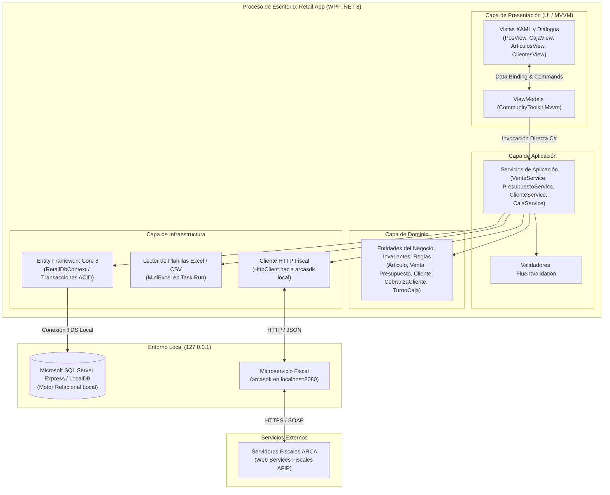

# Especificación de Requisitos de Software (ERS)

### Proyecto: Retail (Sistema ERP & Punto de Venta para Librería)
**Fecha:** Septiembre de 2026  
**Versión:** 3.2 (Clean Desktop Monolith con Cobranzas Multimedio y Recálculo Automático de Precios)

---

# Contenido {#contenido}

1. [Introducción](#1-introducción)
   - 1.1 [Propósito](#11-propósito)
   - 1.2 [Alcance del Producto](#12-alcance-del-producto)
   - 1.3 [Personal Involucrado](#13-personal-involucrado)
   - 1.4 [Definiciones, Acrónimos y Abreviaturas](#14-definiciones-acrónimos-y-abreviaturas)
2. [Descripción General](#2-descripción-general)
   - 2.1 [Perspectiva del Producto y Arquitectura del Sistema](#21-perspectiva-del-producto-y-arquitectura-del-sistema)
   - 2.2 [Funcionalidad del Producto (Módulos)](#22-funcionalidad-del-producto-módulos)
   - 2.3 [Características de los Usuarios](#23-características-de-los-usuarios)
   - 2.4 [Restricciones](#24-restricciones)
3. [Requisitos Específicos](#3-requisitos-específicos)
   - 3.1 [Requisitos Comunes de los Interfaces](#31-requisitos-comunes-de-los-interfaces)
     - 3.1.1 [Interfaces de Usuario (IU)](#311-interfaces-de-usuario-iu)
     - 3.1.2 [Interfaces de Software (IS)](#312-interfaces-de-software-is)
     - 3.1.3 [Interfaces de Comunicación (IC)](#313-interfaces-de-comunicación-ic)
   - 3.2 [Requisitos Funcionales (RF)](#32-requisitos-funcionales-rf)
   - 3.3 [Requisitos No Funcionales (RNF)](#33-requisitos-no-funcionales-rnf)
     - 3.3.1 [Requisitos de Rendimiento](#331-requisitos-de-rendimiento)
     - 3.3.2 [Seguridad](#332-seguridad)
     - 3.3.3 [Disponibilidad y Tolerancia a Fallos](#333-disponibilidad-y-tolerancia-a-fallos)
4. [Apéndice](#4-apéndice)
   - 4.1 [Diagrama Entidad-Relación (DER)](#41-diagrama-entidad-relación-der)
   - 4.2 [Matriz de Trazabilidad de Requisitos](#42-matriz-de-trazabilidad-de-requisitos)

---

# 1. Introducción {#1-introducción}

## 1.1. Propósito {#11-propósito}
El propósito del presente documento es especificar de manera formal y rigurosa los requisitos funcionales, no funcionales, reglas de negocio, interfaces y modelo de datos para el diseño y desarrollo del sistema **"Retail"**, una solución integral de gestión comercial, Punto de Venta (POS), facturación electrónica e inventario para librerías y comercios minoristas bajo los estándares **IEEE 830** e **ISO/IEC/IEEE 29148**.

## 1.2. Alcance del Producto {#12-alcance-del-producto}
El sistema **"Retail"** está diseñado como una **aplicación monolítica de escritorio limpia (Clean Desktop Monolith)** en Windows (.NET 8 / WPF / C# 12).

El producto unifica en un único proceso ejecutable la interfaz visual de mostrador, los servicios de orquestación de negocio y el acceso a datos sobre una base de datos relacional local (**Microsoft SQL Server Express / LocalDB**). Se integra en el entorno local con el microservicio `arcasdk` para la obtención de CAE y emisión fiscal ante ARCA (AFIP), incorporando además gestión de clientes con cobranzas multimedio de cuentas corrientes, recálculo automático de precios por compras y presupuestador independiente.

## 1.3. Personal Involucrado {#13-personal-involucrado}

| Nombre | Fernandez, Pablo |
| :---- | :---- |
| Email | pablofernandez.12@gmail.com |

| Nombre | Kruzolek, Lucas |
| :---- | :---- |
| Email | lucaskruzolek@gmail.com |

## 1.4. Definiciones, Acrónimos y Abreviaturas {#14-definiciones-acrónimos-y-abreviaturas}

* **Clean Desktop Monolith:** Arquitectura en la que todas las capas lógicas (UI, Dominio, Aplicación, Persistencia) se ejecutan en un mismo proceso de sistema operativo en la máquina de mostrador, conservando un estricto desacoplamiento lógico interno.
* **WPF / MVVM:** Windows Presentation Foundation con patrón Model-View-ViewModel (`CommunityToolkit.Mvvm`).
* **Presupuesto Comercial:** Propuesta temporal de precios con vigencia configurable (15 días por defecto, editable al emitir) que congela el precio pactado durante su validez y **no reserva ni descuenta stock físico**. Al expirar, pierde el congelamiento de precios sin bloqueo destructivo, permitiendo conciliar y actualizar importes a catálogo vigente al momento de cobrarlo.
* **Cobranza de Cuenta Corriente:** Registro formal del pago de saldo deudor por parte de un cliente mediante múltiples medios de pago (efectivo, transferencia/QR, tarjeta), impactando en la caja del turno activo y emitiendo recibo oficial no fiscal.
* **Arqueo Ciego de Efectivo:** Procedimiento de control de caja donde el cajero declara únicamente el dinero físico en efectivo sin conocer el saldo teórico calculado por el sistema.
* **Cierre de Lote POS:** Conciliación externa del total recaudado por medios electrónicos (tarjetas de crédito/débito, QR) emitido por la terminal física de cobro adquirente (Posnet/Payway/MercadoPago).
* **Markup sobre Costo:** Porcentaje de recargo aplicado sobre el costo de reposición para calcular automáticamente el precio de venta sugerido: $\text{Precio} = \text{Costo} \times (1 + \frac{\text{Margen}}{100})$.
* **Índice Filtrado (Filtered Index):** Característica de base de datos que restringe la evaluación de unicidad exclusivamente a filas donde la columna no es nula (`[codigo_barras] IS NOT NULL`), permitiendo múltiples registros con valor `NULL` para productos artesanales o servicios.

---

# 2. Descripción General {#2-descripción-general}

## 2.1. Perspectiva del Producto y Arquitectura del Sistema {#21-perspectiva-del-producto-y-arquitectura-del-sistema}

---

## 2.2. Funcionalidad del Producto (Módulos) {#22-funcionalidad-del-producto-módulos}

### Módulo I: Catálogo e Inventario
* **Mantenimiento de Artículos (CRUD):** Código de barras (opcional o autogenerado, soportando múltiples `NULL` para productos artesanales y servicios), descripción, categoría, marca, costo de reposición, margen de ganancia (*Markup %*), precio de venta, stock actual y stock mínimo.
* **Vinculación con Catálogos de Distribuidores:** Enlace de artículos propios con listas de proveedores para actualización automática de costos.
* **Importador Masivo:** Procesamiento en segundo plano (`Task.Run`) de planillas Excel (.xlsx) o CSV leídas directamente de disco local con mapeo dinámico de columnas.

### Módulo II: Punto de Venta (POS) y Cobros Multimedio
* **Terminal de Ventas de Alta Velocidad:** Lectura de códigos de barra, búsqueda incremental por texto, teclado F1-F12 y cálculo de vuelto.
* **Cobros Multimedio:** Efectivo, tarjetas de débito/crédito, transferencias/QR y **Cuenta Corriente** (para clientes habilitados).
* **Asociación de Clientes:** Selección rápida de cliente para emisión de Factura A o Factura B identificada.

### Módulo III: Presupuestador Independiente
* **Emisión de Presupuestos:** Registro de cotizaciones temporales en la entidad `PRESUPUESTOS` con validez configurable (15 días por defecto) y congelamiento del precio unitario pactado (`precio_unitario_pactado`). **No afecta stock ni turno de caja**.
* **Recuperación y Conversión en POS:** Carga del presupuesto por número. Si está dentro de su vigencia, respeta los precios pactados congelados. Si se encuentra vencido, detecta las variaciones frente a los precios actuales de `ARTICULOS` y despliega un diálogo de conciliación no bloqueante para actualizar a valores vigentes y continuar la venta. En ambos casos, audita disponibilidad física de stock ($\text{StockActual} \ge \text{CantidadPresupuestada}$). Al cobrarse, genera una nueva `VENTA` en el turno activo y marca el presupuesto como `CONVERTIDO`.

### Módulo IV: Gestión de Clientes y Cobranzas de Cuentas Corrientes
* **Padrón de Clientes (ABM):** Registro de CUIT/DNI, Razón Social, Condición frente al IVA (Responsable Inscripto, Monotributo, Consumidor Final) y domicilio fiscal.
* **Cuentas Corrientes Comerciales:** Límite de crédito asignado y saldo deudor para compras a plazo.
* **Circuito de Cobranza Multimedio:** Diálogo modal dedicado para registrar pagos de saldos de clientes con Efectivo, Transferencia/QR o Tarjeta. Imputa la cancelación en la cuenta del cliente, ingresa los fondos en el turno activo de caja y emite comprobante oficial de recibo.

### Módulo V: Caja y Tesorería
* **Apertura de Turno:** Registro del fondo de cambio inicial.
* **Movimientos Varios:** Ingresos y retiros justificados en efectivo.
* **Arqueo Ciego de Efectivo:** El cajero declara únicamente el dinero físico contado en efectivo. El sistema calcula faltante/sobrante y provee un total informativo de cobros electrónicos para cotejar con el cierre de lote del POS físico.

### Módulo VI: Facturación Fiscal Electrónica (ARCA)
* **Automatización Tributaria:** Si la venta está asociada a un cliente Responsable Inscripto, emite **Factura A** automáticamente; en cualquier otro caso, emite **Factura B**.
* **Contingencia y Consola de Reintentos:** Si `arcasdk` no responde o no hay Internet, la venta se concluye normalmente como `ERROR_FISCAL_REINTENTABLE` con el motivo del fallo (`motivo_error`), permitiendo su reintento en lote desde la Consola Fiscal gerencial.

### Módulo VII: Gestión de Compras y Distribuidores
* **Registro de Compras:** Ingreso de comprobantes de distribuidores con incremento automático de stock y **recálculo automático e inmediato del precio de venta sugerido** en base al markup configurado.

---

## 2.3. Características de los Usuarios {#23-características-de-los-usuarios}

| Rol de Usuario | Permisos Autorizados | Restricciones |
| :--- | :--- | :--- |
| **Cajero** | Acceso exclusivo al POS, cobros multimedio, búsqueda y alta rápida de clientes, emisión de presupuestos, cobranza de cuentas corrientes, apertura de turno y declaración del arqueo físico de efectivo. | No accede a costos de reposición, márgenes de ganancia, compras, importador masivo ni consola fiscal. |
| **Encargado** | ABM de artículos, importación masiva de planillas, registro de compras y actualización automática de precios, apertura y cierre de caja, consulta de cuentas corrientes. | No puede administrar usuarios ni modificar configuraciones fiscales. |
| **Gerente** | Administración integral de usuarios, asignación de roles, consola de reintentos fiscales ARCA, reportes de rentabilidad y límites de cuenta corriente. | Máxima autoridad del sistema. |

---

## 2.4. Restricciones {#24-restricciones}

* **Arquitectura Monolítica Limpia:** Desacoplamiento estricto de capas; las vistas en XAML no referencian `DbContext`.
* **WPF Dispatcher:** Ninguna operación pesada de base de datos, lectura de archivos o llamada HTTP a `arcasdk` se ejecutará en el hilo de UI.
* **Criptografía de Contraseñas:** Hashing unidireccional seguro mediante BCrypt o PBKDF2.
* **Índice Filtrado para Artesanías:** La base de datos debe soportar múltiples productos con código de barras `NULL` sin infringir la unicidad de los códigos asignados.
* **Defensa en Profundidad en Base de Datos (CHECK Constraints):** El motor relacional (SQL Server) impone restricciones declarativas no eludibles para garantizar que precios, costos, subtotales, totales, márgenes y límites de crédito sean no negativos ($\ge 0$), que cantidades y montos imputados sean estrictamente positivos ($> 0$), y que el stock físico no pueda registrar valores negativos (`[stock_actual] >= 0 OR [es_servicio] = 1`), previniendo corrupción física ante accesos fuera de la aplicación.

---

# 3. Requisitos Específicos {#3-requisitos-específicos}

## 3.1. Requisitos Comunes de los Interfaces {#31-requisitos-comunes-de-los-interfaces}

### 3.1.1. Interfaces de Usuario (IU) {#311-interfaces-de-usuario-iu}

| ID | Nombre | Descripción |
| :--- | :--- | :--- |
| **IU-01** | **Autenticación** | Pantalla de inicio para ingreso de usuario y contraseña con controles `PasswordBox`. Valida credenciales e inicializa el contexto de sesión en memoria (`CurrentUserSession`). |
| **IU-02** | **Punto de Venta (POS)** | Pantalla de alta velocidad optimizada para teclado (F1-F12) y lector de barras. Permite seleccionar cliente (por defecto Consumidor Final), modal de cobro multimedio (efectivo con cálculo de vuelto, tarjetas, QR, cuenta corriente) y botón para recuperar presupuestos con verificación de stock y alerta de precios. |
| **IU-03** | **Turnos y Arqueo Ciego** | Formulario para ingresar el saldo inicial de caja. Al cierre, el cajero declara a ciegas únicamente el efectivo físico contado. Emite el acta comparando el saldo teórico de efectivo vs declarado y muestra el total informativo de operaciones electrónicas para conciliar con el cierre de lote POS. |
| **IU-04** | **Catálogo de Artículos** | ABM de artículos y servicios: descripción, código de barras (opcional/nulable para artesanías), categoría, marca, stock mínimo, markup % y cálculo en tiempo real del precio de venta. |
| **IU-05** | **Proveedores e Importador** | Asistente para abrir archivos locales (.xlsx / .csv) con mapeo visual de columnas y barra de progreso en segundo plano. Incluye explorador y curaduría de catálogos de distribuidores con filtros por estado (sin vincular / ya en tienda) y acciones de incorporación rápida (individual y en lote) o vinculación a artículos existentes. |
| **IU-06** | **Compras** | Registro de facturas de distribuidores con detalle de artículos, cantidades y costos unitarios, recalculando automáticamente los precios de venta de los artículos ingresados. |
| **IU-07** | **Consola Fiscal** | Panel gerencial que lista ventas en `ERROR_FISCAL_REINTENTABLE` con fecha, comprobante interno y motivo de error (`motivo_error`), permitiendo reintento en lote hacia ARCA. |
| **IU-08** | **Usuarios** | Panel gerencial para alta, baja lógica y asignación de roles (Cajero, Encargado, Gerente) y blanqueo de contraseñas. |
| **IU-09** | **Clientes y Cuentas Corrientes** | Vista para gestión del padrón de clientes: CUIT/DNI, Razón Social, Condición IVA, domicilio, límite de crédito, consulta de saldo y botón modal para **Registrar Cobranza Multimedio** (efectivo, tarjeta, transferencia/QR) con emisión de recibo. |

---

### 3.1.2. Interfaces de Software (IS) {#312-interfaces-de-software-is}

| ID | Nombre | Descripción |
| :--- | :--- | :--- |
| **IS-01** | **Servicios de Aplicación C#** | Contratos de interfaz tipados expuestos a los ViewModels (`IVentaService`, `IPresupuestoService`, `IClienteService`, `ICajaService`, `IInventarioService`, `ICompraService`, `IFiscalService`, `IAuthService`). |
| **IS-02** | **Acceso a Datos EF Core 8** | Interfaz `IRetailDbContext` e `IUnitOfWork` que coordina transacciones ACID en Microsoft SQL Server. |
| **IS-03** | **Servicio Fiscal arcasdk** | Cliente HTTP tipado (`IArcaClient`) que despacha comprobantes a `http://localhost:8080` con timeout de 10s. |

---

### 3.1.3. Interfaces de Comunicación (IC) {#313-interfaces-de-comunicación-ic}

| ID | Nombre | Descripción |
| :--- | :--- | :--- |
| **IC-01** | **Comunicación en Memoria** | Llamadas asíncronas C# (`async/await`) en el mismo proceso de sistema operativo. |
| **IC-02** | **Conexión TDS Local** | Conexión local a SQL Server Express / LocalDB vía memoria compartida o `127.0.0.1:1433`. |

---

## 3.2. Requisitos Funcionales (RF) {#32-requisitos-funcionales-rf}

| ID | Nombre | Descripción |
| :--- | :--- | :--- |
| **RF-01** | **Autenticación y Sesión** | El sistema debe validar usuario y contraseña contra el hash BCrypt/PBKDF2 en la base local, inicializando el contexto de usuario en memoria con sus permisos asignados. |
| **RF-02** | **Gestión de Sesión Local** | El sistema debe permitir el cambio rápido de usuario o cierre de sesión desde la ventana principal sin reiniciar la aplicación. |
| **RF-03** | **Administración de Usuarios** | El sistema debe permitir al Gerente crear, modificar, aplicar baja lógica y restablecer contraseñas de usuarios, asignando roles (Cajero, Encargado, Gerente). |
| **RF-04** | **Mantenimiento de Artículos** | Registro y modificación de artículos propios y servicios (fotocopias, anillados), requiriendo: descripción, código de barras (opcional/nulable, admitiendo múltiples productos artesanales con `NULL` mediante índice filtrado), categoría, marca, stock actual, stock mínimo y precio de venta. |
| **RF-05** | **Vinculación con Catálogos y Curaduría** | Enlace opcional de un artículo propio a un registro de `CATALOGOS_PROVEEDORES` con un *Markup %*. Al actualizarse el costo del distribuidor mediante planillas, recalcula automáticamente el precio de venta sugerido. Permite incorporar nuevos artículos a la tienda directamente desde el catálogo del proveedor (individualmente o en lote) o asociar ítems del proveedor a artículos propios preexistentes (con sugerencia automática por coincidencia de código de barras). |
| **RF-06** | **Baja Lógica de Artículos** | Aplicar borrado lógico (`deleted_at IS NOT NULL`) para ocultar artículos en el POS conservando intacto su historial. |
| **RF-07** | **Importación Masiva en Segundo Plano** | Carga de archivos locales Excel (.xlsx) o CSV mapeando columnas de distribuidor (Código, Descripción, Costo) sin congelar la UI mediante `MiniExcel` (`Task.Run`). La ingesta alimenta la base de referencia `CATALOGOS_PROVEEDORES` (evitando sobrecargar el inventario propio), actualiza atómicamente los costos y precios de los artículos ya vinculados, y deja disponibles los registros restantes para su incorporación selectiva. |
| **RF-08** | **Alertas de Stock Mínimo** | Disparar advertencias visuales en catálogo y panel del Encargado cuando $\text{StockActual} \le \text{StockMinimo}$. |
| **RF-09** | **Ventas y Cobros Multimedio** | Registrar ventas ágiles en mostrador permitiendo asociar un cliente (Consumidor Final por defecto) y cobrar mediante efectivo, tarjetas, transferencias o Cuenta Corriente (si el cliente está habilitado y tiene saldo disponible). |
| **RF-10** | **Descuento Atómico de Stock** | Al confirmarse el cobro, el sistema debe descontar de forma síncrona el stock de los artículos vendidos dentro de una transacción ACID local. |
| **RF-11** | **Emisión de Presupuestos Independientes** | Guardar cotizaciones en la entidad `PRESUPUESTOS` con vigencia temporal configurable (15 días por defecto, editable al emitir), congelando el `precio_unitario_pactado` en `DETALLE_PRESUPUESTOS`. **No descuenta stock ni afecta la caja**. |
| **RF-12** | **Conversión de Presupuesto a Venta y Conciliación Adaptativa** | Recuperar un presupuesto en el POS. Si está vigente, respeta los precios pactados; si venció, no bloquea destructivamente la operación sino que audita aumentos de catálogo y permite conciliar/actualizar a precios vigentes vía alerta en UI. En ambos casos audita stock físico ($\text{StockActual} \ge \text{CantidadPresupuestada}$). Al confirmarse el cobro, registra la nueva venta en el turno activo y marca el presupuesto como `CONVERTIDO`. |
| **RF-13** | **Apertura de Turno de Caja** | Exigir al cajero ingresar el saldo inicial de efectivo en `TURNOS_CAJA` antes de habilitar cobros en el POS. |
| **RF-14** | **Movimientos Varios de Caja** | Registrar ingresos y retiros justificados de efectivo durante el turno (`MOVIMIENTOS_CAJA`). |
| **RF-15** | **Arqueo Ciego de Efectivo y Cierre** | Al cerrar turno, el cajero declara a ciegas únicamente el efectivo físico contado. El sistema calcula la diferencia ($\text{declarado} - \text{teórico}$) y exhibe el total de operaciones electrónicas para cotejar con el cierre de lote del POS físico. |
| **RF-16** | **Emisión Fiscal Asíncrona ARCA** | Despachar el comprobante a `arcasdk`: emite **Factura A** automáticamente si el cliente asociado es Responsable Inscripto; en cualquier otro caso, emite **Factura B**. |
| **RF-17** | **Contingencia Fiscal Resiliente** | Si `arcasdk` no responde o no hay Internet, la venta se concluye, descuenta stock, guarda el motivo del fallo en `motivo_error`, fija el estado en `ERROR_FISCAL_REINTENTABLE` e imprime comprobante interno no fiscal. |
| **RF-18** | **Consola de Reintentos Fiscales** | Panel exclusivo para el Gerente que lista ventas en contingencia y permite reintentar su emisión secuencial en lote ante ARCA. |
| **RF-19** | **Registro de Compras y Recálculo Automático de Precios** | Registro de facturas de distribuidores incrementando el stock físico y actualizando el costo de reposición. **Requisito de negocio fundamental:** Si el costo unitario de compra se incrementa, el sistema recalculará automáticamente el `precio_venta` según la fórmula $\text{CostoReposicion} \times (1 + \frac{\text{Markup}}{100})$. |
| **RF-20** | **Gestión Integral de Clientes y Cobranza Multimedio** | ABM de clientes con CUIT/DNI, Razón Social, Condición IVA, límite de crédito comercial y registro de cobranzas de cuentas corrientes (`COBRANZAS_CLIENTES`) admitiendo pagos en efectivo (suman a la gaveta de caja) o electrónicos (transferencia/tarjeta), reduciendo la deuda y emitiendo recibo de pago. |

---

## 3.3. Requisitos No Funcionales (RNF) {#33-requisitos-no-funcionales-rnf}

* **RNF-01 (Rendimiento POS):** Respuesta en mostrador (búsqueda y adición de ítems) $< 50$ ms (típico $< 15$ ms in-process).
* **RNF-02 (Responsividad de UI):** Operaciones pesadas en segundo plano con `Task.Run` para no bloquear el Dispatcher de WPF.
* **RNF-03 (Estabilidad y Memoria):** Consumo de RAM $\le 300$ MB y ausencia de fugas de memoria en jornadas continuas.
* **RNF-04 (Criptografía):** Hashing seguro de contraseñas con PBKDF2 o BCrypt con salt.
* **RNF-05 (Seguridad de Persistencia):** Instancia local de SQL Server con permisos restringidos a nivel de sistema operativo.
* **RNF-06 (Control de Acceso RBAC):** Restricción de vistas y acciones según el rol del usuario autenticado en memoria.
* **RNF-07 (Tolerancia a Fallos Fiscales):** Continuidad operativa total de ventas ante cortes de Internet (Contingencia RF-17).
* **RNF-08 (Integridad ACID y Respaldos):** Transacciones atómicas locales y soporte de copias de seguridad (.bak / .mdf).

---

# 4. Apéndice {#4-apéndice}

## 4.1. Diagrama Entidad-Relación (DER) {#41-diagrama-entidad-relación-der}

*(Consulte el archivo [DER.mmd](file:///c:/Users/lucas/Proyectos/retail/DER.mmd) para la especificación formal en Mermaid).*

---

## 4.2. Matriz de Trazabilidad de Requisitos {#42-matriz-de-trazabilidad-de-requisitos}

| Requisito Funcional | Interfaz de Usuario | Interfaz de Software | Tablas Principales Afectadas |
| :--- | :--- | :--- | :--- |
| **RF-01, RF-02** | `IU-01` (Autenticación) | `IS-01` (`IAuthService`) | `USUARIOS`, `ROLES` |
| **RF-03** | `IU-08` (Gestión Usuarios) | `IS-01` (`IAuthService`) | `USUARIOS`, `ROLES` |
| **RF-04, RF-05, RF-06** | `IU-04` (Catálogo Propio) | `IS-01` (`IInventarioService`) | `ARTICULOS`, `CATALOGOS_PROVEEDORES`, `CATEGORIAS`, `MARCAS` |
| **RF-07** | `IU-05` (Importador Masivo) | `IS-01` (`IInventarioService`), `IS-02` | `CATALOGOS_PROVEEDORES`, `ARTICULOS` |
| **RF-08** | `IU-04` (Catálogo / Dashboard) | `IS-01` (`IInventarioService`) | `ARTICULOS` |
| **RF-09, RF-10** | `IU-02` (Punto de Venta) | `IS-01` (`IVentaService`), `IS-03` | `VENTAS`, `DETALLE_VENTAS`, `PAGOS_VENTA`, `ARTICULOS`, `CLIENTES` |
| **RF-11, RF-12** | `IU-02` (Presupuestador) | `IS-01` (`IPresupuestoService`) | `PRESUPUESTOS`, `DETALLE_PRESUPUESTOS`, `VENTAS`, `ARTICULOS` |
| **RF-13, RF-14, RF-15** | `IU-03` (Turnos y Arqueo Ciego) | `IS-01` (`ICajaService`) | `TURNOS_CAJA`, `MOVIMIENTOS_CAJA`, `COBRANZAS_CLIENTES` |
| **RF-16, RF-17, RF-18** | `IU-07` (Consola Fiscal) | `IS-01` (`IFiscalService`), `IS-03` | `COMPROBANTES_FISCALES`, `VENTAS`, `CLIENTES` |
| **RF-19** | `IU-06` (Compras) | `IS-01` (`ICompraService`) | `COMPRAS`, `DETALLE_COMPRAS`, `ARTICULOS`, `PROVEEDORES` |
| **RF-20** | `IU-09` (Clientes y Cobranzas) | `IS-01` (`IClienteService`) | `CLIENTES`, `COBRANZAS_CLIENTES`, `TURNOS_CAJA` |
