# Estrategia y Directrices de CI/CD

### Proyecto: Retail (Sistema ERP & Punto de Venta para Librería)
**Versión:** 1.0  
**Fecha:** Septiembre de 2026  
**Documentos de Referencia:** [AGENTS.md](file:///c:/Users/lucas/Proyectos/retail/AGENTS.md), [Roadmap de Implementación](file:///c:/Users/lucas/Proyectos/retail/docs/Roadmap%20de%20Implementacion.md), [Mapa del Proyecto](file:///c:/Users/lucas/Proyectos/retail/docs/MAPA_DEL_PROYECTO.md)

---

## 🧭 1. Fundamentos y Justificación Arquitectónica

En una aplicación monolítica limpia de escritorio (**Clean Desktop Monolith**) desarrollada bajo **WPF (.NET 8)** para operar en la computadora de mostrador de una librería, el ciclo de integración y entrega continua responde a dos necesidades con exigencias operativas y de costo radicalmente distintas:

1. **Integración Continua (CI):** Debe ser ultrarrápida ($< 2$ minutos), actuar como compuerta de calidad estricta (*Quality Gate*) y ejecutarse en cada `push` y `pull_request`.
2. **Entrega Continua (CD):** Debe ser determinística, controlada por hitos de versión (*Semantic Versioning*) y empaquetar un binario ejecutable auto-contenido (*Single-File Self-Contained*) listo para ser instalado en la terminal de mostrador sin requerir que la máquina cliente tenga el SDK de .NET instalado.

```mermaid
graph TD
    subgraph "1. Integración Continua (CI Rápido) - ci.yml"
        PR["Pull Request / Push a main"] --> RESTORE["dotnet restore"]
        RESTORE --> BUILD["dotnet build -c Release\n(Cero advertencias)"]
        BUILD --> TEST["dotnet test -c Release\n(Suites xUnit)"]
        TEST --> FORMAT["dotnet format\n(Linter .editorconfig)"]
        FORMAT --> OK["✅ Merge Autorizado (< 2 min)"]
    end

    subgraph "2. Entrega Continua (CD / Release) - release.yml"
        TAG["Push de Git Tag\n(ej: v1.0.0, v0.1.0-preview)"] --> PUB["dotnet publish Retail.App\n(win-x64 / Self-Contained)"]
        PUB --> ZIP["Comprimir Retail-POS-win-x64.zip"]
        ZIP --> GH_REL["Crear GitHub Release\n(Binario oficial descargable)"]
    end
```



---

## ⚙️ 2. Workflow de Integración Continua (`ci.yml`)

* **Ubicación:** [`.github/workflows/ci.yml`](file:///c:/Users/lucas/Proyectos/retail/.github/workflows/ci.yml)
* **Disparadores (*Triggers*):**
  * `pull_request` con destino a la rama `main`.
  * `push` directo sobre la rama `main`.
  * `workflow_dispatch` (ejecución manual desde la interfaz web de GitHub).
* **Runner Obligatorio:** `windows-latest`.
  > [!IMPORTANT]
  > Dado que [`Retail.App`](file:///c:/Users/lucas/Proyectos/retail/src/Retail.App/Retail.App.csproj) utiliza WPF (`<UseWPF>true</UseWPF>` y `net8.0-windows`), el entorno de ejecución debe ser obligatoriamente Windows. Un runner Linux no posee las bibliotecas gráficas nativas de Windows necesarias para compilar ni ejecutar pruebas de WPF.

### Secuencia de Pasos y Comandos
1. **Checkout:** `actions/checkout@v4`.
2. **Setup SDK .NET 8:** `actions/setup-dotnet@v4` con `dotnet-version: '8.0.x'`. (La restauración de dependencias se gestiona directamente en el siguiente paso mediante `dotnet restore` sin requerir archivos lock `packages.lock.json`).
3. **Restauración:**
   ```powershell
   dotnet restore Retail.sln
   ```
4. **Compilación Estricta:**
   ```powershell
   dotnet build Retail.sln --configuration Release --no-restore
   ```
   *Criterio:* Gracias a `<TreatWarningsAsErrors>true</TreatWarningsAsErrors>` en [`Directory.Build.props`](file:///c:/Users/lucas/Proyectos/retail/Directory.Build.props), cualquier advertencia de código aborta el pipeline.
5. **Ejecución de Pruebas Automatizadas:**
   ```powershell
   dotnet test Retail.sln --configuration Release --no-build --verbosity normal --logger "trx;LogFileName=test_results.trx"
   ```
   *Criterio:* Ejecuta las 4 suites de pruebas (`Domain`, `Application`, `Infrastructure`, `App`). Si una sola aserción falla, el PR queda bloqueado.
6. **Validación de Estilo de Código:**
   ```powershell
   dotnet format Retail.sln --verify-no-changes
   ```
   *Criterio:* Verifica que no existan discrepancias frente a las reglas de [`.editorconfig`](file:///c:/Users/lucas/Proyectos/retail/.editorconfig).

---

## 🚀 3. Workflow de Entrega Continua y Publicación (`release.yml`)

* **Ubicación:** [`.github/workflows/release.yml`](file:///c:/Users/lucas/Proyectos/retail/.github/workflows/release.yml)
* **Disparadores (*Triggers*):**
  * `push` de etiquetas Git que cumplan el patrón `v*` (ej. `v1.0.0`, `v0.1.0-preview`).
  * `workflow_dispatch` (disparo manual para pruebas de empaquetado).
* **Permisos de GitHub:** `contents: write` (permite a GitHub Actions generar releases y adjuntar archivos).

### Proceso de Empaquetado y Publicación
1. **Validación Preventiva:** Ejecuta la suite de pruebas con `dotnet test Retail.sln --configuration Release`.
2. **Publicación Auto-Contenida de `Retail.App`:**
   ```powershell
   dotnet publish src/Retail.App/Retail.App.csproj `
     --configuration Release `
     --runtime win-x64 `
     --self-contained true `
     -p:PublishSingleFile=true `
     -p:IncludeNativeLibrariesForSelfExtract=true `
     --output ./publish/Retail-POS
   ```
   *Características del artefacto generado:*
   * **Monolito de Archivo Único (`Retail.App.exe`):** Incluye el runtime completo de .NET 8, las librerías de WPF, Entity Framework Core y el cliente fiscal. La terminal de mostrador no requiere instalar software previo.
   * **Configuración Externa Embebida:** Incluye [`appsettings.json`](file:///c:/Users/lucas/Proyectos/retail/src/Retail.App/appsettings.json) junto al ejecutable para configurar la conexión a base de datos y endpoints fiscales.
3. **Compresión ZIP:** Empaqueta el directorio `./publish/Retail-POS` en `Retail-POS-win-x64.zip`.
4. **Publicación Oficial de Release:** Utiliza `softprops/action-gh-release@v2` para publicar la Release con notas de cambio automáticas y el archivo ZIP como activo descargable.

---

## 🛡️ 4. Directrices de Gobernanza y Protección de Ramas en GitHub

Para hacer efectivas estas compuertas de calidad, se deben configurar las siguientes reglas en el repositorio de GitHub (`Settings > Branches > Branch protection rules` sobre `main`):

1. **Prohibir Pushes Directos a `main`:** Todo cambio debe ingresar exclusivamente a través de un Pull Request originado en una rama temática (`feat/`, `fix/`, `refactor/`).
2. **Requerir Verificación Exitosa de Estado (*Require status checks to pass*):**
   * El job `Compilacion, Pruebas y Linter` (`build-and-test`) debe figurar en verde antes de habilitar el botón de fusión (*Merge*).
3. **Revisión Cruzada Obligatoria (*Require a pull request before merging*):**
   * Exigir al menos **1 aprobación** (*1 approval*).
   * Dado el equipo de dos desarrolladores:
     * Si **Pablo** abre un PR de backend/datos, **Lucas** debe revisarlo y aprobarlo.
     * Si **Lucas** abre un PR de frontend/UI, **Pablo** debe revisarlo y aprobarlo.

---

## 🏷️ 5. Guía Operativa para Publicar una Nueva Versión

Cuando el equipo complete una etapa o hito funcional del [Roadmap](file:///c:/Users/lucas/Proyectos/retail/docs/Roadmap%20de%20Implementacion.md) y desee generar el instalador oficial:

```powershell
# 1. Asegurarse de estar en main con todos los cambios integrados y probados
git checkout main
git pull origin main

# 2. Crear un tag anotado con la versión según Semantic Versioning (vMAJOR.MINOR.PATCH)
git tag -a v0.1.0-preview -m "Release v0.1.0-preview: Cimientos, Scaffolding y Pipeline CI/CD"

# 3. Empujar el tag al repositorio remoto en GitHub
git push origin v0.1.0-preview
```

Al detectar el tag `v0.1.0-preview`, GitHub Actions disparará automáticamente el workflow `release.yml`, compilará el ejecutable auto-contenido `Retail.App.exe`, lo comprimirá en un `.zip` y publicará la Release en la pestaña **Releases** del repositorio.
