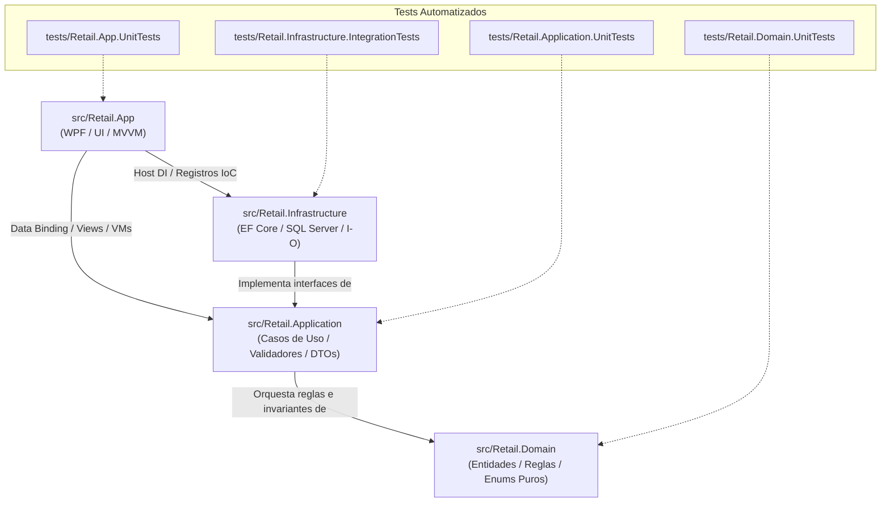

# Mapa Semántico y Guía de Navegación del Proyecto Retail

### Propósito del Documento
Este documento sirve como **índice semántico condensado** para desarrolladores humanos y **agentes de código** (IA). Permite ubicar con exactitud qué archivo, clase y capa es responsable de cada caso de uso del sistema, optimizando el consumo de tokens y previniendo búsquedas ciegas en el repositorio.

---

## 🏛️ Topología de Capas y Proyectos (.NET 8)

---

## 🧭 Catálogo de Archivos por Capa y Responsabilidad

### 1. Capa de Dominio: `src/Retail.Domain` (Sin dependencias externas)

| Componente | Ubicación Relativa | Responsabilidad y Rol DDD | Requisitos Vinculados |
| :--- | :--- | :--- | :--- |
| **Abstracciones Base** | [`Common/BaseEntity.cs`](file:///c:/Users/lucas/Proyectos/retail/src/Retail.Domain/Common/BaseEntity.cs) | Identidad, auditoría temporal (`CreatedAt`) y borrado lógico (`DeletedAt`, `MarkAsDeleted()`, `Restore()`). | Transversal |
| **Marcador DDD** | [`Common/IAggregateRoot.cs`](file:///c:/Users/lucas/Proyectos/retail/src/Retail.Domain/Common/IAggregateRoot.cs) | *Marker Interface* que restringe qué entidades pueden tener Repositorio propio. | Transversal |
| **Excepciones de Dominio** | [`Exceptions/`](file:///c:/Users/lucas/Proyectos/retail/src/Retail.Domain/Exceptions/) | Catálogo de 16 excepciones tipadas de negocio derivadas de [`DomainException.cs`](file:///c:/Users/lucas/Proyectos/retail/src/Retail.Domain/Exceptions/DomainException.cs) que custodian las invariantes de todos los agregados. | Transversal |
| • *Stock / Góndola* | [`Exceptions/StockInsuficienteException.cs`](file:///c:/Users/lucas/Proyectos/retail/src/Retail.Domain/Exceptions/StockInsuficienteException.cs) | Venta o reserva que supera el stock físico disponible en catálogo. | `RF-10`, `RF-12` |
| • *Caja y Tesorería* | [`Exceptions/CajaCerradaException.cs`](file:///c:/Users/lucas/Proyectos/retail/src/Retail.Domain/Exceptions/CajaCerradaException.cs), [`TurnoYaAbiertoException.cs`](file:///c:/Users/lucas/Proyectos/retail/src/Retail.Domain/Exceptions/TurnoYaAbiertoException.cs), [`SaldoCajaInsuficienteException.cs`](file:///c:/Users/lucas/Proyectos/retail/src/Retail.Domain/Exceptions/SaldoCajaInsuficienteException.cs), [`TurnoYaCerradoException.cs`](file:///c:/Users/lucas/Proyectos/retail/src/Retail.Domain/Exceptions/TurnoYaCerradoException.cs) | Custodia de turnos activos, apertura única y retiros limitados al efectivo real en gaveta. | `RF-13`, `RF-14`, `RF-15` |
| • *Presupuestos* | [`Exceptions/PresupuestoVencidoException.cs`](file:///c:/Users/lucas/Proyectos/retail/src/Retail.Domain/Exceptions/PresupuestoVencidoException.cs), [`PresupuestoYaConvertidoException.cs`](file:///c:/Users/lucas/Proyectos/retail/src/Retail.Domain/Exceptions/PresupuestoYaConvertidoException.cs) | Control de vigencia temporal, conciliación de precios y bloqueo de reutilización de cotizaciones ya cobradas. | `RF-11`, `RF-12` |
| • *Clientes / Cta Cte* | [`Exceptions/LimiteCreditoExcedidoException.cs`](file:///c:/Users/lucas/Proyectos/retail/src/Retail.Domain/Exceptions/LimiteCreditoExcedidoException.cs), [`CuentaCorrienteNoHabilitadaException.cs`](file:///c:/Users/lucas/Proyectos/retail/src/Retail.Domain/Exceptions/CuentaCorrienteNoHabilitadaException.cs), [`CobranzaExcedeDeudaException.cs`](file:///c:/Users/lucas/Proyectos/retail/src/Retail.Domain/Exceptions/CobranzaExcedeDeudaException.cs) | Límite de crédito autorizado, habilitación de cuenta corriente y cobros que no superen la deuda. | `RF-09`, `RF-20` |
| • *Venta y Mostrador* | [`Exceptions/MontoPagoInsuficienteException.cs`](file:///c:/Users/lucas/Proyectos/retail/src/Retail.Domain/Exceptions/MontoPagoInsuficienteException.cs), [`VentaVaciaException.cs`](file:///c:/Users/lucas/Proyectos/retail/src/Retail.Domain/Exceptions/VentaVaciaException.cs) | Cancelación total del importe ($\sum \text{Pagos} \ge \text{Total}$) y prohibición de venta sin ítems. | `RF-09` |
| • *Usuarios y Seguridad* | [`Exceptions/UltimoGerenteException.cs`](file:///c:/Users/lucas/Proyectos/retail/src/Retail.Domain/Exceptions/UltimoGerenteException.cs), [`CredencialesInvalidasException.cs`](file:///c:/Users/lucas/Proyectos/retail/src/Retail.Domain/Exceptions/CredencialesInvalidasException.cs), [`UsuarioInactivoException.cs`](file:///c:/Users/lucas/Proyectos/retail/src/Retail.Domain/Exceptions/UsuarioInactivoException.cs) | Invariante de existencia de al menos un Gerente activo y autenticación segura. | `RF-01`, `RF-03` |
| **Enumeraciones Puras** | [`Enums/`](file:///c:/Users/lucas/Proyectos/retail/src/Retail.Domain/Enums/) | 9 enums: [`RolUsuarioEnum`](file:///c:/Users/lucas/Proyectos/retail/src/Retail.Domain/Enums/RolUsuarioEnum.cs), [`MedioPagoEnum`](file:///c:/Users/lucas/Proyectos/retail/src/Retail.Domain/Enums/MedioPagoEnum.cs), [`EstadoTurnoEnum`](file:///c:/Users/lucas/Proyectos/retail/src/Retail.Domain/Enums/EstadoTurnoEnum.cs), [`TipoMovimientoCajaEnum`](file:///c:/Users/lucas/Proyectos/retail/src/Retail.Domain/Enums/TipoMovimientoCajaEnum.cs), [`EstadoPresupuestoEnum`](file:///c:/Users/lucas/Proyectos/retail/src/Retail.Domain/Enums/EstadoPresupuestoEnum.cs), [`EstadoFiscalEnum`](file:///c:/Users/lucas/Proyectos/retail/src/Retail.Domain/Enums/EstadoFiscalEnum.cs), [`TipoComprobanteFiscalEnum`](file:///c:/Users/lucas/Proyectos/retail/src/Retail.Domain/Enums/TipoComprobanteFiscalEnum.cs), [`CondicionIvaEnum`](file:///c:/Users/lucas/Proyectos/retail/src/Retail.Domain/Enums/CondicionIvaEnum.cs), [`TipoDocumentoEnum`](file:///c:/Users/lucas/Proyectos/retail/src/Retail.Domain/Enums/TipoDocumentoEnum.cs). | Transversal |
| **Agregado Venta** | [`Entities/Venta.cs`](file:///c:/Users/lucas/Proyectos/retail/src/Retail.Domain/Entities/Venta.cs) | **Raíz de Agregado.** Custodia el total, ítems y pagos de la venta en mostrador. | `RF-09`, `RF-10` |
| **Entidad Detalle Venta**| [`Entities/DetalleVenta.cs`](file:///c:/Users/lucas/Proyectos/retail/src/Retail.Domain/Entities/DetalleVenta.cs) | Entidad interna del agregado `Venta` (artículo vendido, cantidad, subtotal). | `RF-09` |
| **Entidad Pago Venta** | [`Entities/PagoVenta.cs`](file:///c:/Users/lucas/Proyectos/retail/src/Retail.Domain/Entities/PagoVenta.cs) | Entidad interna del agregado `Venta` (medio de pago, monto, vuelto). | `RF-09` |
| **Comprobante Fiscal** | [`Entities/ComprobanteFiscal.cs`](file:///c:/Users/lucas/Proyectos/retail/src/Retail.Domain/Entities/ComprobanteFiscal.cs) | Entidad interna del agregado `Venta` con datos de AFIP/ARCA (CAE, PV, motivo de error). | `RF-16`, `RF-17` |
| **Agregado Presupuesto**| [`Entities/Presupuesto.cs`](file:///c:/Users/lucas/Proyectos/retail/src/Retail.Domain/Entities/Presupuesto.cs) | **Raíz de Agregado.** Cotización temporal (15 días) independiente de caja y stock. | `RF-11`, `RF-12` |
| **Detalle Presupuesto** | [`Entities/DetallePresupuesto.cs`](file:///c:/Users/lucas/Proyectos/retail/src/Retail.Domain/Entities/DetallePresupuesto.cs)| Entidad interna del presupuesto con precios pactados congelados. | `RF-11` |
| **Agregado Artículos** | [`Entities/Articulo.cs`](file:///c:/Users/lucas/Proyectos/retail/src/Retail.Domain/Entities/Articulo.cs) | **Raíz de Agregado.** Catálogo, stock, markup, categoría y marca opcionales, y soporte de código nulable para artesanías. | `RF-04`, `RF-05`, `RF-06`, `RF-08` |
| **Categorías y Marcas**| [`Entities/Categoria.cs`](file:///c:/Users/lucas/Proyectos/retail/src/Retail.Domain/Entities/Categoria.cs), [`Marca.cs`](file:///c:/Users/lucas/Proyectos/retail/src/Retail.Domain/Entities/Marca.cs) | Clasificación de artículos y fabricantes en el catálogo. | `RF-04` |
| **Agregado Clientes** | [`Entities/Cliente.cs`](file:///c:/Users/lucas/Proyectos/retail/src/Retail.Domain/Entities/Cliente.cs) | **Raíz de Agregado.** Padrón con CUIT/DNI, condición IVA, límite de crédito, saldo de cuenta corriente, custodia de deuda e invariante de bloqueo de soft delete con saldo pendiente. | `RF-20` |
| **Cobranza Cliente** | [`Entities/CobranzaCliente.cs`](file:///c:/Users/lucas/Proyectos/retail/src/Retail.Domain/Entities/CobranzaCliente.cs) | Registro de pago de deuda multimedio con impacto en cuenta corriente y caja. | `RF-20` |
| **Agregado Turno Caja**| [`Entities/TurnoCaja.cs`](file:///c:/Users/lucas/Proyectos/retail/src/Retail.Domain/Entities/TurnoCaja.cs) | **Raíz de Agregado.** Apertura, saldo teórico de efectivo, cierre y arqueo ciego. | `RF-13`, `RF-15` |
| **Movimiento Caja** | [`Entities/MovimientoCaja.cs`](file:///c:/Users/lucas/Proyectos/retail/src/Retail.Domain/Entities/MovimientoCaja.cs) | Entidad interna de caja para ingresos y retiros extraordinarios justificados. | `RF-14` |
| **Agregado Compras** | [`Entities/Compra.cs`](file:///c:/Users/lucas/Proyectos/retail/src/Retail.Domain/Entities/Compra.cs) | **Raíz de Agregado.** Facturas de distribuidores con recálculo automático de precios por markup. | `RF-19` |
| **Detalle Compra** | [`Entities/DetalleCompra.cs`](file:///c:/Users/lucas/Proyectos/retail/src/Retail.Domain/Entities/DetalleCompra.cs) | Entidad interna de compra con cantidades y costo de reposición unitario. | `RF-19` |
| **Agregado Usuarios** | [`Entities/Usuario.cs`](file:///c:/Users/lucas/Proyectos/retail/src/Retail.Domain/Entities/Usuario.cs), [`Rol.cs`](file:///c:/Users/lucas/Proyectos/retail/src/Retail.Domain/Entities/Rol.cs) | **Raíz de Agregado.** Cuentas de acceso local con contraseña hasheada y rol. | `RF-01`, `RF-03` |
| **Agregado Proveedores**| [`Entities/Proveedor.cs`](file:///c:/Users/lucas/Proyectos/retail/src/Retail.Domain/Entities/Proveedor.cs) | **Raíz de Agregado.** Distribuidores mayoristas y catálogos de costos importados. | `RF-05`, `RF-07` |
| **Catálogo Proveedor** | [`Entities/CatalogoProveedor.cs`](file:///c:/Users/lucas/Proyectos/retail/src/Retail.Domain/Entities/CatalogoProveedor.cs) | Entidad interna de listas de precios y códigos de distribución mayorista. | `RF-05`, `RF-07` |

---

### 2. Capa de Aplicación: `src/Retail.Application` (Casos de Uso)

| Componente | Ubicación Relativa | Responsabilidad y Contenido |
| :--- | :--- | :--- |
| **Registro IoC** | [`DependencyInjection.cs`](file:///c:/Users/lucas/Proyectos/retail/src/Retail.Application/DependencyInjection.cs) | Método de extensión `AddApplicationServices()` para el contenedor de dependencias. |
| **Interfaces de Negocio** | [`Interfaces/Services/`](file:///c:/Users/lucas/Proyectos/retail/src/Retail.Application/Interfaces/Services/) | [`IAuthService`](file:///c:/Users/lucas/Proyectos/retail/src/Retail.Application/Interfaces/Services/IAuthService.cs), [`IUsuarioService`](file:///c:/Users/lucas/Proyectos/retail/src/Retail.Application/Interfaces/Services/IUsuarioService.cs), [`IVentaService`](file:///c:/Users/lucas/Proyectos/retail/src/Retail.Application/Interfaces/Services/IVentaService.cs), [`IPresupuestoService`](file:///c:/Users/lucas/Proyectos/retail/src/Retail.Application/Interfaces/Services/IPresupuestoService.cs), [`IClienteService`](file:///c:/Users/lucas/Proyectos/retail/src/Retail.Application/Interfaces/Services/IClienteService.cs), [`ICajaService`](file:///c:/Users/lucas/Proyectos/retail/src/Retail.Application/Interfaces/Services/ICajaService.cs), [`IInventarioService`](file:///c:/Users/lucas/Proyectos/retail/src/Retail.Application/Interfaces/Services/IInventarioService.cs), [`ICompraService`](file:///c:/Users/lucas/Proyectos/retail/src/Retail.Application/Interfaces/Services/ICompraService.cs), [`IProveedorService`](file:///c:/Users/lucas/Proyectos/retail/src/Retail.Application/Interfaces/Services/IProveedorService.cs), [`IFiscalService`](file:///c:/Users/lucas/Proyectos/retail/src/Retail.Application/Interfaces/Services/IFiscalService.cs). |
| **Interfaces de Persistencia** | [`Interfaces/Persistence/`](file:///c:/Users/lucas/Proyectos/retail/src/Retail.Application/Interfaces/Persistence/) | [`IRepository<T>`](file:///c:/Users/lucas/Proyectos/retail/src/Retail.Application/Interfaces/Persistence/IRepository.cs) (`where T : BaseEntity, IAggregateRoot`), [`IUnitOfWork`](file:///c:/Users/lucas/Proyectos/retail/src/Retail.Application/Interfaces/Persistence/IUnitOfWork.cs), [`IRetailDbContext`](file:///c:/Users/lucas/Proyectos/retail/src/Retail.Application/Interfaces/Persistence/IRetailDbContext.cs). |
| **Interfaces de Infraestructura**| [`Interfaces/Infrastructure/`](file:///c:/Users/lucas/Proyectos/retail/src/Retail.Application/Interfaces/Infrastructure/)| [`IArcaClient`](file:///c:/Users/lucas/Proyectos/retail/src/Retail.Application/Interfaces/Infrastructure/IArcaClient.cs), [`IExcelCatalogParser`](file:///c:/Users/lucas/Proyectos/retail/src/Retail.Application/Interfaces/Infrastructure/IExcelCatalogParser.cs), [`IPasswordHasher`](file:///c:/Users/lucas/Proyectos/retail/src/Retail.Application/Interfaces/Infrastructure/IPasswordHasher.cs), [`ITicketPrinterService`](file:///c:/Users/lucas/Proyectos/retail/src/Retail.Application/Interfaces/Infrastructure/ITicketPrinterService.cs). |
| **DTOs de Transporte** | [`DTOs/`](file:///c:/Users/lucas/Proyectos/retail/src/Retail.Application/DTOs/) | Modelos `record class` inmutables agrupados en: `Auth/`, `Usuarios/`, `Articulos/`, `Proveedores/`, `Caja/`, `Clientes/`, `Ventas/`, `Compras/`, `Presupuestos/`, `Fiscal/`. Heredan de [`DTOs/Common/BaseDto.cs`](file:///c:/Users/lucas/Proyectos/retail/src/Retail.Application/DTOs/Common/BaseDto.cs) (`INotifyPropertyChanged`) para prevenir fugas de enlace de datos (*binding leaks*) en WPF. |
| **Implementaciones de Servicios**| [`Services/`](file:///c:/Users/lucas/Proyectos/retail/src/Retail.Application/Services/) | [`AuthService.cs`](file:///c:/Users/lucas/Proyectos/retail/src/Retail.Application/Services/AuthService.cs) (autenticación segura con BCrypt, emisión de DTOs de sesión e integración de excepciones de dominio RF-01), [`UsuarioService.cs`](file:///c:/Users/lucas/Proyectos/retail/src/Retail.Application/Services/UsuarioService.cs) (orquestación RBAC, validaciones e invariante `UltimoGerenteException`), [`InventarioService.cs`](file:///c:/Users/lucas/Proyectos/retail/src/Retail.Application/Services/InventarioService.cs) (catálogo de productos, cálculo reactivo de markup, búsqueda multicriterio con push-down a SQL y alertas de stock mínimo RF-04, RF-08), [`ClienteService.cs`](file:///c:/Users/lucas/Proyectos/retail/src/Retail.Application/Services/ClienteService.cs) (Módulo 3.2: ABM de clientes, push-down de búsqueda multicriterio en SQL, custodia de límites de crédito, amortización de saldo en cobranzas multimedio e integración con caja y comprobantes), [`VentaService.cs`](file:///c:/Users/lucas/Proyectos/retail/src/Retail.Application/Services/VentaService.cs) (Módulo 4.1: Búsqueda ultrarrápida de artículos con push-down a SQL y despacho a emulador de impresión de ticket). |
| **Validadores** | [`Validators/`](file:///c:/Users/lucas/Proyectos/retail/src/Retail.Application/Validators/) | Validaciones declarativas `FluentValidation` en [`Validators/Auth/`](file:///c:/Users/lucas/Proyectos/retail/src/Retail.Application/Validators/Auth/) ([`LoginRequestValidator.cs`](file:///c:/Users/lucas/Proyectos/retail/src/Retail.Application/Validators/Auth/LoginRequestValidator.cs)), [`Validators/Usuarios/`](file:///c:/Users/lucas/Proyectos/retail/src/Retail.Application/Validators/Usuarios/) ([`CrearUsuarioValidator.cs`](file:///c:/Users/lucas/Proyectos/retail/src/Retail.Application/Validators/Usuarios/CrearUsuarioValidator.cs), [`ModificarUsuarioValidator.cs`](file:///c:/Users/lucas/Proyectos/retail/src/Retail.Application/Validators/Usuarios/ModificarUsuarioValidator.cs), [`CambiarPasswordValidator.cs`](file:///c:/Users/lucas/Proyectos/retail/src/Retail.Application/Validators/Usuarios/CambiarPasswordValidator.cs)), [`Validators/Articulos/`](file:///c:/Users/lucas/Proyectos/retail/src/Retail.Application/Validators/Articulos/) ([`CrearArticuloValidator.cs`](file:///c:/Users/lucas/Proyectos/retail/src/Retail.Application/Validators/Articulos/CrearArticuloValidator.cs), [`ActualizarArticuloValidator.cs`](file:///c:/Users/lucas/Proyectos/retail/src/Retail.Application/Validators/Articulos/ActualizarArticuloValidator.cs)) y [`Validators/Clientes/`](file:///c:/Users/lucas/Proyectos/retail/src/Retail.Application/Validators/Clientes/) ([`CrearClienteValidator.cs`](file:///c:/Users/lucas/Proyectos/retail/src/Retail.Application/Validators/Clientes/CrearClienteValidator.cs), [`ActualizarClienteValidator.cs`](file:///c:/Users/lucas/Proyectos/retail/src/Retail.Application/Validators/Clientes/ActualizarClienteValidator.cs), [`RegistrarCobranzaValidator.cs`](file:///c:/Users/lucas/Proyectos/retail/src/Retail.Application/Validators/Clientes/RegistrarCobranzaValidator.cs)). |

---

### 3. Capa de Infraestructura: `src/Retail.Infrastructure` (Persistencia e Integraciones)

| Componente | Ubicación Relativa | Responsabilidad y Contenido |
| :--- | :--- | :--- |
| **Registro IoC** | [`DependencyInjection.cs`](file:///c:/Users/lucas/Proyectos/retail/src/Retail.Infrastructure/DependencyInjection.cs) | Método de extensión `AddInfrastructureServices()` conectando EF Core, repositorios, semillero, hardware de prueba, servicios fiscales y dobles de prueba con `TryAddScoped`. |
| **Contexto EF Core** | [`Persistence/Context/RetailDbContext.cs`](file:///c:/Users/lucas/Proyectos/retail/src/Retail.Infrastructure/Persistence/Context/RetailDbContext.cs) | DbSets, transacciones y configuración de Global Query Filters (`!IsDeleted`). |
| **Mapeo Fluent API** | [`Persistence/Configurations/`](file:///c:/Users/lucas/Proyectos/retail/src/Retail.Infrastructure/Persistence/Configurations/) | Mapeo detallado de tablas, relaciones y **Filtered Indexes** para artesanías con soft delete (`[codigo_barras] IS NOT NULL AND [deleted_at] IS NULL`), operadores activos (`[deleted_at] IS NULL` en `USUARIOS.nombre_usuario`) y clientes activos (`[deleted_at] IS NULL` en `CLIENTES.numero_documento`). |
| **Repositorio y UoW** | [`Persistence/Repositories/`](file:///c:/Users/lucas/Proyectos/retail/src/Retail.Infrastructure/Persistence/Repositories/) | [`Repository<T>`](file:///c:/Users/lucas/Proyectos/retail/src/Retail.Infrastructure/Persistence/Repositories/Repository.cs) (incluyendo `GetByIdWithIncludesAsync` para navegación de agregados) y [`UnitOfWork`](file:///c:/Users/lucas/Proyectos/retail/src/Retail.Infrastructure/Persistence/Repositories/UnitOfWork.cs) que coordina `SaveChangesAsync()`. |
| **Semillero Inicial** | [`Persistence/Initialization/DbInitializer.cs`](file:///c:/Users/lucas/Proyectos/retail/src/Retail.Infrastructure/Persistence/Initialization/DbInitializer.cs) | Poblamiento de roles, usuario `admin` (BCrypt), categorías y 20 artículos en primer arranque. |
| **Migraciones EF Core**| [`Persistence/Migrations/`](file:///c:/Users/lucas/Proyectos/retail/src/Retail.Infrastructure/Persistence/Migrations/) | Migraciones: `InitialCreate`, `AddFilteredIndexToUsuariosNombreUsuario`, `AddFilteredIndexToArticulosCodigoBarrasSoftDelete`, `MakeArticuloCategoriaAndMarcaNullable` y `AddFilteredIndexToClientesNumeroDocumento`. |
| **Guía de Persistencia**| [`docs/SISTEMA_DE_PERSISTENCIA.md`](file:///c:/Users/lucas/Proyectos/retail/docs/SISTEMA_DE_PERSISTENCIA.md) | Manual normativo de base de datos, topología DDD, leyes de persistencia, comandos CLI de EF Core y snippets canónicos. |
| **Cliente Fiscal ARCA** | [`ExternalServices/ArcaSdk/`](file:///c:/Users/lucas/Proyectos/retail/src/Retail.Infrastructure/ExternalServices/ArcaSdk/) | Cliente HTTP [`ArcaClient.cs`](file:///c:/Users/lucas/Proyectos/retail/src/Retail.Infrastructure/ExternalServices/ArcaSdk/ArcaClient.cs), doble de prueba [`MockArcaClient.cs`](file:///c:/Users/lucas/Proyectos/retail/src/Retail.Infrastructure/ExternalServices/ArcaSdk/MockArcaClient.cs) y opciones [`ArcaOptions.cs`](file:///c:/Users/lucas/Proyectos/retail/src/Retail.Infrastructure/ExternalServices/ArcaSdk/ArcaOptions.cs). |
| **Dobles de Prueba (Mocks)** | [`ExternalServices/Mocks/`](file:///c:/Users/lucas/Proyectos/retail/src/Retail.Infrastructure/ExternalServices/Mocks/) | [`FakeCajaService.cs`](file:///c:/Users/lucas/Proyectos/retail/src/Retail.Infrastructure/ExternalServices/Mocks/FakeCajaService.cs) para desarrollo aislado de cobranzas e imputación a caja antes de la integración del Módulo 3.1. |
| **Hardware & Mocks** | [`Hardware/`](file:///c:/Users/lucas/Proyectos/retail/src/Retail.Infrastructure/Hardware/) | Emulador de impresora térmica [`FileDebugTicketPrinterService.cs`](file:///c:/Users/lucas/Proyectos/retail/src/Retail.Infrastructure/Hardware/FileDebugTicketPrinterService.cs) y opciones [`TicketPrinterOptions.cs`](file:///c:/Users/lucas/Proyectos/retail/src/Retail.Infrastructure/Hardware/TicketPrinterOptions.cs). |
| **Lector Masivo Excel** | `ExternalServices/Excel/` | Procesamiento en segundo plano de listas de proveedores usando **MiniExcel**. |
| **Criptografía** | [`Security/PasswordHasher.cs`](file:///c:/Users/lucas/Proyectos/retail/src/Retail.Infrastructure/Security/PasswordHasher.cs) | Hashing seguro de contraseñas de usuarios con `BCrypt.Net-Next`. |

---

### 4. Capa de Presentación: `src/Retail.App` (WPF .NET 8 / MVVM)

| Componente | Ubicación Relativa | Responsabilidad y Contenido |
| :--- | :--- | :--- |
| **Punto de Entrada & IoC**| [`App.xaml.cs`](file:///c:/Users/lucas/Proyectos/retail/src/Retail.App/App.xaml.cs) | Configuración del Generic Host, logging rotativo Serilog (`logs/retail-.log`), captura global de excepciones y flujo de autenticación de inicio (`LoginWindow` modal hacia `MainWindow`). |
| **Configuración Local** | [`appsettings.json`](file:///c:/Users/lucas/Proyectos/retail/src/Retail.App/appsettings.json) | Cadenas de conexión (LocalDB) y flag `"UseMockArca": true`. |
| **Ventana Principal (Shell)** | [`MainWindow.xaml`](file:///c:/Users/lucas/Proyectos/retail/src/Retail.App/MainWindow.xaml) | Shell general de mostrador y punto de venta con Sidebar lateral colapsable (240px / 68px), ficha de operador activo, rol RBAC, cambio rápido de sesión (&lt; 15 ms, RF-02), atajos globales F1-F10 y tooltips en hover. |
| **Ventana de Autenticación** | [`Views/Auth/LoginWindow.xaml`](file:///c:/Users/lucas/Proyectos/retail/src/Retail.App/Views/Auth/LoginWindow.xaml) | Pantalla de inicio de sesión de operadores (Módulo 1.1) con `ui:FluentWindow`, backdrop Mica, diseño centrado y feedback seguro de credenciales. |
| **Páginas de Trabajo** | [`Views/Pages/`](file:///c:/Users/lucas/Proyectos/retail/src/Retail.App/Views/Pages/) | [`UsuariosView.xaml`](file:///c:/Users/lucas/Proyectos/retail/src/Retail.App/Views/Pages/UsuariosView.xaml) (Módulo 1.2: Gestión de operadores, roles, estado y acciones contextuales con surface unificado y paginación), [`ArticulosView.xaml`](file:///c:/Users/lucas/Proyectos/retail/src/Retail.App/Views/Pages/ArticulosView.xaml) (Módulo 2.1: Catálogo de artículos, badges de stock mínimo, atajos de mostrador F2/F3/F5, surface unificado y paginación), [`ClientesView.xaml`](file:///c:/Users/lucas/Proyectos/retail/src/Retail.App/Views/Pages/ClientesView.xaml) (Módulo 3.2: Padrón de clientes, surface unificado con toolbar de filtros, grilla DataGridRetailStyle, badges canónicos, barra de paginación integrada, atajo F4 y cobranza rápida en grilla), [`PosView.xaml`](file:///c:/Users/lucas/Proyectos/retail/src/Retail.App/Views/Pages/PosView.xaml) (Módulo 4.1: Terminal de mostrador POS de alta velocidad, búsqueda asistida y escaneo unificado con popup predictivo, grilla de ticket 70%, tarjeta resumen 30%, atajos de mostrador F1-F12 y checkout multimedio), [`ModuloEnConstruccionView.xaml`](file:///c:/Users/lucas/Proyectos/retail/src/Retail.App/Views/Pages/ModuloEnConstruccionView.xaml) (Cortesía informativa para módulos proyectados en el Roadmap: Caja, Presupuestos, Compras, Proveedores y Consola Fiscal), `CajaView.xaml`, `PresupuestosView.xaml`, `ComprasView.xaml`, `ConsolaFiscalView.xaml`. |
| **Componentes UI Reutilizables**| [`Views/Components/`](file:///c:/Users/lucas/Proyectos/retail/src/Retail.App/Views/Components/) | [`PaginationBar.xaml`](file:///c:/Users/lucas/Proyectos/retail/src/Retail.App/Views/Components/PaginationBar.xaml) (Barra unificada de paginación con selector de tamaño de página, resumen de registros y botones canónicos de navegación F-keys / BoxIcons para DataGrid). |
| **Diálogos Modales** | [`Views/Dialogs/`](file:///c:/Users/lucas/Proyectos/retail/src/Retail.App/Views/Dialogs/) | [`UsuarioFormDialog.xaml`](file:///c:/Users/lucas/Proyectos/retail/src/Retail.App/Views/Dialogs/UsuarioFormDialog.xaml) (Alta y edición modal de operadores), [`CambiarPasswordDialog.xaml`](file:///c:/Users/lucas/Proyectos/retail/src/Retail.App/Views/Dialogs/CambiarPasswordDialog.xaml) (Blanqueo seguro de credencial con doble confirmación), [`ArticuloFormDialog.xaml`](file:///c:/Users/lucas/Proyectos/retail/src/Retail.App/Views/Dialogs/ArticuloFormDialog.xaml) (Alta y edición modal de artículos con recálculo dinámico de markup en tiempo real), [`ClienteFormDialog.xaml`](file:///c:/Users/lucas/Proyectos/retail/src/Retail.App/Views/Dialogs/ClienteFormDialog.xaml) (Alta y edición modal de clientes con habilitación de cuenta corriente), [`CobranzaModalDialog.xaml`](file:///c:/Users/lucas/Proyectos/retail/src/Retail.App/Views/Dialogs/CobranzaModalDialog.xaml) (Cobranza multimedio de cuenta corriente con cálculo reactivo de vuelto y botón "Pagar Totalidad"), [`CobroModalDialog.xaml`](file:///c:/Users/lucas/Proyectos/retail/src/Retail.App/Views/Dialogs/CobroModalDialog.xaml) (Módulo 4.1: Cobro multimedio de venta en mostrador con billetes rápidos, vuelto reactivo, validación de cuenta corriente y comprobante fiscal), [`SeleccionarClienteModalDialog.xaml`](file:///c:/Users/lucas/Proyectos/retail/src/Retail.App/Views/Dialogs/SeleccionarClienteModalDialog.xaml) (Módulo 4.1: Selector modal rápido de cliente [F4] con filtrado en tiempo real y asignación al ticket), [`UnhandledExceptionDialog.xaml`](file:///c:/Users/lucas/Proyectos/retail/src/Retail.App/Views/Dialogs/UnhandledExceptionDialog.xaml), `ArqueoCiegoDialog.xaml`, `AlertaPreciosPresupuestoDialog.xaml`. |
| **ViewModels (MVVM)** | [`ViewModels/`](file:///c:/Users/lucas/Proyectos/retail/src/Retail.App/ViewModels/) | [`LoginViewModel.cs`](file:///c:/Users/lucas/Proyectos/retail/src/Retail.App/ViewModels/Auth/LoginViewModel.cs), [`MainViewModel.cs`](file:///c:/Users/lucas/Proyectos/retail/src/Retail.App/ViewModels/MainViewModel.cs) (Gobierno del Sidebar colapsable, estado de expansión, módulo activo y navegación unificada), [`UsuariosViewModel.cs`](file:///c:/Users/lucas/Proyectos/retail/src/Retail.App/ViewModels/Usuarios/UsuariosViewModel.cs), [`UsuarioFormViewModel.cs`](file:///c:/Users/lucas/Proyectos/retail/src/Retail.App/ViewModels/Usuarios/UsuarioFormViewModel.cs), [`CambiarPasswordViewModel.cs`](file:///c:/Users/lucas/Proyectos/retail/src/Retail.App/ViewModels/Usuarios/CambiarPasswordViewModel.cs), [`ArticulosViewModel.cs`](file:///c:/Users/lucas/Proyectos/retail/src/Retail.App/ViewModels/Articulos/ArticulosViewModel.cs), [`ArticuloFormViewModel.cs`](file:///c:/Users/lucas/Proyectos/retail/src/Retail.App/ViewModels/Articulos/ArticuloFormViewModel.cs), [`ClientesViewModel.cs`](file:///c:/Users/lucas/Proyectos/retail/src/Retail.App/ViewModels/Clientes/ClientesViewModel.cs), [`ClienteFormViewModel.cs`](file:///c:/Users/lucas/Proyectos/retail/src/Retail.App/ViewModels/Clientes/ClienteFormViewModel.cs), [`CobranzaModalViewModel.cs`](file:///c:/Users/lucas/Proyectos/retail/src/Retail.App/ViewModels/Clientes/CobranzaModalViewModel.cs), [`PosViewModel.cs`](file:///c:/Users/lucas/Proyectos/retail/src/Retail.App/ViewModels/Ventas/PosViewModel.cs) (Módulo 4.1: Mostrador POS, buffer de escaneo/búsqueda, atajos F1-F12, grilla de ticket reactiva y totales), [`ItemVentaPosViewModel.cs`](file:///c:/Users/lucas/Proyectos/retail/src/Retail.App/ViewModels/Ventas/ItemVentaPosViewModel.cs), [`CobroModalViewModel.cs`](file:///c:/Users/lucas/Proyectos/retail/src/Retail.App/ViewModels/Ventas/CobroModalViewModel.cs), [`SeleccionarClienteModalViewModel.cs`](file:///c:/Users/lucas/Proyectos/retail/src/Retail.App/ViewModels/Ventas/SeleccionarClienteModalViewModel.cs) con `CommunityToolkit.Mvvm`, comandos asíncronos y soporte de diálogos desacoplados. |
| **Servicios de UI** | [`Services/`](file:///c:/Users/lucas/Proyectos/retail/src/Retail.App/Services/) | [`ICurrentUserSession.cs`](file:///c:/Users/lucas/Proyectos/retail/src/Retail.App/Services/ICurrentUserSession.cs) y [`CurrentUserSession.cs`](file:///c:/Users/lucas/Proyectos/retail/src/Retail.App/Services/CurrentUserSession.cs) (sesión activa en memoria y flags RBAC reactivos); [`INavigationService.cs`](file:///c:/Users/lucas/Proyectos/retail/src/Retail.App/Services/INavigationService.cs) y [`NavigationService.cs`](file:///c:/Users/lucas/Proyectos/retail/src/Retail.App/Services/NavigationService.cs) (enrutamiento de páginas sobre Frame con resolución IoC y sobrecarga con acción de configuración lambda); [`IUsuarioDialogService.cs`](file:///c:/Users/lucas/Proyectos/retail/src/Retail.App/Services/IUsuarioDialogService.cs) y [`UsuarioDialogService.cs`](file:///c:/Users/lucas/Proyectos/retail/src/Retail.App/Services/UsuarioDialogService.cs); [`IArticuloDialogService.cs`](file:///c:/Users/lucas/Proyectos/retail/src/Retail.App/Services/IArticuloDialogService.cs) y [`ArticuloDialogService.cs`](file:///c:/Users/lucas/Proyectos/retail/src/Retail.App/Services/ArticuloDialogService.cs); [`IClienteDialogService.cs`](file:///c:/Users/lucas/Proyectos/retail/src/Retail.App/Services/IClienteDialogService.cs) y [`ClienteDialogService.cs`](file:///c:/Users/lucas/Proyectos/retail/src/Retail.App/Services/ClienteDialogService.cs); [`IVentaDialogService.cs`](file:///c:/Users/lucas/Proyectos/retail/src/Retail.App/Services/IVentaDialogService.cs) y [`VentaDialogService.cs`](file:///c:/Users/lucas/Proyectos/retail/src/Retail.App/Services/VentaDialogService.cs) para desacople de vistas modales y testabilidad en xUnit. |
| **Helpers de UI** | [`Helpers/ButtonHelper.cs`](file:///c:/Users/lucas/Proyectos/retail/src/Retail.App/Helpers/ButtonHelper.cs) | Propiedades de dependencia adjuntas (`IsLoading`, `LoadingText`) para gestión reactiva de spinners e indicadores de carga en botones. |
| **Estilos y Recursos** | [`Styles/`](file:///c:/Users/lucas/Proyectos/retail/src/Retail.App/Styles/) | Diccionarios XAML integrados con WPF-UI y `MahApps.Metro.IconPacks.BoxIcons`: [`Colors.xaml`](file:///c:/Users/lucas/Proyectos/retail/src/Retail.App/Styles/Colors.xaml) (Carmín/Borravino #9D0F33), [`Typography.xaml`](file:///c:/Users/lucas/Proyectos/retail/src/Retail.App/Styles/Typography.xaml) (Cascadia Code / Segoe UI Variable, TextBlockMonospaceCell), [`Icons.xaml`](file:///c:/Users/lucas/Proyectos/retail/src/Retail.App/Styles/Icons.xaml) (StreamGeometries canónicas de mostrador) y [`Controls.xaml`](file:///c:/Users/lucas/Proyectos/retail/src/Retail.App/Styles/Controls.xaml) (Keycaps F1-F12, Badges semánticos de rol/estado, SidebarItemButtonStyle, SidebarToolTipStyle, DataGrid). |
| **Guía de Diseño UI** | [`docs/SISTEMA_DE_DISENO.md`](file:///c:/Users/lucas/Proyectos/retail/docs/SISTEMA_DE_DISENO.md) | Manual normativo de maquetación XAML, catálogo de tokens semánticos, directivas de tipografía dual y snippets canónicos. |
| **Galería de Estilos & Sandbox** | [`Views/Dev/`](file:///c:/Users/lucas/Proyectos/retail/src/Retail.App/Views/Dev/) | [`StyleGalleryView.xaml`](file:///c:/Users/lucas/Proyectos/retail/src/Retail.App/Views/Dev/StyleGalleryView.xaml): Living styleguide (Etapa 0.6), pruebas de resiliencia (Etapa 0.8) y arnés sandbox para validación visual de módulos en curso ([`UsuariosView`](file:///c:/Users/lucas/Proyectos/retail/src/Retail.App/Views/Pages/UsuariosView.xaml), [`ArticulosView`](file:///c:/Users/lucas/Proyectos/retail/src/Retail.App/Views/Pages/ArticulosView.xaml) y [`ClientesView`](file:///c:/Users/lucas/Proyectos/retail/src/Retail.App/Views/Pages/ClientesView.xaml)) sin acoplar el Shell principal. |

- **Actualización:** Se añaden los servicios `CurrentUserSession` e `INavigationService` al mapa semántico.
---

### 5. Proyectos de Pruebas: `tests/` (xUnit)

| Proyecto de Prueba | Ruta | Enfoque de Pruebas Implementado y Proyectado |
| :--- | :--- | :--- |
| **Dominio** | [`tests/Retail.Domain.UnitTests/`](file:///c:/Users/lucas/Proyectos/retail/tests/Retail.Domain.UnitTests/Retail.Domain.UnitTests.csproj) | Pruebas de `BaseEntity` (soft delete), validación de las 9 enumeraciones, verificación de las 16 excepciones de dominio, pruebas de [`UsuarioTests.cs`](file:///c:/Users/lucas/Proyectos/retail/tests/Retail.Domain.UnitTests/Entities/UsuarioTests.cs), pruebas de invariantes de catálogo y markup en [`ArticuloTests.cs`](file:///c:/Users/lucas/Proyectos/retail/tests/Retail.Domain.UnitTests/Entities/ArticuloTests.cs) y pruebas de cuenta corriente, soft delete y amortización de cobranzas en [`ClienteTests.cs`](file:///c:/Users/lucas/Proyectos/retail/tests/Retail.Domain.UnitTests/Entities/ClienteTests.cs). |
| **Aplicación** | [`tests/Retail.Application.UnitTests/`](file:///c:/Users/lucas/Proyectos/retail/tests/Retail.Application.UnitTests/Retail.Application.UnitTests.csproj) | Registro IoC, propiedades calculadas de DTOs, validadores FluentValidation ([`LoginRequestValidatorTests.cs`](file:///c:/Users/lucas/Proyectos/retail/tests/Retail.Application.UnitTests/Validators/LoginRequestValidatorTests.cs), [`ArticuloValidatorTests.cs`](file:///c:/Users/lucas/Proyectos/retail/tests/Retail.Application.UnitTests/Validators/ArticuloValidatorTests.cs), [`ClienteValidatorTests.cs`](file:///c:/Users/lucas/Proyectos/retail/tests/Retail.Application.UnitTests/Validators/ClienteValidatorTests.cs), [`RegistrarCobranzaValidatorTests.cs`](file:///c:/Users/lucas/Proyectos/retail/tests/Retail.Application.UnitTests/Validators/RegistrarCobranzaValidatorTests.cs)) y pruebas de orquestación de servicios en [`AuthServiceTests.cs`](file:///c:/Users/lucas/Proyectos/retail/tests/Retail.Application.UnitTests/Services/AuthServiceTests.cs), [`UsuarioServiceTests.cs`](file:///c:/Users/lucas/Proyectos/retail/tests/Retail.Application.UnitTests/Services/UsuarioServiceTests.cs), [`InventarioServiceTests.cs`](file:///c:/Users/lucas/Proyectos/retail/tests/Retail.Application.UnitTests/Services/InventarioServiceTests.cs) y [`ClienteServiceTests.cs`](file:///c:/Users/lucas/Proyectos/retail/tests/Retail.Application.UnitTests/Services/ClienteServiceTests.cs). |
| **Infraestructura** | [`tests/Retail.Infrastructure.IntegrationTests/`](file:///c:/Users/lucas/Proyectos/retail/tests/Retail.Infrastructure.IntegrationTests/Retail.Infrastructure.IntegrationTests.csproj) | Pruebas de integración con LocalDB, transacciones ACID, persistencia relacional en agregados de cobranzas de clientes, Filtered Indexes (artesanías con código de barras `NULL`, nombres de usuario activos y números de documento de clientes activos) y servicios de hardware mock. |
| **Presentación** | [`tests/Retail.App.UnitTests/`](file:///c:/Users/lucas/Proyectos/retail/tests/Retail.App.UnitTests/Retail.App.UnitTests.csproj) | Smoke tests de inicialización WPF, infraestructura de ejecución STA unificada ([`WpfTestHelper.cs`](file:///c:/Users/lucas/Proyectos/retail/tests/Retail.App.UnitTests/Helpers/WpfTestHelper.cs)), pruebas de sesión en memoria ([`CurrentUserSessionTests.cs`](file:///c:/Users/lucas/Proyectos/retail/tests/Retail.App.UnitTests/Services/CurrentUserSessionTests.cs)), logging rotativo Serilog en archivo (`logs/retail-.log`), pruebas unitarias de `UnhandledExceptionDialog`, cálculo reactivo de vuelto y pruebas completas de MVVM en [`LoginViewModelTests.cs`](file:///c:/Users/lucas/Proyectos/retail/tests/Retail.App.UnitTests/ViewModels/LoginViewModelTests.cs), [`MainViewModelTests.cs`](file:///c:/Users/lucas/Proyectos/retail/tests/Retail.App.UnitTests/ViewModels/MainViewModelTests.cs) (Sidebar, RBAC y navegación integral), [`UsuariosViewModelTests.cs`](file:///c:/Users/lucas/Proyectos/retail/tests/Retail.App.UnitTests/ViewModels/UsuariosViewModelTests.cs), [`UsuarioFormViewModelTests.cs`](file:///c:/Users/lucas/Proyectos/retail/tests/Retail.App.UnitTests/ViewModels/UsuarioFormViewModelTests.cs), [`CambiarPasswordViewModelTests.cs`](file:///c:/Users/lucas/Proyectos/retail/tests/Retail.App.UnitTests/ViewModels/CambiarPasswordViewModelTests.cs), [`ArticulosViewModelTests.cs`](file:///c:/Users/lucas/Proyectos/retail/tests/Retail.App.UnitTests/ViewModels/ArticulosViewModelTests.cs), [`ArticuloFormViewModelTests.cs`](file:///c:/Users/lucas/Proyectos/retail/tests/Retail.App.UnitTests/ViewModels/ArticuloFormViewModelTests.cs), [`ClientesViewModelTests.cs`](file:///c:/Users/lucas/Proyectos/retail/tests/Retail.App.UnitTests/ViewModels/ClientesViewModelTests.cs), [`ClienteFormViewModelTests.cs`](file:///c:/Users/lucas/Proyectos/retail/tests/Retail.App.UnitTests/ViewModels/ClienteFormViewModelTests.cs), [`CobranzaModalViewModelTests.cs`](file:///c:/Users/lucas/Proyectos/retail/tests/Retail.App.UnitTests/ViewModels/CobranzaModalViewModelTests.cs), [`PosViewModelTests.cs`](file:///c:/Users/lucas/Proyectos/retail/tests/Retail.App.UnitTests/ViewModels/PosViewModelTests.cs) (cobertura completa de atajos F1-F12, búsqueda reactiva, commit Enter y totales), [`CobroModalViewModelTests.cs`](file:///c:/Users/lucas/Proyectos/retail/tests/Retail.App.UnitTests/ViewModels/CobroModalViewModelTests.cs) (vuelto reactivo, billetes rápidos y límite de crédito) y tests de humo STA para `PosView`, `CobroModalDialog` y `SeleccionarClienteModalDialog` en [`AppSmokeTests.cs`](file:///c:/Users/lucas/Proyectos/retail/tests/Retail.App.UnitTests/AppSmokeTests.cs). |

---

## 🎯 Matriz de Trazabilidad Rápida: Requisitos Funcionales a Código

| Requisito | Descripción | Punto Central de Implementación (Código) |
| :--- | :--- | :--- |
| **RF-01, RF-02** | Autenticación y Sesión de Usuario | [`IAuthService.cs`](file:///c:/Users/lucas/Proyectos/retail/src/Retail.Application/Interfaces/Services/IAuthService.cs) + [`AuthService.cs`](file:///c:/Users/lucas/Proyectos/retail/src/Retail.Application/Services/AuthService.cs) + [`LoginRequestDto.cs`](file:///c:/Users/lucas/Proyectos/retail/src/Retail.Application/DTOs/Auth/LoginRequestDto.cs) + [`LoginViewModel.cs`](file:///c:/Users/lucas/Proyectos/retail/src/Retail.App/ViewModels/Auth/LoginViewModel.cs) + [`CurrentUserSession.cs`](file:///c:/Users/lucas/Proyectos/retail/src/Retail.App/Services/CurrentUserSession.cs) + [`MainWindow.xaml`](file:///c:/Users/lucas/Proyectos/retail/src/Retail.App/MainWindow.xaml) |
| **RF-03** | ABM y Roles de Usuarios | [`IUsuarioService.cs`](file:///c:/Users/lucas/Proyectos/retail/src/Retail.Application/Interfaces/Services/IUsuarioService.cs) + [`UsuarioService.cs`](file:///c:/Users/lucas/Proyectos/retail/src/Retail.Application/Services/UsuarioService.cs) + [`UsuarioDto.cs`](file:///c:/Users/lucas/Proyectos/retail/src/Retail.Application/DTOs/Usuarios/UsuarioDto.cs) + [`Validators/Usuarios/`](file:///c:/Users/lucas/Proyectos/retail/src/Retail.Application/Validators/Usuarios/) + [`UsuariosView.xaml`](file:///c:/Users/lucas/Proyectos/retail/src/Retail.App/Views/Pages/UsuariosView.xaml) + [`UsuariosViewModel.cs`](file:///c:/Users/lucas/Proyectos/retail/src/Retail.App/ViewModels/Usuarios/UsuariosViewModel.cs) |

| **RF-04** | Catálogo con Código de Barras Nulable | [`IInventarioService.cs`](file:///c:/Users/lucas/Proyectos/retail/src/Retail.Application/Interfaces/Services/IInventarioService.cs) + `Articulo.cs` + `ArticuloConfiguration.cs` (Filtered Index) |
| **RF-05, RF-07** | Ingesta, Vinculación y Curaduría de Catálogos | [`IProveedorService.cs`](file:///c:/Users/lucas/Proyectos/retail/src/Retail.Application/Interfaces/Services/IProveedorService.cs) + [`IExcelCatalogParser.cs`](file:///c:/Users/lucas/Proyectos/retail/src/Retail.Application/Interfaces/Infrastructure/IExcelCatalogParser.cs) (MiniExcel en `Task.Run`) + `ImportadorView.xaml` |
| **RF-08** | Alertas de Stock Mínimo | [`AlertaStockDto.cs`](file:///c:/Users/lucas/Proyectos/retail/src/Retail.Application/DTOs/Articulos/AlertaStockDto.cs) + `Articulo.StockActual <= StockMinimo` + `ArticulosView.xaml` (Badge) |
| **RF-09, RF-10** | POS y Descuento Atómico de Stock | [`IVentaService.cs`](file:///c:/Users/lucas/Proyectos/retail/src/Retail.Application/Interfaces/Services/IVentaService.cs) + [`VentaService.cs`](file:///c:/Users/lucas/Proyectos/retail/src/Retail.Application/Services/VentaService.cs) + [`CrearVentaDto.cs`](file:///c:/Users/lucas/Proyectos/retail/src/Retail.Application/DTOs/Ventas/CrearVentaDto.cs) (ACID) + [`PosView.xaml`](file:///c:/Users/lucas/Proyectos/retail/src/Retail.App/Views/Pages/PosView.xaml) + [`PosViewModel.cs`](file:///c:/Users/lucas/Proyectos/retail/src/Retail.App/ViewModels/Ventas/PosViewModel.cs) + [`CobroModalDialog.xaml`](file:///c:/Users/lucas/Proyectos/retail/src/Retail.App/Views/Dialogs/CobroModalDialog.xaml) + [`CobroModalViewModel.cs`](file:///c:/Users/lucas/Proyectos/retail/src/Retail.App/ViewModels/Ventas/CobroModalViewModel.cs) |
| **RF-11, RF-12** | Presupuestos y Conciliación Adaptativa | [`IPresupuestoService.cs`](file:///c:/Users/lucas/Proyectos/retail/src/Retail.Application/Interfaces/Services/IPresupuestoService.cs) + [`PresupuestoParaVentaDto.cs`](file:///c:/Users/lucas/Proyectos/retail/src/Retail.Application/DTOs/Presupuestos/PresupuestoParaVentaDto.cs) + `AlertaPreciosPresupuestoDialog.xaml` |
| **RF-13, RF-14** | Apertura y Movimientos de Caja | [`ICajaService.cs`](file:///c:/Users/lucas/Proyectos/retail/src/Retail.Application/Interfaces/Services/ICajaService.cs) + [`AperturaTurnoDto.cs`](file:///c:/Users/lucas/Proyectos/retail/src/Retail.Application/DTOs/Caja/AperturaTurnoDto.cs) + `CajaViewModel.cs` |
| **RF-15** | Arqueo Ciego de Efectivo | [`ICajaService.cs`](file:///c:/Users/lucas/Proyectos/retail/src/Retail.Application/Interfaces/Services/ICajaService.cs) + [`ArqueoCiegoDto.cs`](file:///c:/Users/lucas/Proyectos/retail/src/Retail.Application/DTOs/Caja/ArqueoCiegoDto.cs) + `ArqueoCiegoDialog.xaml` |
| **RF-16, RF-17** | Facturación ARCA y Contingencia | [`IArcaClient.cs`](file:///c:/Users/lucas/Proyectos/retail/src/Retail.Application/Interfaces/Infrastructure/IArcaClient.cs) + [`IFiscalService.cs`](file:///c:/Users/lucas/Proyectos/retail/src/Retail.Application/Interfaces/Services/IFiscalService.cs) (Estado `ERROR_FISCAL_REINTENTABLE`) |
| **RF-18** | Consola Gerencial de Reintentos | [`IFiscalService.cs`](file:///c:/Users/lucas/Proyectos/retail/src/Retail.Application/Interfaces/Services/IFiscalService.cs) + [`ReintentoLoteResultadoDto.cs`](file:///c:/Users/lucas/Proyectos/retail/src/Retail.Application/DTOs/Fiscal/ReintentoLoteResultadoDto.cs) + `ConsolaFiscalView.xaml` |
| **RF-19** | Compras y Recálculo Automático Markup | [`ICompraService.cs`](file:///c:/Users/lucas/Proyectos/retail/src/Retail.Application/Interfaces/Services/ICompraService.cs) + [`CrearCompraDto.cs`](file:///c:/Users/lucas/Proyectos/retail/src/Retail.Application/DTOs/Compras/CrearCompraDto.cs) + `Articulo.ActualizarCostoYRecalcularPrecio()` |
| **RF-20** | Clientes y Cobranza Multimedio Cta Cte | [`Cliente.cs`](file:///c:/Users/lucas/Proyectos/retail/src/Retail.Domain/Entities/Cliente.cs) + [`CobranzaCliente.cs`](file:///c:/Users/lucas/Proyectos/retail/src/Retail.Domain/Entities/CobranzaCliente.cs) + [`IClienteService.cs`](file:///c:/Users/lucas/Proyectos/retail/src/Retail.Application/Interfaces/Services/IClienteService.cs) + [`ClienteService.cs`](file:///c:/Users/lucas/Proyectos/retail/src/Retail.Application/Services/ClienteService.cs) + [`RegistrarCobranzaValidator.cs`](file:///c:/Users/lucas/Proyectos/retail/src/Retail.Application/Validators/Clientes/RegistrarCobranzaValidator.cs) + [`CobranzaModalDialog.xaml`](file:///c:/Users/lucas/Proyectos/retail/src/Retail.App/Views/Dialogs/CobranzaModalDialog.xaml) + [`CobranzaModalViewModel.cs`](file:///c:/Users/lucas/Proyectos/retail/src/Retail.App/ViewModels/Clientes/CobranzaModalViewModel.cs) + [`ClientesView.xaml`](file:///c:/Users/lucas/Proyectos/retail/src/Retail.App/Views/Pages/ClientesView.xaml) |

---

## 🗺️ Índice de Etapas del Roadmap Modular (`docs/roadmap/`)

Para preservar el presupuesto de contexto, consulta directamente el archivo modular correspondiente a la etapa de tu tarea:

| Etapa | Módulos y Responsables | Estado | Enlace Directo a la Especificación |
| :--- | :--- | :---: | :--- |
| **Etapa 0** | Cimientos Técnicos, CI/CD, Contratos y Estilos (Pablo & Lucas) | ✅ 100% | [`docs/roadmap/etapa-0-cimientos.md`](file:///c:/Users/lucas/Proyectos/retail/docs/roadmap/etapa-0-cimientos.md) |
| **Etapa 1** | Autenticación y Shell (Pablo) / Usuarios y Roles RBAC (Lucas) | ✅ 100% | [`docs/roadmap/etapa-1-auth-usuarios.md`](file:///c:/Users/lucas/Proyectos/retail/docs/roadmap/etapa-1-auth-usuarios.md) |
| **Etapa 2** | Catálogo y Stock (Lucas) / Proveedores e Importador MiniExcel (Pablo) | 🟡 En Curso (Módulo 2.1 ✅ / Módulo 2.2 ⏳) | [`docs/roadmap/etapa-2-catalogo-stock.md`](file:///c:/Users/lucas/Proyectos/retail/docs/roadmap/etapa-2-catalogo-stock.md) |
| **Etapa 3** | Caja y Arqueo Ciego (Pablo) / Clientes y Cobranza Cta Cte (Lucas) | 🟡 En Curso (Módulo 3.2 ✅ 100% / Módulo 3.1 ⏳) | [`docs/roadmap/etapa-3-caja-clientes.md`](file:///c:/Users/lucas/Proyectos/retail/docs/roadmap/etapa-3-caja-clientes.md) |
| **Etapa 4** | POS y Cobro Multimedio (Lucas) / Compras y Recálculo Markup (Pablo) | 🟡 En Curso (Módulo 4.1 UI/MVVM ✅ / Módulo 4.2 ⏳) | [`docs/roadmap/etapa-4-pos-compras.md`](file:///c:/Users/lucas/Proyectos/retail/docs/roadmap/etapa-4-pos-compras.md) |
| **Etapa 5** | Presupuestador Independiente (Pablo) / Facturación Fiscal ARCA (Lucas) | ⏳ Pendiente | [`docs/roadmap/etapa-5-presupuestos-arca.md`](file:///c:/Users/lucas/Proyectos/retail/docs/roadmap/etapa-5-presupuestos-arca.md) |
| **Etapa 6** | Auditoría UX y Mostrador (Lucas) / Rendimiento BD y Release (Pablo) | ⏳ Pendiente | [`docs/roadmap/etapa-6-estabilizacion-release.md`](file:///c:/Users/lucas/Proyectos/retail/docs/roadmap/etapa-6-estabilizacion-release.md) |

---

## ⚙️ Automatización y CI/CD (.github/workflows)

| Flujo / Workflow | Archivo | Disparador (Trigger) | Responsabilidad |
| :--- | :--- | :--- | :--- |
| **Integración Continua (CI)** | [`.github/workflows/ci.yml`](file:///c:/Users/lucas/Proyectos/retail/.github/workflows/ci.yml) | Pull Requests y pushes a `main` | Valida compilación limpia en Release, ejecución de pruebas xUnit y verificación de formato (.editorconfig). Aduana de calidad rápida. |
| **Entrega Continua (CD)** | [`.github/workflows/release.yml`](file:///c:/Users/lucas/Proyectos/retail/.github/workflows/release.yml) | Git Tags de versión (`v*`) | Compila paquete auto-contenido de `Retail.App` (win-x64), genera archivo ZIP y publica formalmente la Release en GitHub. |

---

## 📌 Configuración de Entorno de Desarrollo y Agentes

* **Archivo de Solución Principal:** [`Retail.sln`](file:///c:/Users/lucas/Proyectos/retail/Retail.sln)
* **Gobernanza de Compilación:** [`Directory.Build.props`](file:///c:/Users/lucas/Proyectos/retail/Directory.Build.props)
* **Reglas de Formato y Estilo:** [`.editorconfig`](file:///c:/Users/lucas/Proyectos/retail/.editorconfig)
* **Aduana de Recursos XAML (Auditoría):** [`scripts/audit-xaml.ps1`](file:///c:/Users/lucas/Proyectos/retail/scripts/audit-xaml.ps1)
* **Directivas de CI/CD y Despliegue:** [`docs/SISTEMA_DE_CI_CD.md`](file:///c:/Users/lucas/Proyectos/retail/docs/SISTEMA_DE_CI_CD.md)
* **Instrucciones para Agentes de Código:** [`AGENTS.md`](file:///c:/Users/lucas/Proyectos/retail/AGENTS.md)
* **Sistema de Diseño y Estilos XAML:** [`docs/SISTEMA_DE_DISENO.md`](file:///c:/Users/lucas/Proyectos/retail/docs/SISTEMA_DE_DISENO.md)
* **Sistema de Persistencia y Base de Datos:** [`docs/SISTEMA_DE_PERSISTENCIA.md`](file:///c:/Users/lucas/Proyectos/retail/docs/SISTEMA_DE_PERSISTENCIA.md)
* **Sistema de Logging y Excepciones:** [`docs/SISTEMA_DE_LOGGING.md`](file:///c:/Users/lucas/Proyectos/retail/docs/SISTEMA_DE_LOGGING.md)
* **Hoja de Ruta Maestra del Proyecto:** [`docs/Roadmap de Implementacion.md`](file:///c:/Users/lucas/Proyectos/retail/docs/Roadmap%20de%20Implementacion.md)
* **Especificación Formal de Requisitos (ERS IEEE 830):** [`docs/ERS - Libreria POS.md`](file:///c:/Users/lucas/Proyectos/retail/docs/ERS%20-%20Libreria%20POS.md)
* **Propuesta y Estructura Arquitectónica:** [`docs/Arquitectura y Estructura del Proyecto.md`](file:///c:/Users/lucas/Proyectos/retail/docs/Arquitectura%20y%20Estructura%20del%20Proyecto.md)
* **Diagrama Entidad-Relación Formal:** [`docs/DER.mmd`](file:///c:/Users/lucas/Proyectos/retail/docs/DER.mmd)
* **Wiki y Portal de Aprendizaje (Obsidian / Humano):** [`wiki/README.md`](file:///c:/Users/lucas/Proyectos/retail/wiki/README.md)

