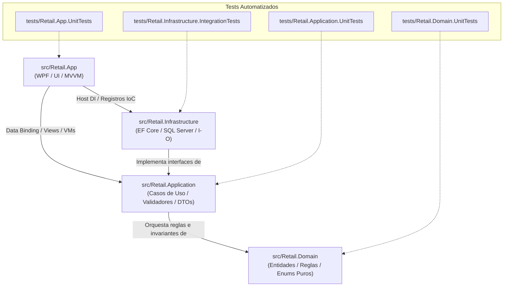

# Mapa Semántico y Guía de Navegación del Proyecto Retail

### Propósito del Documento
Este documento sirve como **índice semántico condensado** para desarrolladores humanos y **agentes de código** (IA). Permite ubicar con exactitud qué archivo, clase y capa es responsable de cada caso de uso del sistema, optimizando el consumo de tokens y previniendo búsquedas ciegas en el repositorio.

---

## 🏛️ Topología de Capas y Proyectos (.NET 8)

---

## 🧭 Catálogo de Archivos por Capa y Responsabilidad

### 1. Capa de Dominio: `src/Retail.Domain` (Sin dependencias externas)

| Componente | Ubicación Relativa | Responsabilidad y Rol DDD | Requisitos Vinculados |
| :--- | :--- | :--- | :--- |
| **Abstracciones Base** | [`Common/BaseEntity.cs`](file:///c:/Users/lucas/Proyectos/retail/src/Retail.Domain/Common/BaseEntity.cs) | Identidad, auditoría temporal (`CreatedAt`) y borrado lógico (`DeletedAt`, `MarkAsDeleted()`, `Restore()`). | Transversal |
| **Marcador DDD** | [`Common/IAggregateRoot.cs`](file:///c:/Users/lucas/Proyectos/retail/src/Retail.Domain/Common/IAggregateRoot.cs) | *Marker Interface* que restringe qué entidades pueden tener Repositorio propio. | Transversal |
| **Agregado Venta** | `Entities/Venta.cs` | **Raíz de Agregado.** Custodia el total, ítems y pagos de la venta en mostrador. | `RF-09`, `RF-10` |
| **Entidad Detalle Venta**| `Entities/DetalleVenta.cs` | Entidad interna del agregado `Venta` (artículo vendido, cantidad, subtotal). | `RF-09` |
| **Entidad Pago Venta** | `Entities/PagoVenta.cs` | Entidad interna del agregado `Venta` (medio de pago, monto, vuelto). | `RF-09` |
| **Comprobante Fiscal** | `Entities/ComprobanteFiscal.cs` | Entidad interna del agregado `Venta` con datos de AFIP/ARCA (CAE, PV, motivo de error). | `RF-16`, `RF-17` |
| **Agregado Presupuesto**| `Entities/Presupuesto.cs` | **Raíz de Agregado.** Cotización temporal (15 días) independiente de caja y stock. | `RF-11`, `RF-12` |
| **Detalle Presupuesto** | `Entities/DetallePresupuesto.cs`| Entidad interna del presupuesto con precios pactados congelados. | `RF-11` |
| **Agregado Artículos** | `Entities/Articulo.cs` | **Raíz de Agregado.** Catálogo, stock, markup y soporte de código nulable para artesanías. | `RF-04`, `RF-05`, `RF-06`, `RF-08` |
| **Agregado Clientes** | `Entities/Cliente.cs` | **Raíz de Agregado.** Padrón con CUIT/DNI, condición IVA, límite de crédito y saldo. | `RF-20` |
| **Cobranza Cliente** | `Entities/CobranzaCliente.cs` | Registro de pago de deuda multimedio con impacto en cuenta corriente y caja. | `RF-20` |
| **Agregado Turno Caja**| `Entities/TurnoCaja.cs` | **Raíz de Agregado.** Apertura, saldo teórico de efectivo, cierre y arqueo ciego. | `RF-13`, `RF-15` |
| **Movimiento Caja** | `Entities/MovimientoCaja.cs` | Entidad interna de caja para ingresos y retiros extraordinarios justificados. | `RF-14` |
| **Agregado Compras** | `Entities/Compra.cs` | **Raíz de Agregado.** Facturas de distribuidores con recálculo automático de precios por markup. | `RF-19` |
| **Detalle Compra** | `Entities/DetalleCompra.cs` | Entidad interna de compra con cantidades y costo de reposición unitario. | `RF-19` |
| **Agregado Usuarios** | `Entities/Usuario.cs` | **Raíz de Agregado.** Cuentas de acceso local con contraseña hasheada y rol. | `RF-01`, `RF-03` |
| **Agregado Proveedores**| `Entities/Proveedor.cs` | **Raíz de Agregado.** Distribuidores mayoristas y catálogos de costos importados. | `RF-05`, `RF-07` |
| **Enumeraciones** | `Enums/` | `MedioPagoEnum`, `EstadoFiscalEnum`, `EstadoTurnoEnum`, `RolUsuarioEnum`, etc. | Transversal |

---

### 2. Capa de Aplicación: `src/Retail.Application` (Casos de Uso)

| Componente | Ubicación Relativa | Responsabilidad y Contenido |
| :--- | :--- | :--- |
| **Registro IoC** | [`DependencyInjection.cs`](file:///c:/Users/lucas/Proyectos/retail/src/Retail.Application/DependencyInjection.cs) | Método de extensión `AddApplicationServices()` para el contenedor de dependencias. |
| **Interfaces de Negocio** | `Interfaces/Services/` | `IVentaService`, `IPresupuestoService`, `IClienteService`, `ICajaService`, `IInventarioService`, `ICompraService`, `IFiscalService`, `IAuthService`. |
| **Interfaces de Persistencia** | `Interfaces/Persistence/` | `IRetailDbContext`, `IUnitOfWork`, `IRepository<T> where T : BaseEntity, IAggregateRoot`. |
| **Interfaces de Infraestructura**| `Interfaces/Infrastructure/`| `IArcaClient`, `IExcelCatalogParser`, `IPasswordHasher`, `ITicketPrinterService`. |
| **Implementaciones de Servicios**| `Services/` | Orquestación transaccional de casos de uso (`VentaService.cs`, `CajaService.cs`, etc.). |
| **DTOs de Transporte** | `DTOs/` | Objetos tipados de entrada/salida desacoplados de las entidades del DER. |
| **Validadores** | `Validators/` | Validaciones declarativas mediante `FluentValidation`. |

---

### 3. Capa de Infraestructura: `src/Retail.Infrastructure` (Persistencia e Integraciones)

| Componente | Ubicación Relativa | Responsabilidad y Contenido |
| :--- | :--- | :--- |
| **Registro IoC** | [`DependencyInjection.cs`](file:///c:/Users/lucas/Proyectos/retail/src/Retail.Infrastructure/DependencyInjection.cs) | Método de extensión `AddInfrastructureServices()` conectando EF Core y servicios. |
| **Contexto EF Core** | `Persistence/Context/RetailDbContext.cs` | DbSets, transacciones y configuración de Global Query Filters (`!IsDeleted`). |
| **Mapeo Fluent API** | `Persistence/Configurations/` | Mapeo detallado de tablas, relaciones y el **Filtered Index** para artesanías: `[codigo_barras] IS NOT NULL`. |
| **Repositorio y UoW** | `Persistence/Repositories/` | `Repository<T>` y `UnitOfWork` que coordina `SaveChangesAsync()`. |
| **Cliente Fiscal ARCA** | `ExternalServices/ArcaSdk/` | Cliente HTTP hacia `http://localhost:8080/` con resiliencia y `MockArcaClient`. |
| **Lector Masivo Excel** | `ExternalServices/Excel/` | Procesamiento en segundo plano de listas de proveedores usando **MiniExcel**. |
| **Criptografía** | `Security/PasswordHasher.cs` | Hashing seguro de contraseñas de usuarios con `BCrypt.Net-Next`. |

---

### 4. Capa de Presentación: `src/Retail.App` (WPF .NET 8 / MVVM)

| Componente | Ubicación Relativa | Responsabilidad y Contenido |
| :--- | :--- | :--- |
| **Punto de Entrada & IoC**| [`App.xaml.cs`](file:///c:/Users/lucas/Proyectos/retail/src/Retail.App/App.xaml.cs) | Configuración del Generic Host, contenedor de dependencias y arranque. |
| **Configuración Local** | [`appsettings.json`](file:///c:/Users/lucas/Proyectos/retail/src/Retail.App/appsettings.json) | Cadenas de conexión (LocalDB) y flag `"UseMockArca": true`. |
| **Ventana Principal** | [`MainWindow.xaml`](file:///c:/Users/lucas/Proyectos/retail/src/Retail.App/MainWindow.xaml) | Shell general de la app, navegación y estado del cajero activo. |
| **Páginas de Trabajo** | `Views/Pages/` | `PosView.xaml`, `CajaView.xaml`, `ArticulosView.xaml`, `ClientesView.xaml`, `PresupuestosView.xaml`, `ComprasView.xaml`, `ConsolaFiscalView.xaml`. |
| **Diálogos Modales** | `Views/Dialogs/` | `CobroModalDialog.xaml`, `CobranzaModalDialog.xaml`, `ArqueoCiegoDialog.xaml`, `AlertaPreciosPresupuestoDialog.xaml`. |
| **ViewModels (MVVM)** | `ViewModels/` | Lógica de presentación y comandos con `CommunityToolkit.Mvvm` (`PosViewModel.cs`, etc.). |
| **Servicios de UI** | `Services/` | `CurrentUserSession.cs`, `NavigationService.cs`, `DialogService.cs`, `TicketPrinterService.cs`. |
| **Estilos y Recursos** | `Styles/` | Diccionarios de recursos XAML (`Colors.xaml`, `Controls.xaml`, `Typography.xaml`, `Icons.xaml`). |

---

### 5. Proyectos de Pruebas: `tests/` (xUnit)

| Proyecto de Prueba | Ruta | Enfoque de Pruebas |
| :--- | :--- | :--- |
| **Dominio** | [`tests/Retail.Domain.UnitTests/`](file:///c:/Users/lucas/Proyectos/retail/tests/Retail.Domain.UnitTests/Retail.Domain.UnitTests.csproj) | Fórmulas de markup, cálculo de arqueo, vigencia de presupuestos y entidades base. |
| **Aplicación** | [`tests/Retail.Application.UnitTests/`](file:///c:/Users/lucas/Proyectos/retail/tests/Retail.Application.UnitTests/Retail.Application.UnitTests.csproj) | Orquestación de servicios, validadores de FluentValidation y simulación con NSubstitute. |
| **Infraestructura** | [`tests/Retail.Infrastructure.IntegrationTests/`](file:///c:/Users/lucas/Proyectos/retail/tests/Retail.Infrastructure.IntegrationTests/Retail.Infrastructure.IntegrationTests.csproj) | Pruebas de integración con LocalDB, transacciones ACID y Filtered Indexes. |
| **Presentación** | [`tests/Retail.App.UnitTests/`](file:///c:/Users/lucas/Proyectos/retail/tests/Retail.App.UnitTests/Retail.App.UnitTests.csproj) | Pruebas unitarias de ViewModels, cálculo de vuelto en modal de cobro y navegación. |

---

## 🎯 Matriz de Trazabilidad Rápida: Requisitos Funcionales a Código

| Requisito | Descripción | Punto Central de Implementación (Código) |
| :--- | :--- | :--- |
| **RF-01, RF-02** | Autenticación y Sesión de Usuario | `AuthService.cs` + `LoginViewModel.cs` + `CurrentUserSession.cs` |
| **RF-03** | ABM y Roles de Usuarios | `AuthService.cs` + `UsuariosViewModel.cs` |
| **RF-04** | Catálogo con Código de Barras Nulable | `Articulo.cs` + `ArticuloConfiguration.cs` (Filtered Index) |
| **RF-05, RF-07** | Vinculación e Importador Excel | `ExcelCatalogParser.cs` (MiniExcel en `Task.Run`) + `ImportadorView.xaml` |
| **RF-08** | Alertas de Stock Mínimo | `Articulo.cs` (`StockActual <= StockMinimo`) + `ArticulosView.xaml` (Badge) |
| **RF-09, RF-10** | POS y Descuento Atómico de Stock | `VentaService.cs` (ACID) + `PosViewModel.cs` + `CobroModalDialog.xaml` |
| **RF-11, RF-12** | Presupuestos y Conversión con Stock | `PresupuestoService.cs` + `PresupuestosView.xaml` + `AlertaPreciosPresupuestoDialog.xaml` |
| **RF-13, RF-14** | Apertura y Movimientos de Caja | `CajaService.cs` + `CajaViewModel.cs` |
| **RF-15** | Arqueo Ciego de Efectivo | `CajaService.cs` + `ArqueoCiegoDialog.xaml` |
| **RF-16, RF-17** | Facturación ARCA y Contingencia | `ArcaClient.cs` + `FiscalService.cs` (Estado `ERROR_FISCAL_REINTENTABLE`) |
| **RF-18** | Consola Gerencial de Reintentos | `FiscalService.cs` + `ConsolaFiscalView.xaml` |
| **RF-19** | Compras y Recálculo Automático Markup | `CompraService.cs` + `Articulo.ActualizarCostoYRecalcularPrecio()` |
| **RF-20** | Clientes y Cobranza Multimedio Cta Cte | `ClienteService.RegistrarCobranzaAsync()` + `CobranzaModalDialog.xaml` |

---

## ⚙️ Automatización y CI/CD (.github/workflows)

| Flujo / Workflow | Archivo | Disparador (Trigger) | Responsabilidad |
| :--- | :--- | :--- | :--- |
| **Integración Continua (CI)** | [`.github/workflows/ci.yml`](file:///c:/Users/lucas/Proyectos/retail/.github/workflows/ci.yml) | Pull Requests y pushes a `main` | Valida compilación limpia en Release, ejecución de pruebas xUnit y verificación de formato (.editorconfig). Aduana de calidad rápida. |
| **Entrega Continua (CD)** | [`.github/workflows/release.yml`](file:///c:/Users/lucas/Proyectos/retail/.github/workflows/release.yml) | Git Tags de versión (`v*`) | Compila paquete auto-contenido de `Retail.App` (win-x64), genera archivo ZIP y publica formalmente la Release en GitHub. |

---

## 📌 Configuración de Entorno de Desarrollo y Agentes

* **Archivo de Solución Principal:** [`Retail.sln`](file:///c:/Users/lucas/Proyectos/retail/Retail.sln)
* **Gobernanza de Compilación:** [`Directory.Build.props`](file:///c:/Users/lucas/Proyectos/retail/Directory.Build.props)
* **Reglas de Formato y Estilo:** [`.editorconfig`](file:///c:/Users/lucas/Proyectos/retail/.editorconfig)
* **Directivas de CI/CD y Despliegue:** [`docs/Estrategia de CI-CD.md`](file:///c:/Users/lucas/Proyectos/retail/docs/Estrategia%20de%20CI-CD.md)
* **Instrucciones para Agentes de Código:** [`AGENTS.md`](file:///c:/Users/lucas/Proyectos/retail/AGENTS.md)
* **Hoja de Ruta del Proyecto:** [`docs/Roadmap de Implementacion.md`](file:///c:/Users/lucas/Proyectos/retail/docs/Roadmap%20de%20Implementacion.md)
