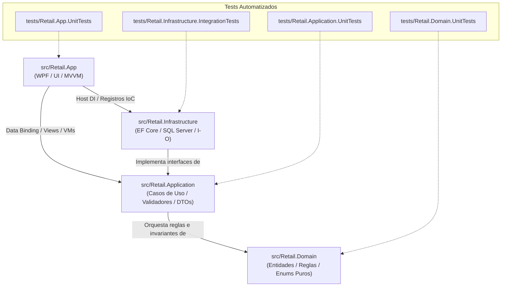

# Mapa Semántico y Guía de Navegación del Proyecto Retail

### Propósito del Documento
Este documento sirve como **índice semántico condensado** para desarrolladores humanos y **agentes de código** (IA). Permite ubicar con exactitud qué archivo, clase y capa es responsable de cada caso de uso del sistema, optimizando el consumo de tokens y previniendo búsquedas ciegas en el repositorio.

---

## 🏛️ Topología de Capas y Proyectos (.NET 8)

---

## 🧭 Catálogo de Archivos por Capa y Responsabilidad

### 1. Capa de Dominio: `src/Retail.Domain` (Sin dependencias externas)

| Componente | Ubicación Relativa | Responsabilidad y Rol DDD | Requisitos Vinculados |
| :--- | :--- | :--- | :--- |
| **Abstracciones Base** | [`Common/BaseEntity.cs`](file:///c:/Users/lucas/Proyectos/retail/src/Retail.Domain/Common/BaseEntity.cs) | Identidad, auditoría temporal (`CreatedAt`) y borrado lógico (`DeletedAt`, `MarkAsDeleted()`, `Restore()`). | Transversal |
| **Marcador DDD** | [`Common/IAggregateRoot.cs`](file:///c:/Users/lucas/Proyectos/retail/src/Retail.Domain/Common/IAggregateRoot.cs) | *Marker Interface* que restringe qué entidades pueden tener Repositorio propio. | Transversal |
| **Excepciones de Dominio** | [`Exceptions/`](file:///c:/Users/lucas/Proyectos/retail/src/Retail.Domain/Exceptions/) | Catálogo de 16 excepciones tipadas de negocio derivadas de [`DomainException.cs`](file:///c:/Users/lucas/Proyectos/retail/src/Retail.Domain/Exceptions/DomainException.cs) que custodian las invariantes de todos los agregados. | Transversal |
| • *Stock / Góndola* | [`Exceptions/StockInsuficienteException.cs`](file:///c:/Users/lucas/Proyectos/retail/src/Retail.Domain/Exceptions/StockInsuficienteException.cs) | Venta o reserva que supera el stock físico disponible en catálogo. | `RF-10`, `RF-12` |
| • *Caja y Tesorería* | [`Exceptions/CajaCerradaException.cs`](file:///c:/Users/lucas/Proyectos/retail/src/Retail.Domain/Exceptions/CajaCerradaException.cs), [`TurnoYaAbiertoException.cs`](file:///c:/Users/lucas/Proyectos/retail/src/Retail.Domain/Exceptions/TurnoYaAbiertoException.cs), [`SaldoCajaInsuficienteException.cs`](file:///c:/Users/lucas/Proyectos/retail/src/Retail.Domain/Exceptions/SaldoCajaInsuficienteException.cs), [`TurnoYaCerradoException.cs`](file:///c:/Users/lucas/Proyectos/retail/src/Retail.Domain/Exceptions/TurnoYaCerradoException.cs) | Custodia de turnos activos, apertura única y retiros limitados al efectivo real en gaveta. | `RF-13`, `RF-14`, `RF-15` |
| • *Presupuestos* | [`Exceptions/PresupuestoVencidoException.cs`](file:///c:/Users/lucas/Proyectos/retail/src/Retail.Domain/Exceptions/PresupuestoVencidoException.cs), [`PresupuestoYaConvertidoException.cs`](file:///c:/Users/lucas/Proyectos/retail/src/Retail.Domain/Exceptions/PresupuestoYaConvertidoException.cs) | Control de vigencia de 15 días y bloqueo de reutilización de cotizaciones ya cobradas. | `RF-11`, `RF-12` |
| • *Clientes / Cta Cte* | [`Exceptions/LimiteCreditoExcedidoException.cs`](file:///c:/Users/lucas/Proyectos/retail/src/Retail.Domain/Exceptions/LimiteCreditoExcedidoException.cs), [`CuentaCorrienteNoHabilitadaException.cs`](file:///c:/Users/lucas/Proyectos/retail/src/Retail.Domain/Exceptions/CuentaCorrienteNoHabilitadaException.cs), [`CobranzaExcedeDeudaException.cs`](file:///c:/Users/lucas/Proyectos/retail/src/Retail.Domain/Exceptions/CobranzaExcedeDeudaException.cs) | Límite de crédito autorizado, habilitación de cuenta corriente y cobros que no superen la deuda. | `RF-09`, `RF-20` |
| • *Venta y Mostrador* | [`Exceptions/MontoPagoInsuficienteException.cs`](file:///c:/Users/lucas/Proyectos/retail/src/Retail.Domain/Exceptions/MontoPagoInsuficienteException.cs), [`VentaVaciaException.cs`](file:///c:/Users/lucas/Proyectos/retail/src/Retail.Domain/Exceptions/VentaVaciaException.cs) | Cancelación total del importe ($\sum \text{Pagos} \ge \text{Total}$) y prohibición de venta sin ítems. | `RF-09` |
| • *Usuarios y Seguridad* | [`Exceptions/UltimoGerenteException.cs`](file:///c:/Users/lucas/Proyectos/retail/src/Retail.Domain/Exceptions/UltimoGerenteException.cs), [`CredencialesInvalidasException.cs`](file:///c:/Users/lucas/Proyectos/retail/src/Retail.Domain/Exceptions/CredencialesInvalidasException.cs), [`UsuarioInactivoException.cs`](file:///c:/Users/lucas/Proyectos/retail/src/Retail.Domain/Exceptions/UsuarioInactivoException.cs) | Invariante de existencia de al menos un Gerente activo y autenticación segura. | `RF-01`, `RF-03` |
| **Enumeraciones Puras** | [`Enums/`](file:///c:/Users/lucas/Proyectos/retail/src/Retail.Domain/Enums/) | 9 enums: [`RolUsuarioEnum`](file:///c:/Users/lucas/Proyectos/retail/src/Retail.Domain/Enums/RolUsuarioEnum.cs), [`MedioPagoEnum`](file:///c:/Users/lucas/Proyectos/retail/src/Retail.Domain/Enums/MedioPagoEnum.cs), [`EstadoTurnoEnum`](file:///c:/Users/lucas/Proyectos/retail/src/Retail.Domain/Enums/EstadoTurnoEnum.cs), [`TipoMovimientoCajaEnum`](file:///c:/Users/lucas/Proyectos/retail/src/Retail.Domain/Enums/TipoMovimientoCajaEnum.cs), [`EstadoPresupuestoEnum`](file:///c:/Users/lucas/Proyectos/retail/src/Retail.Domain/Enums/EstadoPresupuestoEnum.cs), [`EstadoFiscalEnum`](file:///c:/Users/lucas/Proyectos/retail/src/Retail.Domain/Enums/EstadoFiscalEnum.cs), [`TipoComprobanteFiscalEnum`](file:///c:/Users/lucas/Proyectos/retail/src/Retail.Domain/Enums/TipoComprobanteFiscalEnum.cs), [`CondicionIvaEnum`](file:///c:/Users/lucas/Proyectos/retail/src/Retail.Domain/Enums/CondicionIvaEnum.cs), [`TipoDocumentoEnum`](file:///c:/Users/lucas/Proyectos/retail/src/Retail.Domain/Enums/TipoDocumentoEnum.cs). | Transversal |
| **Agregado Venta** | [`Entities/Venta.cs`](file:///c:/Users/lucas/Proyectos/retail/src/Retail.Domain/Entities/Venta.cs) | **Raíz de Agregado.** Custodia el total, ítems y pagos de la venta en mostrador. | `RF-09`, `RF-10` |
| **Entidad Detalle Venta**| [`Entities/DetalleVenta.cs`](file:///c:/Users/lucas/Proyectos/retail/src/Retail.Domain/Entities/DetalleVenta.cs) | Entidad interna del agregado `Venta` (artículo vendido, cantidad, subtotal). | `RF-09` |
| **Entidad Pago Venta** | [`Entities/PagoVenta.cs`](file:///c:/Users/lucas/Proyectos/retail/src/Retail.Domain/Entities/PagoVenta.cs) | Entidad interna del agregado `Venta` (medio de pago, monto, vuelto). | `RF-09` |
| **Comprobante Fiscal** | [`Entities/ComprobanteFiscal.cs`](file:///c:/Users/lucas/Proyectos/retail/src/Retail.Domain/Entities/ComprobanteFiscal.cs) | Entidad interna del agregado `Venta` con datos de AFIP/ARCA (CAE, PV, motivo de error). | `RF-16`, `RF-17` |
| **Agregado Presupuesto**| [`Entities/Presupuesto.cs`](file:///c:/Users/lucas/Proyectos/retail/src/Retail.Domain/Entities/Presupuesto.cs) | **Raíz de Agregado.** Cotización temporal (15 días) independiente de caja y stock. | `RF-11`, `RF-12` |
| **Detalle Presupuesto** | [`Entities/DetallePresupuesto.cs`](file:///c:/Users/lucas/Proyectos/retail/src/Retail.Domain/Entities/DetallePresupuesto.cs)| Entidad interna del presupuesto con precios pactados congelados. | `RF-11` |
| **Agregado Artículos** | [`Entities/Articulo.cs`](file:///c:/Users/lucas/Proyectos/retail/src/Retail.Domain/Entities/Articulo.cs) | **Raíz de Agregado.** Catálogo, stock, markup y soporte de código nulable para artesanías. | `RF-04`, `RF-05`, `RF-06`, `RF-08` |
| **Categorías y Marcas**| [`Entities/Categoria.cs`](file:///c:/Users/lucas/Proyectos/retail/src/Retail.Domain/Entities/Categoria.cs), [`Marca.cs`](file:///c:/Users/lucas/Proyectos/retail/src/Retail.Domain/Entities/Marca.cs) | Clasificación de artículos y fabricantes en el catálogo. | `RF-04` |
| **Agregado Clientes** | [`Entities/Cliente.cs`](file:///c:/Users/lucas/Proyectos/retail/src/Retail.Domain/Entities/Cliente.cs) | **Raíz de Agregado.** Padrón con CUIT/DNI, condición IVA, límite de crédito y saldo. | `RF-20` |
| **Cobranza Cliente** | [`Entities/CobranzaCliente.cs`](file:///c:/Users/lucas/Proyectos/retail/src/Retail.Domain/Entities/CobranzaCliente.cs) | Registro de pago de deuda multimedio con impacto en cuenta corriente y caja. | `RF-20` |
| **Agregado Turno Caja**| [`Entities/TurnoCaja.cs`](file:///c:/Users/lucas/Proyectos/retail/src/Retail.Domain/Entities/TurnoCaja.cs) | **Raíz de Agregado.** Apertura, saldo teórico de efectivo, cierre y arqueo ciego. | `RF-13`, `RF-15` |
| **Movimiento Caja** | [`Entities/MovimientoCaja.cs`](file:///c:/Users/lucas/Proyectos/retail/src/Retail.Domain/Entities/MovimientoCaja.cs) | Entidad interna de caja para ingresos y retiros extraordinarios justificados. | `RF-14` |
| **Agregado Compras** | [`Entities/Compra.cs`](file:///c:/Users/lucas/Proyectos/retail/src/Retail.Domain/Entities/Compra.cs) | **Raíz de Agregado.** Facturas de distribuidores con recálculo automático de precios por markup. | `RF-19` |
| **Detalle Compra** | [`Entities/DetalleCompra.cs`](file:///c:/Users/lucas/Proyectos/retail/src/Retail.Domain/Entities/DetalleCompra.cs) | Entidad interna de compra con cantidades y costo de reposición unitario. | `RF-19` |
| **Agregado Usuarios** | [`Entities/Usuario.cs`](file:///c:/Users/lucas/Proyectos/retail/src/Retail.Domain/Entities/Usuario.cs), [`Rol.cs`](file:///c:/Users/lucas/Proyectos/retail/src/Retail.Domain/Entities/Rol.cs) | **Raíz de Agregado.** Cuentas de acceso local con contraseña hasheada y rol. | `RF-01`, `RF-03` |
| **Agregado Proveedores**| [`Entities/Proveedor.cs`](file:///c:/Users/lucas/Proyectos/retail/src/Retail.Domain/Entities/Proveedor.cs) | **Raíz de Agregado.** Distribuidores mayoristas y catálogos de costos importados. | `RF-05`, `RF-07` |
| **Catálogo Proveedor** | [`Entities/CatalogoProveedor.cs`](file:///c:/Users/lucas/Proyectos/retail/src/Retail.Domain/Entities/CatalogoProveedor.cs) | Entidad interna de listas de precios y códigos de distribución mayorista. | `RF-05`, `RF-07` |

---

### 2. Capa de Aplicación: `src/Retail.Application` (Casos de Uso)

| Componente | Ubicación Relativa | Responsabilidad y Contenido |
| :--- | :--- | :--- |
| **Registro IoC** | [`DependencyInjection.cs`](file:///c:/Users/lucas/Proyectos/retail/src/Retail.Application/DependencyInjection.cs) | Método de extensión `AddApplicationServices()` para el contenedor de dependencias. |
| **Interfaces de Negocio** | [`Interfaces/Services/`](file:///c:/Users/lucas/Proyectos/retail/src/Retail.Application/Interfaces/Services/) | [`IAuthService`](file:///c:/Users/lucas/Proyectos/retail/src/Retail.Application/Interfaces/Services/IAuthService.cs), [`IUsuarioService`](file:///c:/Users/lucas/Proyectos/retail/src/Retail.Application/Interfaces/Services/IUsuarioService.cs), [`IVentaService`](file:///c:/Users/lucas/Proyectos/retail/src/Retail.Application/Interfaces/Services/IVentaService.cs), [`IPresupuestoService`](file:///c:/Users/lucas/Proyectos/retail/src/Retail.Application/Interfaces/Services/IPresupuestoService.cs), [`IClienteService`](file:///c:/Users/lucas/Proyectos/retail/src/Retail.Application/Interfaces/Services/IClienteService.cs), [`ICajaService`](file:///c:/Users/lucas/Proyectos/retail/src/Retail.Application/Interfaces/Services/ICajaService.cs), [`IInventarioService`](file:///c:/Users/lucas/Proyectos/retail/src/Retail.Application/Interfaces/Services/IInventarioService.cs), [`ICompraService`](file:///c:/Users/lucas/Proyectos/retail/src/Retail.Application/Interfaces/Services/ICompraService.cs), [`IProveedorService`](file:///c:/Users/lucas/Proyectos/retail/src/Retail.Application/Interfaces/Services/IProveedorService.cs), [`IFiscalService`](file:///c:/Users/lucas/Proyectos/retail/src/Retail.Application/Interfaces/Services/IFiscalService.cs). |
| **Interfaces de Persistencia** | [`Interfaces/Persistence/`](file:///c:/Users/lucas/Proyectos/retail/src/Retail.Application/Interfaces/Persistence/) | [`IRepository<T>`](file:///c:/Users/lucas/Proyectos/retail/src/Retail.Application/Interfaces/Persistence/IRepository.cs) (`where T : BaseEntity, IAggregateRoot`), [`IUnitOfWork`](file:///c:/Users/lucas/Proyectos/retail/src/Retail.Application/Interfaces/Persistence/IUnitOfWork.cs), [`IRetailDbContext`](file:///c:/Users/lucas/Proyectos/retail/src/Retail.Application/Interfaces/Persistence/IRetailDbContext.cs). |
| **Interfaces de Infraestructura**| [`Interfaces/Infrastructure/`](file:///c:/Users/lucas/Proyectos/retail/src/Retail.Application/Interfaces/Infrastructure/)| [`IArcaClient`](file:///c:/Users/lucas/Proyectos/retail/src/Retail.Application/Interfaces/Infrastructure/IArcaClient.cs), [`IExcelCatalogParser`](file:///c:/Users/lucas/Proyectos/retail/src/Retail.Application/Interfaces/Infrastructure/IExcelCatalogParser.cs), [`IPasswordHasher`](file:///c:/Users/lucas/Proyectos/retail/src/Retail.Application/Interfaces/Infrastructure/IPasswordHasher.cs), [`ITicketPrinterService`](file:///c:/Users/lucas/Proyectos/retail/src/Retail.Application/Interfaces/Infrastructure/ITicketPrinterService.cs). |
| **DTOs de Transporte** | [`DTOs/`](file:///c:/Users/lucas/Proyectos/retail/src/Retail.Application/DTOs/) | Modelos `record class` inmutables agrupados en: `Auth/`, `Usuarios/`, `Articulos/`, `Proveedores/`, `Caja/`, `Clientes/`, `Ventas/`, `Compras/`, `Presupuestos/`, `Fiscal/`. |
| **Implementaciones de Servicios**| `Services/` | Orquestación transaccional de casos de uso (`VentaService.cs`, `CajaService.cs`, etc.). |
| **Validadores** | `Validators/` | Validaciones declarativas de entrada mediante `FluentValidation`. |

---

### 3. Capa de Infraestructura: `src/Retail.Infrastructure` (Persistencia e Integraciones)

| Componente | Ubicación Relativa | Responsabilidad y Contenido |
| :--- | :--- | :--- |
| **Registro IoC** | [`DependencyInjection.cs`](file:///c:/Users/lucas/Proyectos/retail/src/Retail.Infrastructure/DependencyInjection.cs) | Método de extensión `AddInfrastructureServices()` conectando EF Core, repositorios, semillero, hardware de prueba y servicios fiscales. |
| **Contexto EF Core** | [`Persistence/Context/RetailDbContext.cs`](file:///c:/Users/lucas/Proyectos/retail/src/Retail.Infrastructure/Persistence/Context/RetailDbContext.cs) | DbSets, transacciones y configuración de Global Query Filters (`!IsDeleted`). |
| **Mapeo Fluent API** | [`Persistence/Configurations/`](file:///c:/Users/lucas/Proyectos/retail/src/Retail.Infrastructure/Persistence/Configurations/) | Mapeo detallado de tablas, relaciones y el **Filtered Index** para artesanías: `[codigo_barras] IS NOT NULL`. |
| **Repositorio y UoW** | [`Persistence/Repositories/`](file:///c:/Users/lucas/Proyectos/retail/src/Retail.Infrastructure/Persistence/Repositories/) | [`Repository<T>`](file:///c:/Users/lucas/Proyectos/retail/src/Retail.Infrastructure/Persistence/Repositories/Repository.cs) y [`UnitOfWork`](file:///c:/Users/lucas/Proyectos/retail/src/Retail.Infrastructure/Persistence/Repositories/UnitOfWork.cs) que coordina `SaveChangesAsync()`. |
| **Semillero Inicial** | [`Persistence/Initialization/DbInitializer.cs`](file:///c:/Users/lucas/Proyectos/retail/src/Retail.Infrastructure/Persistence/Initialization/DbInitializer.cs) | Poblamiento de roles, usuario `admin` (BCrypt), categorías y 20 artículos en primer arranque. |
| **Migraciones EF Core**| [`Persistence/Migrations/`](file:///c:/Users/lucas/Proyectos/retail/src/Retail.Infrastructure/Persistence/Migrations/) | Migración inicial `InitialCreate` con Filtered Index y esquema relacional completo. |
| **Cliente Fiscal ARCA** | [`ExternalServices/ArcaSdk/`](file:///c:/Users/lucas/Proyectos/retail/src/Retail.Infrastructure/ExternalServices/ArcaSdk/) | Cliente HTTP [`ArcaClient.cs`](file:///c:/Users/lucas/Proyectos/retail/src/Retail.Infrastructure/ExternalServices/ArcaSdk/ArcaClient.cs), doble de prueba [`MockArcaClient.cs`](file:///c:/Users/lucas/Proyectos/retail/src/Retail.Infrastructure/ExternalServices/ArcaSdk/MockArcaClient.cs) y opciones [`ArcaOptions.cs`](file:///c:/Users/lucas/Proyectos/retail/src/Retail.Infrastructure/ExternalServices/ArcaSdk/ArcaOptions.cs). |
| **Hardware & Mocks** | [`Hardware/`](file:///c:/Users/lucas/Proyectos/retail/src/Retail.Infrastructure/Hardware/) | Emulador de impresora térmica [`FileDebugTicketPrinterService.cs`](file:///c:/Users/lucas/Proyectos/retail/src/Retail.Infrastructure/Hardware/FileDebugTicketPrinterService.cs) y opciones [`TicketPrinterOptions.cs`](file:///c:/Users/lucas/Proyectos/retail/src/Retail.Infrastructure/Hardware/TicketPrinterOptions.cs). |
| **Lector Masivo Excel** | `ExternalServices/Excel/` | Procesamiento en segundo plano de listas de proveedores usando **MiniExcel**. |
| **Criptografía** | [`Security/PasswordHasher.cs`](file:///c:/Users/lucas/Proyectos/retail/src/Retail.Infrastructure/Security/PasswordHasher.cs) | Hashing seguro de contraseñas de usuarios con `BCrypt.Net-Next`. |

---

### 4. Capa de Presentación: `src/Retail.App` (WPF .NET 8 / MVVM)

| Componente | Ubicación Relativa | Responsabilidad y Contenido |
| :--- | :--- | :--- |
| **Punto de Entrada & IoC**| [`App.xaml.cs`](file:///c:/Users/lucas/Proyectos/retail/src/Retail.App/App.xaml.cs) | Configuración del Generic Host, contenedor de dependencias y arranque. |
| **Configuración Local** | [`appsettings.json`](file:///c:/Users/lucas/Proyectos/retail/src/Retail.App/appsettings.json) | Cadenas de conexión (LocalDB) y flag `"UseMockArca": true`. |
| **Ventana Principal** | [`MainWindow.xaml`](file:///c:/Users/lucas/Proyectos/retail/src/Retail.App/MainWindow.xaml) | Shell general de la app, navegación y estado del cajero activo. |
| **Páginas de Trabajo** | `Views/Pages/` | `PosView.xaml`, `CajaView.xaml`, `ArticulosView.xaml`, `ClientesView.xaml`, `PresupuestosView.xaml`, `ComprasView.xaml`, `ConsolaFiscalView.xaml`, `UsuariosView.xaml`. |
| **Diálogos Modales** | `Views/Dialogs/` | `CobroModalDialog.xaml`, `CobranzaModalDialog.xaml`, `ArqueoCiegoDialog.xaml`, `AlertaPreciosPresupuestoDialog.xaml`. |
| **ViewModels (MVVM)** | `ViewModels/` | Lógica de presentación y comandos con `CommunityToolkit.Mvvm` (`PosViewModel.cs`, etc.). |
| **Estilos y Recursos** | [`Styles/`](file:///c:/Users/lucas/Proyectos/retail/src/Retail.App/Styles/) | Diccionarios XAML integrados con WPF-UI: [`Colors.xaml`](file:///c:/Users/lucas/Proyectos/retail/src/Retail.App/Styles/Colors.xaml) (Carmín/Borravino #9D0F33), [`Typography.xaml`](file:///c:/Users/lucas/Proyectos/retail/src/Retail.App/Styles/Typography.xaml) (Cascadia Code / Segoe UI Variable), [`Icons.xaml`](file:///c:/Users/lucas/Proyectos/retail/src/Retail.App/Styles/Icons.xaml) (Fluent System Icons) y [`Controls.xaml`](file:///c:/Users/lucas/Proyectos/retail/src/Retail.App/Styles/Controls.xaml) (Keycaps F1-F12, Badges, DataGrid). |
| **Guía de Diseño UI** | [`docs/SISTEMA_DE_DISENO.md`](file:///c:/Users/lucas/Proyectos/retail/docs/SISTEMA_DE_DISENO.md) | Manual normativo de maquetación XAML, catálogo de tokens semánticos, directivas de tipografía dual y snippets canónicos. |
| **Galería de Estilos** | [`Views/Dev/`](file:///c:/Users/lucas/Proyectos/retail/src/Retail.App/Views/Dev/) | [`StyleGalleryView.xaml`](file:///c:/Users/lucas/Proyectos/retail/src/Retail.App/Views/Dev/StyleGalleryView.xaml): Galería interactiva para validación visual y living styleguide de la Etapa 0.6. |

---

### 5. Proyectos de Pruebas: `tests/` (xUnit)

| Proyecto de Prueba | Ruta | Enfoque de Pruebas Implementado y Proyectado |
| :--- | :--- | :--- |
| **Dominio** | [`tests/Retail.Domain.UnitTests/`](file:///c:/Users/lucas/Proyectos/retail/tests/Retail.Domain.UnitTests/Retail.Domain.UnitTests.csproj) | Pruebas de `BaseEntity` (soft delete), validación de las 9 enumeraciones y verificación exhaustiva de las 16 excepciones de dominio con sus metadatos. |
| **Aplicación** | [`tests/Retail.Application.UnitTests/`](file:///c:/Users/lucas/Proyectos/retail/tests/Retail.Application.UnitTests/Retail.Application.UnitTests.csproj) | Registro IoC, propiedades calculadas de DTOs (`StockBajo`, `CreditoDisponible`, `SubtotalItem`, `HaySobrante`), orquestación de servicios y validadores. |
| **Infraestructura** | [`tests/Retail.Infrastructure.IntegrationTests/`](file:///c:/Users/lucas/Proyectos/retail/tests/Retail.Infrastructure.IntegrationTests/Retail.Infrastructure.IntegrationTests.csproj) | Pruebas de integración con LocalDB, transacciones ACID, Filtered Indexes y servicios de hardware mock. |
| **Presentación** | [`tests/Retail.App.UnitTests/`](file:///c:/Users/lucas/Proyectos/retail/tests/Retail.App.UnitTests/Retail.App.UnitTests.csproj) | Smoke tests de inicialización WPF, pruebas unitarias de ViewModels, cálculo reactivo de vuelto y navegación. |

---

## 🎯 Matriz de Trazabilidad Rápida: Requisitos Funcionales a Código

| Requisito | Descripción | Punto Central de Implementación (Código) |
| :--- | :--- | :--- |
| **RF-01, RF-02** | Autenticación y Sesión de Usuario | [`IAuthService.cs`](file:///c:/Users/lucas/Proyectos/retail/src/Retail.Application/Interfaces/Services/IAuthService.cs) + [`LoginRequestDto.cs`](file:///c:/Users/lucas/Proyectos/retail/src/Retail.Application/DTOs/Auth/LoginRequestDto.cs) + `LoginViewModel.cs` + `CurrentUserSession.cs` |
| **RF-03** | ABM y Roles de Usuarios | [`IUsuarioService.cs`](file:///c:/Users/lucas/Proyectos/retail/src/Retail.Application/Interfaces/Services/IUsuarioService.cs) + [`UsuarioDto.cs`](file:///c:/Users/lucas/Proyectos/retail/src/Retail.Application/DTOs/Usuarios/UsuarioDto.cs) + `UsuariosViewModel.cs` |
| **RF-04** | Catálogo con Código de Barras Nulable | [`IInventarioService.cs`](file:///c:/Users/lucas/Proyectos/retail/src/Retail.Application/Interfaces/Services/IInventarioService.cs) + `Articulo.cs` + `ArticuloConfiguration.cs` (Filtered Index) |
| **RF-05, RF-07** | Vinculación e Importador Excel | [`IProveedorService.cs`](file:///c:/Users/lucas/Proyectos/retail/src/Retail.Application/Interfaces/Services/IProveedorService.cs) + [`IExcelCatalogParser.cs`](file:///c:/Users/lucas/Proyectos/retail/src/Retail.Application/Interfaces/Infrastructure/IExcelCatalogParser.cs) (MiniExcel en `Task.Run`) + `ImportadorView.xaml` |
| **RF-08** | Alertas de Stock Mínimo | [`AlertaStockDto.cs`](file:///c:/Users/lucas/Proyectos/retail/src/Retail.Application/DTOs/Articulos/AlertaStockDto.cs) + `Articulo.StockActual <= StockMinimo` + `ArticulosView.xaml` (Badge) |
| **RF-09, RF-10** | POS y Descuento Atómico de Stock | [`IVentaService.cs`](file:///c:/Users/lucas/Proyectos/retail/src/Retail.Application/Interfaces/Services/IVentaService.cs) + [`CrearVentaDto.cs`](file:///c:/Users/lucas/Proyectos/retail/src/Retail.Application/DTOs/Ventas/CrearVentaDto.cs) (ACID) + `PosViewModel.cs` + `CobroModalDialog.xaml` |
| **RF-11, RF-12** | Presupuestos y Conversión con Stock | [`IPresupuestoService.cs`](file:///c:/Users/lucas/Proyectos/retail/src/Retail.Application/Interfaces/Services/IPresupuestoService.cs) + [`PresupuestoParaVentaDto.cs`](file:///c:/Users/lucas/Proyectos/retail/src/Retail.Application/DTOs/Presupuestos/PresupuestoParaVentaDto.cs) + `AlertaPreciosPresupuestoDialog.xaml` |
| **RF-13, RF-14** | Apertura y Movimientos de Caja | [`ICajaService.cs`](file:///c:/Users/lucas/Proyectos/retail/src/Retail.Application/Interfaces/Services/ICajaService.cs) + [`AperturaTurnoDto.cs`](file:///c:/Users/lucas/Proyectos/retail/src/Retail.Application/DTOs/Caja/AperturaTurnoDto.cs) + `CajaViewModel.cs` |
| **RF-15** | Arqueo Ciego de Efectivo | [`ICajaService.cs`](file:///c:/Users/lucas/Proyectos/retail/src/Retail.Application/Interfaces/Services/ICajaService.cs) + [`ArqueoCiegoDto.cs`](file:///c:/Users/lucas/Proyectos/retail/src/Retail.Application/DTOs/Caja/ArqueoCiegoDto.cs) + `ArqueoCiegoDialog.xaml` |
| **RF-16, RF-17** | Facturación ARCA y Contingencia | [`IArcaClient.cs`](file:///c:/Users/lucas/Proyectos/retail/src/Retail.Application/Interfaces/Infrastructure/IArcaClient.cs) + [`IFiscalService.cs`](file:///c:/Users/lucas/Proyectos/retail/src/Retail.Application/Interfaces/Services/IFiscalService.cs) (Estado `ERROR_FISCAL_REINTENTABLE`) |
| **RF-18** | Consola Gerencial de Reintentos | [`IFiscalService.cs`](file:///c:/Users/lucas/Proyectos/retail/src/Retail.Application/Interfaces/Services/IFiscalService.cs) + [`ReintentoLoteResultadoDto.cs`](file:///c:/Users/lucas/Proyectos/retail/src/Retail.Application/DTOs/Fiscal/ReintentoLoteResultadoDto.cs) + `ConsolaFiscalView.xaml` |
| **RF-19** | Compras y Recálculo Automático Markup | [`ICompraService.cs`](file:///c:/Users/lucas/Proyectos/retail/src/Retail.Application/Interfaces/Services/ICompraService.cs) + [`CrearCompraDto.cs`](file:///c:/Users/lucas/Proyectos/retail/src/Retail.Application/DTOs/Compras/CrearCompraDto.cs) + `Articulo.ActualizarCostoYRecalcularPrecio()` |
| **RF-20** | Clientes y Cobranza Multimedio Cta Cte | [`IClienteService.cs`](file:///c:/Users/lucas/Proyectos/retail/src/Retail.Application/Interfaces/Services/IClienteService.cs) + [`RegistrarCobranzaDto.cs`](file:///c:/Users/lucas/Proyectos/retail/src/Retail.Application/DTOs/Clientes/RegistrarCobranzaDto.cs) + `CobranzaModalDialog.xaml` |

---

## ⚙️ Automatización y CI/CD (.github/workflows)

| Flujo / Workflow | Archivo | Disparador (Trigger) | Responsabilidad |
| :--- | :--- | :--- | :--- |
| **Integración Continua (CI)** | [`.github/workflows/ci.yml`](file:///c:/Users/lucas/Proyectos/retail/.github/workflows/ci.yml) | Pull Requests y pushes a `main` | Valida compilación limpia en Release, ejecución de pruebas xUnit y verificación de formato (.editorconfig). Aduana de calidad rápida. |
| **Entrega Continua (CD)** | [`.github/workflows/release.yml`](file:///c:/Users/lucas/Proyectos/retail/.github/workflows/release.yml) | Git Tags de versión (`v*`) | Compila paquete auto-contenido de `Retail.App` (win-x64), genera archivo ZIP y publica formalmente la Release en GitHub. |

---

## 📌 Configuración de Entorno de Desarrollo y Agentes

* **Archivo de Solución Principal:** [`Retail.sln`](file:///c:/Users/lucas/Proyectos/retail/Retail.sln)
* **Gobernanza de Compilación:** [`Directory.Build.props`](file:///c:/Users/lucas/Proyectos/retail/Directory.Build.props)
* **Reglas de Formato y Estilo:** [`.editorconfig`](file:///c:/Users/lucas/Proyectos/retail/.editorconfig)
* **Directivas de CI/CD y Despliegue:** [`docs/Estrategia de CI-CD.md`](file:///c:/Users/lucas/Proyectos/retail/docs/Estrategia%20de%20CI-CD.md)
* **Instrucciones para Agentes de Código:** [`AGENTS.md`](file:///c:/Users/lucas/Proyectos/retail/AGENTS.md)
* **Sistema de Diseño y Estilos XAML:** [`docs/SISTEMA_DE_DISENO.md`](file:///c:/Users/lucas/Proyectos/retail/docs/SISTEMA_DE_DISENO.md)
* **Hoja de Ruta del Proyecto:** [`docs/Roadmap de Implementacion.md`](file:///c:/Users/lucas/Proyectos/retail/docs/Roadmap%20de%20Implementacion.md)
