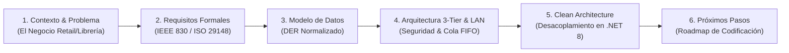
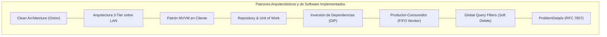

# Guía de Presentación y Defensa Técnica: Etapa de Diseño y Arquitectura

### Proyecto: Retail (Sistema ERP & Punto de Venta para Librería)
**Fecha:** Agosto de 2026   
**Estado del Proyecto:** Fase de Análisis, Requisitos y Diseño de Arquitectura Finalizada

---

## 🧭 1. Estructura de la Presentación (10 a 15 Minutos)

---

### Bloque 1: Introducción y Contexto del Negocio (2 min)
* **Objetivo del Producto:** Sistema integral de ERP & Punto de Venta (POS) diseñado específicamente para el rubro librerías y comercios minoristas sobre Red de Área Local (LAN).
* **Dolores Clave del Negocio que Resolvemos:**
  1. **Velocidad Extrema en Mostrador:** Tiempos de respuesta menores a $150\text{ ms}$ operando al 100% mediante atajos de teclado (F1-F12) y lector de códigos de barras.
  2. **Catálogos Masivos de Distribuidores:** Actualización asíncrona de listas de precios de $\ge 10.000$ filas aplicando porcentajes de ganancia (*Markup %*) sin congelar la terminal de cobro.
  3. **Facturación Fiscal Electrónica Obligatoria (ARCA / ex-AFIP):** Emisión secuencial estricta y mecanismo de contingencia para no interrumpir ventas si falla Internet o el servicio fiscal.
  4. **Control Imparcial de Efectivo:** Implementación de **Arqueo Ciego** para el cierre de turno de los cajeros.

---

### Bloque 2: Ingeniería de Requisitos y Estándares Formales (3 min)
* **Marco Normativo:** Especificación formal bajo lineamientos **IEEE 830** e **ISO/IEC/IEEE 29148** ([`ERS - Libreria POS.md`](file:///c:/Users/lucas/Proyectos/retail/ERS%20-%20Libreria%20POS.md)).
* **Alcance Riguroso:**
  * **20 Requisitos Funcionales (`RF-01` a `RF-20`):** Detallan autenticación con *Kick-Out*, cobros multimedio fraccionados, presupuestos con vigencia de 15 días sin reserva de stock, devoluciones con Nota de Crédito y consola de reintentos fiscales.
  * **8 Requisitos No Funcionales (`RNF-01` a `RNF-08`):** Rendimiento ($< 150\text{ ms}$), seguridad criptográfica (PBKDF2/BCrypt y JWT), aislamiento de base de datos y resiliencia en red LAN.
  * **Matriz de Trazabilidad:** Mapeo bidireccional entre pantallas (`IU`), contratos de servicios (`IS`), protocolos de comunicación (`IC`), requisitos funcionales y tablas afectadas.

---

### Bloque 3: Modelo de Datos Relacional (DER) (2 min)
* **Normalización y Consistencia:** Diagrama Entidad-Relación formal ([`DER.mmd`](file:///c:/Users/lucas/Proyectos/retail/DER.mmd)) en 3FN con integridad referencial estricta.
* **Puntos Fuertes del Modelo:**
  * **Auditoría con Soft Delete:** Soporte nativo de bajas lógicas (`deleted_at`) en todas las entidades clave para preservar el historial contable y comercial.
  * **Desacoplamiento Fiscal:** La tabla `VENTAS` no depende rígidamente de la respuesta inmediata de `COMPROBANTES_FISCALES`, permitiendo operar en contingencia (`ERROR_FISCAL_REINTENTABLE`).
  * **Control de Sesión Única por Terminal:** Tabla `SESIONES_ACTIVAS` con clave primaria en `id_usuario` para gobernar el acceso exclusivo y desalojo forzado de terminales huérfanas.

---

### Bloque 4: Arquitectura del Sistema: Decisiones de Alto Impacto (4 min)
* **Justificación de la Arquitectura en 3 Capas (3-Tier) sobre LAN:**
  * **Aislamiento y Seguridad de Persistencia (`RNF-05`, `IC-02`):** Microsoft SQL Server reside en el servidor local escuchando exclusivamente en `127.0.0.1:1433`. Las terminales de mostrador no tienen acceso directo ni credenciales a la base de datos.
  * **Centralización de la Cola Secuencial FIFO Fiscal (`RF-17`, `IS-03`):** La normativa tributaria exige correlatividad estricta sin saltos ni colisiones. La Web API centraliza las solicitudes encolándolas secuencialmente hacia el microservicio local `arcasdk`.
  * **Procesamiento Masivo en Segundo Plano (`RF-07`, `RNF-02`):** La importación de planillas se procesa mediante un `BackgroundService` en el servidor con lectura en *streaming*, liberando de carga a los puestos de trabajo.

---

### Bloque 5: Diseño de Software y Clean Architecture en .NET 8 (3 min)
* **Estructura Modular Desacoplada ([`README.md` principal](file:///c:/Users/lucas/Proyectos/retail/README.md)):**
  1. **[`Retail.Shared`](file:///c:/Users/lucas/Proyectos/retail/src/Shared/Retail.Shared/README.md):** Contrato común de DTOs, Enums fuertemente tipados y constantes de rutas REST.
  2. **[`Retail.Domain`](file:///c:/Users/lucas/Proyectos/retail/src/Backend/Retail.Domain/README.md):** Núcleo puro de entidades e invariantes de negocio (sin dependencias de EF Core ni frameworks).
  3. **[`Retail.Application`](file:///c:/Users/lucas/Proyectos/retail/src/Backend/Retail.Application/README.md):** Casos de uso orquestados, validaciones desacopladas con `FluentValidation` e inversión de dependencias (`IRepository`, `IUnitOfWork`).
  4. **[`Retail.Infrastructure`](file:///c:/Users/lucas/Proyectos/retail/src/Backend/Retail.Infrastructure/README.md):** EF Core 8 con Fluent API, worker FIFO (`System.Threading.Channels`), parser de planillas en streaming (`ClosedXML`/`MiniExcel`) y seguridad.
  5. **[`Retail.Server.Api`](file:///c:/Users/lucas/Proyectos/retail/src/Backend/Retail.Server.Api/README.md):** ASP.NET Core Web API con JWT, middleware de *Kick-Out* y formato de error estándar `ProblemDetails` (RFC 7807).
  6. **[`Retail.Client.Wpf`](file:///c:/Users/lucas/Proyectos/retail/src/Frontend/Retail.Client.Wpf/README.md):** Cliente nativo WPF con `CommunityToolkit.Mvvm`, políticas de reintento ante microcortes LAN con `Polly` e impresión térmica ESC/POS.

---

### Bloque 6: Estado Actual y Próximos Pasos (1 min)
* **Estado Actual:** Fase de **Análisis, Requisitos y Diseño de Arquitectura 100% completada y documentada**.
* **Próximos Pasos (Sprint 1):** Inicio de la codificación comenzando por el núcleo de dominio y pruebas unitarias automatizadas bajo enfoque **TDD** (*Test-Driven Development*), seguido de la capa de persistencia e infraestructura.

---

## ⚖️ 2. Justificación de Tecnologías Elegidas vs. Alternativas

| Tecnología Elegida | Alternativas Evaluadas | Justificación Técnica de la Elección |
| :--- | :--- | :--- |
| **.NET 8 LTS (C# 12)** | Node.js, Python, Java Spring Boot | **Rendimiento y homogeneidad:** Permite compartir modelos (DTOs y Enums en `Retail.Shared`) entre cliente y servidor sin duplicar código. Máxima velocidad de ejecución compilada y soporte oficial a largo plazo (LTS). |
| **ASP.NET Core Web API** | Express.js, Django REST, NestJS | **Rendimiento de Kestrel y tipado estricto:** Excelente manejo de concurrencia y bajo consumo de recursos en hardware de servidor local; integración nativa de Dependency Injection, JWT y Middlewares. |
| **WPF (.NET 8 / DirectX)** | Electron, Web Browser (React/Vue), WinForms, .NET MAUI | **Velocidad de mostrador y hardware nativo:** Acceso directo a puertos serie/USB para impresoras térmicas ESC/POS y lectores de barras sin restricciones de *sandbox* web; atajos F1-F12 garantizados sin interceptación del navegador; renderizado acelerado por hardware ($< 150\text{ ms}$). |
| **Entity Framework Core 8 con Fluent API** | Data Annotations en Clases, Dapper puro, ADO.NET clásico | **Dominio 100% puro y control total:** Fluent API aísla la configuración en `Infrastructure` dejando `Domain` libre de dependencias de BD; soporta *Global Query Filters* (Soft Delete) y transacciones ACID complejas. Dapper o ADO.NET requerirían SQL manual propenso a errores y sin seguimiento tipado. |
| **Microsoft SQL Server (127.0.0.1)** | SQLite local por máquina, MySQL, MongoDB | **Concurrencia ACID y aislamiento:** Evita la fragmentación de datos de SQLite; garantiza consistencia estricta en transacciones financieras y de stock multipuesto sin riesgo de lecturas sucias (*dirty reads*) o bloqueos de contención. |
| **Polly** | Bloques `try/catch` con `Thread.Sleep`, Reintentos manuales ad-hoc | **Resiliencia declarativa en red LAN:** Manejo estandarizado de políticas de reintento con retroceso exponencial (*exponential backoff*) ante microcortes transitorios en cables/switches LAN (`RNF-08`), sin ensuciar la lógica de UI. |
| **System.Threading.Channels** | RabbitMQ, Kafka, Azure Service Bus, `BlockingCollection` | **Cola FIFO de ultra alto rendimiento en memoria:** Cero sobrecarga de infraestructura externa en el servidor local de la tienda; garantiza consumidor único (`SingleReader = true`) para correlatividad fiscal estricta de ARCA con mínimo consumo de RAM. |
| **MiniExcel / ClosedXML** | Microsoft.Office.Interop.Excel (COM), Carga completa en `DataTable` | **Lectura en streaming de bajo consumo:** Lectura fila por fila de listas de distribuidores ($\ge 10.000$ filas) con consumo menor a 50 MB de RAM, evitando fugas de memoria y la necesidad de tener Microsoft Office instalado en el servidor. |
| **FluentValidation** | Validaciones manuales con `if`, Data Annotations (`[Required]`, `[Range]`) | **Reglas de validación desacopladas y testeables:** Permite definir validaciones complejas entre múltiples campos (ej: total venta vs suma de pagos fraccionados) fuera de los DTOs y probarlas unitariamente de forma aislada. |
| **CommunityToolkit.Mvvm** | MVVMLight (obsoleto), Prism, Implementación manual `INotifyPropertyChanged` | **Source Generators y cero boilerplate:** Genera código en tiempo de compilación con atributos (`[ObservableProperty]`, `[RelayCommand]`), logrando el código más limpio y con el rendimiento más alto del ecosistema .NET. |
| **PBKDF2 / BCrypt + JWT** | SHA-256 simple sin salt, Sesiones basadas en Cookies con estado | **Criptografía robusta y desacoplamiento:** Hashing resistente a ataques de fuerza bruta y GPU (`RNF-04`); tokens JWT sin estado en transporte combinados con la tabla `SESIONES_ACTIVAS` para posibilitar el desalojo inmediato (*Kick-Out*). |

---

## 🏛️ 3. Justificación de Patrones de Diseño vs. Alternativas

| Patrón de Diseño | Alternativa Descartada | Justificación Técnica de la Elección |
| :--- | :--- | :--- |
| **Clean Architecture (Arquitectura Limpia)** | Arquitectura en Capas Tradicional (Base de datos al centro), Código Espagueti (Smart UI) | **Independencia del negocio y testabilidad:** La lógica de negocio (`Domain`) no depende de la base de datos ni de frameworks; permite ejecutar suites de pruebas unitarias en milisegundos y cambiar tecnologías sin romper el core. |
| **Arquitectura en 3 Capas (3-Tier)** | Arquitectura 2-Tier (Cliente de escritorio conectado directo a SQL Server) | **Seguridad y centralización:** Elimina la exposición del puerto 1433 en la red LAN; centraliza la cola secuencial fiscal de ARCA y la lógica de validación de turnos de caja en un único punto controlado. |
| **Model-View-ViewModel (MVVM)** | Model-View-Controller (MVC), Code-Behind en `.xaml.cs` (estilo WinForms) | **Separación visual y pruebas de UI:** Desacopla el diseño gráfico XAML de la lógica de interfaz; permite probar el comportamiento de cobro, teclado y lectura de códigos en los ViewModels sin necesidad de abrir ventanas físicas. |
| **Repository & Unit of Work** | `DbContext` disperso directamente en controladores, Patrón Active Record | **Atomicidad y abstracción:** Agrupa múltiples operaciones sobre distintas entidades (`VENTAS`, `DETALLE_VENTAS`, `ARTICULOS`, `PAGOS_VENTA`) bajo una única transacción ACID explícita, facilitando la creación de dobles de prueba (*mocks*). |
| **Inversión de Dependencias (DIP) + IoC** | Instanciación directa (`new VentaService()`), Service Locator (anti-patrón) | **Bajo acoplamiento:** Los servicios dependen de contratos abstractos (`IArcaClient`, `IRepository`), permitiendo sustituir implementaciones de infraestructura sin tocar la capa de aplicación. |
| **Productor-Consumidor Asíncrono (Worker FIFO)** | Procesamiento síncrono en la petición HTTP, `Task.Run` descontrolado | **No bloqueo del mostrador y orden estricto:** Libera la terminal de caja inmediatamente tras cobrar (< 150 ms) y procesa la emisión fiscal en segundo plano garantizando el orden cronológico de llegada. |
| **Filtros Globales de Consulta (Global Query Filters)** | Cláusulas manuales `WHERE deleted_at IS NULL` en cada consulta LINQ | **Seguridad contra errores humanos:** Entity Framework aplica el filtro de borrado lógico automáticamente a todas las consultas del sistema, evitando mostrar productos o usuarios dados de baja por olvido del desarrollador. |
| **ProblemDetails Handler (RFC 7807)** | Bloques `try/catch` manuales en cada endpoint, Respuestas de error con formatos dispares | **Estandarización de errores REST:** Unifica las respuestas de error en un formato estándar de la industria, mapeando excepciones de dominio (`StockInsuficienteException`) a códigos HTTP precisos (`409 Conflict`). |

---

## 🎯 4. Defensa Técnica ante Preguntas del Jurado

| Pregunta Típica del Evaluador | Argumentación Técnica para la Respuesta |
| :--- | :--- |
| **¿Por qué no crearon una aplicación de escritorio tradicional conectada directamente a SQL Server?** | *Por seguridad y control de concurrencia. Conectar los puestos de trabajo directo a la BD expone el puerto 1433 a la LAN y requiere distribuir credenciales en cada máquina. Con una Web API intermedia aislamos SQL Server a `127.0.0.1`, centralizamos la cola secuencial fiscal (FIFO) y controlamos sesiones únicas de forma estricta.* |
| **¿Qué sucede si se corta Internet o se cae el servidor de ARCA/AFIP durante una venta en mostrador?** | *El sistema garantiza la continuidad operativa mediante el flujo de contingencia (`RF-18`): cobra la venta, descuenta el stock de forma atómica en SQL Server, emite un ticket interno de control y deja el comprobante en estado `ERROR_FISCAL_REINTENTABLE` para que el Gerente lo reenvíe en lote desde su panel.* |
| **¿Cómo evitan fraudes o manipulaciones de dinero al momento del cierre de caja?** | *Implementando **Arqueo Ciego** (`RF-16`): el cajero declara los billetes y cupones físicos en su poder sin conocer el saldo teórico que calculó el sistema. La API compara ambos montos y emite el acta calculando diferencias (sobrante/faltante).* |
| **¿Cómo garantizan que un cajero no inicie sesión en dos terminales al mismo tiempo?** | *Mediante la tabla `SESIONES_ACTIVAS` y el `SessionValidationMiddleware` de la API (`RF-02`). Si el usuario inicia sesión en una terminal B, se abre un diálogo modal informativo y, tras confirmar, la API invalida de inmediato el token previo (*Kick-Out*), bloqueando a la terminal A con error HTTP 401.* |
| **¿Por qué eligieron WPF (.NET 8) y no una interfaz Web o Electron para el mostrador?** | *Por velocidad de renderizado en hardware local, soporte nativo de periféricos de mostrador (lectores de código de barras e impresoras térmicas ESC/POS sin restricciones de sandbox de navegador) y fluidez garantizada en atajos de teclado F1-F12 (< 150 ms).* |
| **¿Por qué usar Fluent API en lugar de Data Annotations en las entidades?** | *Para mantener el núcleo de dominio 100% limpio y agnóstico de bases de datos según Clean Architecture. Fluent API centraliza toda la configuración relacional en `Infrastructure`, facilitando índices avanzados, precisión decimal y filtros globales de Soft Delete.* |
