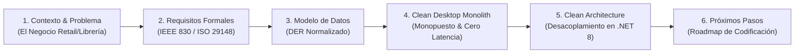

# Guía de Presentación y Defensa Técnica: Etapa de Diseño y Arquitectura

### Proyecto: Retail (Sistema ERP & Punto de Venta para Librería)
**Fecha:** Septiembre de 2026   
**Versión:** 3.2 (Clean Desktop Monolith con Cobranzas Multimedio y Recálculo Automático de Precios)  
**Estado del Proyecto:** Fase de Análisis, Requisitos y Diseño de Arquitectura Monolítica Finalizada

---

## 🧭 1. Estructura de la Presentación (10 a 15 Minutos)

---

### Bloque 1: Introducción y Contexto del Negocio (2 min)
* **Objetivo del Producto:** Sistema integral de ERP & Punto de Venta (POS) diseñado específicamente para librerías y comercios minoristas, optimizado para operar en una estación de trabajo de mostrador única.
* **Dolores Clave del Negocio que Resolvemos:**
  1. **Velocidad Extrema en Mostrador:** Tiempos de respuesta inmediatos ($< 15\text{ ms}$) operando al 100% mediante atajos de teclado (F1-F12) y lector de códigos de barras, sin latencia de red.
  2. **Catálogos Masivos de Distribuidores:** Procesamiento en segundo plano de listas de precios de distribuidores ($\ge 10.000$ filas) aplicando porcentajes de ganancia (*Markup %*) sin congelar la terminal de cobro.
  3. **Presupuestador con Conciliación de Precios:** Generación de presupuestos con validez de 15 días y comparación automática contra el catálogo vigente al momento de su cobro.
  4. **Padrón de Clientes y Cobranzas Multimedio:** Gestión de cuentas corrientes con circuito dedicado de cancelación de deuda mediante efectivo, tarjetas o transferencias/QR.
  5. **Recálculo Automático de Precios por Compras:** Protección inmediata del margen comercial ante la inflación de costos.
  6. **Arqueo Ciego en Efectivo:** Control estricto de dinero físico en gaveta, delegando la conciliación electrónica al cierre de lote del POS físico.

---

### Bloque 2: Ingeniería de Requisitos y Estándares Formales (3 min)
* **Marco Normativo:** Especificación formal bajo lineamientos **IEEE 830** e **ISO/IEC/IEEE 29148** ([`ERS - Libreria POS.md`](file:///c:/Users/lucas/Proyectos/retail/ERS%20-%20Libreria%20POS.md)).
* **Alcance Riguroso:**
  * **20 Requisitos Funcionales (`RF-01` a `RF-20`):** Autenticación, catálogo con soporte de artesanías, importador masivo, ventas multimedio, presupuestos independientes, cobranzas multimedio de cuentas corrientes, arqueo ciego en efectivo, facturación fiscal ARCA con contingencia y compras con recálculo automático.
  * **8 Requisitos No Funcionales (`RNF-01` a `RNF-08`):** Rendimiento ($< 50\text{ ms}$ en mostrador), seguridad criptográfica (PBKDF2/BCrypt), responsividad del hilo UI (`WPF Dispatcher`) e integridad ACID local.

---

### Bloque 3: Modelo de Datos Relacional (DER) (2 min)
* **Normalización y Consistencia:** Diagrama Entidad-Relación formal ([`DER.mmd`](file:///c:/Users/lucas/Proyectos/retail/DER.mmd)) en 3FN con integridad referencial estricta.
* **Decisiones Clave de Modelado:**
  * **Entidad `COBRANZAS_CLIENTES`:** Circuito formal e independiente para registrar pagos de saldos deudores de clientes con discriminación de medios de pago.
  * **Índice Filtrado en `ARTICULOS`:** Soporte de múltiples códigos de barras `NULL` para productos artesanales y servicios sin violar la unicidad de los códigos comerciales.
  * **Separación de `VENTAS` y `PRESUPUESTOS`:** Presupuestos independientes con vigencia estricta de 15 días y precio unitario pactado.
  * **`TURNOS_CAJA` Simplificado:** Foco exclusivo en el efectivo físico conciliable.

---

## ⚖️ 2. Justificación de Tecnologías y Patrones

| Decisión de Diseño | Alternativa Descartada | Justificación Técnica |
| :--- | :--- | :--- |
| **Entidad Dedicada `COBRANZAS_CLIENTES`** | Mezclar cobros de deuda en `MOVIMIENTOS_CAJA` o como ventas ficticias | Mantiene una auditoría contable impecable, permite cobrar con múltiples medios de pago (efectivo vs transferencia) y emitir un recibo oficial de cobranza sin desvirtuar la caja chica. |
| **Recálculo Automático por Markup en Compras** | Edición manual de precios tras ingresar facturas | Regla de negocio fundamental para comercios minoristas: ante aumentos de costos de distribuidores, el precio de venta al público se actualiza de inmediato para preservar el margen de ganancia configurado. |
| **Filtered Index en Código de Barras** | Índice único estándar en columna nulable | SQL Server prohíbe más de un `NULL` en índices únicos estándar. El índice filtrado (`WHERE [codigo_barras] IS NOT NULL`) es la solución técnica que permite infinitos artículos artesanales sin código. |
| **Separación de `VENTAS` y `PRESUPUESTOS`** | Una sola tabla `VENTAS` con columna `tipo_operacion` | Evita registros mutantes que rompen los balances de turno de caja cuando un presupuesto se cobra días después de emitido. |
| **Arqueo Ciego en Efectivo** | Arqueo multimoneda y cupones de tarjeta en el sistema | En el mostrador, el único dinero físico en riesgo de faltante es el efectivo. Los cupones electrónicos se auditan automáticamente contra el reporte de cierre de lote de la terminal adquirente (Posnet/Payway). |

---

## 🎯 3. Defensa Técnica ante Preguntas del Jurado

| Pregunta Típica del Evaluador | Argumentación Técnica para la Respuesta |
| :--- | :--- |
| **¿Cómo manejan la venta de productos artesanales que no poseen código de barras?** | *Mediante la configuración de un **Filtered Index** en Entity Framework Core sobre SQL Server. La columna `codigo_barras` es nulable y el índice único solo se aplica sobre valores no nulos (`[codigo_barras] IS NOT NULL`). Esto permite registrar ilimitados productos artesanales o servicios con valor `NULL` sin generar errores de clave duplicada, conservando la validación estricta para los artículos comerciales que sí tienen código.* |
| **¿Cómo se asegura el comercio de no perder rentabilidad si un distribuidor aumenta sus costos?** | *El sistema implementa el **recálculo automático de precio por compra (`RF-19`)**. Al registrar una factura de compra, si el costo unitario cambia, el método de dominio `articulo.ActualizarCostoYRecalcularPrecio()` actualiza el costo de reposición y recalcula de inmediato el precio de venta aplicando el margen porcentual configurado.* |
| **¿Qué ocurre cuando un cliente viene a pagar una deuda de su cuenta corriente mediante transferencia bancaria?** | *Se registra a través del circuito de `COBRANZAS_CLIENTES` en la vista de clientes. Al seleccionar medio de pago electrónico (Transferencia/QR), el sistema descuenta la deuda del cliente en su cuenta corriente e imputa el cobro al turno de caja activo como ingreso electrónico para conciliar con el banco, sin alterar el saldo físico de billetes en la gaveta.* |
| **¿Qué sucede si un cliente quiere cobrar un presupuesto de hace 10 días pero no hay stock suficiente?** | *La conversión de presupuesto a venta (`RF-12`) valida la disponibilidad física de stock antes de concretar la transacción. Si el stock en góndola es menor a las unidades presupuestadas, el sistema alerta al cajero e impide la conversión hasta que se ajusten las cantidades o ingrese reposición.* |
| **¿Por qué utilizan la interfaz marcadora `IAggregateRoot` y qué ventaja ofrece sobre un modelo CRUD tradicional?** | *Implementa el patrón de **Agregados de Domain-Driven Design (DDD)** para blindar la consistencia atómica. Una venta y sus detalles o pagos forman un todo indivisible. Al restringir los repositorios exclusivamente a `IAggregateRoot` (`IRepository<T> where T : BaseEntity, IAggregateRoot`), el compilador de C# impide alterar un `DetalleVenta` o `PagoVenta` de forma aislada. Todo cambio pasa obligatoriamente por la raíz `Venta`, la cual custodia los subtotales, impuestos y reglas de cobro.* |
| **¿Por qué aplican borrado lógico (*Soft Delete*) mediante `BaseEntity` en lugar de `DELETE` físico en base de datos?** | *En un sistema comercial y ERP con facturación fiscal, el borrado físico está prohibido porque destruiría la trazabilidad de auditoría y rompería las relaciones históricas con comprobantes pasados. `BaseEntity` provee `DeletedAt` e `IsDeleted`, permitiendo que Entity Framework Core aplique un **Global Query Filter** automático (`HasQueryFilter(e => !e.IsDeleted)`) para omitir productos o clientes inactivos en mostrador sin perder su respaldo contable.* |
