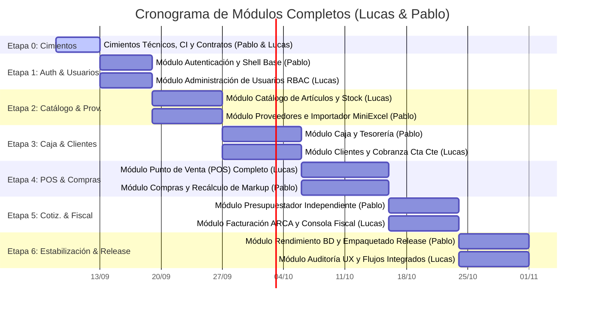

# Roadmap de Implementación y Plan de Acciones Inmediatas

### Proyecto: Retail (Sistema ERP & Punto de Venta para Librería)
**Versión:** 2.0 (Modelo de Módulos e Interfaces Completas - Cátedra de Taller de Programación)  
**Fecha:** Septiembre de 2026  
**Equipo:** Lucas Kruzolek & Pablo Fernandez  
**Documentos de Referencia:** [ERS v3.2](file:///c:/Users/lucas/Proyectos/retail/docs/ERS%20-%20Libreria%20POS.md), [Arquitectura y Estructura](file:///c:/Users/lucas/Proyectos/retail/docs/Arquitectura%20y%20Estructura%20del%20Proyecto.md), [DER](file:///c:/Users/lucas/Proyectos/retail/docs/DER.mmd), [Mapa Semántico](file:///c:/Users/lucas/Proyectos/retail/docs/MAPA_DEL_PROYECTO.md)

---

## 🧭 Visión General del Roadmap y Enfoque Pedagógico

El presente documento establece la hoja de ruta técnica ordenada por etapas para guiar la construcción del sistema **Retail**, adaptada al marco de un **proyecto universitario de cátedra (Taller de Programación)** para un equipo de **dos estudiantes desarrolladores: Lucas Kruzolek y Pablo Fernandez**.

### Principios Fundamentales de Organización del Trabajo

1. **Titularidad Completa por Módulo o Interfaz de Usuario:**
   * Se elimina la división clásica horizontal en silos (*Backend vs Frontend*) y se descarta también la subdivisión intra-pantalla.
   * El punto de corte entre ambos desarrolladores se establece en las **fronteras de los módulos e interfaces de usuario**.
   * Cada estudiante es propietario y responsable de un módulo **de principio a fin**, implementando toda su pila:
     $$\text{Vista XAML} \longrightarrow \text{ViewModel (MVVM)} \longrightarrow \text{Servicio de Aplicación} \longrightarrow \text{Entidades y Dominio} \longrightarrow \text{Mapeo EF Core} \longrightarrow \text{Tests xUnit}$$
   * Esto garantiza una formación pedagógica homogénea: ambos estudiantes desarrollarán y defenderán ante los docentes competencias en XAML reactivo, diseño MVVM, modelado DDD, consultas EF Core, transacciones ACID y pruebas automatizadas.

2. **Equidad Absoluta en Esfuerzo y Complejidad (50% / 50%):**
   * La carga se balancea emparejando en cada etapa módulos con desafíos de ingeniería comparables (ej. *Filtered Index* vs *Streaming con MiniExcel*; *Caja y Arqueo Ciego* vs *Clientes y Cobranza Transaccional*; *Punto de Venta Completo* vs *Compras y Recálculo Automático de Precios*).

3. **Arquitectura Basada en Contratos (*Contract-First*):**
   * Las interfaces de servicio (`src/Retail.Application/Interfaces/`) y los DTOs de intercambio se definen y congelan en la Etapa 0.
   * Esto permite a ambos desarrolladores avanzar en paralelo sin bloqueos mutuos mediante dobles de prueba (*mocks* y *stubs*).

4. **Revisión Cruzada Obligatoria (100% Peer Review):**
   * Ningún código entra a `main` sin la aprobación formal del compañero mediante Pull Request, asegurando que ambos conozcan la totalidad del sistema.

---

## 🛡️ Estrategia Técnica para Evitar Sobreescrituras en Funciones y Entidades Compartidas

Dado que existen agregados y servicios que interactúan entre módulos (por ejemplo, el stock de `Articulo`, el turno activo de `TurnoCaja` o la deuda de `Cliente`), se establecen las siguientes **4 barandillas arquitectónicas obligatorias** para evitar conflictos de fusión en Git y regresiones de código:

### 1. Desacoplamiento de Mapeos en EF Core (Fluent API)
* **Prohibición de modificar `RetailDbContext.cs` concurrentemente:**  
  El contexto utiliza `modelBuilder.ApplyConfigurationsFromAssembly(typeof(RetailDbContext).Assembly);`.
* Cada desarrollador crea y edita **únicamente su propio archivo de configuración aislado** dentro de `src/Retail.Infrastructure/Persistence/Configurations/` (ej. `ArticuloConfiguration.cs` para Lucas; `ProveedorConfiguration.cs` y `TurnoCajaConfiguration.cs` para Pablo). No se edita `RetailDbContext.cs` para agregar tablas ni relaciones.

### 2. Inversión de Dependencias (DIP) y Consumo por Contratos
* Ningún módulo accede a las clases concretas de implementación del otro.
* **Caso Cobranza/Caja:** Cuando el módulo de Clientes (Lucas) registra una cobranza en efectivo que debe ingresar a la caja activa, Lucas **no toca ni modifica `CajaService.cs` ni `CajaView.xaml`**. Lucas consume la interfaz acordada `ICajaService.RegistrarIngresoCobranzaAsync(...)` inyectada vía DI. Pablo es el titular exclusivo de la implementación interna de caja.
* **Caso POS/Caja y POS/Clientes:** Cuando el módulo POS (Lucas) finaliza una venta, invoca `ICajaService.RegistrarVentaEnCajaAsync(...)` e `IClienteService.DebitarCuentaCorrienteAsync(...)` sin tocar la lógica interna de esos servicios.

### 3. Métodos Atómicos y Encapsulados en Entidades Compartidas (`Articulo`)
* En entidades de dominio que sufren mutaciones desde distintos módulos (ej. `Articulo` es vendido por el POS de Lucas y adquirido por el módulo de Compras de Pablo), se prohíbe exponer *setters* públicos libres.
* Cada desarrollador incorpora métodos de dominio cohesivos y atómicos:
  * **Lucas (POS):** `articulo.DescontarStock(cantidad)` (valida stock suficiente y descuenta).
  * **Pablo (Compras):** `articulo.IncrementarStock(cantidad)` y `articulo.ActualizarCostoYRecalcularPrecio(nuevoCosto)` (recalcula el precio de venta sugerido preservando el markup).

### 4. Cohesión de Módulos Visualmente Acoplados
* **POS y Facturación ARCA asignados a Lucas:** Quien construye la experiencia de mostrador y el flujo de cobro del POS (Lucas en Etapa 4) es quien luego integra la emisión de comprobantes fiscales al cierre de la venta (Lucas en Etapa 5). Esto evita que Pablo tenga que intervenir en `PosView.xaml` o `PosViewModel.cs`.
* **Presupuestador con Diálogo Autónomo asignado a Pablo:** Pablo construye `PresupuestosView.xaml` y el diálogo modal independiente `AlertaPreciosPresupuestoDialog.xaml`. La recuperación de un presupuesto desde el mostrador se realiza mediante una llamada limpia al método `IPresupuestoService.RecuperarPresupuestoParaVentaAsync(id)` expuesto para el POS.

---

## 📅 Cronograma de Etapas y Módulos de Trabajo



---

## 📍 Etapa 0: Cimientos Técnicos, Gobernanza y Contratos (Sprint 0 - Pre-Implementación)

> **Objetivo:** Disponer del repositorio operativo, proyectos .NET 8 compilables, pipeline de integración continua, estándares de código unificados, sistema de diseño visual y contratos de servicios acordados antes de programar la lógica del negocio.

### Tareas Desglosadas

| ID | Tarea Técnica | Responsable | Entregable / Criterio de Éxito |
| :--- | :--- | :--- | :--- |
| **0.1** | **Scaffolding de Solución y Proyectos** ✅<br>Crear `Retail.sln`, proyectos de clase para `Retail.Domain`, `Retail.Application`, `Retail.Infrastructure`, ejecutable `Retail.App` (WPF .NET 8) y los 4 proyectos de pruebas xUnit bajo `tests/`. Configurar referencias entre capas, `<Nullable>enable</Nullable>` y `<TreatWarningsAsErrors>true</TreatWarningsAsErrors>` en `Directory.Build.props`. | **Pablo & Lucas** | Solución compila limpiamente desde CLI (`dotnet build`) sin advertencias. |
| **0.2** | **Estandarización y Calidad de Código** ✅<br>Crear `.editorconfig` con reglas estrictas de formato C# y XAML. Configurar `.gitignore` completo para entornos .NET/Visual Studio/Rider. | **Pablo** | Archivo `.editorconfig` en raíz validado con `dotnet format --verify-no-changes`. |
| **0.3** | **Pipeline de CI/CD en GitHub Actions** ✅<br>• **CI (`ci.yml`):** en runner `windows-latest` para PRs y pushes a `main` (`restore`, `build` Release sin warnings, `test` xUnit y `format`).<br>• **CD (`release.yml`):** en runner `windows-latest` ante Git Tags (`v*`) para compilar paquete auto-contenido de `Retail.App` (win-x64), comprimir en ZIP y publicar GitHub Release oficial. | **Pablo** | Workflows funcionales, verificados localmente y validados en sintaxis. |
| **0.4** | **Definición de Contratos "Contract-First"** ✅<br>Escribir en `Retail.Application` los contratos de interfaces: `IAuthService`, `IUsuarioService`, `IVentaService`, `IPresupuestoService`, `IClienteService`, `ICajaService`, `IInventarioService`, `ICompraService`, `IFiscalService` y sus DTOs principales de transporte. | **Pablo & Lucas** | Interfaces tipadas con firmas async documentadas y acordadas por ambos desarrolladores. |
| **0.5** | **Aislamiento y Mocks de Hardware / Terceros** ✅<br>Definir la interfaz `ITicketPrinterService` con su implementación de prueba `FileDebugTicketPrinterService` (salida a consola/archivo de texto). Crear `MockArcaClient` con bandera `"UseMockArca": true` en `appsettings.json` para simular respuestas fiscales sin requerir certificado AFIP. | **Pablo** | Pruebas unitarias que confirmen el comportamiento simulado sin dependencias externas. |
| **0.6** | **Sistema de Diseño XAML y Guía de Estilos** ✅<br>Integrar librería de controles modernos (diccionarios base en `Retail.App/Styles/`: `Colors.xaml`, `Typography.xaml`, `Controls.xaml`, `Icons.xaml`). Definir tokens de color (primario, advertencia de caja/stock, error fiscal, superficies de mostrador) y tipografía monoespaciada para valores monetarios. | **Lucas** | Galería de controles en XAML que valide visualmente botones, inputs, modales y tablas. |
| **0.7** | **Infraestructura de DB y Semillero Inicial** ✅<br>Crear `RetailDbContext`, mapear la cadena de conexión para `LocalDB` (desarrollo) y configurar el `DbInitializer` que inserte roles (`Gerente`, `Encargado`, `Cajero`), usuario `admin`, categorías base y 20 artículos de librería simulados. | **Pablo** | Migración inicial generada (`InitialCreate`) y base poblada automáticamente en primer arranque. |
| **0.8** | **Manejo Centralizado de Excepciones y Logging**<br>Configurar **Serilog** con destino a archivo local rotativo (`logs/retail-.log`). Conectar manejadores globales en `App.xaml.cs` (`DispatcherUnhandledException`, `AppDomain.UnhandledException`, `TaskScheduler.UnobservedTaskException`) con despliegue de diálogo visual amigable. | **Lucas** | Una excepción no controlada provocada deliberadamente no cuelga la app y se escribe en el log. |

---

## 📍 Etapa 1: Épica 1 - Autenticación, RBAC y Shell de Navegación

> **Objetivo:** Garantizar el acceso seguro de operadores mediante credenciales protegidas con hash, control de acceso basado en roles (RBAC) y un shell de escritorio ergonómico con sesión activa y cambio rápido de usuario.  
> **Requisitos Vinculados:** `RF-01`, `RF-02`, `RF-03`, `RNF-04`, `RNF-06`.

### Módulos e Interfaces Asignados

```text
┌────────────────────────────────────────────────────────────────────────────────────────┐
│ MÓDULO 1.1: Autenticación, Seguridad y Shell Base de Mostrador (Responsable: Pablo)    │
├────────────────────────────────────────────────────────────────────────────────────────┤
│ • Interfaz Visual: LoginWindow.xaml (pantalla de inicio con PasswordBox protegido y    │
│   feedback de credenciales) y MainWindow.xaml (Shell principal con contenedor de       │
│   páginas Frame, barra superior con operador activo, turno y botón de cambio de sesión).│
│ • ViewModels y UI Services: LoginViewModel.cs, MainViewModel.cs, CurrentUserSession.cs │
│   y NavigationService.cs para cambio de usuario sin reiniciar el ejecutable (RF-02).   │
│ • Lógica y Casos de Uso: IAuthService.LoginAsync, DTOs de login y validadores Fluent.  │
│ • Dominio y Seguridad: Entidad Usuario (IAggregateRoot), Rol, PasswordHasher con      │
│   BCrypt (BCrypt.Net-Next) para hashing seguro con salt (RNF-04).                      │
│ • Persistencia: UsuarioConfiguration.cs y RolConfiguration.cs en EF Core.              │
│ • Testing: Pruebas unitarias de hashing y autenticación en AuthServiceTests.cs;         │
│   pruebas unitarias de interfaz en LoginViewModelTests.cs.                             │
└────────────────────────────────────────────────────────────────────────────────────────┘
┌────────────────────────────────────────────────────────────────────────────────────────┐
│ MÓDULO 1.2: Administración de Usuarios y Roles RBAC (Responsable: Lucas)               │
├────────────────────────────────────────────────────────────────────────────────────────┤
│ • Interfaz Visual: UsuariosView.xaml (panel gerencial con grilla de operadores,        │
│   diálogo de alta/edición, selector de rol y opción de restablecimiento de contraseña).│
│ • ViewModels: UsuariosViewModel.cs y UsuarioDetalleViewModel.cs.                       │
│ • Lógica y Casos de Uso: IUsuarioService (RegistrarUsuarioAsync, ListarUsuariosAsync,  │
│   CambiarPasswordAsync, BajaUsuarioAsync). Validadores CrearUsuarioValidator.          │
│ • Dominio: RolUsuarioEnum (Cajero, Encargado, Gerente), reglas de baja lógica          │
│   (MarkAsDeleted) e invariante que impide eliminar al último Gerente del sistema.     │
│ • Persistencia: Consultas filtradas de usuarios activos/inactivos en EF Core.          │
│ • Testing: Pruebas de reglas de negocio en UsuarioServiceTests.cs; pruebas unitarias    │
│   de comandos y navegación en UsuariosViewModelTests.cs.                               │
└────────────────────────────────────────────────────────────────────────────────────────┘
```

* **Prevención de Sobreescritura:** Pablo define el Shell `MainWindow` y el contenedor de navegación. Lucas desarrolla `UsuariosView.xaml` de forma completamente autónoma y la conecta como página de destino en el `NavigationService`.
* **Criterio de Aceptación Integrado:** El operador se autentica desde `LoginWindow`; el shell principal adapta sus opciones según el rol (`RNF-06`), y el Gerente puede administrar usuarios y roles desde `UsuariosView`. El cambio de usuario se efectúa en $< 15\text{ ms}$ sin reiniciar la aplicación.

---

## 📍 Etapa 2: Épica 2 - Catálogo, Artículos e Importador Masivo

> **Objetivo:** Centralizar el padrón de productos físicos y artesanías sin código de barras, proteger la unicidad con índices filtrados en base de datos, advertir stocks críticos y permitir la actualización de costos mediante planillas Excel de distribuidores en segundo plano.  
> **Requisitos Vinculados:** `RF-04`, `RF-05`, `RF-06`, `RF-07`, `RF-08`, `RNF-02`, `RNF-03`.

### Módulos e Interfaces Asignados

```text
┌────────────────────────────────────────────────────────────────────────────────────────┐
│ MÓDULO 2.1: Catálogo Propio de Artículos y Alertas de Stock (Responsable: Lucas)       │
├────────────────────────────────────────────────────────────────────────────────────────┤
│ • Interfaz Visual: ArticulosView.xaml (grilla de productos con búsqueda en tiempo real,│
│   badges de alerta de stock mínimo RF-08, modal reactivo de alta/edición de artículo   │
│   con cálculo dinámico de precio de venta al ingresar costo y porcentaje de ganancia). │
│ • ViewModels: ArticulosViewModel.cs y ArticuloDetalleViewModel.cs.                     │
│ • Lógica y Casos de Uso: IInventarioService (CRUD de artículos, borrado lógico         │
│   MarkAsDeleted, búsqueda por código o texto, categorización). CrearArticuloValidator. │
│ • Dominio: Agregado Articulo (IAggregateRoot), Categoria, Marca. Fórmula de markup:   │
│   PrecioVenta = CostoReposicion * (1 + PorcentajeGanancia/100). Soporte de código     │
│   de barras opcional/nulo para artesanías y servicios.                                 │
│ • Persistencia: ArticuloConfiguration.cs con Filtered Unique Index en SQL Server:      │
│   builder.HasIndex(a => a.CodigoBarras).IsUnique().HasFilter("[codigo_barras] IS NOT NULL");
│   CategoriaConfiguration.cs y MarcaConfiguration.cs.                                   │
│ • Testing: Prueba de integración en LocalDB validando que múltiples artesanías con     │
│   código NULL coexistan sin infringir unicidad; pruebas unitarias de markup y de VM.  │
└────────────────────────────────────────────────────────────────────────────────────────┘
┌────────────────────────────────────────────────────────────────────────────────────────┐
│ MÓDULO 2.2: Proveedores e Importador Masivo Streaming con MiniExcel (Resp: Pablo)     │
├────────────────────────────────────────────────────────────────────────────────────────┤
│ • Interfaz Visual: ProveedoresView.xaml (ABM de distribuidores) e ImportadorView.xaml   │
│   (asistente de selección de planillas .xlsx/.csv locales, vista previa interactiva    │
│   para mapeo de columnas y barra de progreso asíncrona no bloqueante).                 │
│ • ViewModels: ProveedoresViewModel.cs e ImportadorCatalogosViewModel.cs.               │
│ • Lógica y Casos de Uso: IProveedorService e ImportarPlanillaProveedorAsync:          │
│   implementación de ExcelCatalogParser con MiniExcel en segundo plano (Task.Run) para │
│   no saturar la memoria (RNF-02, RNF-03), actualización masiva de costos de catálogo. │
│ • Dominio: Agregado Proveedor (IAggregateRoot), CatalogoProveedor, reglas de           │
│   vinculación de artículos a códigos de proveedor (RF-05).                             │
│ • Persistencia: ProveedorConfiguration.cs y CatalogoProveedorConfiguration.cs.         │
│ • Testing: Pruebas unitarias de parsing con archivo Excel sintético de 5.000 filas     │
│   (< 3 s de lectura, <= 300 MB de RAM); pruebas de integración de base de datos.       │
└────────────────────────────────────────────────────────────────────────────────────────┘
```

* **Prevención de Sobreescritura:** Lucas es el propietario de `ArticulosView`, `Articulo` y su configuración de base de datos. Pablo es el propietario de `ProveedoresView`, `ImportadorView`, `Proveedor`, `CatalogoProveedor` y el parser de MiniExcel. Ambas interfaces son páginas independientes conectadas al frame de navegación.
* **Criterio de Aceptación Integrado:** Se pueden crear productos artesanales sin código de barras sin colisiones de índice; se importa una lista de distribuidor de 5.000 filas en segundo plano sin congelar la UI, actualizando costos y enlazando con artículos existentes; los artículos con stock bajo exhiben alertas visuales.

---

## 📍 Etapa 3: Épica 3 - Turnos de Caja, Clientes y Cobranza de Cuentas Corrientes

> **Objetivo:** Controlar los flujos de dinero físico en mostrador mediante balance teórico y arqueo ciego, y gestionar el padrón de clientes con cobranzas multimedio de deudas que impacten atómicamente en la caja activa.  
> **Requisitos Vinculados:** `RF-13`, `RF-14`, `RF-15`, `RF-20`, `RNF-08`.

### Módulos e Interfaces Asignados

```text
┌────────────────────────────────────────────────────────────────────────────────────────┐
│ MÓDULO 3.1: Caja y Tesorería con Arqueo Ciego (Responsable: Pablo)                     │
├────────────────────────────────────────────────────────────────────────────────────────┤
│ • Interfaz Visual: CajaView.xaml (panel de control de turno, saldo inicial, grilla de  │
│   movimientos varios) y ArqueoCiegoDialog.xaml (modal de cierre donde el cajero        │
│   declara únicamente el dinero físico contado; el sistema emite el acta comparativa de │
│   sobrante/faltante y exhibe el total electrónico para conciliar con el POS adquirente).│
│ • ViewModels: CajaViewModel.cs y ArqueoCiegoViewModel.cs.                              │
│ • Lógica y Casos de Uso: ICajaService (AbrirTurnoAsync, RegistrarMovimientoAsync,      │
│   ObtenerTurnoActivoAsync, CerrarTurnoConArqueoCiegoAsync).                            │
│ • Dominio: Agregado TurnoCaja (IAggregateRoot), MovimientoCaja, balance teórico:       │
│   SaldoTeorico = Inicial + VentasEfectivo + CobranzasEfectivo + Ingresos - Egresos.   │
│   Cálculo de arqueo ciego: Diferencia = SaldoDeclarado - SaldoTeorico.                 │
│ • Persistencia: TurnoCajaConfiguration.cs y MovimientoCajaConfiguration.cs.           │
│ • Testing: Pruebas unitarias de fórmulas de arqueo; pruebas de servicio de turno       │
│   y pruebas de interfaz de ArqueoCiegoDialog.                                          │
└────────────────────────────────────────────────────────────────────────────────────────┘
┌────────────────────────────────────────────────────────────────────────────────────────┐
│ MÓDULO 3.2: Clientes y Cobranzas de Cuentas Corrientes (Responsable: Lucas)            │
├────────────────────────────────────────────────────────────────────────────────────────┤
│ • Interfaz Visual: ClientesView.xaml (padrón con búsqueda por CUIT/DNI, condición IVA,│
│   límite de crédito y saldo deudor) y CobranzaModalDialog.xaml (modal multimedio para  │
│   cancelar deuda con efectivo, tarjeta o QR, con emisión de recibo duplicado).        │
│ • ViewModels: ClientesViewModel.cs y CobranzaModalViewModel.cs.                        │
│ • Lógica y Casos de Uso: IClienteService (ABM de clientes, consulta de saldo) y        │
│   RegistrarCobranzaAsync bajo transacción ACID:                                        │
│   - Reduce el saldo deudor del cliente (Cliente.SaldoCuentaCorriente).                 │
│   - Invoca a ICajaService para ingresar los fondos a la caja del turno activo.         │
│   - Emite recibo duplicado no fiscal mediante ITicketPrinterService.                   │
│ • Dominio: Agregado Cliente (IAggregateRoot), CobranzaCliente, límite de crédito.      │
│ • Persistencia: ClienteConfiguration.cs y CobranzaClienteConfiguration.cs.             │
│ • Testing: Pruebas de integración transaccional de cobranza en LocalDB; pruebas        │
│   unitarias de validación de deudas y límites en ClienteServiceTests.cs.               │
└────────────────────────────────────────────────────────────────────────────────────────┘
```

* **Prevención de Sobreescritura:** Para imputar el cobro en caja, Lucas inyecta la interfaz `ICajaService` y ejecuta el método acordado en los contratos (`RegistrarIngresoCobranzaAsync`). Lucas **no modifica `CajaView`, `CajaViewModel` ni la implementación de `CajaService`**.
* **Criterio de Aceptación Integrado:** Al registrar una cobranza de cuenta corriente en efectivo, la deuda del cliente se reduce y el efectivo de la caja activa se incrementa en una misma transacción ACID; al cerrar el turno, el arqueo ciego detecta faltantes/sobrantes y exhibe el total electrónico para cotejo.

---

## 📍 Etapa 4: Épica 4 - Punto de Venta (POS) y Gestión de Compras

> **Objetivo:** Construir la terminal operativa de mostrador de alta velocidad para ventas y cobros multimedio con descuento atómico de stock, y el módulo de ingreso de compras a distribuidores con recálculo automático de precios de venta.  
> **Requisitos Vinculados:** `RF-09`, `RF-10`, `RF-19`, `RNF-01`, `RNF-02`.

### Módulos e Interfaces Asignados

```text
┌────────────────────────────────────────────────────────────────────────────────────────┐
│ MÓDULO 4.1: Punto de Venta (POS) y Checkout Multimedio Completo (Responsable: Lucas)   │
├────────────────────────────────────────────────────────────────────────────────────────┤
│ • Interfaz Visual: PosView.xaml (terminal de mostrador de alta velocidad, captura en   │
│   buffer continuo de scanner de barras, atajos F1 a F12, foco permanente, grilla de   │
│   líneas con cantidades y selección rápida de cliente) y CobroModalDialog.xaml         │
│   (modal de pago multimedio: efectivo con cálculo dinámico de vuelto, tarjetas, QR y   │
│   cuenta corriente con verificación de límite de crédito; confirmación e impresión).   │
│ • ViewModels: PosViewModel.cs y CobroModalViewModel.cs.                                │
│ • Lógica y Casos de Uso: IVentaService (BuscarArticuloParaVentaAsync con lecturas      │
│   ultrarrápidas < 15 ms sin tracking, y RegistrarVentaAsync con transacción ACID       │
│   que guarda venta, ítems, pagos y descuenta stock atómicamente).                      │
│ • Dominio: Agregado Venta (IAggregateRoot), DetalleVenta, PagoVenta, invariantes de     │
│   total y método de descuento articulo.DescontarStock(cant).                           │
│ • Persistencia: VentaConfiguration.cs, DetalleVentaConfiguration.cs y                   │
│   PagoVentaConfiguration.cs en EF Core. Despacho a ITicketPrinterService.              │
│ • Testing: Pruebas unitarias de cálculo de vuelto; pruebas de concurrencia y rollback  │
│   por falta de stock; pruebas de interfaz de PosViewModel.                             │
└────────────────────────────────────────────────────────────────────────────────────────┘
┌────────────────────────────────────────────────────────────────────────────────────────┐
│ MÓDULO 4.2: Compras a Proveedores y Recálculo Automático de Precios (Responsable: Pablo│
├────────────────────────────────────────────────────────────────────────────────────────┤
│ • Interfaz Visual: ComprasView.xaml (ingreso de facturas/remitos de distribuidores,    │
│   selección de proveedor, grilla interactiva con previsualización en tiempo real del   │
│   nuevo precio de venta sugerido al ingresar el nuevo costo de reposición unitario).   │
│ • ViewModels: ComprasViewModel.cs y DetalleCompraItemViewModel.cs.                     │
│ • Lógica y Casos de Uso: ICompraService.RegistrarCompraAsync:                          │
│   - Transacción ACID de ingreso de mercadería.                                         │
│   - Incremento del stock físico de los artículos adquiridos.                           │
│   - Ejecución inmediata del recálculo de precios de venta en catálogo.                 │
│ • Dominio: Agregado Compra (IAggregateRoot), DetalleCompra. Regla de negocio central   │
│   RF-19: Articulo.ActualizarCostoYRecalcularPrecio(nuevoCosto) con fórmula de markup.  │
│ • Persistencia: CompraConfiguration.cs y DetalleCompraConfiguration.cs en EF Core.     │
│ • Testing: Pruebas unitarias de recálculo de markup; pruebas de integración de compras │
│   validando nuevo stock y nuevo precio en una sola transacción; tests de ComprasView.  │
└────────────────────────────────────────────────────────────────────────────────────────┘
```

* **Prevención de Sobreescritura:** Lucas es el dueño exclusivo del POS y el modal de cobro. Pablo es el dueño exclusivo de la pantalla de Compras. En la entidad compartida `Articulo`, Lucas solo invoca `DescontarStock` y Pablo invoca `IncrementarStock` y `ActualizarCostoYRecalcularPrecio`, manteniendo los métodos estrictamente encapsulados.
* **Criterio de Aceptación Integrado:** El POS permite vender ágilmente con teclado y lector de barras en $< 50\text{ ms}$, descontando stock e imprimiendo el ticket; al ingresar una compra de distribuidor, el stock se incrementa y el catálogo recalcula inmediatamente el precio de venta sugerido protegiendo el margen comercial.

---

## 📍 Etapa 5: Épica 5 - Presupuestador Independiente y Facturación Fiscal ARCA

> **Objetivo:** Confeccionar cotizaciones comerciales independientes con validez de 15 días y conversión en mostrador con control de stock, y automatizar la emisión fiscal electrónica ante AFIP/ARCA con contingencia resiliente y consola gerencial.  
> **Requisitos Vinculados:** `RF-11`, `RF-12`, `RF-16`, `RF-17`, `RF-18`, `RNF-07`.

### Módulos e Interfaces Asignados

```text
┌────────────────────────────────────────────────────────────────────────────────────────┐
│ MÓDULO 5.1: Presupuestador Independiente y Conversión a Venta (Responsable: Pablo)    │
├────────────────────────────────────────────────────────────────────────────────────────┤
│ • Interfaz Visual: PresupuestosView.xaml (confección, listado e impresión de           │
│   cotizaciones independientes) y AlertaPreciosPresupuestoDialog.xaml (modal de alerta  │
│   que advierte al cajero si los precios del catálogo aumentaron o si falta stock en    │
│   góndola al intentar convertir un presupuesto en mostrador).                          │
│ • ViewModels: PresupuestosViewModel.cs y AlertaPreciosPresupuestoViewModel.cs.         │
│ • Lógica y Casos de Uso: IPresupuestoService:                                          │
│   - CrearPresupuestoAsync: cotización temporal sin afectar stock ni caja.              │
│   - RecuperarPresupuestoParaVentaAsync: valida vigencia de 15 días (lanza excepción   │
│     PresupuestoVencidoException si expiró), audita stock disponible y detecta          │
│     discrepancias contra los precios actuales de catálogo.                             │
│   - MarcarPresupuestoComoConvertidoAsync al confirmarse la venta.                      │
│ • Dominio: Agregado Presupuesto (IAggregateRoot), DetallePresupuesto, EstadoPresupuesto│
│   e invariante de congelamiento de precio_unitario_pactado por 15 días.                │
│ • Persistencia: PresupuestoConfiguration.cs y DetallePresupuestoConfiguration.cs.      │
│ • Testing: Pruebas unitarias de vigencia temporal; pruebas de bloqueo por stock        │
│   insuficiente en conversión y tests de PresupuestosViewModel.                         │
└────────────────────────────────────────────────────────────────────────────────────────┘
┌────────────────────────────────────────────────────────────────────────────────────────┐
│ MÓDULO 5.2: Facturación Fiscal ARCA y Consola Gerencial (Responsable: Lucas)           │
├────────────────────────────────────────────────────────────────────────────────────────┤
│ • Interfaz Visual: ConsolaFiscalView.xaml (panel exclusivo para el rol Gerente con     │
│   grilla de comprobantes en contingencia, visualización de motivo_error, botón         │
│   [Reintentar Lote] con barra de progreso) e indicador de salud del servicio fiscal en │
│   la barra de estado de MainWindow. Integración del comprobante al cierre del POS.     │
│ • ViewModels: ConsolaFiscalViewModel.cs.                                               │
│ • Lógica y Casos de Uso: IFiscalService (EmitirComprobanteAsync, ObtenerPendientes,    │
│   ReintentarLoteAsync) y cliente HTTP tipado ArcaClient hacia http://localhost:8080    │
│   (con timeout de 10s y soporte de MockArcaClient):                                    │
│   - Discriminación tributaria: Factura A si Cliente.CondicionIva == ResponsableInsc;   │
│     Factura B para Consumidor Final y demás casos.                                     │
│   - Motor de contingencia resiliente: ante fallo de conexión, guarda la venta como     │
│     ERROR_FISCAL_REINTENTABLE con motivo_error e imprime ticket no fiscal.             │
│ • Dominio: Entidad ComprobanteFiscal, TipoComprobanteFiscalEnum, EstadoFiscalEnum.     │
│ • Persistencia: ComprobanteFiscalConfiguration.cs en EF Core.                         │
│ • Testing: Pruebas unitarias simulando respuestas CAE con MockArcaClient; pruebas de   │
│   corte de conexión validando contingencia sin interrupción de la venta; tests de VM.  │
└────────────────────────────────────────────────────────────────────────────────────────┘
```

* **Prevención de Sobreescritura:** Lucas es el autor del POS y de la Facturación Fiscal, por lo que la conexión entre el checkout y la emisión fiscal la realiza el mismo desarrollador sin riesgos de colisión. Pablo entrega el módulo de presupuestos completo con su propio modal de alerta de discrepancias `AlertaPreciosPresupuestoDialog.xaml`, listo para ser consumido mediante la interfaz `IPresupuestoService`.
* **Criterio de Aceptación Integrado:** Un presupuesto vencido (> 15 días) es rechazado al intentar cobrarlo; ante variaciones de precio en catálogo, el cajero es alertado antes de transferir las líneas a la venta; ante cortes de red o caídas del servicio fiscal, la venta concluye normalmente en contingencia, y el Gerente autoriza los comprobantes en lote con un clic desde su consola fiscal.

---

## 📍 Etapa 6: Épica 6 - Estabilización, Integración E2E y Empaquetado Release

> **Objetivo:** Auditar la experiencia de usuario y ergonomía de mostrador, optimizar los tiempos de respuesta de base de datos, validar la resiliencia integral de flujos de negocio y generar el paquete de release auto-contenido para producción.  
> **Requisitos Vinculados:** `RNF-01`, `RNF-02`, `RNF-03`, `RNF-07`, `RNF-08`.

### Módulos y Responsabilidades Asignadas

```text
┌────────────────────────────────────────────────────────────────────────────────────────┐
│ TRACK 6.1: Auditoría UX, Modo Mostrador Mouse-less y Flujos Integrados (Resp: Lucas)   │
├────────────────────────────────────────────────────────────────────────────────────────┤
│ • Experiencia de Mostrador Mouse-less: auditoría de accesibilidad y navegación         │
│   100% por teclado en POS y cajas (tabulación cíclica, foco garantizado y atajos F1-F12)│
│ • Manejo Global de Diálogos: unificación visual de alertas amigables y registro de     │
│   errores de interfaz con Serilog rotativo (logs/retail-.log).                         │
│ • Pruebas de Flujos E2E: validación de escenarios límite (venta sin stock, cliente con │
│   límite de crédito superado, presupuesto con precios desactualizados, corte fiscal).  │
│ • Documentación: manual de operación de mostrador y guía visual para defensa académica.│
└────────────────────────────────────────────────────────────────────────────────────────┘
┌────────────────────────────────────────────────────────────────────────────────────────┐
│ TRACK 6.2: Rendimiento de Base de Datos y Empaquetado Release (Responsable: Pablo)     │
├────────────────────────────────────────────────────────────────────────────────────────┤
│ • Optimización de Persistencia: revisión de índices en SQL Server / LocalDB, auditoría │
│   de tiempos de respuesta en consultas de catálogo y venta (< 15 ms en mostrador).     │
│ • Pipeline CD en GitHub Actions: validación del workflow release.yml para compilación  │
│   de binario auto-contenido Retail.App (win-x64), compresión en ZIP y publicación.    │
│ • Inner Loop de Calidad: verificación estricta de compilación Release con cero         │
│   advertencias, 100% de tests xUnit aprobados y formato conforme a .editorconfig.      │
│ • Validación de Despliegue: prueba de ejecución en equipo Windows limpio sin SDK .NET. │
└────────────────────────────────────────────────────────────────────────────────────────┘
```

* **Criterio de Aceptación Final:** La solución compila en modo Release con cero advertencias (`TreatWarningsAsErrors`); la suite de pruebas unitarias e integración se ejecuta al 100% en verde; el sistema opera en mostrador con teclado y scanner a $< 15\text{ ms}$; y se genera el archivo ZIP de release auto-contenido listo para su defensa y entrega.

---

## 📋 Matriz de Gobernanza y Modelo de Colaboración

### Modelo Pedagógico: Desarrolladores Full-Stack Desktop

En el marco de la cátedra de **Taller de Programación**, ambos estudiantes actúan como ingenieros integrales del sistema:

```text
                  EQUIPO DE DESARROLLO (TALLER DE PROGRAMACIÓN)
                       Lucas Kruzolek & Pablo Fernandez
              (Desarrolladores Full-Stack Desktop / .NET 8 WPF)

        MÓDULOS DE LUCAS                         MÓDULOS DE PABLO
  ┌──────────────────────────────┐         ┌──────────────────────────────┐
  │ • Vistas XAML & ViewModels   │         │ • Vistas XAML & ViewModels   │
  │ • Servicios de Aplicación    │         │ • Servicios de Aplicación    │
  │ • Entidades y Dominio (DDD)  │  ◄───►  │ • Entidades y Dominio (DDD)  │
  │ • Persistencia y EF Core     │         │ • Persistencia y EF Core     │
  │ • Pruebas Unitarias xUnit    │         │ • Pruebas Unitarias xUnit    │
  └──────────────────────────────┘         └──────────────────────────────┘
                  ▲                                       ▲
                  └───────────────┬───────────────────────┘
                                  │
                   ACUERDO CONTRACT-FIRST Y GOBERNANZA
                   • Contratos C# congelados en Etapa 0 (Interfaces/DTOs)
                   • Mocks / Dobles de prueba para trabajo en paralelo
                   • Revisión Cruzada Obligatoria de PRs (100% Peer Review)
                   • Inner Loop: Build (0 warnings) + Tests + Format
```

### Resumen de Distribución de Módulos e Interfaces

| Etapa | Módulo Completo Asignado a Lucas | Módulo Completo Asignado a Pablo |
| :--- | :--- | :--- |
| **Etapa 1** | **Módulo Usuarios y Roles:** `UsuariosView.xaml`, `UsuariosViewModel`, `IUsuarioService` | **Módulo Autenticación y Shell:** `LoginWindow.xaml`, `MainWindow.xaml`, `IAuthService` |
| **Etapa 2** | **Módulo Catálogo y Stock:** `ArticulosView.xaml`, `ArticulosViewModel`, `Articulo` (Filtered Index) | **Módulo Proveedores e Importador:** `ProveedoresView.xaml`, `ImportadorView.xaml`, MiniExcel |
| **Etapa 3** | **Módulo Clientes y Cobranza:** `ClientesView.xaml`, `CobranzaModalDialog.xaml`, `ClienteService` | **Módulo Caja y Tesorería:** `CajaView.xaml`, `ArqueoCiegoDialog.xaml`, `CajaService` |
| **Etapa 4** | **Módulo Punto de Venta (POS):** `PosView.xaml`, `CobroModalDialog.xaml`, `VentaService` | **Módulo Compras a Proveedores:** `ComprasView.xaml`, `ComprasViewModel`, `CompraService` |
| **Etapa 5** | **Módulo Facturación ARCA:** `ConsolaFiscalView.xaml`, `FiscalService`, `ArcaClient` | **Módulo Presupuestador:** `PresupuestosView.xaml`, `AlertaPreciosDialog.xaml`, `PresupuestoService` |
| **Etapa 6** | **Auditoría UX y Mostrador Mouse-less:** Flujos integrados E2E y manual de mostrador | **Rendimiento BD y Empaquetado:** Benchmarking $< 15\text{ ms}$ y pipeline CD `release.yml` |
| **Balance** | **6 Módulos / Tracks Completos de Principio a Fin** | **6 Módulos / Tracks Completos de Principio a Fin** |

### Políticas de Trabajo y Calidad en Git

1. **GitHub Flow y Ramas Cortas:** La rama `main` siempre compila y mantiene todos los tests en verde. Cada desarrollador trabaja en ramas específicas por módulo (`feat/etapaX-nombre-modulo`).
2. **Revisión Cruzada Obligatoria (100% Peer Review):** Ningún PR puede incorporarse a `main` sin la revisión técnica y aprobación formal del compañero de equipo.
3. **Bucle de Verificación Obligatorio (*Inner Loop*):** Antes de solicitar revisión o dar por terminada una tarea, el desarrollador debe ejecutar localmente:
   ```powershell
   dotnet build Retail.sln --configuration Release
   dotnet test Retail.sln --configuration Release --no-build
   dotnet format Retail.sln --verify-no-changes
   ```
4. **Cero Tolerancia a Advertencias (`TreatWarningsAsErrors`):** Código con advertencias de compilador, nulabilidad no gestionada o formato incorrecto será rechazado por el pipeline de CI.
