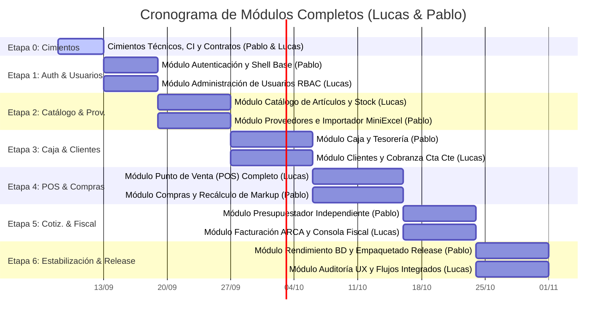

# Roadmap de Implementación y Hoja de Ruta Ejecutiva

### Proyecto: Retail (Sistema ERP & Punto de Venta para Librería)
**Versión:** 2.0 (Modelo de Módulos e Interfaces Completas - Cátedra de Taller de Programación)  
**Fecha:** Septiembre de 2026  
**Equipo:** Lucas Kruzolek & Pablo Fernandez  
**Documentos de Referencia:** [ERS v3.2](file:///c:/Users/lucas/Proyectos/retail/docs/ERS%20-%20Libreria%20POS.md), [Arquitectura y Estructura](file:///c:/Users/lucas/Proyectos/retail/docs/Arquitectura%20y%20Estructura%20del%20Proyecto.md), [DER](file:///c:/Users/lucas/Proyectos/retail/docs/DER.mmd), [Mapa Semántico](file:///c:/Users/lucas/Proyectos/retail/docs/MAPA_DEL_PROYECTO.md)

---

## 🧭 Visión General del Roadmap y Enfoque Pedagógico

El presente documento establece la hoja de ruta técnica ordenada por etapas para guiar la construcción del sistema **Retail**, adaptada al marco de un **proyecto universitario de cátedra (Taller de Programación)** para un equipo de **dos estudiantes desarrolladores: Lucas Kruzolek y Pablo Fernandez**.

### Principios Fundamentales de Organización del Trabajo

1. **Titularidad Completa por Módulo o Interfaz de Usuario:**
   * Se elimina la división clásica horizontal en silos (*Backend vs Frontend*) y se descarta también la subdivisión intra-pantalla.
   * El punto de corte entre ambos desarrolladores se establece en las **fronteras de los módulos e interfaces de usuario**.
   * Cada estudiante es propietario y responsable de un módulo **de principio a fin**, implementando toda su pila:
     $$\text{Vista XAML} \longrightarrow \text{ViewModel (MVVM)} \longrightarrow \text{Servicio de Aplicación} \longrightarrow \text{Entidades y Dominio} \longrightarrow \text{Mapeo EF Core} \longrightarrow \text{Tests xUnit}$$
   * Esto garantiza una formación pedagógica homogénea: ambos estudiantes desarrollarán y defenderán ante los docentes competencias en XAML reactivo, diseño MVVM, modelado DDD, consultas EF Core, transacciones ACID y pruebas automatizadas.

2. **Equidad Absoluta en Esfuerzo y Complejidad (50% / 50%):**
   * La carga se balancea emparejando en cada etapa módulos con desafíos de ingeniería comparables (ej. *Filtered Index* vs *Streaming con MiniExcel*; *Caja y Arqueo Ciego* vs *Clientes y Cobranza Transaccional*; *Punto de Venta Completo* vs *Compras y Recálculo Automático de Precios*).

3. **Arquitectura Basada en Contratos (*Contract-First*):**
   * Las interfaces de servicio (`src/Retail.Application/Interfaces/`) y los DTOs de intercambio se definen y congelan en la Etapa 0.
   * Esto permite a ambos desarrolladores avanzar en paralelo sin bloqueos mutuos mediante dobles de prueba (*mocks* y *stubs*).

4. **Revisión Cruzada Obligatoria (100% Peer Review):**
   * Ningún código entra a `main` sin la aprobación formal del compañero mediante Pull Request, asegurando que ambos conozcan la totalidad del sistema.

---

## 🛡️ Estrategia Técnica para Evitar Sobreescrituras en Funciones y Entidades Compartidas

Dado que existen agregados y servicios que interactúan entre módulos (por ejemplo, el stock de `Articulo`, el turno activo de `TurnoCaja` o la deuda de `Cliente`), se establecen las siguientes **4 barandillas arquitectónicas obligatorias** para evitar conflictos de fusión en Git y regresiones de código:

### 1. Desacoplamiento de Mapeos en EF Core (Fluent API)
* **Prohibición de modificar `RetailDbContext.cs` concurrentemente:**  
  El contexto utiliza `modelBuilder.ApplyConfigurationsFromAssembly(typeof(RetailDbContext).Assembly);`.
* Cada desarrollador crea y edita **únicamente su propio archivo de configuración aislado** dentro de `src/Retail.Infrastructure/Persistence/Configurations/` (ej. `ArticuloConfiguration.cs` para Lucas; `ProveedorConfiguration.cs` y `TurnoCajaConfiguration.cs` para Pablo). No se edita `RetailDbContext.cs` para agregar tablas ni relaciones.

### 2. Inversión de Dependencias (DIP) y Consumo por Contratos
* Ningún módulo accede a las clases concretas de implementación del otro.
* **Caso Cobranza/Caja:** Cuando el módulo de Clientes (Lucas) registra una cobranza en efectivo que debe ingresar a la caja activa, Lucas **no toca ni modifica `CajaService.cs` ni `CajaView.xaml`**. Lucas consume la interfaz acordada `ICajaService.RegistrarIngresoCobranzaAsync(...)` inyectada vía DI. Pablo es el titular exclusivo de la implementación interna de caja.
* **Caso POS/Caja y POS/Clientes:** Cuando el módulo POS (Lucas) finaliza una venta, invoca `ICajaService.RegistrarVentaEnCajaAsync(...)` e `IClienteService.DebitarCuentaCorrienteAsync(...)` sin tocar la lógica interna de esos servicios.

### 3. Métodos Atómicos y Encapsulados en Entidades Compartidas (`Articulo`)
* En entidades de dominio que sufren mutaciones desde distintos módulos (ej. `Articulo` es vendido por el POS de Lucas y adquirido por el módulo de Compras de Pablo), se prohíbe exponer *setters* públicos libres.
* Cada desarrollador incorpora métodos de dominio cohesivos y atómicos:
  * **Lucas (POS):** `articulo.DescontarStock(cantidad)` (valida stock suficiente y descuenta).
  * **Pablo (Compras):** `articulo.IncrementarStock(cantidad)` y `articulo.ActualizarCostoYRecalcularPrecio(nuevoCosto)` (recalcula el precio de venta sugerido preservando el markup).

### 4. Cohesión de Módulos Visualmente Acoplados
* **POS y Facturación ARCA asignados a Lucas:** Quien construye la experiencia de mostrador y el flujo de cobro del POS (Lucas en Etapa 4) es quien luego integra la emisión de comprobantes fiscales al cierre de la venta (Lucas en Etapa 5). Esto evita que Pablo tenga que intervenir en `PosView.xaml` o `PosViewModel.cs`.
* **Presupuestador con Diálogo Autónomo asignado a Pablo:** Pablo construye `PresupuestosView.xaml` y el diálogo modal independiente `AlertaPreciosPresupuestoDialog.xaml`. La recuperación de un presupuesto desde el mostrador se realiza mediante una llamada limpia al método `IPresupuestoService.RecuperarPresupuestoParaVentaAsync(id)` expuesto para el POS.

---

## 📅 Cronograma de Etapas y Módulos de Trabajo



---

## 🗂️ Navegación a las Especificaciones Modulares de Etapa

Para garantizar la eficiencia de contexto de desarrolladores y agentes de código, las especificaciones técnicas detalladas de cada etapa se encuentran modularizadas en archivos dedicados:

| Etapa | Nombre y Alcance | Módulos y Responsables | Estado | Enlace a Especificación Detallada |
| :--- | :--- | :--- | :---: | :--- |
| **Etapa 0** | **Cimientos Técnicos, Gobernanza y Contratos** | Tareas 0.1 a 0.8 (Pablo & Lucas) | ✅ 100% | [`docs/roadmap/etapa-0-cimientos.md`](file:///c:/Users/lucas/Proyectos/retail/docs/roadmap/etapa-0-cimientos.md) |
| **Etapa 1** | **Autenticación, RBAC y Shell de Navegación** | Módulo 1.1 (Pablo) & Módulo 1.2 (Lucas) | ⏳ Pendiente | [`docs/roadmap/etapa-1-auth-usuarios.md`](file:///c:/Users/lucas/Proyectos/retail/docs/roadmap/etapa-1-auth-usuarios.md) |
| **Etapa 2** | **Catálogo, Artículos e Importador Masivo** | Módulo 2.1 (Lucas) & Módulo 2.2 (Pablo) | ⏳ Pendiente | [`docs/roadmap/etapa-2-catalogo-stock.md`](file:///c:/Users/lucas/Proyectos/retail/docs/roadmap/etapa-2-catalogo-stock.md) |
| **Etapa 3** | **Turnos de Caja, Clientes y Cobranza Cta Cte** | Módulo 3.1 (Pablo) & Módulo 3.2 (Lucas) | ⏳ Pendiente | [`docs/roadmap/etapa-3-caja-clientes.md`](file:///c:/Users/lucas/Proyectos/retail/docs/roadmap/etapa-3-caja-clientes.md) |
| **Etapa 4** | **Punto de Venta (POS) y Compras con Markup** | Módulo 4.1 (Lucas) & Módulo 4.2 (Pablo) | ⏳ Pendiente | [`docs/roadmap/etapa-4-pos-compras.md`](file:///c:/Users/lucas/Proyectos/retail/docs/roadmap/etapa-4-pos-compras.md) |
| **Etapa 5** | **Presupuestador y Facturación Fiscal ARCA** | Módulo 5.1 (Pablo) & Módulo 5.2 (Lucas) | ⏳ Pendiente | [`docs/roadmap/etapa-5-presupuestos-arca.md`](file:///c:/Users/lucas/Proyectos/retail/docs/roadmap/etapa-5-presupuestos-arca.md) |
| **Etapa 6** | **Estabilización, Integración E2E y Release** | Track 6.1 (Lucas) & Track 6.2 (Pablo) | ⏳ Pendiente | [`docs/roadmap/etapa-6-estabilizacion-release.md`](file:///c:/Users/lucas/Proyectos/retail/docs/roadmap/etapa-6-estabilizacion-release.md) |

---

## 📋 Matriz de Gobernanza y Modelo de Colaboración

### Modelo Pedagógico: Desarrolladores Full-Stack Desktop

En el marco de la cátedra de **Taller de Programación**, ambos estudiantes actúan como ingenieros integrales del sistema:

```text
                  EQUIPO DE DESARROLLO (TALLER DE PROGRAMACIÓN)
                       Lucas Kruzolek & Pablo Fernandez
              (Desarrolladores Full-Stack Desktop / .NET 8 WPF)

        MÓDULOS DE LUCAS                         MÓDULOS DE PABLO
  ┌──────────────────────────────┐         ┌──────────────────────────────┐
  │ • Vistas XAML & ViewModels   │         │ • Vistas XAML & ViewModels   │
  │ • Servicios de Aplicación    │         │ • Servicios de Aplicación    │
  │ • Entidades y Dominio (DDD)  │  ◄───►  │ • Entidades y Dominio (DDD)  │
  │ • Persistencia y EF Core     │         │ • Persistencia y EF Core     │
  │ • Pruebas Unitarias xUnit    │         │ • Pruebas Unitarias xUnit    │
  └──────────────────────────────┘         └──────────────────────────────┘
                  ▲                                       ▲
                  └───────────────┬───────────────────────┘
                                  │
                   ACUERDO CONTRACT-FIRST Y GOBERNANZA
                   • Contratos C# congelados en Etapa 0 (Interfaces/DTOs)
                   • Mocks / Dobles de prueba para trabajo en paralelo
                   • Revisión Cruzada Obligatoria de PRs (100% Peer Review)
                   • Inner Loop: Build (0 warnings) + Tests + Format
```

### Resumen de Distribución de Módulos e Interfaces

| Etapa | Módulo Completo Asignado a Lucas | Módulo Completo Asignado a Pablo |
| :--- | :--- | :--- |
| **Etapa 1** | **Módulo Usuarios y Roles:** `UsuariosView.xaml`, `UsuariosViewModel`, `IUsuarioService` | **Módulo Autenticación y Shell:** `LoginWindow.xaml`, `MainWindow.xaml`, `IAuthService` |
| **Etapa 2** | **Módulo Catálogo y Stock:** `ArticulosView.xaml`, `ArticulosViewModel`, `Articulo` (Filtered Index) | **Módulo Proveedores e Importador:** `ProveedoresView.xaml`, `ImportadorView.xaml`, MiniExcel |
| **Etapa 3** | **Módulo Clientes y Cobranza:** `ClientesView.xaml`, `CobranzaModalDialog.xaml`, `ClienteService` | **Módulo Caja y Tesorería:** `CajaView.xaml`, `ArqueoCiegoDialog.xaml`, `CajaService` |
| **Etapa 4** | **Módulo Punto de Venta (POS):** `PosView.xaml`, `CobroModalDialog.xaml`, `VentaService` | **Módulo Compras a Proveedores:** `ComprasView.xaml`, `ComprasViewModel`, `CompraService` |
| **Etapa 5** | **Módulo Facturación ARCA:** `ConsolaFiscalView.xaml`, `FiscalService`, `ArcaClient` | **Módulo Presupuestador:** `PresupuestosView.xaml`, `AlertaPreciosDialog.xaml`, `PresupuestoService` |
| **Etapa 6** | **Auditoría UX y Mostrador Mouse-less:** Flujos integrados E2E y manual de mostrador | **Rendimiento BD y Empaquetado:** Benchmarking $< 15\text{ ms}$ y pipeline CD `release.yml` |
| **Balance** | **6 Módulos / Tracks Completos de Principio a Fin** | **6 Módulos / Tracks Completos de Principio a Fin** |

### Políticas de Trabajo y Calidad en Git

1. **GitHub Flow y Ramas Cortas:** La rama `main` siempre compila y mantiene todos los tests en verde. Cada desarrollador trabaja en ramas específicas por módulo (`feat/etapaX-nombre-modulo`).
2. **Revisión Cruzada Obligatoria (100% Peer Review):** Ningún PR puede incorporarse a `main` sin la revisión técnica y aprobación formal del compañero de equipo.
3. **Bucle de Verificación Obligatorio (*Inner Loop*):** Antes de solicitar revisión o dar por terminada una tarea, el desarrollador debe ejecutar localmente:
   ```powershell
   dotnet build Retail.sln --configuration Release
   dotnet test Retail.sln --configuration Release --no-build
   dotnet format Retail.sln --verify-no-changes
   ```
4. **Cero Tolerancia a Advertencias (`TreatWarningsAsErrors`):** Código con advertencias de compilador, nulabilidad no gestionada o formato incorrecto será rechazado por el pipeline de CI.
