# Sistema de Integración y Entrega Continua CI/CD (Retail POS)

### Proyecto: Retail (Sistema ERP & Punto de Venta para Librería)
**Plataforma:** .NET 8 LTS | C# 12 | WPF (Windows) | GitHub Actions | Windows Runner  
**Propósito:** Manual técnico normativo y protocolo de contextualización rápida para **agentes de código (IA)** y desarrolladores. Define los pipelines automatizados de calidad, las directivas de compilación Release, el empaquetado de ejecutables auto-contenidos para mostrador y las compuertas de seguridad para la integración de código.

---

## 🏛️ Topología de Automatización y Pipelines

El sistema implementa dos pipelines desacoplados en **GitHub Actions** optimizados para operar con un monolito de escritorio en **WPF .NET 8**:

```mermaid
graph TD
    subgraph "1. Pipeline de Integración Continua (CI Rápido - ci.yml)"
        PR["Pull Request / Push a main"] --> CHK["actions/checkout@v4"]
        CHK --> SDK["actions/setup-dotnet@v4 (.NET 8.0.x)"]
        SDK --> RESTORE["dotnet restore Retail.sln"]
        RESTORE --> BUILD["dotnet build -c Release --no-restore\n(TreatWarningsAsErrors)"]
        BUILD --> TEST["dotnet test -c Release --no-build\n(4 Suites xUnit / TRX Logger)"]
        TEST --> FORMAT["dotnet format --verify-no-changes\n(Linter .editorconfig)"]
        FORMAT --> GATE["✅ Merge Autorizado (< 2 min)"]
    end

    subgraph "2. Pipeline de Entrega Continua (CD / Release - release.yml)"
        TAG["Push Git Tag (v*)\n(ej: v1.0.0, v0.1.0-preview)"] --> VAL["dotnet test -c Release"]
        VAL --> PUB["dotnet publish src/Retail.App/Retail.App.csproj\n(-r win-x64 --self-contained -p:PublishSingleFile=true)"]
        PUB --> ZIP["Comprimir Retail-POS-win-x64.zip\n(Ejecutable + appsettings.json)"]
        ZIP --> GH["softprops/action-gh-release@v2\n(Publicar Release Oficial con Binario)"]
    end
```



---

## ⚖️ Las 5 Leyes Inviolables de CI/CD para Agentes de Código

### 1. Runner Obligatorio `windows-latest`
* **Directiva:** Todo workflow de GitHub Actions (`ci.yml` y `release.yml`) debe ejecutarse con `runs-on: windows-latest`.
* **Fundamento:** [`Retail.App`](file:///c:/Users/lucas/Proyectos/retail/src/Retail.App/Retail.App.csproj) utiliza WPF (`<UseWPF>true</UseWPF>` y target `net8.0-windows`). Un runner Linux (`ubuntu-latest`) carece de las APIs nativas de Windows Presentation Foundation y fallará la compilación.

### 2. Cero Tolerancia a Advertencias (`TreatWarningsAsErrors`)
* **Directiva:** [`Directory.Build.props`](file:///c:/Users/lucas/Proyectos/retail/Directory.Build.props) impone `<TreatWarningsAsErrors>true</TreatWarningsAsErrors>` y `<Nullable>enable</Nullable>`.
* **Regla Agéntica:** Queda estrictamente prohibido suprimir advertencias mediante `#pragma warning disable` sin justificación documental y autorización explícita. Un solo warning aborta el pipeline y bloquea el merge.

### 3. Distribución Auto-Contenida para Mostrador (*Self-Contained Single-File*)
* **Directiva:** El entregable final debe ser un binario único auto-contenido para Windows x64 (`win-x64`).
* **Fundamento:** La máquina física de la librería no debe requerir la instalación previa del SDK ni del runtime de .NET 8. El binario debe incluir el runtime, bibliotecas WPF y dependencias en un único archivo ejecutable (`Retail.App.exe`).

### 4. Inviolabilidad de la Rama `main` y Revisión Cruzada
* **Directiva:** Está prohibido realizar `git push` directo a `main`.
* **Regla:** Todo cambio se integra mediante Pull Request desde una rama temática (`feat/`, `fix/`, `refactor/`), requiriendo:
  1. El check de CI en verde (`build-and-test`).
  2. Aprobación obligatoria del compañero (100% Peer Review entre Lucas y Pablo).

### 5. Ejecución Previa del *Inner Loop* Local
* **Directiva:** Antes de solicitar revisión de código o considerar finalizada una tarea, el agente o desarrollador debe ejecutar localmente el bucle de verificación estricto.

---

## ⚙️ Especificación Técnica de los Workflows

### 1. Workflow de CI: `.github/workflows/ci.yml`
* **Ubicación:** [`.github/workflows/ci.yml`](file:///c:/Users/lucas/Proyectos/retail/.github/workflows/ci.yml)
* **Disparadores:**
  * `pull_request` sobre `main`.
  * `push` sobre `main`.
  * `workflow_dispatch` (manual).
* **Pasos Canónicos:**
  ```yaml
  - name: Checkout del Repositorio
    uses: actions/checkout@v4

  - name: Instalar SDK .NET 8
    uses: actions/setup-dotnet@v4
    with:
      dotnet-version: '8.0.x'

  - name: Restaurar Dependencias
    run: dotnet restore Retail.sln

  - name: Compilar Solución en Release
    run: dotnet build Retail.sln --configuration Release --no-restore

  - name: Ejecutar Pruebas Automatizadas
    run: dotnet test Retail.sln --configuration Release --no-build --verbosity normal --logger "trx;LogFileName=test_results.trx"

  - name: Validar Formato y Estilo (.editorconfig)
    run: dotnet format Retail.sln --verify-no-changes
  ```

### 2. Workflow de CD y Publicación: `.github/workflows/release.yml`
* **Ubicación:** [`.github/workflows/release.yml`](file:///c:/Users/lucas/Proyectos/retail/.github/workflows/release.yml)
* **Disparadores:**
  * `push` de etiquetas Git que cumplan el patrón `v*` (ej. `v1.0.0`, `v0.1.0-preview`).
  * `workflow_dispatch` (manual).
* **Permisos:** `contents: write` (para publicar releases y assets descargables).
* **Comando Canónico de Publicación:**
  ```powershell
  dotnet publish src/Retail.App/Retail.App.csproj `
    --configuration Release `
    --runtime win-x64 `
    --self-contained true `
    -p:PublishSingleFile=true `
    -p:IncludeNativeLibrariesForSelfExtract=true `
    --output ./publish/Retail-POS
  ```
* **Contenido del Paquete ZIP (`Retail-POS-win-x64.zip`):**
  * `Retail.App.exe` (Binario compilado auto-contenido).
  * `appsettings.json` (Configuración de base de datos local y endpoint fiscal).

---

## 🛠️ Comandos Canónicos de CLI para Agentes

### Bucle de Verificación Local (*Inner Loop*)
Ejecutar siempre antes de dar por concluida una tarea de código:

```powershell
# 1. Compilación estricta en Release
dotnet build Retail.sln --configuration Release

# 2. Pruebas completas sobre binarios Release
dotnet test Retail.sln --configuration Release --no-build

# 3. Verificación de reglas de estilo (.editorconfig)
dotnet format Retail.sln --verify-no-changes
```

### Prueba de Publicación Local (Simulación de Empaquetado Release)
Para verificar que el binario auto-contenido empaqueta correctamente sin errores de enlace:

```powershell
dotnet publish src/Retail.App/Retail.App.csproj -c Release -r win-x64 --self-contained true -p:PublishSingleFile=true -o ./publish/test
```

### Publicación de una Nueva Versión (Git Tagging)
Cuando se concluye una etapa del Roadmap y se aprueba el merge a `main`:

```powershell
git checkout main
git pull origin main
git tag -a v0.1.0-preview -m "Release v0.1.0-preview: Cimientos, Scaffolding y Pipeline CI/CD"
git push origin v0.1.0-preview
```

---

## 🔍 Diagnóstico y Resolución de Fallos Comunes en CI

| Síntoma en CI | Causa Raíz | Solución para el Agente |
| :--- | :--- | :--- |
| `error CS8618: Non-nullable property...` | Advertencia de nulabilidad tratada como error por `Directory.Build.props`. | Inicializar con valor por defecto, marcar con `?` o usar `= null!;` si es inicializado por EF Core. |
| `dotnet format --verify-no-changes failed` | Discrepancia de llaves Allman o espacios frente a `.editorconfig`. | Ejecutar `dotnet format Retail.sln` localmente y commitear los ajustes de estilo. |
| Fallo en tests de `Retail.App.UnitTests` | Pruebas de UI invocadas fuera del hilo STA. | Asegurarse de usar decoradores de hilo STA en xUnit o aislar la lógica del Dispatcher. |
| Runner Linux falla con error de SDK WPF | El workflow especifica `runs-on: ubuntu-latest`. | Cambiar inmediatamente a `runs-on: windows-latest` en el archivo `.yml`. |
