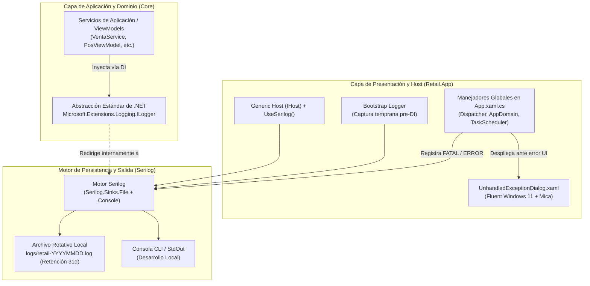

# Sistema de Logging y Manejo Global de Excepciones (Retail POS)

### Proyecto: Retail (Sistema ERP & Punto de Venta para Librería)
**Plataforma:** .NET 8 LTS | C# 12 | WPF (Windows) | Serilog 4.2.0 | `Microsoft.Extensions.Logging`  
**Propósito:** Guía técnica normativa y protocolo de contextualización rápida para **agentes de código (IA)** y desarrolladores. Define cómo se registran eventos, cómo se diagnostican fallos y cómo se capturan excepciones sin interrumpir la operación de mostrador.

---

## 🏛️ Topología y Separación de Responsabilidades

El sistema aplica estrictamente el principio de inversión de dependencias (**DIP**) de Clean Architecture para el subsistema de logging:



> [!IMPORTANT]
> **Regla de Oro para Agentes de Código:**  
> En las capas de negocio (`Retail.Application`, `Retail.Domain`, `Retail.Infrastructure` y `ViewModels` de `Retail.App`), **está estrictamente prohibido utilizar la clase estática `Serilog.Log`**. Se debe inyectar siempre `ILogger<T>` mediante inyección de dependencias. `Serilog` actúa exclusivamente como el motor configurado en el punto de entrada (`App.xaml.cs`).

---

## ⚖️ Las 5 Leyes Inviolables de Logging para Agentes

### 1. Prohibición de Interpolación de Cadenas en Logs (Anti-Pattern)
* **Queda terminantemente prohibido** interpolar cadenas con `$"..."` dentro de las llamadas a `LogInformation`, `LogWarning`, etc.
* **Causa:** Rompe el *Structured Logging*, impide filtrar por propiedades semánticas y degrada el rendimiento al forzar alocaciones de memoria innecesarias en el recolector de basura (`RNF-03`).
* **Regla:** Utilizar *Message Templates* con parámetros semánticos:
  ```csharp
  // ❌ INCORRECTO (Interpolación directa)
  _logger.LogInformation($"Venta {ventaId} cobrada con total {total} por operador {usuarioId}");

  // ✅ CORRECTO (Plantilla estructurada fuertemente tipada)
  _logger.LogInformation("Venta {VentaId} cobrada con total {Total} por operador {UsuarioId}", ventaId, total, usuarioId);
  ```

### 2. Parámetro `Exception` como Primer Argumento Obligatorio
* Al capturar o registrar una excepción, el objeto `Exception` debe pasarse **siempre como el primer argumento** del método de logging, nunca concatenado en el texto del mensaje:
  ```csharp
  // ❌ INCORRECTO (Pierde el objeto de excepción y el stack trace completo)
  _logger.LogError("Falla al conectar con ARCA: " + ex.Message);

  // ✅ CORRECTO (Preserva el stack trace original y enriquece con contexto)
  _logger.LogError(ex, "Falla al conectar con microservicio fiscal ARCA para la venta {VentaId}", ventaId);
  ```

### 3. Privacidad y Seguridad de Datos de Pago (PCI DSS)
* **Queda estrictamente prohibido** asentar en los logs datos confidenciales de usuarios o transacciones:
  * Contraseñas en texto plano o hashes temporales.
  * Número completo de tarjetas de crédito/débito (PAN). Solo se admite enmascaramiento: `****-****-****-1234`.
  * Códigos de seguridad de tarjetas (CVV/CVC).

### 4. Resiliencia de Mostrador: No Cuelgues la Aplicación (`e.Handled = true`)
* Las excepciones producidas en el hilo de interfaz (`DispatcherUnhandledException`) son interceptadas globalmente en [`App.xaml.cs`](file:///c:/Users/lucas/Proyectos/retail/src/Retail.App/App.xaml.cs).
* El manejador asienta el error con severidad `FATAL`, despliega el diálogo modal amigable [`UnhandledExceptionDialog`](file:///c:/Users/lucas/Proyectos/retail/src/Retail.App/Views/Dialogs/UnhandledExceptionDialog.xaml) y fija `e.Handled = true`. Esto evita que la aplicación de mostrador se cierre abruptamente, preservando la sesión del cajero y los datos cargados.

### 5. Configuración de Formato Invariante (`CA1305`)
* Todos los sumideros de Serilog y llamadas de formateo de diagnósticos deben consumir explícitamente `CultureInfo.InvariantCulture` para cumplir con `<TreatWarningsAsErrors>true</TreatWarningsAsErrors>` y prevenir fallas de parseo en equipos con distintas configuraciones regionales.

---

## 📊 Matriz de Niveles de Severidad

| Nivel `LogLevel` | Uso Semántico en Retail | Destino Típico | Ejemplo de Suceso |
| :--- | :--- | :--- | :--- |
| **`Debug` / `Trace`** | Diagnóstico detallado durante desarrollo. Lectura de payloads, tiempos de ciclo `< 15 ms`. | Consola / Archivo temporal | `"Mapeando fila 142 de catálogo con código {CodigoDistribuidor}"` |
| **`Information`** | Hitos exitosos del negocio y ciclo de vida de la aplicación. | Consola y Archivo `.log` | `"Apertura de turno de caja exitosa. TurnoId={TurnoId}, SaldoInicial={SaldoInicial}"` |
| **`Warning`** | Anomalías recuperables que no impiden operar pero ameritan atención. | Consola y Archivo `.log` | `"Stock por debajo del mínimo en artículo {CodigoBarras}. StockActual={Stock}"` |
| **`Error`** | Fallo en una operación o caso de uso que no detiene el sistema. | Consola y Archivo `.log` | `"Error de contingencia fiscal al despachar comprobante {VentaId}. Motivo: {Motivo}"` |
| **`Critical` / `Fatal`** | Fallo no controlado a nivel de proceso o Dispatcher que pone en riesgo el flujo. | Archivo `.log` y Diálogo UI | `"Excepción no controlada capturada en el Dispatcher de UI"` |

---

## 📁 Especificación del Archivo de Log

* **Ubicación Física:** `<DirectorioDeEjecución>/logs/`
* **Patrón de Nombre:** `retail-YYYYMMDD.log` (ejemplo: `logs/retail-20260909.log`)
* **Rotación:** Diaria automática (`RollingInterval.Day`).
* **Retención:** 31 archivos históricos (`retainedFileCountLimit: 31`).
* **Plantilla de Salida (Output Template):**
  ```text
  {Timestamp:yyyy-MM-dd HH:mm:ss.fff zzz} [{Level:u3}] {Message:lj}{NewLine}{Exception}
  ```
* **Ejemplo de Entrada Real en el Archivo:**
  ```text
  2026-09-09 14:05:30.124 -03:00 [INF] Iniciando Retail POS (.NET 8 LTS | Clean Monolith)
  2026-09-09 14:05:35.842 -03:00 [INF] Base de datos migrada y semillero inicial verificado exitosamente.
  2026-09-09 14:05:40.510 -03:00 [FTL] Excepción no controlada capturada en el Dispatcher de UI
  System.InvalidOperationException: Excepción deliberada en el Dispatcher de UI (Prueba de Resiliencia - Etapa 0.8).
     at Retail.App.Views.Dev.StyleGalleryView.BtnTestDispatcherException_Click(Object sender, RoutedEventArgs e)
  ```

---

## 🖥️ Diálogo Modal de Incidencia (`UnhandledExceptionDialog`)

Cuando ocurre una excepción no controlada en mostrador:
1. **Contenedor Visual:** `ui:FluentWindow` con efecto Mica y tokens semánticos definidos en [`src/Retail.App/Styles/Colors.xaml`](file:///c:/Users/lucas/Proyectos/retail/src/Retail.App/Styles/Colors.xaml) (`DangerBackgroundBrush`, `DangerForegroundBrush`, `DangerBorderBrush`).
2. **Mensaje Amigable:** Diseñado para operadores de caja, explicando que la aplicación permanecerá abierta para continuar trabajando.
3. **Ruta al Log en Cascadia Code:** Informa con precisión la ruta al archivo `logs/retail-YYYYMMDD.log` para facilitar la asistencia remota del soporte técnico.
4. **Copiado al Portapapeles:** Botón `[Copiar Detalle Técnico]` que genera un reporte estructurado con fecha, tipo de excepción, mensaje y stack trace para ser enviado por mensaje o ticket de soporte.
5. **Salvaguarda de Pantalla:** Cumple la directiva de pantalla segura de [`docs/SISTEMA_DE_DISENO.md`](file:///c:/Users/lucas/Proyectos/retail/docs/SISTEMA_DE_DISENO.md) ajustando `MaxHeight` y `MaxWidth` a `SystemParameters.WorkArea`.

---

## 🧩 Snippets Canónicos para Agentes

### 1. Inyección y Uso en un Servicio de Aplicación (`Retail.Application`)
```csharp
using Microsoft.Extensions.Logging;

namespace Retail.Application.Services;

public class VentaService(
    IVentaRepository ventaRepository,
    ILogger<VentaService> logger) : IVentaService
{
    public async Task<int> RegistrarVentaAsync(CrearVentaDto dto, CancellationToken ct = default)
    {
        logger.LogInformation("Iniciando registro de venta para cliente {ClienteId} con {CantidadItems} ítems", 
            dto.ClienteId, dto.Items.Count);

        try
        {
            // Lógica transaccional...
            logger.LogInformation("Venta {VentaId} registrada exitosamente", ventaId);
            return ventaId;
        }
        catch (Exception ex)
        {
            logger.LogError(ex, "Fallo al persistir la venta del cliente {ClienteId}", dto.ClienteId);
            throw;
        }
    }
}
```

### 2. Inyección y Uso en un ViewModel (`Retail.App`)
```csharp
using CommunityToolkit.Mvvm.ComponentModel;
using CommunityToolkit.Mvvm.Input;
using Microsoft.Extensions.Logging;

namespace Retail.App.ViewModels;

public partial class PosViewModel : ObservableObject
{
    private readonly IVentaService _ventaService;
    private readonly ILogger<PosViewModel> _logger;

    public PosViewModel(IVentaService ventaService, ILogger<PosViewModel> logger)
    {
        _ventaService = ventaService;
        _logger = logger;
    }

    [RelayCommand]
    private async Task CobrarAsync()
    {
        _logger.LogInformation("Operador inició comando de cobro");
        // Operación de mostrador...
    }
}
```

---

## 🧭 Catálogo de Archivos Clave del Subsistema

| Archivo | Ubicación | Rol Técnico |
| :--- | :--- | :--- |
| [`App.xaml.cs`](file:///c:/Users/lucas/Proyectos/retail/src/Retail.App/App.xaml.cs) | `src/Retail.App/` | Inicialización de Serilog bootstrap, conexión de `.UseSerilog()` y manejadores globales (`Dispatcher`, `AppDomain`, `TaskScheduler`). |
| [`UnhandledExceptionDialog.xaml`](file:///c:/Users/lucas/Proyectos/retail/src/Retail.App/Views/Dialogs/UnhandledExceptionDialog.xaml) | `src/Retail.App/Views/Dialogs/` | Vista modal Fluent Windows 11 para aviso de incidencias y reporte de diagnóstico. |
| [`UnhandledExceptionDialog.xaml.cs`](file:///c:/Users/lucas/Proyectos/retail/src/Retail.App/Views/Dialogs/UnhandledExceptionDialog.xaml.cs) | `src/Retail.App/Views/Dialogs/` | Lógica de presentación, copiado al portapapeles y propiedades tipadas de inspección. |
| [`StyleGalleryView.xaml`](file:///c:/Users/lucas/Proyectos/retail/src/Retail.App/Views/Dev/StyleGalleryView.xaml) | `src/Retail.App/Views/Dev/` | Sección 8 de prueba en vivo para verificar que excepciones deliberadas no cuelgan la app. |
| [`GlobalExceptionHandlingTests.cs`](file:///c:/Users/lucas/Proyectos/retail/tests/Retail.App.UnitTests/GlobalExceptionHandlingTests.cs) | `tests/Retail.App.UnitTests/` | Pruebas unitarias xUnit de generación de archivo rotativo Serilog, hilo STA y reporte de diagnóstico. |
