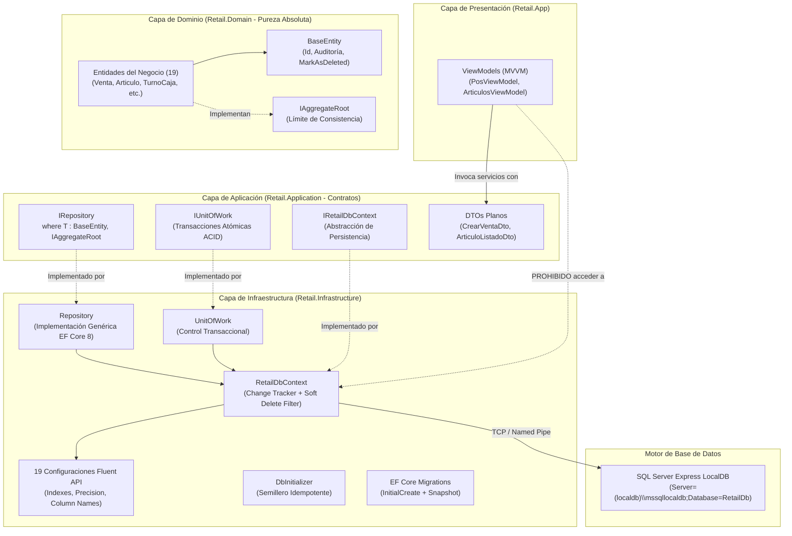

# Sistema de Persistencia e Infraestructura de Base de Datos (Retail POS)

### Proyecto: Retail (Sistema ERP & Punto de Venta para Librería)
**Plataforma:** .NET 8 LTS | C# 12 | Entity Framework Core 8.0.11 | SQL Server Express / LocalDB  
**Propósito:** Guía técnica normativa y protocolo de contextualización rápida para **agentes de código (IA)** y desarrolladores. Define cómo se modelan las entidades bajo DDD, cómo se configuran las migraciones relacionales, cómo se ejecutan transacciones atómicas seguras y cómo se optimizan las consultas para no degradar la operación de mostrador.

---

## 🏛️ Topología y Separación de Responsabilidades

El sistema implementa una arquitectura desacoplada de persistencia basada en **Clean Architecture**, **Domain-Driven Design (DDD)** y **segregación pragmática de lecturas/escrituras (CQRS-lite)**:



> [!IMPORTANT]
> **Regla de Oro para Agentes de Código:**  
> 1. `Retail.App` (UI) **jamás inyecta ni interactúa directamente con `RetailDbContext`**. Toda operación pasa por servicios de `Retail.Application`.
> 2. `Retail.Domain` no contiene ninguna referencia a Entity Framework Core, SQL Server ni paquetes NuGet externos.

---

## ⚖️ Las 6 Leyes Inviolables de Persistencia para Agentes

### 1. Persistencia Restringida a Raíces de Agregado (`IAggregateRoot`)
* **Queda estrictamente prohibido** crear interfaces o clases de repositorio para entidades internas o secundarias (ejemplo: `IDetalleVentaRepository`, `PagoVentaRepository`, `MovimientoCajaRepository`).
* **Regla:** Solo las entidades marcadas formalmente con [`IAggregateRoot`](file:///c:/Users/lucas/Proyectos/retail/src/Retail.Domain/Common/IAggregateRoot.cs) tienen repositorio:
  ```csharp
  public interface IRepository<T> where T : BaseEntity, IAggregateRoot
  ```
* Las entidades hijas se manipulan **exclusivamente a través de los métodos de negocio de su raíz** (`Venta.AgregarItem(...)`, `TurnoCaja.RegistrarMovimiento(...)`) y se persisten automáticamente en cascada dentro del mismo grafo.

### 2. Borrado Lógico Obligatorio (*Soft Delete*) e Invariante Fiscal
* En sistemas de facturación fiscal y trazabilidad comercial, el borrado físico (`DELETE FROM ...`) está terminantemente prohibido.
* **Mecanismo del Dominio:** Para dar de baja un registro, se invoca `entity.MarkAsDeleted()`.
* **Intercepción en Persistencia:** [`RetailDbContext`](file:///c:/Users/lucas/Proyectos/retail/src/Retail.Infrastructure/Persistence/Context/RetailDbContext.cs) sobreescribe `SaveChangesAsync` para interceptar cualquier llamada accidental a `DbSet.Remove()` y transformarla en una llamada a `MarkAsDeleted()`.
* **Filtros Globales:** Todas las entidades heredan de [`BaseEntity`](file:///c:/Users/lucas/Proyectos/retail/src/Retail.Domain/Common/BaseEntity.cs) y tienen activo el filtro global `HasQueryFilter(e => !e.IsDeleted)`. Jamás agregues filtros manuales `where !e.IsDeleted` en las consultas de aplicación; EF Core lo resuelve de forma nativa e invisible.

### 3. Segregación de Lectura y Proyecciones sin Tracking (`.AsNoTracking()`)
* **Para Grillas, Combos y Reportes (Read Side):**
  * Deshabilitar siempre el Change Tracker utilizando `.AsNoTracking()`.
  * Proyectar directamente a DTOs planos (`.Select(x => new ArticuloListadoDto { ... })`).
  * **Causa:** Evita instanciar grafos pesados de dominio en memoria, garantizando el cumplimiento del requisito no funcional de memoria RAM $\le 300\text{ MB}$ (`RNF-03`).
* **Para Comandos y Mutaciones (Write Side):**
  * Cargar la raíz del agregado mediante `IRepository<T>.GetByIdAsync(id)` manteniendo el Change Tracker activo para registrar las mutaciones del grafo.

### 4. Evaluación en el Motor Relacional (*Push-Down to SQL*)
* **Queda terminantemente prohibido** materializar tablas en memoria con `.ToList()` prematuro para luego filtrar, ordenar o calcular con LINQ to Objects en C#.
* **Regla:** Las operaciones deben componerse sobre `IQueryable` para que SQL Server / LocalDB resuelva la consulta en servidor:
  * Utilizar `EF.Functions.Like` para búsquedas parciales (`%termino%`).
  * Utilizar `Skip()` y `Take()` para paginación nativa (`OFFSET ... ROWS FETCH NEXT ... ROWS ONLY`).
  * Delegar agregaciones numéricas al motor relacional (`CountAsync()`, `SumAsync()`).

### 5. Tipado Estricto de Moneda y Precisión Decimal Fiscal
* Todo importe monetario (`precio_venta`, `costo_reposicion`, `subtotal`, `total`, `monto`) debe representarse en C# obligatoriamente como tipo de datos `decimal` (nunca `float` ni `double` debido a errores de redondeo en aritmética de punto flotante IEEE).
* En las configuraciones de Fluent API, toda columna monetaria debe declarar explícitamente su precisión y escala:
  ```csharp
  builder.Property(a => a.PrecioVenta)
      .HasPrecision(18, 2)
      .HasColumnName("precio_venta");
  ```

### 6. Cero Lógica de Negocio en la Base de Datos
* La base de datos es un almacén relacional transaccional, no un motor de reglas de negocio.
* **Queda estrictamente prohibido** escribir *Stored Procedures*, *Triggers* o funciones escalares en SQL que calculen márgenes de ganancia (markup), validen límites de crédito o descuenten stock.
* Esas invariantes pertenecen con exclusividad a las entidades y servicios de dominio en [`Retail.Domain`](file:///c:/Users/lucas/Proyectos/retail/src/Retail.Domain) y son testeadas en la suite [`Retail.Domain.UnitTests`](file:///c:/Users/lucas/Proyectos/retail/tests/Retail.Domain.UnitTests).

---

## 💻 Entorno LocalDB, Conexión y Semillero

### Cadena de Conexión por Defecto
Ubicada en [`src/Retail.App/appsettings.json`](file:///c:/Users/lucas/Proyectos/retail/src/Retail.App/appsettings.json):
```json
{
  "ConnectionStrings": {
    "DefaultConnection": "Server=(localdb)\\mssqllocaldb;Database=RetailDb;Trusted_Connection=True;MultipleActiveResultSets=true"
  }
}
```

* **Instancia LocalDB:** `(localdb)\mssqllocaldb` (SQL Server Express LocalDB 2022 preinstalado en Windows).
* **Arranque Bajo Demanda:** Windows inicia el proceso `sqlservr.exe` automáticamente ante la primera consulta de conexión y lo suspende al liberar la memoria.
* **Archivos Físicos:** Se ubican en `C:\Users\<Usuario>\RetailDb.mdf` y `C:\Users\<Usuario>\RetailDb_log.ldf`.

### Ciclo de Arranque y Auto-Migración
Al iniciar la aplicación ([`App.xaml.cs`](file:///c:/Users/lucas/Proyectos/retail/src/Retail.App/App.xaml.cs)):
1. `await dbContext.Database.MigrateAsync();`: Consulta la tabla `__EFMigrationsHistory`. Si faltan migraciones, aplica su método `Up()` de forma incremental. **No borra ni sobreescribe datos preexistentes**.
2. `await DbInitializer.InitializeAsync(dbContext);`: Siembra roles base (`Gerente`, `Encargado`, `Cajero`), usuario `admin` (clave `Admin123!`), categorías, marcas y 20 artículos. Diseñado bajo el principio de **Idempotencia** (si la tabla ya tiene datos, se saltea).

### Comando Canónico para Generar Futuras Migraciones
Cuando se añadan columnas o relaciones en etapas posteriores, ejecutar siempre desde la raíz de la solución especificando proyectos exactos para evitar colisiones con compilaciones intermedias de WPF:
```powershell
dotnet ef migrations add <NombreDeLaMigracion> --project src/Retail.Infrastructure/Retail.Infrastructure.csproj --startup-project src/Retail.App/Retail.App.csproj
```

---

## 🧩 Snippets Canónicos para Agentes

### 1. Consulta Optimizada de Lectura (Read Side / Push-Down to SQL)
```csharp
using Microsoft.EntityFrameworkCore;
using Retail.Application.DTOs.Articulos;
using Retail.Infrastructure.Persistence.Context;

namespace Retail.Application.Services;

public class CatalogoQueryService(RetailDbContext context)
{
    public async Task<IReadOnlyList<ArticuloListadoDto>> BuscarArticulosAsync(
        string? termino, 
        int pagina, 
        int tamanoPagina, 
        CancellationToken ct = default)
    {
        var query = context.Articulos.AsNoTracking(); // 1. Sin tracking de cambios en RAM

        if (!string.IsNullOrWhiteSpace(termino))
        {
            // 2. Push-down to SQL con Like traducible
            query = query.Where(a => EF.Functions.Like(a.Descripcion, $"%{termino}%") 
                                  || a.CodigoBarras == termino);
        }

        // 3. Proyección directa a DTO (solo viajan las columnas requeridas)
        return await query
            .OrderBy(a => a.Descripcion)
            .Skip((pagina - 1) * tamanoPagina)
            .Take(tamanoPagina)
            .Select(a => new ArticuloListadoDto
            {
                Id = a.Id,
                CodigoBarras = a.CodigoBarras,
                Descripcion = a.Descripcion,
                PrecioVenta = a.PrecioVenta,
                StockActual = a.StockActual
            })
            .ToListAsync(ct);
    }
}
```

### 2. Mutación Transaccional con Agregado y Unit of Work (Write Side)
```csharp
using Retail.Application.Common.Interfaces;
using Retail.Application.DTOs.Ventas;
using Retail.Application.Interfaces.Persistence;
using Retail.Domain.Entities;

namespace Retail.Application.Services;

public class VentaService(
    IRepository<Venta> ventaRepository,
    IRepository<Articulo> articuloRepository,
    IUnitOfWork unitOfWork) : IVentaService
{
    public async Task<int> RegistrarVentaAsync(CrearVentaDto dto, CancellationToken ct = default)
    {
        // 1. Instanciar la Raíz del Agregado
        var venta = new Venta(dto.IdUsuario, dto.IdTurno, dto.IdCliente);

        foreach (var item in dto.Items)
        {
            // 2. Cargar raíz de artículo con Change Tracker activo para mutación
            var articulo = await articuloRepository.GetByIdAsync(item.IdArticulo, ct)
                ?? throw new KeyNotFoundException($"Artículo {item.IdArticulo} no encontrado.");

            // 3. Regla de dominio: descontar stock
            articulo.DescontarStock(item.Cantidad);

            // 4. Regla de agregado: el agregado calcula sus subtotales internamente
            venta.AgregarItem(articulo.Id, item.Cantidad, articulo.PrecioVenta);
        }

        // 5. Agregar la raíz al repositorio
        await ventaRepository.AddAsync(venta, ct);

        // 6. Transacción atómica ACID (persiste la venta, sus items y el stock modificado)
        await unitOfWork.SaveChangesAsync(ct);

        return venta.Id;
    }
}
```

---

## 🧭 Catálogo de Archivos Clave de Persistencia

| Archivo | Capa | Rol Arquitectónico |
| :--- | :--- | :--- |
| [`BaseEntity.cs`](file:///c:/Users/lucas/Proyectos/retail/src/Retail.Domain/Common/BaseEntity.cs) | `Retail.Domain` | Entidad base con `Id`, timestamps de auditoría y método `MarkAsDeleted()`. |
| [`IAggregateRoot.cs`](file:///c:/Users/lucas/Proyectos/retail/src/Retail.Domain/Common/IAggregateRoot.cs) | `Retail.Domain` | Interfaz marcadora para delimitar consistencia transaccional DDD. |
| [`IRepository.cs`](file:///c:/Users/lucas/Proyectos/retail/src/Retail.Application/Interfaces/Persistence/IRepository.cs) | `Retail.Application` | Contrato genérico de persistencia restringido a `where T : BaseEntity, IAggregateRoot`. |
| [`IUnitOfWork.cs`](file:///c:/Users/lucas/Proyectos/retail/src/Retail.Application/Common/Interfaces/IUnitOfWork.cs) | `Retail.Application` | Abstracción para control transaccional atómico y confirmación de cambios. |
| [`RetailDbContext.cs`](file:///c:/Users/lucas/Proyectos/retail/src/Retail.Infrastructure/Persistence/Context/RetailDbContext.cs) | `Retail.Infrastructure` | Contexto de EF Core 8 con filtros globales de Soft Delete e intercepción de borrado. |
| [`Repository.cs`](file:///c:/Users/lucas/Proyectos/retail/src/Retail.Infrastructure/Persistence/Repositories/Repository.cs) | `Retail.Infrastructure` | Implementación genérica de acceso a datos para Raíces de Agregado. |
| [`UnitOfWork.cs`](file:///c:/Users/lucas/Proyectos/retail/src/Retail.Infrastructure/Persistence/Repositories/UnitOfWork.cs) | `Retail.Infrastructure` | Coordinador transaccional sobre `RetailDbContext`. |
| [`ArticuloConfiguration.cs`](file:///c:/Users/lucas/Proyectos/retail/src/Retail.Infrastructure/Persistence/Configurations/ArticuloConfiguration.cs) | `Retail.Infrastructure` | Configuración Fluent API de artículo con índice único filtrado (`[codigo_barras] IS NOT NULL AND [deleted_at] IS NULL`). |
| [`DbInitializer.cs`](file:///c:/Users/lucas/Proyectos/retail/src/Retail.Infrastructure/Persistence/Initialization/DbInitializer.cs) | `Retail.Infrastructure` | Semillero idempotente de roles, usuario `admin`, categorías, marcas y 20 artículos. |
| [`RetailDbContextModelSnapshot.cs`](file:///c:/Users/lucas/Proyectos/retail/src/Retail.Infrastructure/Persistence/Migrations/RetailDbContextModelSnapshot.cs) | `Retail.Infrastructure` | Foto satelital de las 19 entidades generada por la herramienta CLI de EF Core. |
