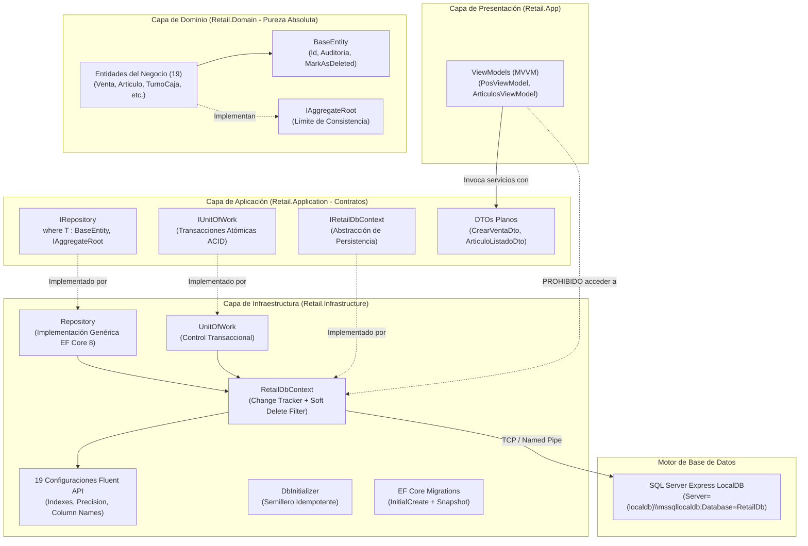

# Sistema de Persistencia e Infraestructura de Base de Datos (Retail POS)

### Proyecto: Retail (Sistema ERP & Punto de Venta para Librería)
**Plataforma:** .NET 8 LTS | C# 12 | Entity Framework Core 8.0.11 | SQL Server Express / LocalDB  
**Propósito:** Guía técnica normativa y protocolo de contextualización rápida para **agentes de código (IA)** y desarrolladores. Define cómo se modelan las entidades bajo DDD, cómo se configuran las migraciones relacionales, cómo se ejecutan transacciones atómicas seguras y cómo se optimizan las consultas para no degradar la operación de mostrador.

---

## 🏛️ Topología y Separación de Responsabilidades

El sistema implementa una arquitectura desacoplada de persistencia basada en **Clean Architecture**, **Domain-Driven Design (DDD)** y **segregación pragmática de lecturas/escrituras (CQRS-lite)**:


```mermaid
graph TD
    subgraph "Capa de Presentación (Retail.App)"
        VM["ViewModels (MVVM)\n(PosViewModel, ArticulosViewModel)"]
    end

    subgraph "Capa de Aplicación (Retail.Application - Contratos)"
        IREPO["IRepository<T>\nwhere T : BaseEntity, IAggregateRoot"]
        IUOW["IUnitOfWork\n(Transacciones Atómicas ACID)"]
        IDBCONTEXT["IRetailDbContext\n(Abstracción de Persistencia)"]
        DTOS["DTOs Planos\n(CrearVentaDto, ArticuloListadoDto)"]
        
        VM -->|"Invoca servicios con"| DTOS
    end

    subgraph "Capa de Dominio (Retail.Domain - Pureza Absoluta)"
        BASE_ENT["BaseEntity\n(Id, Auditoría, MarkAsDeleted)"]
        AGG_ROOT["IAggregateRoot\n(Límite de Consistencia)"]
        ENTITIES["Entidades del Negocio (19)\n(Venta, Articulo, TurnoCaja, etc.)"]
        
        ENTITIES --> BASE_ENT
        ENTITIES -.->|"Implementan"| AGG_ROOT
    end

    subgraph "Capa de Infraestructura (Retail.Infrastructure)"
        DBCONTEXT["RetailDbContext\n(Change Tracker + Soft Delete Filter)"]
        REPO_IMPL["Repository<T>\n(Implementación Genérica EF Core 8)"]
        UOW_IMPL["UnitOfWork\n(Control Transaccional)"]
        FLUENT["19 Configuraciones Fluent API\n(Indexes, Precision, Column Names)"]
        SEED["DbInitializer\n(Semillero Idempotente)"]
        MIGRATIONS["EF Core Migrations\n(InitialCreate + Snapshot)"]
        
        REPO_IMPL --> DBCONTEXT
        UOW_IMPL --> DBCONTEXT
        DBCONTEXT --> FLUENT
    end

    subgraph "Motor de Base de Datos"
        LOCALDB["SQL Server Express LocalDB\n(Server=(localdb)\\mssqllocaldb;Database=RetailDb)"]
        DBCONTEXT -->|"TCP / Named Pipe"| LOCALDB
    end

    IREPO -.->|"Implementado por"| REPO_IMPL
    IUOW -.->|"Implementado por"| UOW_IMPL
    IDBCONTEXT -.->|"Implementado por"| DBCONTEXT
    VM -.->|"PROHIBIDO acceder a"| DBCONTEXT
```

> [!IMPORTANT]
> **Regla de Oro para Agentes de Código:**  
> 1. `Retail.App` (UI) **jamás inyecta ni interactúa directamente con `RetailDbContext`**. Toda operación pasa por servicios de `Retail.Application`.
> 2. `Retail.Domain` no contiene ninguna referencia a Entity Framework Core, SQL Server ni paquetes NuGet externos.

---

## ⚖️ Las 9 Leyes Inviolables de Persistencia para Agentes

### 1. Persistencia Restringida a Raíces de Agregado (`IAggregateRoot`)
* **Queda estrictamente prohibido** crear interfaces o clases de repositorio para entidades internas o secundarias (ejemplo: `IDetalleVentaRepository`, `PagoVentaRepository`, `MovimientoCajaRepository`).
* **Regla:** Solo las entidades marcadas formalmente con [`IAggregateRoot`](file:///c:/Users/lucas/Proyectos/retail/src/Retail.Domain/Common/IAggregateRoot.cs) tienen repositorio:
  ```csharp
  public interface IRepository<T> where T : BaseEntity, IAggregateRoot
  ```
* Las entidades hijas se manipulan **exclusivamente a través de los métodos de negocio de su raíz** (`Venta.AgregarItem(...)`, `TurnoCaja.RegistrarMovimiento(...)`) y se persisten automáticamente en cascada dentro del mismo grafo.

### 2. Borrado Lógico Obligatorio (*Soft Delete*) e Invariante Fiscal
* En sistemas de facturación fiscal y trazabilidad comercial, el borrado físico (`DELETE FROM ...`) está terminantemente prohibido.
* **Mecanismo del Dominio:** Para dar de baja un registro, se invoca `entity.MarkAsDeleted()`.
* **Intercepción en Persistencia:** [`RetailDbContext`](file:///c:/Users/lucas/Proyectos/retail/src/Retail.Infrastructure/Persistence/Context/RetailDbContext.cs) sobreescribe `SaveChangesAsync` para interceptar cualquier llamada accidental a `DbSet.Remove()` y transformarla en una llamada a `MarkAsDeleted()`.
* **Filtros Globales:** Todas las entidades heredan de [`BaseEntity`](file:///c:/Users/lucas/Proyectos/retail/src/Retail.Domain/Common/BaseEntity.cs) y tienen activo el filtro global `HasQueryFilter(e => !e.IsDeleted)`. Jamás agregues filtros manuales `where !e.IsDeleted` en las consultas de aplicación; EF Core lo resuelve de forma nativa e invisible.

### 3. Segregación de Lectura y Proyecciones sin Tracking (`.AsNoTracking()`)
* **Para Grillas, Combos y Reportes (Read Side):**
  * Deshabilitar siempre el Change Tracker utilizando `.AsNoTracking()`.
  * Proyectar directamente a DTOs planos (`.Select(x => new ArticuloListadoDto { ... })`).
  * **Causa:** Evita instanciar grafos pesados de dominio en memoria, garantizando el cumplimiento del requisito no funcional de memoria RAM $\le 300\text{ MB}$ (`RNF-03`).
* **Para Comandos y Mutaciones (Write Side):**
  * Cargar la raíz del agregado mediante `IRepository<T>.GetByIdAsync(id)` manteniendo el Change Tracker activo para registrar las mutaciones del grafo.

### 4. Evaluación en el Motor Relacional (*Push-Down to SQL*)
* **Queda terminantemente prohibido** materializar tablas en memoria con `.ToList()` prematuro para luego filtrar, ordenar o calcular con LINQ to Objects en C#.
* **Regla:** Las operaciones deben componerse sobre `IQueryable` para que SQL Server / LocalDB resuelva la consulta en servidor:
  * Utilizar `EF.Functions.Like` para búsquedas parciales (`%termino%`).
  * Utilizar `Skip()` y `Take()` para paginación nativa (`OFFSET ... ROWS FETCH NEXT ... ROWS ONLY`).
  * Delegar agregaciones numéricas al motor relacional (`CountAsync()`, `SumAsync()`).
* **Listas en memoria dentro de un filtro (`lista.Contains(columna)`):** EF Core 8 las envía como **un único parámetro JSON** que SQL Server desarma con `OPENJSON`, por lo que el límite de 2.100 parámetros por consulta no aplica. Está verificado contra LocalDB con 3.000 códigos en [`CatalogoProveedorQueryServiceTests.cs`](file:///c:/Users/lucas/Proyectos/retail/tests/Retail.Infrastructure.IntegrationTests/Services/CatalogoProveedorQueryServiceTests.cs), que además protege ante un cambio de versión de EF Core que modifique esa traducción.
  * **Supuesto de despliegue:** `OPENJSON` requiere que la base tenga **nivel de compatibilidad ≥ 130** (SQL Server 2016+). Una base restaurada desde una versión anterior con un nivel inferior hace fallar estas consultas, y el test contra LocalDB no lo detecta. Verificar con `SELECT compatibility_level FROM sys.databases WHERE name = DB_NAME();`.

### 5. Tipado Estricto de Moneda y Precisión Decimal Fiscal
* Todo importe monetario (`precio_venta`, `costo_reposicion`, `subtotal`, `total`, `monto`) debe representarse en C# obligatoriamente como tipo de datos `decimal` (nunca `float` ni `double` debido a errores de redondeo en aritmética de punto flotante IEEE).
* En las configuraciones de Fluent API, toda columna monetaria debe declarar explícitamente su precisión y escala:
  ```csharp
  builder.Property(a => a.PrecioVenta)
      .HasPrecision(18, 2)
      .HasColumnName("precio_venta");
  ```

### 6. Cero Lógica de Negocio en la Base de Datos
* La base de datos es un almacén relacional transaccional, no un motor de reglas de negocio.
* **Queda estrictamente prohibido** escribir *Stored Procedures*, *Triggers* o funciones escalares en SQL que calculen márgenes de ganancia (markup), validen límites de crédito o descuenten stock.
* Esas invariantes pertenecen con exclusividad a las entidades y servicios de dominio en [`Retail.Domain`](file:///c:/Users/lucas/Proyectos/retail/src/Retail.Domain) y son testeadas en la suite [`Retail.Domain.UnitTests`](file:///c:/Users/lucas/Proyectos/retail/tests/Retail.Domain.UnitTests).

### 7. Defensa en Profundidad Declarativa (CHECK Constraints)
* Para prevenir corrupción física de datos ante accesos fuera de la aplicación (scripts de soporte, mantenimientos o herramientas ETL), el motor relacional implementa restricciones declarativas `CHECK` que custodian los límites físicos del estado:
  * Precios, subtotales, totales y costos no negativos ($\ge 0$).
  * Cantidades y montos de imputación transaccional estrictamente positivos ($> 0$).
  * Existencias físicas no negativas (`[stock_actual] >= 0 OR [es_servicio] = 1`).
  * Límites y deudas de cuenta corriente no negativas ($\ge 0$).
* **Cuidado con `NULL` (lógica de tres valores):** un `CHECK` solo rechaza la fila cuando la condición da `FALSE`; si da `UNKNOWN`, la acepta. Una comparación contra una columna nula (`[unidades_por_origen] >= 1` con `NULL`) da `UNKNOWN`, así que **toda columna nullable que deba tener valor necesita un `IS NOT NULL` explícito**. Lo detectó el test `Presentacion_OrigenSinUnidades_LaRechazaElCheck` en la Fase 3: la fórmula sin `IS NOT NULL` aceptaba un derivado sin unidades.
* **Alcance de un `CHECK`:** solo ve la fila que se guarda. Las reglas entre filas se cubren con índices únicos filtrados (unicidad) o quedan en Dominio/Aplicación (por ejemplo, "un derivado no puede ser origen de otro"), porque expresarlas en la base requeriría funciones escalares, prohibidas por la Ley 6.

### 8. Un `DbContext` por Pantalla y Accesos Serializados (H-19)
* El `RetailDbContext` es una *Unit of Work* **no segura para hilos**: EF Core no admite dos operaciones simultáneas sobre la misma instancia. Verificado contra LocalDB: la segunda consulta lanza `InvalidOperationException` aunque la primera ya esté cancelada, y una consulta cancelada termina en `SqlException` ("Operation cancelled by user"), no en `OperationCanceledException`.
* **Ciclo de vida:** el contexto y los servicios de Application son `Scoped`. [`NavigationService`](file:///c:/Users/lucas/Proyectos/retail/src/Retail.App/Services/NavigationService.cs) crea **un scope de DI por pantalla** y descarta el de la anterior; los `*DialogService` son `Scoped`, así que un modal comparte el contexto de la pantalla que lo abre; el login tiene su propio scope. Es el equivalente de escritorio de "un contexto por request" en la web.
* **Red de seguridad:** el Host activa `ValidateScopes` y `ValidateOnBuild`. **Queda prohibido** resolver servicios `Scoped` desde el proveedor raíz (por ejemplo, con `App.Services`): la app falla al arrancar y `InyeccionDependenciasTests` lo detecta.
* **Dentro de una pantalla**, todo acceso a datos que pueda solaparse (búsquedas por tecla, filtros, paginación, cargas iniciales) pasa por [`CargaSerializada`](file:///c:/Users/lucas/Proyectos/retail/src/Retail.App/Helpers/CargaSerializada.cs): espera a que el acceso anterior libere el contexto, descarta respuestas obsoletas y cancela lo pendiente al salir de la pantalla (el ViewModel implementa `IDisposable` y el scope lo invoca).

### 9. Concurrencia Optimista y Contexto Limpio Tras un Fallo (D-12, Módulo 4.1)
* **`rowversion` en `ARTICULOS`:** la columna `row_version` se mapea como *shadow property* (`builder.Property<byte[]>("RowVersion").IsRowVersion()`), sin propiedad en la entidad: es un mecanismo de la base, no un concepto del Dominio. EF Core la agrega al `WHERE` de cada `UPDATE`; si otra terminal modificó la fila entre la lectura y el guardado, el `UPDATE` no afecta filas y SQL Server revierte **toda** la transacción. Evita el *lost update* (dos terminales leen stock 1 y ambas escriben 0).
* **Traducción en la frontera:** [`UnitOfWork.SaveChangesAsync`](file:///c:/Users/lucas/Proyectos/retail/src/Retail.Infrastructure/Persistence/Repositories/UnitOfWork.cs) convierte `DbUpdateConcurrencyException` (tipo de EF Core) en [`ConflictoDeConcurrenciaException`](file:///c:/Users/lucas/Proyectos/retail/src/Retail.Application/Exceptions/ConflictoDeConcurrenciaException.cs) (tipo de Application), porque Application no referencia EF Core (Ley 1 de `AGENTS.md`).
* **El ChangeTracker no se limpia solo:** si un caso de uso falla después de modificar entidades, o falla el `SaveChanges`, los cambios quedan en memoria y, como el contexto vive mientras dura la pantalla (Ley 8), **se guardarían con la próxima operación exitosa**. Dos defensas, ambas en [`VentaService.RegistrarVentaAsync`](file:///c:/Users/lucas/Proyectos/retail/src/Retail.Application/Services/VentaService.cs):
  1. **Validar todo antes de modificar cualquier agregado:** primero las verificaciones que pueden fallar (`Articulo.VerificarStockDisponible`, `Venta.ValidarCierre`, límite de crédito); recién después las mutaciones (`DescontarStock`, `ImputarVenta`).
  2. **`IUnitOfWork.DescartarCambios()`** (`ChangeTracker.Clear()`) cuando falla el `SaveChanges`. Es seguro desde H-19: limpia solo el contexto de esa pantalla.
* **Identidad de EF Core:** una consulta con tracking devuelve la instancia que ya está en memoria y **no la actualiza** con los valores de la base. Sin `DescartarCambios`, un reintento tras un conflicto reutilizaría el `rowversion` viejo y volvería a fallar. Lo verifica `RegistrarVentaIntegrationTests` con dos contextos.
* **Pendiente:** los demás servicios (`CajaService`, `ClienteService`, `InventarioService`, `ProveedorService`) todavía no descartan cambios ante un guardado fallido. Evaluar llevar el descarte a `UnitOfWork.SaveChangesAsync` para todos (coordinar con Pablo).

---

## 🛡️ Catálogo de Restricciones CHECK en Motor Relacional

| Entidad / Tabla | Nombre de Constraint | Expresión SQL Server | Propósito de Defensa en Profundidad |
| :--- | :--- | :--- | :--- |
| **`ARTICULOS`** | `CK_ARTICULOS_Precios` | `[precio_venta] >= 0 AND [costo_reposicion] >= 0 AND [porcentaje_ganancia] >= 0` | Precios, costos y márgenes de ganancia no negativos. |
| **`ARTICULOS`** | `CK_ARTICULOS_StockMinimo` | `[stock_minimo] >= 0` | Umbral de reposición de catálogo no negativo. |
| **`ARTICULOS`** | `CK_ARTICULOS_StockActual` | `([stock_actual] >= 0) OR ([es_servicio] = 1)` | Prohibición de stock negativo en mostrador (excepto servicios `RF-04`). |
| **`ARTICULOS`** | `CK_ARTICULOS_Presentacion` | `([id_articulo_origen] IS NULL AND [unidades_por_origen] IS NULL) OR ([id_articulo_origen] IS NOT NULL AND [unidades_por_origen] IS NOT NULL AND [unidades_por_origen] >= 1 AND [id_catalogo_proveedor] IS NULL AND [es_servicio] = 0 AND [id_articulo_origen] <> [id_articulo])` | Presentación derivada (`RF-21`): origen y unidades van juntos, al menos 1 unidad, sin catálogo propio, no servicio y sin autorreferencia. Complementada por la FK autorreferencial `Restrict` y el índice único filtrado `IX_ARTICULOS_id_catalogo_proveedor` (un artículo activo por ítem del proveedor, `RF-05`). |
| **`CATALOGOS_PROVEEDORES`** | `CK_CATALOGOS_PROVEEDORES_PrecioCosto` | `[precio_costo] >= 0` | Precios de lista mayorista no negativos. |
| **`CLIENTES`** | `CK_CLIENTES_LimiteCredito` | `[limite_credito] >= 0` | Límite crediticio asignado no negativo. |
| **`CLIENTES`** | `CK_CLIENTES_SaldoCuentaCorriente` | `[saldo_cuenta_corriente] >= 0` | Deuda del cliente no negativa (no admite saldo acreedor `RF-20`). |
| **`COBRANZAS_CLIENTES`** | `CK_COBRANZAS_CLIENTES_Monto` | `[monto] > 0` | Cancelación de deuda mayor a cero. |
| **`VENTAS`** | `CK_VENTAS_Totales` | `[subtotal] >= 0 AND [descuento] >= 0 AND [total] >= 0` | Totales consolidados de mostrador no negativos. |
| **`DETALLE_VENTAS`** | `CK_DETALLE_VENTAS_Valores` | `[cantidad] > 0 AND [precio_unitario] >= 0 AND [subtotal_item] >= 0` | Cantidad vendida mayor a cero y precios no negativos. |
| **`PAGOS_VENTA`** | `CK_PAGOS_VENTA_Monto` | `[monto] > 0` | Medios de pago imputados mayores a cero. |
| **`PRESUPUESTOS`** | `CK_PRESUPUESTOS_Totales` | `[subtotal] >= 0 AND [descuento] >= 0 AND [total] >= 0` | Totales de cotización no negativos. |
| **`DETALLE_PRESUPUESTOS`**| `CK_DETALLE_PRESUPUESTOS_Valores`| `[cantidad] > 0 AND [precio_unitario_pactado] >= 0 AND [subtotal_item] >= 0` | Cantidad presupuestada mayor a cero y precios pactados válidos. |
| **`COMPRAS`** | `CK_COMPRAS_Totales` | `[subtotal] >= 0 AND [total] >= 0` | Facturas de compra con totales válidos. |
| **`DETALLE_COMPRAS`** | `CK_DETALLE_COMPRAS_Valores` | `[cantidad] > 0 AND [costo_unitario] >= 0 AND [subtotal_item] >= 0` | Cantidad de mercadería recibida mayor a cero. |
| **`TURNOS_CAJA`** | `CK_TURNOS_CAJA_Saldos` | `[saldo_inicial] >= 0 AND [total_ventas_efectivo] >= 0 AND [total_ingresos_efectivo] >= 0 AND [total_egresos_efectivo] >= 0 AND [total_ventas_electronicas] >= 0 AND [monto_retenido_en_caja] >= 0` | Totales acumulativos no negativos en gaveta de efectivo. |
| **`MOVIMIENTOS_CAJA`** | `CK_MOVIMIENTOS_CAJA_Monto` | `[monto] > 0` | Ingresos y retiros de efectivo estrictamente mayores a cero. |
| **`COMPROBANTES_FISCALES`**| `CK_COMPROBANTES_FISCALES_Numeracion`| `[punto_venta] > 0 AND [numero_comprobante] >= 0` | Punto de venta mayor a cero y número de comprobante fiscal válido. |

---

## 💻 Entorno LocalDB, Conexión y Semillero

### Cadena de Conexión por Defecto
Ubicada en [`src/Retail.App/appsettings.json`](file:///c:/Users/lucas/Proyectos/retail/src/Retail.App/appsettings.json):
```json
{
  "ConnectionStrings": {
    "DefaultConnection": "Server=(localdb)\\mssqllocaldb;Database=RetailDb;Trusted_Connection=True;MultipleActiveResultSets=true"
  }
}
```

* **Instancia LocalDB:** `(localdb)\mssqllocaldb` (SQL Server Express LocalDB 2022 preinstalado en Windows).
* **Arranque Bajo Demanda:** Windows inicia el proceso `sqlservr.exe` automáticamente ante la primera consulta de conexión y lo suspende al liberar la memoria.
* **Archivos Físicos:** Se ubican en `C:\Users\<Usuario>\RetailDb.mdf` y `C:\Users\<Usuario>\RetailDb_log.ldf`.

### Ciclo de Arranque y Auto-Migración
Al iniciar la aplicación ([`App.xaml.cs`](file:///c:/Users/lucas/Proyectos/retail/src/Retail.App/App.xaml.cs)):
1. `await dbContext.Database.MigrateAsync();`: Consulta la tabla `__EFMigrationsHistory`. Si faltan migraciones, aplica su método `Up()` de forma incremental. **No borra ni sobreescribe datos preexistentes**.
2. `await DbInitializer.InitializeAsync(dbContext);`: Siembra roles base (`Gerente`, `Encargado`, `Cajero`), usuario `admin` (clave `Admin123!`), categorías, marcas y 20 artículos. Diseñado bajo el principio de **Idempotencia** (si la tabla ya tiene datos, se saltea).

### Comando Canónico para Generar Futuras Migraciones
Cuando se añadan columnas o relaciones en etapas posteriores, ejecutar siempre desde la raíz de la solución especificando proyectos exactos para evitar colisiones con compilaciones intermedias de WPF:
```powershell
dotnet ef migrations add <NombreDeLaMigracion> --project src/Retail.Infrastructure/Retail.Infrastructure.csproj --startup-project src/Retail.App/Retail.App.csproj
```

---

## 🧩 Snippets Canónicos para Agentes

### 1. Consulta Optimizada de Lectura (Read Side / Push-Down to SQL)
```csharp
using Microsoft.EntityFrameworkCore;
using Retail.Application.DTOs.Articulos;
using Retail.Infrastructure.Persistence.Context;

namespace Retail.Application.Services;

public class CatalogoQueryService(RetailDbContext context)
{
    public async Task<IReadOnlyList<ArticuloListadoDto>> BuscarArticulosAsync(
        string? termino, 
        int pagina, 
        int tamanoPagina, 
        CancellationToken ct = default)
    {
        var query = context.Articulos.AsNoTracking(); // 1. Sin tracking de cambios en RAM

        if (!string.IsNullOrWhiteSpace(termino))
        {
            // 2. Push-down to SQL con Like traducible
            query = query.Where(a => EF.Functions.Like(a.Descripcion, $"%{termino}%") 
                                  || a.CodigoBarras == termino);
        }

        // 3. Proyección directa a DTO (solo viajan las columnas requeridas)
        return await query
            .OrderBy(a => a.Descripcion)
            .Skip((pagina - 1) * tamanoPagina)
            .Take(tamanoPagina)
            .Select(a => new ArticuloListadoDto
            {
                Id = a.Id,
                CodigoBarras = a.CodigoBarras,
                Descripcion = a.Descripcion,
                PrecioVenta = a.PrecioVenta,
                StockActual = a.StockActual
            })
            .ToListAsync(ct);
    }
}
```

### 2. Mutación Transaccional con Agregado y Unit of Work (Write Side)
Versión resumida de [`VentaService.RegistrarVentaAsync`](file:///c:/Users/lucas/Proyectos/retail/src/Retail.Application/Services/VentaService.cs) (la implementación real también valida el DTO, el precio contra el catálogo y la cuenta corriente). El orden importa: **primero todo lo que puede fallar, después las mutaciones** (Ley 9).

```csharp
public async Task<VentaResponseDto> RegistrarVentaAsync(CrearVentaDto dto, CancellationToken ct = default)
{
    // 1. Cargar agregados con tracking: los artículos en UNA consulta (Contains → OPENJSON)
    var turno = await _turnoRepository.GetByIdAsync(dto.IdTurno, ct);
    var ids = dto.Items.Select(i => i.IdArticulo).Distinct().ToList();
    var articulosPorId = (await _articuloRepository.FindAsync(a => ids.Contains(a.Id), includeDeleted: false, ct))
        .ToDictionary(a => a.Id);

    // 2. Armar la raíz: el agregado calcula sus totales y valida que los pagos cubran el total
    var venta = Venta.Registrar(dto.IdTurno, dto.IdUsuario, dto.IdCliente);
    foreach (var item in dto.Items)
    {
        venta.AgregarItem(item.IdArticulo, item.Cantidad, articulosPorId[item.IdArticulo].PrecioVenta);
    }
    foreach (var pago in dto.Pagos)
    {
        venta.ImputarPago(pago.MedioPago, pago.Monto, pago.ReferenciaPago);
    }
    venta.ValidarCierre();

    // 3. Verificar el stock de TODOS antes de descontar cualquiera (sin mutar)
    foreach (var detalle in venta.Detalles)
    {
        articulosPorId[detalle.IdArticulo].VerificarStockDisponible(detalle.Cantidad);
    }

    // 4. Mutaciones: ya no pueden fallar por reglas de negocio
    foreach (var detalle in venta.Detalles)
    {
        articulosPorId[detalle.IdArticulo].DescontarStock(detalle.Cantidad);
    }
    turno!.ImputarVenta(venta.TotalEfectivo, venta.TotalElectronico);
    await _ventaRepository.AddAsync(venta, ct);

    // 5. Un único SaveChanges = una transacción; si falla, limpiar el contexto de la pantalla
    try
    {
        await _unitOfWork.SaveChangesAsync(ct);
    }
    catch
    {
        _unitOfWork.DescartarCambios();
        throw;
    }

    return MapearRespuesta(venta);
}
```

---

## 🧭 Catálogo de Archivos Clave de Persistencia

| Archivo | Capa | Rol Arquitectónico |
| :--- | :--- | :--- |
| [`BaseEntity.cs`](file:///c:/Users/lucas/Proyectos/retail/src/Retail.Domain/Common/BaseEntity.cs) | `Retail.Domain` | Entidad base con `Id`, timestamps de auditoría y método `MarkAsDeleted()`. |
| [`IAggregateRoot.cs`](file:///c:/Users/lucas/Proyectos/retail/src/Retail.Domain/Common/IAggregateRoot.cs) | `Retail.Domain` | Interfaz marcadora para delimitar consistencia transaccional DDD. |
| [`IRepository.cs`](file:///c:/Users/lucas/Proyectos/retail/src/Retail.Application/Interfaces/Persistence/IRepository.cs) | `Retail.Application` | Contrato genérico de persistencia restringido a `where T : BaseEntity, IAggregateRoot`. |
| [`IUnitOfWork.cs`](file:///c:/Users/lucas/Proyectos/retail/src/Retail.Application/Interfaces/Persistence/IUnitOfWork.cs) | `Retail.Application` | Abstracción para control transaccional atómico, confirmación de cambios y descarte de cambios tras un guardado fallido (Ley 9). |
| [`RetailDbContext.cs`](file:///c:/Users/lucas/Proyectos/retail/src/Retail.Infrastructure/Persistence/Context/RetailDbContext.cs) | `Retail.Infrastructure` | Contexto de EF Core 8 con filtros globales de Soft Delete e intercepción de borrado. |
| [`Repository.cs`](file:///c:/Users/lucas/Proyectos/retail/src/Retail.Infrastructure/Persistence/Repositories/Repository.cs) | `Retail.Infrastructure` | Implementación genérica de acceso a datos para Raíces de Agregado. |
| [`UnitOfWork.cs`](file:///c:/Users/lucas/Proyectos/retail/src/Retail.Infrastructure/Persistence/Repositories/UnitOfWork.cs) | `Retail.Infrastructure` | Coordinador transaccional sobre `RetailDbContext`; traduce `DbUpdateConcurrencyException` a `ConflictoDeConcurrenciaException`. |
| [`ArticuloConfiguration.cs`](file:///c:/Users/lucas/Proyectos/retail/src/Retail.Infrastructure/Persistence/Configurations/ArticuloConfiguration.cs) | `Retail.Infrastructure` | Configuración Fluent API de artículo con índice único filtrado (`[codigo_barras] IS NOT NULL AND [deleted_at] IS NULL`). |
| [`DbInitializer.cs`](file:///c:/Users/lucas/Proyectos/retail/src/Retail.Infrastructure/Persistence/Initialization/DbInitializer.cs) | `Retail.Infrastructure` | Semillero idempotente de roles, usuario `admin`, categorías, marcas y 20 artículos. |
| [`RetailDbContextModelSnapshot.cs`](file:///c:/Users/lucas/Proyectos/retail/src/Retail.Infrastructure/Persistence/Migrations/RetailDbContextModelSnapshot.cs) | `Retail.Infrastructure` | Foto satelital de las 19 entidades generada por la herramienta CLI de EF Core. |
