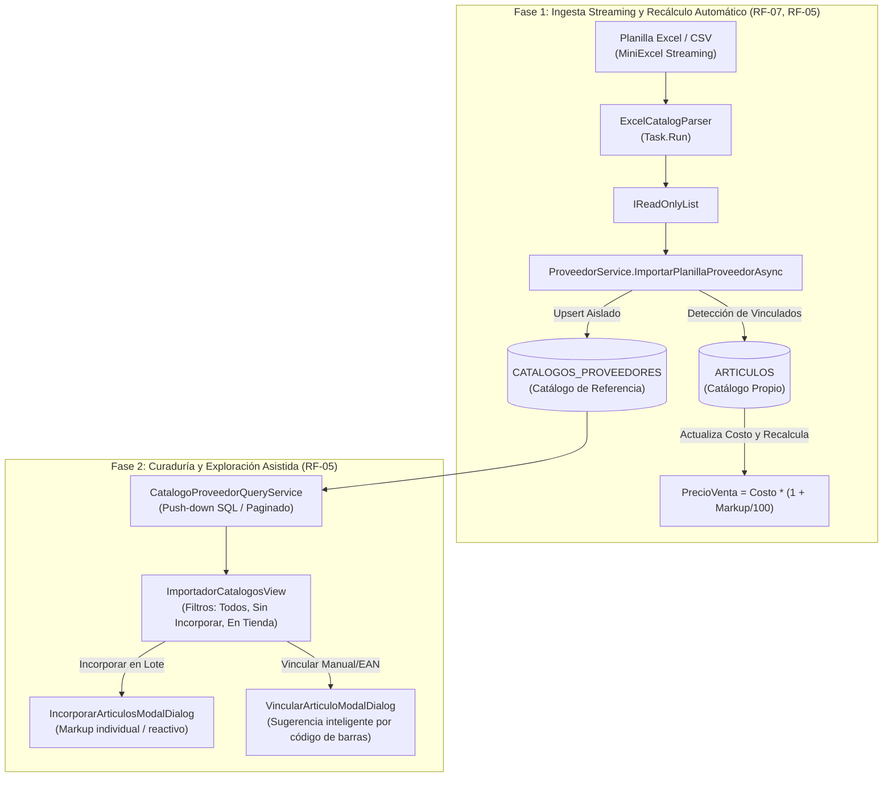

# Informe de Auditoría Técnica: Importación Masiva de Catálogos Excel y Actualización de Precios

**Proyecto:** Retail (Sistema ERP & Punto de Venta para Librería)  
**Módulo Auditado:** Etapa 2 — Catálogo y Stock: Módulo 2.2 (*Proveedores e Importador Masivo de Catálogos Mayoristas*)  
**Responsable Asignado:** Pablo Fernandez  
**Requisitos Vinculados:** [`RF-04`](file:///c:/Users/lucas/Proyectos/retail/docs/ERS%20-%20Libreria%20POS.md#L228), [`RF-05`](file:///c:/Users/lucas/Proyectos/retail/docs/ERS%20-%20Libreria%20POS.md#L229), [`RF-06`](file:///c:/Users/lucas/Proyectos/retail/docs/ERS%20-%20Libreria%20POS.md#L230), [`RF-07`](file:///c:/Users/lucas/Proyectos/retail/docs/ERS%20-%20Libreria%20POS.md#L231), [`RF-08`](file:///c:/Users/lucas/Proyectos/retail/docs/ERS%20-%20Libreria%20POS.md#L232), [`RNF-02`](file:///c:/Users/lucas/Proyectos/retail/docs/ERS%20-%20Libreria%20POS.md#L251), [`RNF-03`](file:///c:/Users/lucas/Proyectos/retail/docs/ERS%20-%20Libreria%20POS.md#L252)  
**Normativa Aplicada:** [`AGENTS.md`](file:///c:/Users/lucas/Proyectos/retail/AGENTS.md) (Las 10 Leyes Inviolables, Clean Architecture, DDD, .editorconfig) y [`docs/roadmap/etapa-2-catalogo-stock.md`](file:///c:/Users/lucas/Proyectos/retail/docs/roadmap/etapa-2-catalogo-stock.md)  
**Fecha de Emisión:** 2026-09-27  

---

## 1. Alcance de la Auditoría

Se realizó una revisión estática, analítica y de arquitectura sobre el circuito completo de:
1. **Ingesta Streaming de Planillas (.xlsx / .csv):** [`ExcelCatalogParser.cs`](file:///c:/Users/lucas/Proyectos/retail/src/Retail.Infrastructure/ExternalServices/Excel/ExcelCatalogParser.cs) e [`IExcelCatalogParser.cs`](file:///c:/Users/lucas/Proyectos/retail/src/Retail.Application/Interfaces/Infrastructure/IExcelCatalogParser.cs).
2. **Entidades de Dominio e Invariantes:** [`Articulo.cs`](file:///c:/Users/lucas/Proyectos/retail/src/Retail.Domain/Entities/Articulo.cs), [`CatalogoProveedor.cs`](file:///c:/Users/lucas/Proyectos/retail/src/Retail.Domain/Entities/CatalogoProveedor.cs) y [`Proveedor.cs`](file:///c:/Users/lucas/Proyectos/retail/src/Retail.Domain/Entities/Proveedor.cs).
3. **Casos de Uso y Orquestación:** [`ProveedorService.cs`](file:///c:/Users/lucas/Proyectos/retail/src/Retail.Application/Services/ProveedorService.cs) e [`IProveedorService.cs`](file:///c:/Users/lucas/Proyectos/retail/src/Retail.Application/Interfaces/Services/IProveedorService.cs).
4. **Consultas y Persistencia Push-Down SQL:** [`CatalogoProveedorQueryService.cs`](file:///c:/Users/lucas/Proyectos/retail/src/Retail.Infrastructure/Persistence/Services/CatalogoProveedorQueryService.cs), [`CatalogoProveedorConfiguration.cs`](file:///c:/Users/lucas/Proyectos/retail/src/Retail.Infrastructure/Persistence/Configurations/CatalogoProveedorConfiguration.cs) y [`ArticuloConfiguration.cs`](file:///c:/Users/lucas/Proyectos/retail/src/Retail.Infrastructure/Persistence/Configurations/ArticuloConfiguration.cs).
5. **Capa UI y Experiencia de Usuario (WPF):** [`ImportarPlanillaDialog.xaml`](file:///c:/Users/lucas/Proyectos/retail/src/Retail.App/Views/Dialogs/ImportarPlanillaDialog.xaml), [`ImportadorCatalogosView.xaml`](file:///c:/Users/lucas/Proyectos/retail/src/Retail.App/Views/Pages/ImportadorCatalogosView.xaml), [`IncorporarArticulosModalDialog.xaml`](file:///c:/Users/lucas/Proyectos/retail/src/Retail.App/Views/Dialogs/IncorporarArticulosModalDialog.xaml) y sus correspondientes ViewModels.
6. **Batería de Pruebas Automatizadas:** [`ExcelCatalogParserTests.cs`](file:///c:/Users/lucas/Proyectos/retail/tests/Retail.Infrastructure.IntegrationTests/Services/ExcelCatalogParserTests.cs), [`ProveedorServiceTests.cs`](file:///c:/Users/lucas/Proyectos/retail/tests/Retail.Application.UnitTests/Services/ProveedorServiceTests.cs) y [`CatalogoProveedorDomainTests.cs`](file:///c:/Users/lucas/Proyectos/retail/tests/Retail.Domain.UnitTests/Entities/CatalogoProveedorDomainTests.cs).

---

## 2. Resumen Ejecutivo y Veredicto Arquitectural



### Calificación Global: **8.5 / 10 (Sólida, con riesgos de escalabilidad y casos límite)**

* **Cumplimiento de Requisitos de Negocio:**
  * ✅ **Aislamiento de Catálogo (`RF-07`):** La planilla no contamina la tabla `ARTICULOS`. Vuelca a `CATALOGOS_PROVEEDORES`, protegiendo el inventario físico y las alertas de stock crítico (`RF-08`).
  * ✅ **Recálculo Atómico de Precios (`RF-05`):** Los artículos previamente enlazados recalculan reactivamente su `PrecioVenta` preservando su margen de ganancia (`PorcentajeGanancia`).
  * ✅ **Responsividad de UI y RAM (`RNF-02`, `RNF-03`):** Procesamiento en segundo plano (`Task.Run`) con consumo $< 50\text{ MB}$ para 5.000 filas.
* **Aspectos Críticos a Resolver:**
  * ⚠️ Riesgo de fallo fatal en SQL Server ante planillas mayores a 2.100 códigos distintos (`IN (...)`).
  * ⚠️ Riesgo de excepción no controlada (`ArgumentException`) en `.ToDictionary()` ante artículos con mismo catálogo asociado.
  * ⚠️ Vulnerabilidad ante filas duplicadas dentro del mismo archivo Excel.
  * ⚠️ Métricas de importación imprecisas: no discrimina si el precio de costo efectivamente cambió respecto al anterior.

---

## 3. Análisis Detallado por Componentes y Capas

### A. Capa de Infraestructura: Parser de Excel ([`ExcelCatalogParser.cs`](file:///c:/Users/lucas/Proyectos/retail/src/Retail.Infrastructure/ExternalServices/Excel/ExcelCatalogParser.cs))
* **Aciertos:**
  * Utiliza `stream.Query(useHeaderRow: true)` de `MiniExcel` de forma diferida en `Task.Run`.
  * Conversión polimórfica de tipos de celdas (`double`, `decimal`, `int`, `long`) y limpieza de strings con soporte de símbolos de moneda (`$`), manejando tanto `InvariantCulture` (punto) como `es-AR` (coma).
  * Soporte de cancelación cooperativa (`cancellationToken.ThrowIfCancellationRequested()`).
  * Notificación periódica de progreso a la UI mediante `IProgress<int>` cada 250 filas.
* **Deficiencias Encontradas:**
  1. **Case-Sensitivity estricta en cabeceras:** Si el usuario define `CODIGO` y la planilla tiene `Codigo` o `código`, o espacios invisibles (`"CODIGO "`), `row.TryGetValue(...)` falla silenciosamente y omite la fila.
  2. **Materialización intermedia completa:** Se acumula toda la planilla en una lista en memoria (`List<ItemCatalogoImportadoDto>`) en lugar de alimentar un pipeline streaming o procesamiento por lotes (*batching*).

---

### B. Capa de Aplicación: Servicio Orquestador ([`ProveedorService.cs`](file:///c:/Users/lucas/Proyectos/retail/src/Retail.Application/Services/ProveedorService.cs))

#### 1. Ingesta y Recálculo (`ImportarPlanillaProveedorAsync`, líneas 152–233)
* **Aciertos:**
  * Valida previamente el mapeo de columnas con `FluentValidation` ([`MapeoColumnasValidator.cs`](file:///c:/Users/lucas/Proyectos/retail/src/Retail.Application/Validators/Proveedores/MapeoColumnasValidator.cs)).
  * Verifica la existencia del proveedor antes de parsear el archivo.
  * El recálculo de precios se apoya en el método de dominio [`Articulo.ActualizarCostoYRecalcularPrecio`](file:///c:/Users/lucas/Proyectos/retail/src/Retail.Domain/Entities/Articulo.cs#L61-L65), respetando la Ley 8 (la lógica de precios reside en el Dominio, no en la base de datos).
* **Riesgos y Errores Detectados:**
  1. **Excepción por Clave Duplicada en Diccionario (Línea 171):**
     ```csharp
     var articulosLocales = await _articuloRepository.FindAsync(a => a.IdCatalogoProveedor != null, ...);
     var mapArticulos = articulosLocales.ToDictionary(a => a.IdCatalogoProveedor!.Value, a => a);
     ```
     La entidad `CatalogoProveedor` tiene una relación 1-a-N con `Articulo` (`public ICollection<Articulo> Articulos`). Si por alguna razón de negocio existen dos artículos vinculados al mismo ítem de catálogo (o si se re-incorporó un producto), `.ToDictionary()` lanza una excepción `System.ArgumentException: An item with the same key has already been added`, abortando toda la importación.
  2. **Falla ante códigos duplicados dentro de la misma planilla:**
     Si el Excel contiene dos filas con el mismo código de proveedor (ej. fila 10 y fila 50):
     - La fila 10 no existe en la base de datos y se añade a través de `AgregarAsync(nuevoCatalogo)`.
     - `mapCatalogos` no contiene aún este nuevo registro (solo los preexistentes en la BD).
     - La fila 50 tampoco lo encuentra en `mapCatalogos` y vuelve a instanciar otro `CatalogoProveedor` con el mismo código.
     - Al llamar a `await _unitOfWork.SaveChangesAsync()`, SQL Server arroja una excepción de violación de índice único (`[IdProveedor, CodigoProveedor]`).
  3. **Métrica `actualizados++` no auditada:**
     El contador `PreciosActualizados` incrementa cada vez que un artículo vinculado se encuentra en la planilla, incluso si el nuevo costo es idéntico al costo actual (`costoReposicion == item.PrecioCosto`). Esto distorsiona el reporte informando actualizaciones cuando los precios se mantuvieron invariantes.

---

### C. Capa de Persistencia: Consultas y Push-Down SQL ([`CatalogoProveedorQueryService.cs`](file:///c:/Users/lucas/Proyectos/retail/src/Retail.Infrastructure/Persistence/Services/CatalogoProveedorQueryService.cs))

#### 1. Límite de 2.100 Parámetros en SQL Server (Líneas 148–150)
```csharp
var codigoList = codigos.Where(c => !string.IsNullOrWhiteSpace(c)).Distinct().ToList();
var lista = await _context.CatalogosProveedores
    .Where(c => c.IdProveedor == idProveedor && codigoList.Contains(c.CodigoProveedor))
    .ToListAsync(cancellationToken);
```
* **Vulnerabilidad Crítica:** SQL Server impone un límite estricto de **2.100 parámetros por consulta**. Si una planilla de distribuidor tiene 3.000 o 5.000 códigos distintos, la cláusula `codigoList.Contains(c.CodigoProveedor)` se traduce a un `IN (@p0, @p1, ... @pN)`. EF Core fallará con `SqlException: The incoming request has too many parameters`.

#### 2. Riesgo idéntico en Explorador de Catálogo (Línea 58)
```csharp
var articulosVinculados = await _context.Articulos...ToListAsync();
var articulosMap = articulosVinculados.ToDictionary(a => a.IdCatalogoProveedor, a => a);
```
Nuevamente, si existen artículos con `IdCatalogoProveedor` duplicados en la base de datos, el explorador del catálogo en la vista [`ImportadorCatalogosView`](file:///c:/Users/lucas/Proyectos/retail/src/Retail.App/Views/Pages/ImportadorCatalogosView.xaml) crashea al paginar.

---

### D. Capa de Dominio: Entidades e Invariantes

1. **[`Articulo.cs`](file:///c:/Users/lucas/Proyectos/retail/src/Retail.Domain/Entities/Articulo.cs):**
   * Fórmula matemática oficial:
     $$\text{PrecioVenta} = \text{CostoReposicion} \times \left(1 + \frac{\text{PorcentajeGanancia}}{100}\right)$$
   * Rigurosidad de redondeo monetario a 2 decimales (`Math.Round(..., 2)`).
   * Invariante de custodia: `VincularCatalogoProveedor(int idCatalogoProveedor, decimal nuevoCosto)` actualiza costo y recalcula precio de venta atómicamente.

2. **[`CatalogoProveedor.cs`](file:///c:/Users/lucas/Proyectos/retail/src/Retail.Domain/Entities/CatalogoProveedor.cs):**
   * Discrepancia en validación de costo cero:
     - En `CatalogoProveedor.ActualizarPrecio(decimal nuevoCosto, ...)`:
       ```csharp
       if (nuevoCosto <= 0m)
           throw new ArgumentOutOfRangeException(nameof(nuevoCosto), "El costo de reposición debe ser estrictamente positivo.");
       ```
     - En `ExcelCatalogParser.cs` (Línea 92):
       ```csharp
       if (precioCosto < 0m) continue; // Permite 0m
       ```
     - En la base de datos ([`CatalogoProveedorConfiguration.cs`](file:///c:/Users/lucas/Proyectos/retail/src/Retail.Infrastructure/Persistence/Configurations/CatalogoProveedorConfiguration.cs#L13)):
       `HasCheckConstraint("CK_CATALOGOS_PROVEEDORES_PrecioCosto", "[precio_costo] >= 0")` (permite 0).
     *Efecto:* Si un proveedor envía un producto con costo \$0 (muestra gratis o bonificación), el parser lo acepta pero el método de dominio lanza una excepción que es capturada en el `catch` genérico de `ProveedorService`, registrándolo como `FilasConError` sin explicar la causa.

---

### E. Capa de Presentación: UI, Diálogos y MVVM

1. **[`ImportarPlanillaDialog.xaml`](file:///c:/Users/lucas/Proyectos/retail/src/Retail.App/Views/Dialogs/ImportarPlanillaDialog.xaml):**
   * Interfaz limpia, accesible mediante atajos de teclado (`F1` para examinar, `F9` para importar).
   * Muestra progreso reactivo de lectura streaming y badges de resumen de resultado (`✚ X nuevos`, `↑ X precios`, `✕ X errores`).
   * *Oportunidad de Mejora:* Los nombres de columnas deben tipear manualmente (`CODIGO`, `PRECIO`, `DESCRIPCION`). No existe una vista previa que lea la fila de cabecera del archivo seleccionado para ofrecer un ComboBox desplegable con los nombres de columnas reales del archivo.
2. **[`ImportadorCatalogosView.xaml`](file:///c:/Users/lucas/Proyectos/retail/src/Retail.App/Views/Pages/ImportadorCatalogosView.xaml):**
   * Barra de paginación integrada ([`PaginationBar.xaml`](file:///c:/Users/lucas/Proyectos/retail/src/Retail.App/Views/Components/PaginationBar.xaml)) con push-down a SQL Server.
   * Filtros por estado (`Todos`, `Sin incorporar`, `Ya en tienda`).
   * Badges contextuales claros (`En Tienda`, `Sin Incorporar`, `Coincide EAN`).
3. **[`IncorporarArticulosModalDialog.xaml`](file:///c:/Users/lucas/Proyectos/retail/src/Retail.App/Views/Dialogs/IncorporarArticulosModalDialog.xaml):**
   * Cumplimiento total de curaduría: permite aplicar un margen global (ej. 40%) o modificar el margen individual fila por fila, con recálculo dinámico e instantáneo del precio de venta final antes de impactar en la base de datos.

---

### F. Cobertura de Pruebas Automatizadas

| Suite de Pruebas | Archivo | Casos Cubiertos | Brechas (Gaps) Identificados |
| :--- | :--- | :--- | :--- |
| **Integración Excel** | [`ExcelCatalogParserTests.cs`](file:///c:/Users/lucas/Proyectos/retail/tests/Retail.Infrastructure.IntegrationTests/Services/ExcelCatalogParserTests.cs) | Ingesta de 5.000 filas en $< 3$ s; consumo $< 50$ MB; columnas inexistentes. | No prueba cabeceras con diferencias de mayúsculas/minúsculas ni caracteres especiales. |
| **Dominio** | [`CatalogoProveedorDomainTests.cs`](file:///c:/Users/lucas/Proyectos/retail/tests/Retail.Domain.UnitTests/Entities/CatalogoProveedorDomainTests.cs) | Invariante de fecha UTC, rechazo de costos negativos, descripción en blanco. | No prueba el comportamiento con múltiples artículos vinculados. |
| **Servicio de Aplicación** | [`ProveedorServiceTests.cs`](file:///c:/Users/lucas/Proyectos/retail/tests/Retail.Application.UnitTests/Services/ProveedorServiceTests.cs) | ABM de proveedores, vinculación individual, incorporación masiva con márgenes individuales. | **Falta prueba unitaria de `ImportarPlanillaProveedorAsync`** (el método principal no tiene test con re-importación y recálculo). |

---

## 4. Matriz de Hallazgos y Vulnerabilidades

| # | Severidad | Componente / Ubicación | Descripción del Hallazgo | Impacto en Producción |
| :-: | :--- | :--- | :--- | :--- |
| **H1** | 🔴 **Alta** | [`CatalogoProveedorQueryService.cs#L148`](file:///c:/Users/lucas/Proyectos/retail/src/Retail.Infrastructure/Persistence/Services/CatalogoProveedorQueryService.cs#L148) | Cláusula `codigoList.Contains(c.CodigoProveedor)` sin particionado (*chunking*). | Falla con `SqlException` (límite de 2.100 parámetros) al importar planillas de distribuidores con más de 2.100 códigos únicos. |
| **H2** | 🔴 **Alta** | [`ProveedorService.cs#L171`](file:///c:/Users/lucas/Proyectos/retail/src/Retail.Application/Services/ProveedorService.cs#L171) y [`CatalogoProveedorQueryService.cs#L58`](file:///c:/Users/lucas/Proyectos/retail/src/Retail.Infrastructure/Persistence/Services/CatalogoProveedorQueryService.cs#L58) | Uso de `.ToDictionary(a => a.IdCatalogoProveedor)` asumiendo relación 1:1 estricta. | Falla con `ArgumentException` (clave duplicada) si existen dos artículos apuntando al mismo catálogo, rompiendo la importación y la grilla. |
| **H3** | 🟡 **Media** | [`ProveedorService.cs#L181-L220`](file:///c:/Users/lucas/Proyectos/retail/src/Retail.Application/Services/ProveedorService.cs#L181-L220) | Ausencia de deduplicación de códigos en el archivo Excel antes de persistir. | Si una planilla contiene el mismo código en 2 filas, la segunda intenta insertar un duplicado y falla toda la transacción al llamar a `SaveChangesAsync`. |
| **H4** | 🟡 **Media** | [`ProveedorService.cs#L196`](file:///c:/Users/lucas/Proyectos/retail/src/Retail.Application/Services/ProveedorService.cs#L196) | Métrica de `actualizados++` se incrementa sin comprobar si `CostoReposicion` varió. | Informa precios actualizados en el reporte final aun cuando los costos no sufrieron variación alguna respecto a la lista anterior. |
| **H5** | 🟡 **Media** | [`CatalogoProveedor.cs#L28`](file:///c:/Users/lucas/Proyectos/retail/src/Retail.Domain/Entities/CatalogoProveedor.cs#L28) vs [`ExcelCatalogParser.cs#L92`](file:///c:/Users/lucas/Proyectos/retail/src/Retail.Infrastructure/ExternalServices/Excel/ExcelCatalogParser.cs#L92) | Inconsistencia en validación de costo \$0 (`<= 0m` en Dominio vs `< 0m` en Parser y BD). | Productos de promoción/bonificados con costo \$0 son descartados como errores sin feedback descriptivo al operador. |
| **H6** | 🟢 **Baja** | [`ImportarPlanillaViewModel.cs`](file:///c:/Users/lucas/Proyectos/retail/src/Retail.App/ViewModels/Proveedores/ImportarPlanillaViewModel.cs) | Mapeo manual de columnas por texto sin lectura previa de cabeceras. | Errores humanos de tipeo en los nombres de columnas impiden procesar el archivo. |
| **H7** | 💡 **Mejora** | [`ProveedorService.cs`](file:///c:/Users/lucas/Proyectos/retail/src/Retail.Application/Services/ProveedorService.cs) | Inexistencia de historial de variaciones de costos o alertas ante aumentos abruptos. | Si el distribuidor comete un error en la planilla (ej. \$1.000 pasa a \$100.000 por una coma), la tienda actualiza sus precios de venta sin advertencia. |

---

## 5. Referencia Cruzada de Solución

La especificación técnica de la solución integral para los cuellos de botella H1, H2, H3, H4 y la saturación del Change Tracker se encuentra documentada en:  
👉 [`docs/auditorias/solucion-optimizacion-importador-excel.md`](file:///c:/Users/lucas/Proyectos/retail/docs/auditorias/solucion-optimizacion-importador-excel.md)
