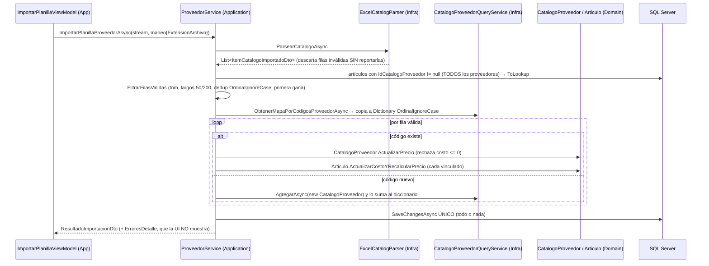
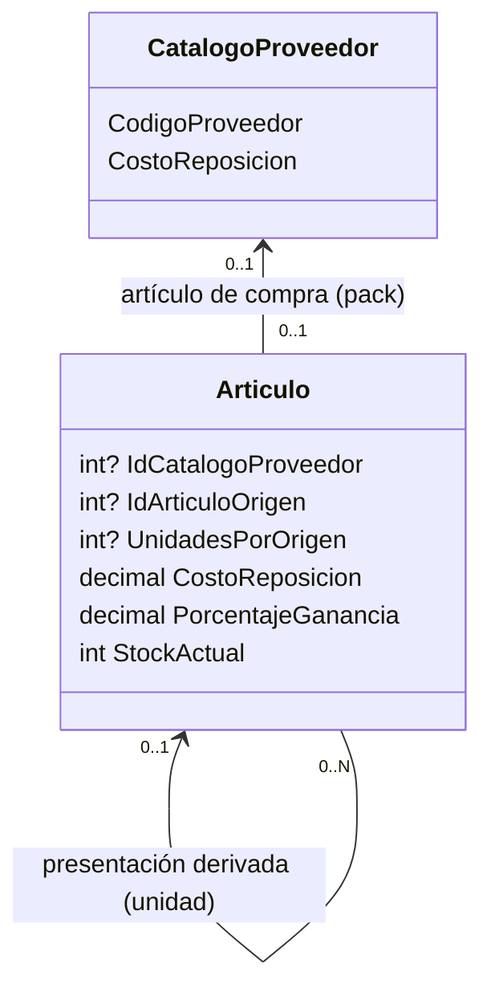

# Handoff: Importador de planillas, precios y stock por presentaciones

> **Para el agente que lea esto:** este archivo resume las sesiones del 2 al 8 de octubre de 2026 sobre el Módulo 2.2 (importador de catálogos) y su relación con artículos y stock. Contiene el estado del repositorio, los hallazgos verificados en el código, las decisiones tomadas y el plan de trabajo por fases.
>
> **Estado al 8 de octubre:** las Fases 0 (salvo `.gitattributes`), 1, 2 y **3** están completadas y mergeadas. La Fase 3 (presentaciones de venta y fraccionamiento, RF-21) entró en `main` con el **PR #14** (3a, backend) y el **PR #15** (3b, UI), con la prueba manual de la UI aprobada por el estudiante. Detalle y desvíos en la **sección 7, Fase 3**.
>
> **Cómo usarlo:** la línea de trabajo del importador y las presentaciones está **cerrada**. Lo que queda de este handoff: `.gitattributes` (Fase 0, paso 4, coordinado con Pablo), la Fase 4 (deuda de diseño, código de Pablo) y las notas de `wiki/` de la Fase 3, que el estudiante decidió no escribir por ahora. El siguiente trabajo de Lucas es el **Módulo 4.1, fase de persistencia** (`docs/roadmap/etapa-4-pos-compras.md`): `VentaService.RegistrarVentaAsync` todavía es un stub y ahí se conectan `DescontarStock` y la oferta de fraccionar del POS (RF-10, ver "Fuera de alcance de la Fase 3" en la sección 7).

---

## 0. Reglas de trabajo (obligatorias)

Además de `AGENTS.md` (las 10 Leyes, el protocolo de lectura jerárquica y el bucle de verificación) y del `CLAUDE.md` (modo pedagógico), en esta línea de trabajo rigen estas reglas acordadas con el usuario:

1. **Explicar y planificar antes de editar.** Cada fase empieza en *plan mode*, con un diagrama Mermaid del flujo afectado y una tabla de archivos por capa. No se edita código hasta que el usuario apruebe.
2. **Pasos chicos, capa por capa**, con el diff explicado: Dominio → Aplicación → Infraestructura → UI → Tests.
3. **Sin commits, ramas, pushes ni PRs** salvo pedido explícito. Los PRs los abre el estudiante para la revisión cruzada con su compañero.
4. **Sin subagentes que escriban código.** Solo se admiten para lecturas o auditorías.
5. **Las decisiones marcadas como PENDIENTE (sección 4) se preguntan antes de implementar.** No se resuelven por defecto.
6. **Propiedad del código** (roadmap): el importador, `Proveedor`, `CatalogoProveedor` y Compras son de **Pablo**. `Articulo`, Catálogo/Inventario y el POS son de **Lucas**. Los cambios que crucen esa frontera se señalan para coordinarlos.
7. **Se respeta la coautoría de Claude** (decisión del 5 de octubre). Los commits y PRs hechos con el agente conservan el trailer `Co-Authored-By` y la línea de atribución. No se desactiva `attribution` ni se reescribe historia para quitarla.

---

## 1. Estado del repositorio (al 8 de octubre de 2026)

### PRs mergeados en `origin/main` en esta línea de trabajo

| PR | Contenido |
|---|---|
| #3, #4 | Parseo de precios es-AR, CSV y robustez del importador (anteriores a este handoff) |
| #6 | Fase 1: H-01 a H-05, H-11, H-16, H-17 y test de los 2.100 parámetros |
| #7 | Auditorías, `CLAUDE.md` y este handoff |
| #9 | Arreglo del build de `main` tras el módulo 3.1 de Caja (namespace de `CajaView`, estilos XAML inexistentes, smoke tests) |
| #10 | ERS: RF-21 (presentaciones y fraccionamiento) y precisiones en RF-05, RF-10 y RF-19 |
| #11 | Fase 2: H-14 (filtro por navegación) y medición de H-15 |
| #12 | H-18: descarte de cargas obsoletas del catálogo (arreglo parcial) |
| #13 | H-19: un `DbContext` por pantalla y `CargaSerializada` (completa H-18) |
| #14 | Fase 3, PR 3a: presentaciones de venta y fraccionamiento, backend (RF-21). Commit `08d6f4b` |
| #15 | Fase 3, PR 3b: UI de presentaciones y fraccionamiento. Commit `5b5fa03`; merge en `main` `5ef62f4` |

Los PRs se mergean por *squash* y GitHub borra la rama remota: después del merge, la rama local queda `[gone]` y se borra con `git branch -D` (el `-d` la rechaza porque el squash no conserva los commits originales).

**Ramas pendientes de PR:** ninguna en esta línea de trabajo (8 de octubre).

### Entorno

- El CI (`.github/workflows/ci.yml`, `windows-latest`) corre `build` Release, `test` completo y `dotnet format --verify-no-changes`. **No** corre `scripts/audit-xaml.ps1`: hay que correrlo a mano ante cualquier cambio de XAML.
- Windows con `core.autocrlf=true` y sin `.gitattributes` (Fase 0, paso 4, pendiente). Los archivos nuevos deben quedar en **CRLF**: `dotnet format` falla con `ENDOFLINE` si quedan en LF.
- `.claude/hooks/session-start.sh` tiene finales **LF** y debe conservarlos: corre en Linux en las sesiones cloud.
- **Cuidado al editar con `sed`:** las secuencias `\f`, `\t` y `\n` dentro de fórmulas LaTeX (`\frac`, `\text`, `\times`) se convierten en caracteres de control. Preferir la herramienta de edición o verificar después.

---

## 2. Cómo funciona hoy el importador (post PRs #3 y #4)



Archivos clave:

- `src/Retail.Application/Services/ProveedorService.cs`: `ImportarPlanillaProveedorAsync`, `FiltrarFilasValidas`, `IncorporarArticulosATiendaAsync`, `VincularArticuloACatalogoAsync`.
- `src/Retail.Infrastructure/ExternalServices/Excel/ExcelCatalogParser.cs` y `ParseadorPrecioTexto.cs`.
- `src/Retail.Infrastructure/Persistence/Services/CatalogoProveedorQueryService.cs`.
- `src/Retail.Domain/Entities/Articulo.cs` (`CalcularPrecioVenta`, `ActualizarCostoYRecalcularPrecio`, `VincularCatalogoProveedor`) y `CatalogoProveedor.cs` (`ActualizarPrecio`).
- `src/Retail.App/ViewModels/Proveedores/ImportarPlanillaViewModel.cs` y `src/Retail.App/Views/Dialogs/ImportarPlanillaDialog.xaml`.
- Configuraciones: `ArticuloConfiguration.cs` (índice único filtrado en `codigo_barras`; en `id_catalogo_proveedor` hay un índice **no único** creado por convención de EF para la FK, pero **no** un índice único filtrado) y `CatalogoProveedorConfiguration.cs` (UK `(id_proveedor, codigo_proveedor)` filtrada por `deleted_at IS NULL`).

---

## 3. Backlog de hallazgos (verificados en el código de `main`)

| ID | Hallazgo | Dónde | Estado | Dueño |
|---|---|---|---|---|
| H-01 | `ErroresDetalle` se calcula, pero el diálogo solo muestra el contador `FilasConError` | `ImportarPlanillaDialog.xaml`, `ImportadorCatalogosViewModel.cs` | **Resuelto** (Fase 1, commit `e47cbdd`): lista con scroll en el diálogo | Pablo |
| H-02 | Los números de fila del reporte (`i + 1` sobre la lista parseada) no coinciden con los de la planilla: falta el encabezado y las filas que descartó el parser | `ProveedorService.FiltrarFilasValidas` | **Resuelto** (Fase 1, commit `e47cbdd`): `NumeroFila` real en `ItemCatalogoImportadoDto` | Pablo |
| H-03 | El parser descarta filas con `continue` sin reportarlas (precio ilegible, negativo, campos vacíos) | `ExcelCatalogParser.cs` | **Resuelto** (Fase 1, commit `e47cbdd`): `ResultadoParseoCatalogoDto.FilasDescartadas` con el motivo | Pablo |
| H-04 | La barra de progreso va de 0 a 100, pero recibe la cantidad de filas leídas | `ImportarPlanillaViewModel.cs`, `ImportarPlanillaDialog.xaml` | **Resuelto** (Fase 1, commit `e47cbdd`): barra indeterminada + "N filas leídas" | Pablo |
| H-05 | `MapeoColumnasDto.FilaInicial` se valida y se muestra, pero el parser la ignora (`useHeaderRow: true` fijo) | `ExcelCatalogParser.cs` | **Resuelto** (Fase 1, commit `e47cbdd`): renombrada a `FilaEncabezado` (por defecto 1), editable en el diálogo; encabezados sin distinguir mayúsculas, acentos ni espacios | Pablo |
| H-06 | `CatalogoProveedor` se escribe desde un *query service* (`AgregarAsync`/`ActualizarAsync`), saltando la raíz `Proveedor` (Ley 2, CQRS) | `ICatalogoProveedorQueryService`, `CatalogoProveedorQueryService.cs` | Abierto (deuda de diseño) | Pablo |
| H-07 | Invariante de costo inconsistente: un ítem existente con costo 0 se rechaza (`ActualizarPrecio` exige > 0); un ítem nuevo con costo 0 se crea (inicializador con setters públicos). La base admite >= 0 | `CatalogoProveedor.cs`, `ProveedorService.cs` | Abierto, requiere decisión D-05 | Pablo |
| H-08 | `ActualizarCostoYRecalcularPrecio` asigna `CostoReposicion` antes de validar (si `CalcularPrecioVenta` lanza, queda estado parcial) | `Articulo.cs` | **Resuelto** (Fase 3, PR 3a): el precio se calcula antes de asignar. La misma causa estaba en `ActualizarDatos` y `VincularCatalogoProveedor`, y se corrigió en los tres | Lucas |
| H-09 | Redondeo bancario implícito: `Math.Round(x, 2)` usa `ToEven` (2,345 da 2,34) | `Articulo.CalcularPrecioVenta` | **Resuelto** (Fase 3, PR 3a): `Articulo.RedondearMoneda` es el único punto de redondeo (`AwayFromZero`), para el precio y el costo derivado | Lucas |
| H-10 | Ambigüedad de `"12.500"`: se resuelve con una heurística fija a favor de es-AR. Un CSV exportado en inglés multiplicaría precios × 1000 sin error | `ParseadorPrecioTexto.cs` | Abierto, requiere decisión D-04 | Pablo |
| H-11 | `IncorporarArticulosATiendaAsync` omite en silencio los ítems ya vinculados (devuelve `Task`, sin informe) | `ProveedorService.cs` | **Resuelto** (Fase 1, commit `e47cbdd`): devuelve `ResultadoIncorporacionDto` (incorporados y omitidos) | Pablo |
| H-12 | `VincularArticuloACatalogoAsync` vincula y copia el costo del ítem tal cual: un artículo "unidad" vinculado a un ítem "pack x100" recibe el costo del pack | `ProveedorService.cs`, `Articulo.VincularCatalogoProveedor` | **Resuelto en el backend** (Fase 3, PR 3a): un derivado no se puede vincular (Dominio y CHECK); la unidad se modela como presentación del pack y recibe el costo dividido. En la UI (PR 3b), la edición de una presentación oculta el vínculo con distribuidor y la unidad se da de alta desde la fila del pack | Ambos |
| H-13 | El explorador elige el artículo vinculado con `GroupBy(...).First()` sin orden definido | `CatalogoProveedorQueryService.cs` | **Resuelto** (Fase 3, PR 3a): índice único filtrado `IX_ARTICULOS_id_catalogo_proveedor` y `ToDictionary` | Pablo |
| H-14 | Se cargan todos los artículos vinculados de **todos** los proveedores, con tracking. Solución propuesta: filtrar por proveedor a través de la navegación (ver sección 6.1) | `ProveedorService.ImportarPlanillaProveedorAsync` | **Resuelto** (Fase 2): filtro por navegación (sección 6.1). Verificado en LocalDB: con 2.000 artículos de otro proveedor, solo se cargan los del proveedor importado | Pablo (toca la consulta de `Articulo`: coordinar con Lucas) |
| H-15 | El "streaming" termina en el parser: se materializa toda la `List` y todas las entidades quedan en el Change Tracker. No está medido contra RNF-03 (≤ 300 MB) | Parser y servicio | **Medido** (Fase 2): 5.000 filas de punta a punta retienen ≈ 13 MB (4 % de RNF-03). Tiempo típico 3,9–4,6 s en LocalDB, con un caso aislado de 28,5 s atribuible al entorno | Pablo |
| H-16 | `PreciosActualizados` cuenta artículos tocados aunque el costo no haya cambiado. Comparar contra el costo **de cada artículo** (`articulo.CostoReposicion != nuevoCosto`), no contra el del catálogo: un artículo editado a mano puede tener otro costo | `ProveedorService.cs` | **Resuelto** (Fase 1, commit `e47cbdd`) | Pablo |
| H-17 | El PR #4 agregó el chequeo de "ya vinculado" solo en `IncorporarArticulosATiendaAsync`. `VincularArticuloACatalogoAsync` no chequea nada, así que por esa vía todavía se crean vínculos 1 a N, en contra de la regla 1 de la sección 5.2 | `ProveedorService.VincularArticuloACatalogoAsync` | **Resuelto** (Fase 1, commit `e47cbdd`): `DomainException` si el ítem ya tiene otro artículo; revincular el mismo sigue permitido. El índice único llega en la Fase 3 | Pablo |
| H-18 | Condición de carrera en `ImportadorCatalogosViewModel`: asignar `ProveedorActivo` dispara una carga asíncrona del catálogo que pone `MensajeError = null`; si termina después de que un comando escribió un error, lo borra. Hace intermitente el test `IncorporarSeleccionadosCommand_SinElementosSeleccionados_EstableceMensajeDeError` (falló 1 de 4 corridas). Detectado el 5 de octubre al verificar la Fase 2 | `ImportadorCatalogosViewModel.OnProveedorActivoChanged` | **Resuelto** junto con H-19 (rama `fix/dbcontext-por-pantalla`; el primer arreglo, en `fix/importador-carga-catalogo`, era parcial): cada carga cancela la anterior y solo la vigente actualiza grilla, error e `IsBusy`. Además de borrar mensajes, la grilla podía mostrar resultados de una búsqueda vieja que respondía tarde. Tests de cargas solapadas (fallan sin el arreglo). **No alcanza en la app real:** con el DbContext compartido (H-19), la carga vigente falla con `InvalidOperationException` si la anterior, aunque cancelada, todavía ocupa el contexto. Se completa con la serialización por pantalla (H-19, paso R3) | Pablo |
| H-19 | **Un único `DbContext` para toda la app.** Los servicios y el contexto son `Scoped`, pero `NavigationService` y los seis `*DialogService` (Singleton) los resuelven desde el proveedor raíz, y el único `CreateScope()` está en el arranque. EF Core no admite dos operaciones simultáneas sobre un contexto: **verificado contra LocalDB** (7 de octubre), la segunda consulta lanza `InvalidOperationException` aunque la primera esté cancelada, y la cancelada termina en `SqlException` "Operation cancelled by user" (no en `OperationCanceledException`). Afecta a todas las vistas con búsqueda: Importador, Artículos y Clientes (un filtro cambiado durante una búsqueda abre un **diálogo modal de error**), Seleccionar cliente del POS (sin debounce, cancelación ni `catch`: la lista queda congelada en silencio) y, en menor medida, el POS. Proveedores y Usuarios filtran en memoria y no se ven afectados. Además el ChangeTracker crece durante toda la jornada (RNF-03) | `NavigationService`, `*DialogService`, `App.xaml.cs` y los ViewModels con búsqueda | **Resuelto** (rama `fix/dbcontext-por-pantalla`). **R1:** `NavigationService` crea un scope de DI por pantalla y descarta el anterior; los `*DialogService` son `Scoped`; el login tiene su propio scope; el Host activa `ValidateScopes` y `ValidateOnBuild`. **R2 y R3 se resolvieron juntos** con `Helpers/CargaSerializada`: fila de accesos a datos por pantalla (espera a que el anterior libere el contexto, descarta respuestas obsoletas, debounce y cancelación al descartarse la pantalla). La usan los ocho ViewModels de pantalla (que implementan `IDisposable`) y el modal Seleccionar cliente. `EjecutarOperacionAsync` cubre los accesos que no deben reemplazarse (estado de la caja, artículo escaneado en el POS). **Riesgos residuales:** los comandos que escriben o consultan después de abrir un diálogo (incorporar, ABM, registrar venta) no pasan por la fila, porque el diálogo modal impide en la práctica que se solapen con una carga; y el modal de clientes tiene su propia fila sobre el contexto del POS | Pablo (navegación y DI, Ley 10) + Lucas |

**Resueltos por los PRs #3 y #4** (no volver a trabajarlos): precios en texto es-AR, lectura de CSV, mayúsculas contra collation, duplicados en la planilla, `catch` vacío, `ToDictionary` con claves repetidas, largos que hacían fallar el `SaveChanges`.

---

## 4. Decisiones (las PENDIENTES se preguntan al usuario antes de implementar; las DECIDIDAS y CERRADAS no se reabren)

| ID | Pregunta | Opciones | Recomendación de la sesión |
|---|---|---|---|
| D-01 | Stock de presentaciones (pack y unidad) | A) stocks separados + fraccionamiento explícito · B) stock único en unidad base · C) A con fraccionamiento automático en el POS | **DECIDIDA (7 de octubre): A**, con el POS *ofreciendo* abrir un pack cuando no alcanzan los sueltos (no lo hace solo). En la ERS: RF-10 y RF-21 |
| D-02 | ¿Registrar los movimientos de stock (`MovimientoStock`)? | Sí (tipo, artículo, cantidad, usuario, fecha) / No (solo `StockActual`) | **CERRADA (5 de octubre): No.** La ERS no lo pide (verificado: no menciona movimientos de stock ni kardex). Queda como mejora documentada (YAGNI) |
| D-03 | ¿Un artículo derivado puede salir de más de un origen? | No (`IdArticuloOrigen` alcanza) / Sí (tabla de presentaciones) | **DECIDIDA (7 de octubre): No.** Un solo origen y un solo nivel (RF-21) |
| D-04 | Formato numérico de planillas en texto | Heurística es-AR actual / selector de formato por proveedor / alerta de variación abrupta de costo (H7 de la auditoría local) | Selector por proveedor, más alerta de variación como red de seguridad |
| D-05 | ¿Un ítem de proveedor puede costar $0 (bonificados)? | Sí (unificar en ≥ 0) / No (unificar en > 0 y reportarlo) | Unificar la regla en el dominio, en un solo lugar |
| D-06 | Modo de redondeo del precio de venta | `ToEven` (actual, implícito) / `AwayFromZero` | **DECIDIDA (7 de octubre): `MidpointRounding.AwayFromZero` explícito** (0,045 → 0,05). Se implementa en la Fase 3, en un solo lugar del dominio, para el precio de venta y el costo derivado |
| D-07 | Deduplicación: ¿qué fila gana? | Primera (PR #4) / Última (propuesta en `solucion-optimizacion-importador-excel.md`) | Decidir y documentar. Cualquiera sirve si se reporta |
| D-08 | Transacción única contra lotes | Ver sección 6 | **CERRADA (Fase 2): no se implementa.** La medición de H-15 da ≈ 13 MB para 5.000 filas, así que los lotes no se justifican. Si en el futuro hiciera falta, rigen dos condiciones obligatorias: **(a)** Ley 1: `ProveedorService` (Application) no puede tocar `RetailDbContext.ChangeTracker`; habría que exponer la limpieza en `IUnitOfWork`. **(b)** El DbContext es **compartido por toda la app** (los servicios Scoped se resuelven desde la raíz; el único `CreateScope()` está en `App.xaml.cs:139`). `ChangeTracker.Clear()` desvincularía las entidades de otras pantallas, así que la importación necesitaría **su propio scope de DI** |
| D-09 | Precisión del costo unitario derivado | `decimal(18,2)` actual / `decimal(18,4)` para costos y redondeo solo del precio | **DECIDIDA (7 de octubre): se mantiene `decimal(18,2)`**, sin migración de precisión. El costo del derivado se redondea a 2 decimales (RF-21); el error es de hasta medio centavo por unidad, relevante solo en productos de centavos. El modo de redondeo depende de D-06 |

---

## 5. Conclusiones de modelo

### 5.1 Cardinalidad artículo ↔ ítem de proveedor (ACORDADO en el razonamiento)

- Artículo → ítem de proveedor: **0..1**. Las artesanías y los servicios no tienen proveedor; si hay vínculo, es uno.
- Ítem de proveedor → artículos: **0..N** en el negocio, por el **fraccionamiento**. Ejemplo: el proveedor vende sobres en pack x100 y la tienda los vende por pack y por unidad.
- La regla "un ítem, un artículo" **no es una regla del negocio**. Hay que descartar cualquier propuesta anterior que la imponga sin el modelo de 5.2.

### 5.2 Presentaciones (ACORDADO: especificado en la ERS como RF-21, PR #10)

**Decisión del 5 de octubre:** vender por unidad artículos que se compran por pack (y que el catálogo del proveedor muestra por pack) es un problema **legítimo y acordado**. Desde el PR #10 está especificado en la ERS: **RF-21** (nuevo) y precisiones en RF-05, RF-10 y RF-19, más cuatro definiciones en la sección 1.4. **La ERS es el contrato:** ante cualquier duda de alcance, manda su texto.

La conversión pack ↔ unidad es una relación **entre artículos**, no entre un artículo y el catálogo. Así hay una sola fuente de verdad, que resuelve precio y stock a la vez:



Reglas acordadas (las invariantes de un solo artículo van en el dominio, Ley 8; las que miran a otros artículos van en Application, como H-17):

1. Solo el **artículo de compra** (el pack) se vincula al ítem del proveedor. Con eso, el **índice único filtrado** en `id_catalogo_proveedor` (`IS NOT NULL AND deleted_at IS NULL`) vuelve a ser válido y resuelve H-13. **Verificado por el usuario (7 de octubre): la base real no tiene ítems con más de un artículo vinculado**, así que la migración no falla.
2. Un artículo derivado tiene `IdArticuloOrigen` y `UnidadesPorOrigen` (entero ≥ 1, con CHECK). No puede tener `IdCatalogoProveedor`, ni ser origen de otro (un solo nivel, D-03), ni derivar de sí mismo. Ni el origen ni el derivado pueden ser servicios.
3. Costo del derivado = `Math.Round(costo del origen / UnidadesPorOrigen, 2, MidpointRounding.AwayFromZero)` (D-06 y D-09). Cada vez que cambia el costo del origen, **se propaga** a sus derivados, y cada uno recalcula su precio con su propio markup.
4. **El costo del derivado se puede editar a mano** (decisión del 7 de octubre), pero ese valor se pisa la próxima vez que cambie el costo del origen. El dominio no lo rechaza; la UI debe avisarlo junto al campo.
5. Stock independiente por artículo (D-01 A). Compras incrementa el artículo de compra; el POS descuenta el artículo vendido; el derivado recibe unidades **solo** por fraccionamiento.
6. Caso de uso `FraccionarAsync(idArticuloDerivado, cantidadOrigen)`. Se identifica el **derivado**, no el origen, porque un origen puede tener varios derivados (pack → unidad, pack → media docena). Un **servicio de dominio** resta `cantidadOrigen` del origen y suma `cantidadOrigen × UnidadesPorOrigen` al derivado. Ambos agregados se guardan en **un solo** `SaveChanges`, que es atómico. Modificar dos agregados en una transacción está justificado en un monolito con una sola base, y hay que poder defenderlo.
7. `DescontarStock` e `IncrementarStock` (previstos en el roadmap, Etapa 4) **todavía no existen**: `StockActual` es un setter público. Se crean con validación (`StockInsuficienteException`, que ya existe en `Retail.Domain/Exceptions`). En la Fase 3 solo los usa el fraccionamiento: **conectarlos a Ventas y Compras es trabajo de la Etapa 4**.
8. **No se puede dar de baja un artículo de compra con presentaciones derivadas activas** (decisión del 7 de octubre): `DomainException` que pide dar de baja antes los derivados. Evita derivados huérfanos cuyo costo nadie actualiza. Es el mismo criterio que la baja de clientes con deuda.
9. Al importar, el filtro de H-14 (sección 6.1) trae solo los artículos de compra, porque los derivados no tienen `IdCatalogoProveedor`. Para propagar el costo a los derivados se usa la misma técnica, otro JOIN sin listas: `a.ArticuloOrigen != null && a.ArticuloOrigen.CatalogoProveedor != null && a.ArticuloOrigen.CatalogoProveedor.IdProveedor == id`.

El plan por capas, los archivos y los criterios de aceptación están en la **sección 7, Fase 3**.

---

## 6. Evaluación de la propuesta `docs/auditorias/solucion-optimizacion-importador-excel.md`

Esa propuesta, de otro agente y escrita **antes** de los PRs #3 y #4, plantea un pipeline por lotes de 1.000 filas con `SaveChangesAsync` + `ChangeTracker.Clear()` por lote. Evaluación de esta sesión:

| Punto de la propuesta | Evaluación |
|---|---|
| Rechazar Stored Procedures (Ley 8) | ✅ De acuerdo |
| `ToLookup` y deduplicación (H2/H3 locales) | ✅ Ya resuelto por el PR #4 (que conserva la primera fila; la propuesta, la última → D-07) |
| Límite de 2.100 parámetros (H1 local) | ✅ **Falso positivo, verificado.** EF Core 8.0.11 traduce `Contains` sobre colecciones parametrizadas con `OPENJSON` (un solo parámetro) en SQL Server 2016+. El test de integración de la sección 6.2 pasa con 3.000 códigos. No hace falta *chunking* |
| `SaveChanges` por lote | ❌ Así como está, **rompe la atomicidad**: si falla el lote 3, los lotes 1 y 2 quedan guardados (importación a medias) y el mensaje "Importación cancelada" queda engañoso. Si la medición de H-15 justifica lotes, envolverlos en una transacción explícita, con las condiciones de D-08 |
| `_retailDbContext.ChangeTracker.Clear()` en `ProveedorService` | ❌ Viola la Ley 1 (no compila: Application no ve `RetailDbContext`) y vacía un DbContext compartido por toda la app (ver D-08) |
| Lista `idsCatalogosEncontrados.Contains(...)` para buscar artículos | ❌ Innecesaria: el filtro por navegación de H-14 hace lo mismo con un JOIN y sin listas |
| Promesas "memoria O(1), < 25 MB" | ❌ Sin respaldo: el parser carga toda la planilla en una `List` antes de los lotes. Medir (H-15) antes de afirmar cifras |
| Contar solo costos que cambiaron (H4 local) | ✅ Coincide con H-16 (resuelto en la Fase 1) |
| Costo $0 (H5 local) | ✅ Coincide con H-07 / D-05 |
| Lectura previa de cabeceras para el mapeo (H6 local) | 💡 Buena mejora de UX, opcional |
| Alerta por variación abrupta de costos (H7 local) | 💡 Muy recomendable; mitiga H-10 |

### 6.1 Filtro por navegación para H-14 (acordado como solución)

```csharp
var articulosVinculados = await _articuloRepository.FindAsync(
    a => a.CatalogoProveedor != null && a.CatalogoProveedor.IdProveedor == mapeo.IdProveedor,
    includeDeleted: false,
    cancellationToken);
```

SQL Server resuelve el filtro con un `JOIN` entre `ARTICULOS` y `CATALOGOS_PROVEEDORES` y **un solo parámetro escalar** (`@IdProveedor`), sin listas. Implicaciones:

- **Índices:** usa el índice no único de la FK `id_catalogo_proveedor` y la UK `(id_proveedor, codigo_proveedor)`, que empieza por `id_proveedor`.
- **Soft delete:** el filtro global se aplica también al catálogo dentro del JOIN. Los artículos vinculados a ítems borrados quedan afuera; es coherente con el mapa de catálogos, que tampoco los incluye.
- **Capas:** el predicado vive en Application, usa solo propiedades del Dominio y reutiliza `IRepository<T>.FindAsync`. No hace falta un método nuevo.
- **Tracking:** se mantiene, porque las entidades se modifican.
- **Precisión:** trae los artículos **del proveedor**, no solo los de la planilla. Es aceptable para una librería.
- **Tests:** con NSubstitute el predicado nunca se ejecuta, así que un unit test no puede validarlo. Requiere un test de integración en LocalDB: `FindAsync_FiltrandoPorProveedorViaNavegacion_RetornaSoloArticulosDeEseProveedor`.

### 6.2 El test de los 2.100 parámetros (redefinido)

El filtro de H-14 **no** resuelve esta duda. La única consulta que envía una lista es la de catálogos por código (`ObtenerMapaPorCodigosProveedorAsync`, con `codigoList.Contains(...)`). Se descartó evitar la lista trayendo todo el catálogo del proveedor: con planillas parciales trae miles de filas de más, y cambiar el diseño sin medir contradice "medir antes de optimizar".

Test de integración en `CatalogoProveedorQueryServiceTests.cs` (nuevo, LocalDB, mismo patrón que `ArticuloQueryServiceTests`):

- `ObtenerMapaPorCodigosProveedorAsync_ConMasDe2100Codigos_RetornaCoincidenciasSinExcepcion`: 2.500 ítems persistidos, se piden 3.000 códigos y vuelven exactamente 2.500.
- No se afirma sobre el SQL generado (`OPENJSON`), porque es un detalle de implementación.

Para qué sirve: convierte la creencia en evidencia y **protege ante una actualización**. La traducción de `Contains` cambió entre versiones de EF (constantes hasta EF 7, `OPENJSON` en EF 8, otra estrategia en versiones posteriores), y EF 8 sale de soporte en noviembre de 2026.

**Supuesto de despliegue a documentar** en `SISTEMA_DE_PERSISTENCIA.md`: `OPENJSON` requiere un nivel de compatibilidad de la base **≥ 130**. Una base restaurada con un nivel inferior haría fallar la consulta, y el test contra LocalDB no lo detecta.

**Resultado (Fase 1, commit `e47cbdd`):** el test pasa contra LocalDB: 3.000 códigos en una sola consulta, sin excepción. **H1 de la auditoría local queda confirmado como falso positivo.** El supuesto de compatibilidad ≥ 130 quedó documentado en `SISTEMA_DE_PERSISTENCIA.md` (Ley 4 de persistencia).

---

## 7. Plan de trabajo por fases

Cada fase: plan mode → aprobación → implementación incremental → verificación (bucle de `AGENTS.md`) → nota en `wiki/` → PR abierto por el estudiante.

### Fase 0: Puesta a punto (sin código de producto)

Orden corregido el 5 de octubre: **primero sincronizar, después normalizar**.

1. ~~Borrar `.git/index.lock`~~ (hecho el 5 de octubre).
2. ~~Sincronizar la copia local~~ (hecho el 5 de octubre: `main` al día; conflicto del MAPA resuelto uniendo ambos textos).
3. ~~Commitear `CLAUDE.md`, las dos auditorías locales y este handoff~~ (hecho: rama `docs/handoff-importador`, commit `bc113ac`, con atribución de Claude).
4. Normalizar los finales de línea en **un PR propio, coordinado con Pablo** (toca prácticamente todos los archivos y puede generar conflictos en sus ramas). El `.gitattributes` debe exceptuar los scripts de shell:
   ```gitattributes
   * text=auto eol=crlf
   *.sh text eol=lf
   ```
   Explicar el efecto (`git add --renormalize .`) antes de aplicarlo.

Se **descartaron** dos pasos de la versión original: desactivar `attribution` en `.claude/settings.json` y reescribir `7a6ac64` con force push (regla 7).

### Fase 1: Correcciones rápidas del importador (Pablo) — ✅ COMPLETADA
H-01, H-02 (número de fila real en `ItemCatalogoImportadoDto`), H-03 (descartes del parser en el reporte), H-04, H-05, H-11, H-16, H-17, el test de compatibilidad de la sección 6.2 y el supuesto del nivel de compatibilidad ≥ 130 en `SISTEMA_DE_PERSISTENCIA.md`.

**Estado (5 de octubre):** implementada por Lucas con el agente en la rama `fix/importador-fase-1` (commits `e47cbdd` código y `ffd69b0` wiki). El código es de Pablo según el roadmap: **él revisa el PR**. Verificación de cierre: `audit-xaml` OK, build Release sin advertencias, **488/488 tests**, `dotnet format` sin cambios.

Cambios de contrato que Pablo debe conocer:
- `IExcelCatalogParser.ParsearCatalogoAsync` devuelve `ResultadoParseoCatalogoDto { Items, FilasDescartadas }`.
- `ItemCatalogoImportadoDto` tiene `required int NumeroFila`.
- `MapeoColumnasDto.FilaInicial = 2` pasó a `FilaEncabezado = 1` (la fila donde están los encabezados).
- `IProveedorService.IncorporarArticulosATiendaAsync` devuelve `ResultadoIncorporacionDto`.
- Una columna obligatoria inexistente lanza `InvalidDataException` (antes devolvía 0 filas en silencio).

Hallazgo de los tests: MiniExcel entrega las filas vacías intermedias en XLSX y CSV, así que contar filas da el número real. La nota [`wiki/05-casos-de-uso-y-flujos/flujo-importador-excel.md`](../../wiki/05-casos-de-uso-y-flujos/flujo-importador-excel.md) se reescribió: la anterior describía un diseño (`IAsyncEnumerable`, lotes de 500, memoria O(1)) que no coincidía con el código.

### Fase 2: Medición y transacción (Pablo) — ✅ COMPLETADA
H-14 con el filtro de la sección 6.1 y su test de integración (es barato y no depende de medir). Después, un test con 5.000 filas sintéticas (roadmap: < 3 s, ≤ 300 MB). Solo si no cumple, implementar D-08 (lotes dentro de una transacción, con las condiciones (a) y (b)).

**Estado (5 de octubre):** rama `perf/importador-fase-2`. Nuevo `ImportacionPlanillaIntegrationTests.cs`: primeros tests **de punta a punta** del importador (`ProveedorService` con repositorios, Unit of Work, query service y parser reales, contra LocalDB).

| Corrida | Tiempo total | Memoria retenida | Artículos cargados |
|---|---|---|---|
| 1 | 4.624 ms | 12,7 MB | 2.500 |
| 2 | 28.507 ms | 12,8 MB | 2.500 |
| 3 | 3.869 ms | 12,7 MB | 2.500 |
| 4 | 4.471 ms | 12,8 MB | 2.500 |

Escenario: 2.500 renglones existentes con artículo vinculado, 2.500 nuevos y 2.000 artículos de otro proveedor como ruido. Conclusiones:
- **Memoria:** estable y muy por debajo de RNF-03 → **D-08 cerrada**. El test afirma < 100 MB.
- **H-14:** se cargan 2.500 artículos en lugar de 4.500. El test lo afirma contando las entradas `Articulo` del ChangeTracker.
- **Tiempo:** **no se afirma**, solo se informa en la salida del test. En la corrida 2 también la preparación de datos fue lenta (el test entero tardó 1 min 8 s, contra 9–11 s en las demás), lo que apunta a LocalDB o al disco. Un límite fijo volvería el test *flaky* en el CI. RNF-02 exige no bloquear la UI (la importación corre en `Task.Run`), no un tiempo fijo, y el criterio de < 3 s del roadmap aplica al parseo, que cubre `ExcelCatalogParserTests`.
- **Posible optimización futura (no medida):** los `UpdateAsync` sobre entidades ya seguidas marcan todas las columnas como modificadas; sin ellos, EF generaría `UPDATE` solo de las columnas que cambian. Evaluar solo si el tiempo llegara a ser un problema real.

### Fase 3: Presentaciones y stock (Lucas + Pablo) — ✅ COMPLETADA (PRs #14 y #15)

**Requisito:** RF-21 de la ERS, con las precisiones de RF-05, RF-10 y RF-19. **Modelo y reglas:** sección 5.2 (reglas 1 a 9). **Decisiones cerradas:** D-01, D-03, D-06 y D-09 (sección 4), más las del 7 de octubre que figuran en 5.2: costo del derivado editable, baja de un origen con derivados rechazada. **No reabrirlas.**

#### Prerrequisitos

1. ✅ ERS aprobada y mergeada (PR #10).
2. ✅ Fase 2 mergeada (PR #11): el filtro de H-14 es la base de la propagación.
3. ✅ `fix/importador-carga-catalogo` (PR #12) y `fix/dbcontext-por-pantalla` (PR #13, H-19) mergeadas en `main`.
4. ✅ Rama `feat/presentaciones-fase-3a` creada desde `main` en `e4706a0` (7 de octubre).

**Estado (8 de octubre): PR 3a mergeado** como PR #14 (commit `08d6f4b`), con los pasos 1 a 5. Desvíos respecto de esta guía, todos aprobados durante la sesión:
- **CHECK extendido y corregido.** Además de lo previsto, rechaza un derivado que sea servicio o derive de sí mismo. La fórmula original de la fila del paso 3 tenía un hueco: con `unidades_por_origen = NULL`, `NULL >= 1` da `UNKNOWN` y un CHECK solo rechaza `FALSE`, así que aceptaba un derivado sin unidades. Lo detectó el test de integración `Presentacion_OrigenSinUnidades_LaRechazaElCheck`; se agregó `[unidades_por_origen] IS NOT NULL` y se regeneró la migración (no estaba aplicada fuera de las bases de test). La fórmula vigente está en `SISTEMA_DE_PERSISTENCIA.md`.
- **Regla 2 vista desde el origen.** `ActualizarArticuloAsync` rechaza convertir en servicio un origen con presentaciones (necesita mirar otros artículos, por eso va en Application).
- **`FraccionarAsync`** recibe un `FraccionarDto` validado y devuelve las unidades obtenidas. `ArticuloDto` expone `IdArticuloOrigen`, `UnidadesPorOrigen` y `EsDerivado`, también en la proyección de `ArticuloQueryService`, para el PR 3b.
- **Riesgo anotado para la Etapa 4:** dos terminales fraccionando el mismo pack a la vez pueden perder una actualización (`Articulo` no tiene `rowversion`). Es el mismo problema que el descuento de stock de RF-10.

**Estado (8 de octubre): PR 3b mergeado** como PR #15 (commit `5b5fa03`, merge `5ef62f4`). Decisiones del estudiante: **diálogo propio** para el alta (`PresentacionFormDialog`), **stock editable** al editar una presentación (es un ajuste de inventario físico, no un ingreso de mercadería; el backend ya lo permitía) y **botones por fila** en la columna Acciones. Contenido:
- `PresentacionFormDialog` y `FraccionarDialog` con sus ViewModels. La vista previa usa las fórmulas del Dominio (`Articulo.CalcularCostoPresentacion` y `CalcularPrecioVenta`), y los errores de dominio se muestran dentro del diálogo.
- `ArticulosView`: badge "Presentación ×N" en la columna Distribuidor y, en Acciones, "Crear presentación" (artículos de compra) o "Fraccionar" (presentaciones), según `DataTrigger`.
- `ArticuloFormDialog` en modo presentación: oculta "Es servicio" y el vínculo con distribuidor, y muestra el aviso de la regla 4 junto al costo.
- Tests de ViewModel y smoke tests STA de los dos diálogos nuevos y del formulario en modo presentación. El smoke test de `ArticulosView` ahora incluye una fila derivada, porque sin ella nunca construía el badge ni el botón Fraccionar.
- **Sin nota de `wiki/`** (decisión del estudiante).
- **Prueba manual aprobada** por el estudiante antes del merge. Al ejecutar la app se aplica la migración `AddPresentacionesDeVenta` a la base de desarrollo `RetailDb`.
- Además, el 3b quitó la columna Código de Barras de la grilla de Artículos para hacer lugar al botón nuevo; el dato sigue en la búsqueda y en el formulario.

#### Alcance y división en PRs

| PR | Contenido | Revisión |
|---|---|---|
| **3a** | Dominio + Aplicación + Persistencia (migración) + tests + documentación técnica (DER, MAPA, SISTEMA_DE_PERSISTENCIA) | Pablo (toca `ProveedorService`) |
| **3b** | UI: alta de presentación, botón "Fraccionar" en Inventario, aviso de costo editable, smoke tests STA, auditoría XAML y nota en `wiki/` | Pablo |

**Fuera de alcance de la Fase 3:**
- El POS **ofreciendo** fraccionar cuando faltan sueltos (RF-10). Va con la Etapa 4.
- Conectar `DescontarStock` a `VentaService` (hoy no toca el stock) y `IncrementarStock` a Compras (`CompraService` todavía no existe; solo está la interfaz). Es Etapa 4.
- `MovimientoStock` (D-02 cerrada).

#### PR 3a, paso a paso (cada paso se aprueba antes de seguir)

| Paso | Capa | Archivos | Contenido |
|---|---|---|---|
| 1 | Dominio | `Retail.Domain/Entities/Articulo.cs` | `IdArticuloOrigen`, `ArticuloOrigen`, `Presentaciones` (colección), `UnidadesPorOrigen`, `EsDerivado`. `DefinirComoPresentacionDe(origen, unidades)` con las invariantes de la regla 2. `RecalcularCostoDesdeOrigen(costoOrigen)`. `DescontarStock` e `IncrementarStock`. `VincularCatalogoProveedor` y `ActualizarDatos` rechazan un catálogo en un derivado. **H-08:** calcular el precio antes de asignar el costo. **D-06:** `MidpointRounding.AwayFromZero` explícito en `CalcularPrecioVenta` y en el costo derivado. Override de `MarkAsDeleted()` **no** alcanza para la regla 8, porque necesita mirar otros artículos: va en Application |
| 1 | Dominio | `Retail.Domain/Services/ServicioFraccionamiento.cs` (**carpeta nueva**, registrarla en el MAPA) | `Fraccionar(origen, derivado, cantidadOrigen)`: valida que `derivado.IdArticuloOrigen == origen.Id` y `cantidadOrigen ≥ 1`, y llama a `DescontarStock` e `IncrementarStock` |
| 2 | Aplicación | `InventarioService` + DTOs (`CrearPresentacionDto`, `FraccionarDto`) + validadores FluentValidation | `CrearPresentacionAsync`: crea el derivado heredando categoría y marca del origen. `FraccionarAsync(idArticuloDerivado, cantidadOrigen)`: carga los dos artículos, usa el servicio de dominio y hace **un** `SaveChanges`. `BajaArticuloAsync` rechaza un origen con derivados activos (regla 8). **Propagación** cuando cambia el costo del origen en `ActualizarArticuloAsync` y `ActualizarCostoYPrecioAsync` |
| 2 | Aplicación | `ProveedorService` (**de Pablo**) | Propagación en `ImportarPlanillaProveedorAsync` (consulta de la regla 9 + `ToLookup` por `IdArticuloOrigen`, contando en `PreciosActualizados` solo los costos que cambian, como H-16) y en `VincularArticuloACatalogoAsync` |
| 3 | Infraestructura | `ArticuloConfiguration.cs` + migración `AddPresentacionesDeVenta` | Columnas `id_articulo_origen` y `unidades_por_origen`. FK autorreferencial con `OnDelete(Restrict)`. CHECK `CK_ARTICULOS_Presentacion` (**fórmula corregida**, ver "Estado" más arriba): `([id_articulo_origen] IS NULL AND [unidades_por_origen] IS NULL) OR ([id_articulo_origen] IS NOT NULL AND [unidades_por_origen] IS NOT NULL AND [unidades_por_origen] >= 1 AND [id_catalogo_proveedor] IS NULL AND [es_servicio] = 0 AND [id_articulo_origen] <> [id_articulo])`. **Índice único filtrado** en `id_catalogo_proveedor` con `[id_catalogo_proveedor] IS NOT NULL AND [deleted_at] IS NULL` (reemplaza al índice no único de la convención; mismo patrón que `codigo_barras`). Comando: el de `SISTEMA_DE_PERSISTENCIA.md` |
| 3 | Infraestructura | `CatalogoProveedorQueryService.cs` | H-13: volver de `GroupBy(...).First()` a `ToDictionary`, ahora garantizado por el índice único |
| 4 | Tests | `Retail.Domain.UnitTests`, `Retail.Application.UnitTests`, `Retail.Infrastructure.IntegrationTests` | Ver criterios de aceptación |
| 5 | Docs | `docs/DER.mmd`, `MAPA_DEL_PROYECTO.md`, `SISTEMA_DE_PERSISTENCIA.md` (catálogo de CHECK) y este handoff | — |

#### Criterios de aceptación del PR 3a

- **Dominio:** cada invariante de la regla 2 con su test de rechazo. Costo derivado con redondeo `AwayFromZero` (por ejemplo, $45 / 1.000 = $0,05). `DescontarStock` con stock insuficiente lanza `StockInsuficienteException` **sin modificar el stock**. H-08: si el cálculo falla, el costo no cambia.
- **Aplicación:** fraccionar actualiza los dos stocks con un solo `SaveChanges`. La baja de un origen con derivados se rechaza. La propagación ocurre en los cuatro puntos (importación, vinculación, edición y actualización de costo). `PreciosActualizados` cuenta los derivados cuyo costo cambia.
- **Integración contra LocalDB** (no alcanzan los mocks): el CHECK rechaza un derivado con catálogo o con `unidades_por_origen = 0`; el índice único rechaza dos artículos activos vinculados al mismo ítem y admite uno borrado lógicamente; una importación de punta a punta propaga el costo al derivado (extender `ImportacionPlanillaIntegrationTests`).
- **Verificación completa de `AGENTS.md`:** build Release sin advertencias, toda la suite, `dotnet format --verify-no-changes`. Si un test usa `TaskCompletionSource`, usar `WaitAsync` con límite de tiempo (lección de H-18).
- Archivos nuevos en **CRLF**. Commits con `Co-Authored-By` (regla 7). Sin push: el PR lo abre el estudiante.

#### Riesgos conocidos

- **Los precios existentes cambian con D-06:** al recalcular, algunos precios terminados en medio centavo suben $0,01. Es esperado; mencionarlo en el PR.
- **Error de redondeo en productos de centavos** (D-09): hasta medio centavo por unidad. Aceptado.
- **Fraccionar modifica dos agregados en una transacción:** es una excepción consciente a "un agregado por transacción". Preparar la justificación para la defensa.

### Fase 4: Deuda de diseño
H-06 (escrituras por la raíz `Proveedor`), H-07 + D-05 y H-10 + D-04. (H-08 y H-09 + D-06 pasaron a la Fase 3.)

---

## 8. Referencias

- **`docs/ERS - Libreria POS.md`: RF-21** (y RF-05, RF-10, RF-19, definiciones de 1.4), `AGENTS.md`, `CLAUDE.md`, `docs/MAPA_DEL_PROYECTO.md`, `docs/roadmap/etapa-2-catalogo-stock.md`, `docs/roadmap/etapa-4-pos-compras.md`.
- `docs/auditorias/auditoria-importador-excel-actualizacion-precios.md` y `docs/auditorias/solucion-optimizacion-importador-excel.md` (auditoría y propuesta de otro agente, anteriores a los PRs #3 y #4).
- PRs #3 y #4 en GitHub (`lucaskruzolek/retail`), con su descripción de cambios.
- Informe pedagógico de la sesión, en claude.ai: *"Importador de planillas y actualización de precios"*. **Desactualizado** en un punto: todavía propone "un ítem, un artículo" sin el modelo de presentaciones de la sección 5.

---

## 9. Registro de cambios de la revisión del 5 de octubre

| Sección | Cambio |
|---|---|
| 0 | Nueva regla 7: se respeta la coautoría de Claude |
| 1 | El ruido CRLF era del entorno cloud, no de la copia local. `index.lock` eliminado. Conflicto previsto en el MAPA. El hook `.sh` debe quedar en LF |
| 2 | Corregido: `id_catalogo_proveedor` sí tiene un índice no único por convención de EF |
| 3 | H-14 con solución propuesta; H-16 precisado (comparar contra el costo del artículo); nuevo H-17 |
| 4 | D-02 cerrada (No, por YAGNI); D-08 con las condiciones de Ley 1 y scope de DI |
| 5.2 | Problema pack/unidad acordado; la ERS pasa a ser obligatoria y es el primer paso; regla 7 sobre la propagación a derivados |
| 6 | Más filas de evaluación; nuevas 6.1 (filtro por navegación) y 6.2 (test de los 2.100 redefinido) |

### Actualización posterior del 5 de octubre: Fase 0 y Fase 1 completadas

| Sección | Cambio |
|---|---|
| 3 | H-01, H-02, H-03, H-04, H-05, H-11, H-16 y H-17 marcados como resueltos (commit `e47cbdd`) |
| 6 | H1 local confirmado como falso positivo por el test de integración. Se corrigieron cuatro filas de la tabla de evaluación que habían quedado fuera de ella |
| 7 | Fase 0: pasos 1 a 3 hechos (el 4, `.gitattributes`, sigue pendiente). Fase 1 completada, con los cambios de contrato para la revisión de Pablo |
| 7 | Fase 0 reordenada y sin los pasos de atribución; H-17 y el test de compatibilidad en Fase 1; H-14 adelantado en Fase 2; Fase 3 empieza por la ERS |

### Actualización del 5 de octubre: Fase 2 completada

| Sección | Cambio |
|---|---|
| 3 | H-14 resuelto (filtro por navegación, verificado en LocalDB). H-15 medido: ≈ 13 MB para 5.000 filas |
| 4 | D-08 cerrada: los lotes no se justifican con la memoria medida |
| 7 | Fase 2 completada, con la tabla de las cuatro corridas y la decisión de no afirmar el tiempo |

### Hallazgo durante la verificación de la Fase 2

| Sección | Cambio |
|---|---|
| 3 | Nuevo H-18: condición de carrera en `ImportadorCatalogosViewModel` que vuelve intermitente un test |
| — | `main` no compilaba desde el PR #8 (módulo 3.1): namespace de `CajaView`, tres estilos XAML inexistentes en los diálogos de Caja, un test de navegación desactualizado y formato. Se corrigió en una rama aparte, `fix/build-main-caja` (commit `605df15`), para que lo revise Pablo |

### Actualización del 7 de octubre: inicio de la Fase 3

| Sección | Cambio |
|---|---|
| 4 | D-01, D-03 y D-09 decididas (D-09: se mantiene `decimal(18,2)`, a diferencia de la recomendación original) |
| 7 | Fase 3, paso 1: ERS redactada con RF-21 |

### Actualización del 7 de octubre: guía de arranque de la Fase 3

| Sección | Cambio |
|---|---|
| Portada | Apunta a la Fase 3 (PR 3a) en lugar de la Fase 0 |
| 1 | Estado del repositorio al 7 de octubre (PRs #6 a #11, rama de H-18 pendiente) y advertencias del entorno (CRLF, `sed` con LaTeX) |
| 3 | H-18 resuelto (además de borrar mensajes, la grilla podía mostrar resultados de una búsqueda vieja). H-08, H-09 y H-13 pasan a la Fase 3 |
| 4 | D-06 decidida: `MidpointRounding.AwayFromZero` |
| 5.2 | Modelo acordado. `FraccionarAsync` recibe el **derivado**. Reglas nuevas: costo derivado editable (se pisa al recalcular), baja de un origen con derivados rechazada, la base no tiene vínculos duplicados, alcance de `DescontarStock`/`IncrementarStock` |
| 7 | Fase 3 reescrita como guía para delegar: prerrequisitos, PRs 3a y 3b, fuera de alcance, pasos con archivos, migración, criterios de aceptación y riesgos |

### Corrección del 7 de octubre: H-18 parcial y nuevo H-19

| Sección | Cambio |
|---|---|
| 3 | H-18 pasa de "Resuelto" a **Parcial**: el arreglo descarta respuestas obsoletas, pero la causa de fondo es el `DbContext` único (H-19). Nuevo H-19 con la verificación contra LocalDB, las vistas afectadas y el plan aprobado (R1 a R3) |

### Actualización del 7 de octubre: H-19 resuelto

| Sección | Cambio |
|---|---|
| 3 | H-18 y H-19 resueltos en `fix/dbcontext-por-pantalla`: scope de DI por pantalla, validación de scopes y `CargaSerializada` en todas las pantallas con acceso a datos. Riesgos residuales documentados en H-19 |

### Actualización del 7 de octubre: PR 3a de la Fase 3 implementado

| Sección | Cambio |
|---|---|
| Portada, 1 | PRs #12 y #13 mergeados. Rama pendiente: `feat/presentaciones-fase-3a`. Próxima tarea: PR 3b (UI) |
| 3 | H-08, H-09 y H-13 resueltos. H-12 resuelto en el backend (falta la UI del PR 3b) |
| 7 | Prerrequisitos cumplidos. Estado del PR 3a y sus desvíos aprobados: CHECK extendido, hueco de `NULL` en la fórmula original del CHECK (detectado por un test de integración y corregido), regla 2 vista desde el origen, contrato de `FraccionarAsync` y riesgo de *lost update* para la Etapa 4 |

### Actualización del 7 de octubre: PR 3a subido y PR 3b implementado

| Sección | Cambio |
|---|---|
| Portada, 1 | PR 3a commiteado (`08d6f4b`) y subido. PR 3b en `feat/presentaciones-fase-3b`, apilada sobre la del 3a. Pendientes después de la Fase 3 |
| 3 | H-12 resuelto también en la UI |
| 7 | Estado del PR 3b: decisiones de diseño (diálogo propio, stock editable, botones por fila), contenido, sin nota de `wiki/` y prueba manual pendiente |

### Actualización del 8 de octubre: Fase 3 cerrada

| Sección | Cambio |
|---|---|
| Portada | Fase 3 completada. Lo que queda de este handoff (`.gitattributes`, Fase 4, notas de `wiki/`) y el siguiente trabajo de Lucas: Módulo 4.1, persistencia |
| 1 | PRs #14 (3a) y #15 (3b) mergeados. Sin ramas pendientes en esta línea de trabajo |
| 7 | Fase 3 marcada como completada. Prueba manual del 3b aprobada. Se registra que el 3b quitó la columna Código de Barras de la grilla |
