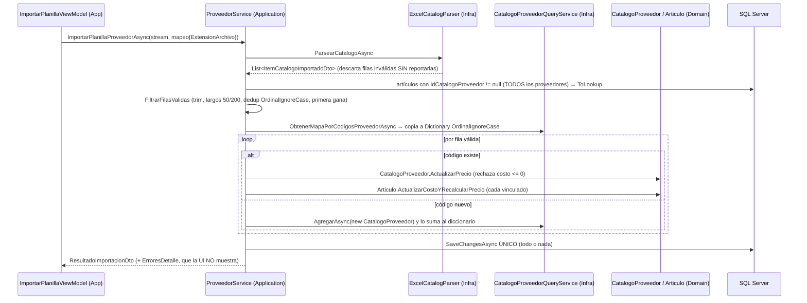
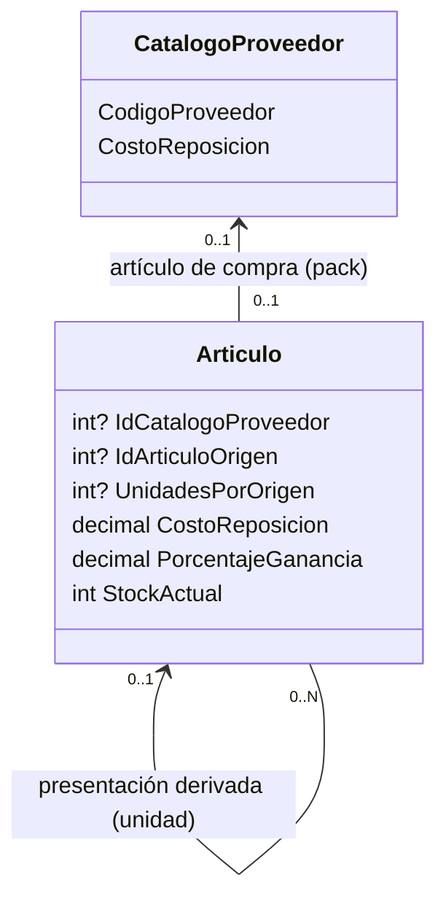

# Handoff: Importador de planillas, precios y stock por presentaciones

> **Para el agente que lea esto:** este archivo resume las sesiones de análisis del 2 al 5 de octubre de 2026 sobre el Módulo 2.2 (importador de catálogos) y su relación con artículos y stock. Contiene el estado del repositorio, los hallazgos verificados en el código, las conclusiones acordadas, las que siguen pendientes de decisión y un plan de trabajo por fases.
>
> **Revisión del 5 de octubre:** se contrastó el handoff contra el código de `origin/main` y contra la copia local. Los cambios respecto de la versión original están en la sección 9.
>
> **Cómo usarlo:** en una sesión nueva de Claude Code, pedí: *"Leé `@docs/auditorias/handoff-importador-precios-stock.md` y proponé el plan de la Fase 0 en plan mode"*.

---

## 0. Reglas de trabajo (obligatorias)

Además de `AGENTS.md` (las 10 Leyes, el protocolo de lectura jerárquica y el bucle de verificación) y del `CLAUDE.md` (modo pedagógico), en esta línea de trabajo rigen estas reglas acordadas con el usuario:

1. **Explicar y planificar antes de editar.** Cada fase empieza en *plan mode*, con un diagrama Mermaid del flujo afectado y una tabla de archivos por capa. No se edita código hasta que el usuario apruebe.
2. **Pasos chicos, capa por capa**, con el diff explicado: Dominio → Aplicación → Infraestructura → UI → Tests.
3. **Sin commits, ramas, pushes ni PRs** salvo pedido explícito. Los PRs los abre el estudiante para la revisión cruzada con su compañero.
4. **Sin subagentes que escriban código.** Solo se admiten para lecturas o auditorías.
5. **Las decisiones marcadas como PENDIENTE (sección 4) se preguntan antes de implementar.** No se resuelven por defecto.
6. **Propiedad del código** (roadmap): el importador, `Proveedor`, `CatalogoProveedor` y Compras son de **Pablo**. `Articulo`, Catálogo/Inventario y el POS son de **Lucas**. Los cambios que crucen esa frontera se señalan para coordinarlos.
7. **Se respeta la coautoría de Claude** (decisión del 5 de octubre). Los commits y PRs hechos con el agente conservan el trailer `Co-Authored-By` y la línea de atribución. No se desactiva `attribution` ni se reescribe historia para quitarla.

---

## 1. Estado del repositorio (al 4 de octubre de 2026)

### GitHub (`origin/main`)

| Commit | Contenido | Nota |
|---|---|---|
| `99788b3` | PR #4: robustez del importador (normalización, deduplicación, `ToLookup`, `catch` filtrado) | Mergeado por squash; CI en verde |
| `7a6ac64` | PR #3: parseo de precios es-AR (`ParseadorPrecioTexto`) y tipo CSV/XLSX | Mergeado por squash; CI en verde. Tiene el trailer `Co-authored-by: Claude`, que **se conserva** (regla 7) |
| `2bf8d64` | PR #5: hook `SessionStart` en `.claude/` para sesiones cloud | Se decidió mantenerlo |
| `8fd2900` | docs: actualizar README | Último commit presente en la copia local |

El CI (`.github/workflows/ci.yml`, `windows-latest`) corre `build` Release, `test` completo y `dotnet format --verify-no-changes`. **No** corre `scripts/audit-xaml.ps1`.

### Copia local (`C:\Users\lucas\Proyectos\retail`)

- `main` está **3 commits atrás** de `origin/main` (verificado con `git rev-list --count main..origin/main`).
- **Ruido de finales de línea:** el entorno cloud veía cientos de archivos modificados, pero en la copia local (Windows, `core.autocrlf=true` en la configuración de sistema de Git) `git status` muestra solo 5 entradas. El único cambio real es `docs/MAPA_DEL_PROYECTO.md`. No hay `.gitattributes`.
- Archivos sin seguimiento: `CLAUDE.md`, `docs/auditorias/auditoria-importador-excel-actualizacion-precios.md`, `docs/auditorias/solucion-optimizacion-importador-excel.md` y este handoff.
- El `.git/index.lock` huérfano **se eliminó el 5 de octubre**.
- **Conflicto previsto:** el cambio local de `MAPA_DEL_PROYECTO.md` y el PR #3 modifican **la misma línea** (fila "Lector Masivo Excel"). El remoto agrega `ParseadorPrecioTexto.cs`; la copia local agrega enlaces a las auditorías. Al sincronizar hay que unir ambos textos y enlazar `solucion-optimizacion-importador-excel.md` como *propuesta evaluada (ver handoff)*, no como "diseño".
- `.claude/hooks/session-start.sh` (PR #5) tiene finales **LF** y debe conservarlos: corre en Linux en las sesiones cloud.

---

## 2. Cómo funciona hoy el importador (post PRs #3 y #4)



Archivos clave:

- `src/Retail.Application/Services/ProveedorService.cs`: `ImportarPlanillaProveedorAsync`, `FiltrarFilasValidas`, `IncorporarArticulosATiendaAsync`, `VincularArticuloACatalogoAsync`.
- `src/Retail.Infrastructure/ExternalServices/Excel/ExcelCatalogParser.cs` y `ParseadorPrecioTexto.cs`.
- `src/Retail.Infrastructure/Persistence/Services/CatalogoProveedorQueryService.cs`.
- `src/Retail.Domain/Entities/Articulo.cs` (`CalcularPrecioVenta`, `ActualizarCostoYRecalcularPrecio`, `VincularCatalogoProveedor`) y `CatalogoProveedor.cs` (`ActualizarPrecio`).
- `src/Retail.App/ViewModels/Proveedores/ImportarPlanillaViewModel.cs` y `src/Retail.App/Views/Dialogs/ImportarPlanillaDialog.xaml`.
- Configuraciones: `ArticuloConfiguration.cs` (índice único filtrado en `codigo_barras`; en `id_catalogo_proveedor` hay un índice **no único** creado por convención de EF para la FK, pero **no** un índice único filtrado) y `CatalogoProveedorConfiguration.cs` (UK `(id_proveedor, codigo_proveedor)` filtrada por `deleted_at IS NULL`).

---

## 3. Backlog de hallazgos (verificados en el código de `main`)

| ID | Hallazgo | Dónde | Estado | Dueño |
|---|---|---|---|---|
| H-01 | `ErroresDetalle` se calcula, pero el diálogo solo muestra el contador `FilasConError` | `ImportarPlanillaDialog.xaml`, `ImportadorCatalogosViewModel.cs` | **Resuelto** (Fase 1, commit `e47cbdd`): lista con scroll en el diálogo | Pablo |
| H-02 | Los números de fila del reporte (`i + 1` sobre la lista parseada) no coinciden con los de la planilla: falta el encabezado y las filas que descartó el parser | `ProveedorService.FiltrarFilasValidas` | **Resuelto** (Fase 1, commit `e47cbdd`): `NumeroFila` real en `ItemCatalogoImportadoDto` | Pablo |
| H-03 | El parser descarta filas con `continue` sin reportarlas (precio ilegible, negativo, campos vacíos) | `ExcelCatalogParser.cs` | **Resuelto** (Fase 1, commit `e47cbdd`): `ResultadoParseoCatalogoDto.FilasDescartadas` con el motivo | Pablo |
| H-04 | La barra de progreso va de 0 a 100, pero recibe la cantidad de filas leídas | `ImportarPlanillaViewModel.cs`, `ImportarPlanillaDialog.xaml` | **Resuelto** (Fase 1, commit `e47cbdd`): barra indeterminada + "N filas leídas" | Pablo |
| H-05 | `MapeoColumnasDto.FilaInicial` se valida y se muestra, pero el parser la ignora (`useHeaderRow: true` fijo) | `ExcelCatalogParser.cs` | **Resuelto** (Fase 1, commit `e47cbdd`): renombrada a `FilaEncabezado` (por defecto 1), editable en el diálogo; encabezados sin distinguir mayúsculas, acentos ni espacios | Pablo |
| H-06 | `CatalogoProveedor` se escribe desde un *query service* (`AgregarAsync`/`ActualizarAsync`), saltando la raíz `Proveedor` (Ley 2, CQRS) | `ICatalogoProveedorQueryService`, `CatalogoProveedorQueryService.cs` | Abierto (deuda de diseño) | Pablo |
| H-07 | Invariante de costo inconsistente: un ítem existente con costo 0 se rechaza (`ActualizarPrecio` exige > 0); un ítem nuevo con costo 0 se crea (inicializador con setters públicos). La base admite >= 0 | `CatalogoProveedor.cs`, `ProveedorService.cs` | Abierto, requiere decisión D-05 | Pablo |
| H-08 | `ActualizarCostoYRecalcularPrecio` asigna `CostoReposicion` antes de validar (si `CalcularPrecioVenta` lanza, queda estado parcial) | `Articulo.cs` | Abierto | Lucas |
| H-09 | Redondeo bancario implícito: `Math.Round(x, 2)` usa `ToEven` (2,345 da 2,34) | `Articulo.CalcularPrecioVenta` | Abierto, requiere decisión D-06 | Lucas |
| H-10 | Ambigüedad de `"12.500"`: se resuelve con una heurística fija a favor de es-AR. Un CSV exportado en inglés multiplicaría precios × 1000 sin error | `ParseadorPrecioTexto.cs` | Abierto, requiere decisión D-04 | Pablo |
| H-11 | `IncorporarArticulosATiendaAsync` omite en silencio los ítems ya vinculados (devuelve `Task`, sin informe) | `ProveedorService.cs` | **Resuelto** (Fase 1, commit `e47cbdd`): devuelve `ResultadoIncorporacionDto` (incorporados y omitidos) | Pablo |
| H-12 | `VincularArticuloACatalogoAsync` vincula y copia el costo del ítem tal cual: un artículo "unidad" vinculado a un ítem "pack x100" recibe el costo del pack | `ProveedorService.cs`, `Articulo.VincularCatalogoProveedor` | Abierto, se resuelve con el modelo de la sección 5 | Ambos |
| H-13 | El explorador elige el artículo vinculado con `GroupBy(...).First()` sin orden definido | `CatalogoProveedorQueryService.cs` | Abierto, depende de la sección 5 | Pablo |
| H-14 | Se cargan todos los artículos vinculados de **todos** los proveedores, con tracking. Solución propuesta: filtrar por proveedor a través de la navegación (ver sección 6.1) | `ProveedorService.ImportarPlanillaProveedorAsync` | **Resuelto** (Fase 2): filtro por navegación (sección 6.1). Verificado en LocalDB: con 2.000 artículos de otro proveedor, solo se cargan los del proveedor importado | Pablo (toca la consulta de `Articulo`: coordinar con Lucas) |
| H-15 | El "streaming" termina en el parser: se materializa toda la `List` y todas las entidades quedan en el Change Tracker. No está medido contra RNF-03 (≤ 300 MB) | Parser y servicio | **Medido** (Fase 2): 5.000 filas de punta a punta retienen ≈ 13 MB (4 % de RNF-03). Tiempo típico 3,9–4,6 s en LocalDB, con un caso aislado de 28,5 s atribuible al entorno | Pablo |
| H-16 | `PreciosActualizados` cuenta artículos tocados aunque el costo no haya cambiado. Comparar contra el costo **de cada artículo** (`articulo.CostoReposicion != nuevoCosto`), no contra el del catálogo: un artículo editado a mano puede tener otro costo | `ProveedorService.cs` | **Resuelto** (Fase 1, commit `e47cbdd`) | Pablo |
| H-17 | El PR #4 agregó el chequeo de "ya vinculado" solo en `IncorporarArticulosATiendaAsync`. `VincularArticuloACatalogoAsync` no chequea nada, así que por esa vía todavía se crean vínculos 1 a N, en contra de la regla 1 de la sección 5.2 | `ProveedorService.VincularArticuloACatalogoAsync` | **Resuelto** (Fase 1, commit `e47cbdd`): `DomainException` si el ítem ya tiene otro artículo; revincular el mismo sigue permitido. El índice único llega en la Fase 3 | Pablo |
| H-18 | Condición de carrera en `ImportadorCatalogosViewModel`: asignar `ProveedorActivo` dispara una carga asíncrona del catálogo que pone `MensajeError = null`; si termina después de que un comando escribió un error, lo borra. Hace intermitente el test `IncorporarSeleccionadosCommand_SinElementosSeleccionados_EstableceMensajeDeError` (falló 1 de 4 corridas). Detectado el 5 de octubre al verificar la Fase 2 | `ImportadorCatalogosViewModel.OnProveedorActivoChanged` | Abierto | Pablo |

**Resueltos por los PRs #3 y #4** (no volver a trabajarlos): precios en texto es-AR, lectura de CSV, mayúsculas contra collation, duplicados en la planilla, `catch` vacío, `ToDictionary` con claves repetidas, largos que hacían fallar el `SaveChanges`.

---

## 4. Decisiones PENDIENTES (preguntar al usuario antes de implementar)

| ID | Pregunta | Opciones | Recomendación de la sesión |
|---|---|---|---|
| D-01 | Stock de presentaciones (pack y unidad) | A) stocks separados + fraccionamiento explícito · B) stock único en unidad base · C) A con fraccionamiento automático en el POS | **A**, con el POS *ofreciendo* abrir un pack cuando no alcanzan los sueltos (no lo hace solo) |
| D-02 | ¿Registrar los movimientos de stock (`MovimientoStock`)? | Sí (tipo, artículo, cantidad, usuario, fecha) / No (solo `StockActual`) | **CERRADA (5 de octubre): No.** La ERS no lo pide (verificado: no menciona movimientos de stock ni kardex). Queda como mejora documentada (YAGNI) |
| D-03 | ¿Un artículo derivado puede salir de más de un origen? | No (`IdArticuloOrigen` alcanza) / Sí (tabla de presentaciones) | **No**, por ahora |
| D-04 | Formato numérico de planillas en texto | Heurística es-AR actual / selector de formato por proveedor / alerta de variación abrupta de costo (H7 de la auditoría local) | Selector por proveedor, más alerta de variación como red de seguridad |
| D-05 | ¿Un ítem de proveedor puede costar $0 (bonificados)? | Sí (unificar en ≥ 0) / No (unificar en > 0 y reportarlo) | Unificar la regla en el dominio, en un solo lugar |
| D-06 | Modo de redondeo del precio de venta | `ToEven` (actual, implícito) / `AwayFromZero` | `AwayFromZero` explícito, por convención comercial |
| D-07 | Deduplicación: ¿qué fila gana? | Primera (PR #4) / Última (propuesta en `solucion-optimizacion-importador-excel.md`) | Decidir y documentar. Cualquiera sirve si se reporta |
| D-08 | Transacción única contra lotes | Ver sección 6 | **CERRADA (Fase 2): no se implementa.** La medición de H-15 da ≈ 13 MB para 5.000 filas, así que los lotes no se justifican. Si en el futuro hiciera falta, rigen estas condiciones: Dos condiciones obligatorias: **(a)** Ley 1: `ProveedorService` (Application) no puede tocar `RetailDbContext.ChangeTracker`; habría que exponer la limpieza en `IUnitOfWork`. **(b)** El DbContext es **compartido por toda la app** (los servicios Scoped se resuelven desde la raíz; el único `CreateScope()` está en `App.xaml.cs:139`). `ChangeTracker.Clear()` desvincularía las entidades de otras pantallas, así que la importación necesitaría **su propio scope de DI** |
| D-09 | Precisión del costo unitario derivado | `decimal(18,2)` actual / `decimal(18,4)` para costos y redondeo solo del precio | `(18,4)` en `costo_reposicion` si se implementan presentaciones |

---

## 5. Conclusiones de modelo

### 5.1 Cardinalidad artículo ↔ ítem de proveedor (ACORDADO en el razonamiento)

- Artículo → ítem de proveedor: **0..1**. Las artesanías y los servicios no tienen proveedor; si hay vínculo, es uno.
- Ítem de proveedor → artículos: **0..N** en el negocio, por el **fraccionamiento**. Ejemplo: el proveedor vende sobres en pack x100 y la tienda los vende por pack y por unidad.
- La regla "un ítem, un artículo" **no es una regla del negocio**. Hay que descartar cualquier propuesta anterior que la imponga sin el modelo de 5.2.

### 5.2 Presentaciones (PROBLEMA ACORDADO; modelo PROPUESTO, sujeto a D-01, D-03 y D-09)

**Decisión del 5 de octubre:** vender por unidad artículos que se compran por pack (y que el catálogo del proveedor muestra por pack) es un problema **legítimo y acordado**. Su solución **debe expresarse en la ERS** antes de implementarse. Hoy la ERS no menciona packs, presentaciones ni fraccionamiento (verificado), así que el primer paso de la Fase 3 es redactar el RF nuevo o ajustar RF-04, RF-05 y RF-10.

La conversión pack ↔ unidad es una relación **entre artículos**, no entre un artículo y el catálogo. Así hay una sola fuente de verdad, que resuelve precio y stock a la vez:



Reglas propuestas (todas en el dominio, Ley 8):

1. Solo el **artículo de compra** (el pack) se vincula al ítem del proveedor. Con eso, el **índice único filtrado** en `id_catalogo_proveedor` (`IS NOT NULL AND deleted_at IS NULL`) vuelve a ser válido y resuelve H-13.
2. Un artículo derivado tiene `IdArticuloOrigen` y `UnidadesPorOrigen` (≥ 1, con CHECK constraint). No puede tener a la vez `IdCatalogoProveedor`, ni ser origen de otro (un solo nivel).
3. Costo del derivado = costo del origen / `UnidadesPorOrigen`. Al importar, el costo del pack se actualiza y **se propaga** a sus derivados, cada uno con su propio markup.
4. Stock independiente por artículo (D-01 A). Compras incrementa el artículo comprado; el POS descuenta el artículo vendido.
5. Caso de uso nuevo `FraccionarAsync(idArticuloOrigen, cantidad)`: un servicio de dominio que resta `cantidad` del origen y suma `cantidad × UnidadesPorOrigen` al derivado, en **una** transacción (dos agregados; está justificado en un monolito y hay que defenderlo).
6. `DescontarStock` e `IncrementarStock` (previstos en el roadmap, Etapa 4) **todavía no existen**: `StockActual` es un setter público. Se crean con validación (`StockInsuficienteException`) como parte de esta fase.

7. Al importar, el filtro de H-14 (sección 6.1) trae solo los artículos de compra, porque los derivados no tienen `IdCatalogoProveedor`. Para propagar el costo a los derivados se usa la misma técnica, otro JOIN sin listas: `a.ArticuloOrigen != null && a.ArticuloOrigen.CatalogoProveedor != null && a.ArticuloOrigen.CatalogoProveedor.IdProveedor == id`.

Archivos afectados: **la ERS (obligatorio, primer paso)**, `Articulo.cs`, `ArticuloConfiguration.cs`, una migración EF, `InventarioService` (alta/edición de derivados), `ProveedorService` (propagación al importar y vinculación), la futura `CompraService` y `VentaService`, `docs/DER.mmd`, `docs/MAPA_DEL_PROYECTO.md` y `docs/SISTEMA_DE_PERSISTENCIA.md`.

---

## 6. Evaluación de la propuesta `docs/auditorias/solucion-optimizacion-importador-excel.md`

Esa propuesta, de otro agente y escrita **antes** de los PRs #3 y #4, plantea un pipeline por lotes de 1.000 filas con `SaveChangesAsync` + `ChangeTracker.Clear()` por lote. Evaluación de esta sesión:

| Punto de la propuesta | Evaluación |
|---|---|
| Rechazar Stored Procedures (Ley 8) | ✅ De acuerdo |
| `ToLookup` y deduplicación (H2/H3 locales) | ✅ Ya resuelto por el PR #4 (que conserva la primera fila; la propuesta, la última → D-07) |
| Límite de 2.100 parámetros (H1 local) | ✅ **Falso positivo, verificado.** EF Core 8.0.11 traduce `Contains` sobre colecciones parametrizadas con `OPENJSON` (un solo parámetro) en SQL Server 2016+. El test de integración de la sección 6.2 pasa con 3.000 códigos. No hace falta *chunking* |
| `SaveChanges` por lote | ❌ Así como está, **rompe la atomicidad**: si falla el lote 3, los lotes 1 y 2 quedan guardados (importación a medias) y el mensaje "Importación cancelada" queda engañoso. Si la medición de H-15 justifica lotes, envolverlos en una transacción explícita, con las condiciones de D-08 |
| `_retailDbContext.ChangeTracker.Clear()` en `ProveedorService` | ❌ Viola la Ley 1 (no compila: Application no ve `RetailDbContext`) y vacía un DbContext compartido por toda la app (ver D-08) |
| Lista `idsCatalogosEncontrados.Contains(...)` para buscar artículos | ❌ Innecesaria: el filtro por navegación de H-14 hace lo mismo con un JOIN y sin listas |
| Promesas "memoria O(1), < 25 MB" | ❌ Sin respaldo: el parser carga toda la planilla en una `List` antes de los lotes. Medir (H-15) antes de afirmar cifras |
| Contar solo costos que cambiaron (H4 local) | ✅ Coincide con H-16 (resuelto en la Fase 1) |
| Costo $0 (H5 local) | ✅ Coincide con H-07 / D-05 |
| Lectura previa de cabeceras para el mapeo (H6 local) | 💡 Buena mejora de UX, opcional |
| Alerta por variación abrupta de costos (H7 local) | 💡 Muy recomendable; mitiga H-10 |

### 6.1 Filtro por navegación para H-14 (acordado como solución)

```csharp
var articulosVinculados = await _articuloRepository.FindAsync(
    a => a.CatalogoProveedor != null && a.CatalogoProveedor.IdProveedor == mapeo.IdProveedor,
    includeDeleted: false,
    cancellationToken);
```

SQL Server resuelve el filtro con un `JOIN` entre `ARTICULOS` y `CATALOGOS_PROVEEDORES` y **un solo parámetro escalar** (`@IdProveedor`), sin listas. Implicaciones:

- **Índices:** usa el índice no único de la FK `id_catalogo_proveedor` y la UK `(id_proveedor, codigo_proveedor)`, que empieza por `id_proveedor`.
- **Soft delete:** el filtro global se aplica también al catálogo dentro del JOIN. Los artículos vinculados a ítems borrados quedan afuera; es coherente con el mapa de catálogos, que tampoco los incluye.
- **Capas:** el predicado vive en Application, usa solo propiedades del Dominio y reutiliza `IRepository<T>.FindAsync`. No hace falta un método nuevo.
- **Tracking:** se mantiene, porque las entidades se modifican.
- **Precisión:** trae los artículos **del proveedor**, no solo los de la planilla. Es aceptable para una librería.
- **Tests:** con NSubstitute el predicado nunca se ejecuta, así que un unit test no puede validarlo. Requiere un test de integración en LocalDB: `FindAsync_FiltrandoPorProveedorViaNavegacion_RetornaSoloArticulosDeEseProveedor`.

### 6.2 El test de los 2.100 parámetros (redefinido)

El filtro de H-14 **no** resuelve esta duda. La única consulta que envía una lista es la de catálogos por código (`ObtenerMapaPorCodigosProveedorAsync`, con `codigoList.Contains(...)`). Se descartó evitar la lista trayendo todo el catálogo del proveedor: con planillas parciales trae miles de filas de más, y cambiar el diseño sin medir contradice "medir antes de optimizar".

Test de integración en `CatalogoProveedorQueryServiceTests.cs` (nuevo, LocalDB, mismo patrón que `ArticuloQueryServiceTests`):

- `ObtenerMapaPorCodigosProveedorAsync_ConMasDe2100Codigos_RetornaCoincidenciasSinExcepcion`: 2.500 ítems persistidos, se piden 3.000 códigos y vuelven exactamente 2.500.
- No se afirma sobre el SQL generado (`OPENJSON`), porque es un detalle de implementación.

Para qué sirve: convierte la creencia en evidencia y **protege ante una actualización**. La traducción de `Contains` cambió entre versiones de EF (constantes hasta EF 7, `OPENJSON` en EF 8, otra estrategia en versiones posteriores), y EF 8 sale de soporte en noviembre de 2026.

**Supuesto de despliegue a documentar** en `SISTEMA_DE_PERSISTENCIA.md`: `OPENJSON` requiere un nivel de compatibilidad de la base **≥ 130**. Una base restaurada con un nivel inferior haría fallar la consulta, y el test contra LocalDB no lo detecta.

**Resultado (Fase 1, commit `e47cbdd`):** el test pasa contra LocalDB: 3.000 códigos en una sola consulta, sin excepción. **H1 de la auditoría local queda confirmado como falso positivo.** El supuesto de compatibilidad ≥ 130 quedó documentado en `SISTEMA_DE_PERSISTENCIA.md` (Ley 4 de persistencia).

---

## 7. Plan de trabajo por fases

Cada fase: plan mode → aprobación → implementación incremental → verificación (bucle de `AGENTS.md`) → nota en `wiki/` → PR abierto por el estudiante.

### Fase 0: Puesta a punto (sin código de producto)

Orden corregido el 5 de octubre: **primero sincronizar, después normalizar**.

1. ~~Borrar `.git/index.lock`~~ (hecho el 5 de octubre).
2. ~~Sincronizar la copia local~~ (hecho el 5 de octubre: `main` al día; conflicto del MAPA resuelto uniendo ambos textos).
3. ~~Commitear `CLAUDE.md`, las dos auditorías locales y este handoff~~ (hecho: rama `docs/handoff-importador`, commit `bc113ac`, con atribución de Claude).
4. Normalizar los finales de línea en **un PR propio, coordinado con Pablo** (toca prácticamente todos los archivos y puede generar conflictos en sus ramas). El `.gitattributes` debe exceptuar los scripts de shell:
   ```gitattributes
   * text=auto eol=crlf
   *.sh text eol=lf
   ```
   Explicar el efecto (`git add --renormalize .`) antes de aplicarlo.

Se **descartaron** dos pasos de la versión original: desactivar `attribution` en `.claude/settings.json` y reescribir `7a6ac64` con force push (regla 7).

### Fase 1: Correcciones rápidas del importador (Pablo) — ✅ COMPLETADA
H-01, H-02 (número de fila real en `ItemCatalogoImportadoDto`), H-03 (descartes del parser en el reporte), H-04, H-05, H-11, H-16, H-17, el test de compatibilidad de la sección 6.2 y el supuesto del nivel de compatibilidad ≥ 130 en `SISTEMA_DE_PERSISTENCIA.md`.

**Estado (5 de octubre):** implementada por Lucas con el agente en la rama `fix/importador-fase-1` (commits `e47cbdd` código y `ffd69b0` wiki). El código es de Pablo según el roadmap: **él revisa el PR**. Verificación de cierre: `audit-xaml` OK, build Release sin advertencias, **488/488 tests**, `dotnet format` sin cambios.

Cambios de contrato que Pablo debe conocer:
- `IExcelCatalogParser.ParsearCatalogoAsync` devuelve `ResultadoParseoCatalogoDto { Items, FilasDescartadas }`.
- `ItemCatalogoImportadoDto` tiene `required int NumeroFila`.
- `MapeoColumnasDto.FilaInicial = 2` pasó a `FilaEncabezado = 1` (la fila donde están los encabezados).
- `IProveedorService.IncorporarArticulosATiendaAsync` devuelve `ResultadoIncorporacionDto`.
- Una columna obligatoria inexistente lanza `InvalidDataException` (antes devolvía 0 filas en silencio).

Hallazgo de los tests: MiniExcel entrega las filas vacías intermedias en XLSX y CSV, así que contar filas da el número real. La nota [`wiki/05-casos-de-uso-y-flujos/flujo-importador-excel.md`](../../wiki/05-casos-de-uso-y-flujos/flujo-importador-excel.md) se reescribió: la anterior describía un diseño (`IAsyncEnumerable`, lotes de 500, memoria O(1)) que no coincidía con el código.

### Fase 2: Medición y transacción (Pablo) — ✅ COMPLETADA
H-14 con el filtro de la sección 6.1 y su test de integración (es barato y no depende de medir). Después, un test con 5.000 filas sintéticas (roadmap: < 3 s, ≤ 300 MB). Solo si no cumple, implementar D-08 (lotes dentro de una transacción, con las condiciones (a) y (b)).

**Estado (5 de octubre):** rama `perf/importador-fase-2`. Nuevo `ImportacionPlanillaIntegrationTests.cs`: primeros tests **de punta a punta** del importador (`ProveedorService` con repositorios, Unit of Work, query service y parser reales, contra LocalDB).

| Corrida | Tiempo total | Memoria retenida | Artículos cargados |
|---|---|---|---|
| 1 | 4.624 ms | 12,7 MB | 2.500 |
| 2 | 28.507 ms | 12,8 MB | 2.500 |
| 3 | 3.869 ms | 12,7 MB | 2.500 |
| 4 | 4.471 ms | 12,8 MB | 2.500 |

Escenario: 2.500 renglones existentes con artículo vinculado, 2.500 nuevos y 2.000 artículos de otro proveedor como ruido. Conclusiones:
- **Memoria:** estable y muy por debajo de RNF-03 → **D-08 cerrada**. El test afirma < 100 MB.
- **H-14:** se cargan 2.500 artículos en lugar de 4.500. El test lo afirma contando las entradas `Articulo` del ChangeTracker.
- **Tiempo:** **no se afirma**, solo se informa en la salida del test. En la corrida 2 también la preparación de datos fue lenta (el test entero tardó 1 min 8 s, contra 9–11 s en las demás), lo que apunta a LocalDB o al disco. Un límite fijo volvería el test *flaky* en el CI. RNF-02 exige no bloquear la UI (la importación corre en `Task.Run`), no un tiempo fijo, y el criterio de < 3 s del roadmap aplica al parseo, que cubre `ExcelCatalogParserTests`.
- **Posible optimización futura (no medida):** los `UpdateAsync` sobre entidades ya seguidas marcan todas las columnas como modificadas; sin ellos, EF generaría `UPDATE` solo de las columnas que cambian. Evaluar solo si el tiempo llegara a ser un problema real.

### Fase 3: Presentaciones y stock (Lucas + Pablo, después de D-01, D-03 y D-09)
1. **Redactar en la ERS** el requisito de presentaciones y fraccionamiento (RF nuevo o ajuste de RF-04/RF-05/RF-10) y acordarlo con Pablo.
2. Modelo de la sección 5.2, `DescontarStock` / `IncrementarStock`, `FraccionarAsync`, propagación de costos a los derivados, migración con índice único filtrado y CHECK, ajustes en el vínculo (H-12, H-13, H-17) y actualización de DER, MAPA y SISTEMA_DE_PERSISTENCIA.

### Fase 4: Deuda de diseño
H-06 (escrituras por la raíz `Proveedor`), H-07 + D-05, H-08, H-09 + D-06, H-10 + D-04.

---

## 8. Referencias

- `AGENTS.md`, `CLAUDE.md`, `docs/MAPA_DEL_PROYECTO.md`, `docs/roadmap/etapa-2-catalogo-stock.md`, `docs/roadmap/etapa-4-pos-compras.md`.
- `docs/auditorias/auditoria-importador-excel-actualizacion-precios.md` y `docs/auditorias/solucion-optimizacion-importador-excel.md` (auditoría y propuesta de otro agente, anteriores a los PRs #3 y #4).
- PRs #3 y #4 en GitHub (`lucaskruzolek/retail`), con su descripción de cambios.
- Informe pedagógico de la sesión, en claude.ai: *"Importador de planillas y actualización de precios"*. **Desactualizado** en un punto: todavía propone "un ítem, un artículo" sin el modelo de presentaciones de la sección 5.

---

## 9. Registro de cambios de la revisión del 5 de octubre

| Sección | Cambio |
|---|---|
| 0 | Nueva regla 7: se respeta la coautoría de Claude |
| 1 | El ruido CRLF era del entorno cloud, no de la copia local. `index.lock` eliminado. Conflicto previsto en el MAPA. El hook `.sh` debe quedar en LF |
| 2 | Corregido: `id_catalogo_proveedor` sí tiene un índice no único por convención de EF |
| 3 | H-14 con solución propuesta; H-16 precisado (comparar contra el costo del artículo); nuevo H-17 |
| 4 | D-02 cerrada (No, por YAGNI); D-08 con las condiciones de Ley 1 y scope de DI |
| 5.2 | Problema pack/unidad acordado; la ERS pasa a ser obligatoria y es el primer paso; regla 7 sobre la propagación a derivados |
| 6 | Más filas de evaluación; nuevas 6.1 (filtro por navegación) y 6.2 (test de los 2.100 redefinido) |

### Actualización posterior del 5 de octubre: Fase 0 y Fase 1 completadas

| Sección | Cambio |
|---|---|
| 3 | H-01, H-02, H-03, H-04, H-05, H-11, H-16 y H-17 marcados como resueltos (commit `e47cbdd`) |
| 6 | H1 local confirmado como falso positivo por el test de integración. Se corrigieron cuatro filas de la tabla de evaluación que habían quedado fuera de ella |
| 7 | Fase 0: pasos 1 a 3 hechos (el 4, `.gitattributes`, sigue pendiente). Fase 1 completada, con los cambios de contrato para la revisión de Pablo |
| 7 | Fase 0 reordenada y sin los pasos de atribución; H-17 y el test de compatibilidad en Fase 1; H-14 adelantado en Fase 2; Fase 3 empieza por la ERS |

### Actualización del 5 de octubre: Fase 2 completada

| Sección | Cambio |
|---|---|
| 3 | H-14 resuelto (filtro por navegación, verificado en LocalDB). H-15 medido: ≈ 13 MB para 5.000 filas |
| 4 | D-08 cerrada: los lotes no se justifican con la memoria medida |
| 7 | Fase 2 completada, con la tabla de las cuatro corridas y la decisión de no afirmar el tiempo |

### Hallazgo durante la verificación de la Fase 2

| Sección | Cambio |
|---|---|
| 3 | Nuevo H-18: condición de carrera en `ImportadorCatalogosViewModel` que vuelve intermitente un test |
| — | `main` no compilaba desde el PR #8 (módulo 3.1): namespace de `CajaView`, tres estilos XAML inexistentes en los diálogos de Caja, un test de navegación desactualizado y formato. Se corrigió en una rama aparte, `fix/build-main-caja` (commit `605df15`), para que lo revise Pablo |
