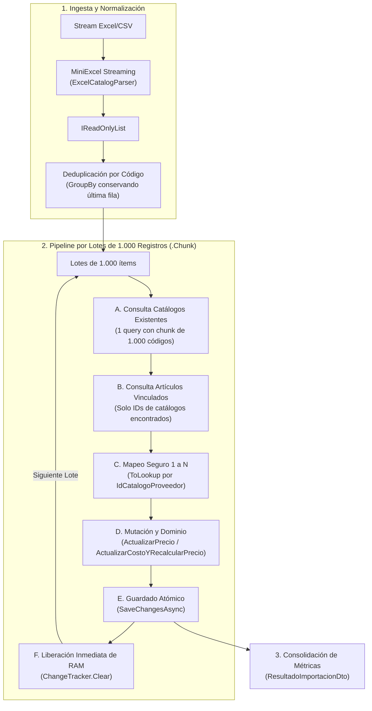

# Solución Arquitectónica: Optimización Integral del Importador Masivo de Catálogos y Recálculo de Precios

**Proyecto:** Retail (Sistema ERP & Punto de Venta para Librería)  
**Módulo:** Etapa 2 — Catálogo y Stock (Módulo 2.2: Proveedores e Importador Masivo)  
**Requisitos Vinculados:** [`RF-05`](file:///c:/Users/lucas/Proyectos/retail/docs/ERS%20-%20Libreria%20POS.md#L229), [`RF-07`](file:///c:/Users/lucas/Proyectos/retail/docs/ERS%20-%20Libreria%20POS.md#L231), [`RNF-02`](file:///c:/Users/lucas/Proyectos/retail/docs/ERS%20-%20Libreria%20POS.md#L251), [`RNF-03`](file:///c:/Users/lucas/Proyectos/retail/docs/ERS%20-%20Libreria%20POS.md#L252)  
**Normativa Arquitectónica:** [`AGENTS.md`](file:///c:/Users/lucas/Proyectos/retail/AGENTS.md) (Ley 1, Ley 2, Ley 8, Principio Ponytail / Simplicidad Pragmática)  
**Fecha:** 2026-09-27  

---

## 1. Contexto y Diagnóstico del Problema

La funcionalidad de importación masiva de planillas de distribuidores mayoristas ([`ProveedorService.ImportarPlanillaProveedorAsync`](file:///c:/Users/lucas/Proyectos/retail/src/Retail.Application/Services/ProveedorService.cs#L152)) procesa listas de miles de productos mediante streaming diferido con `MiniExcel`, manteniendo la UI desacoplada en segundo plano (`Task.Run`).

Sin embargo, el análisis técnico y la auditoría del módulo revelaron tres cuellos de botella críticos en la persistencia y la memoria:

```
┌────────────────────────────────────────────────────────────────────────────────────────┐
│                               CUELLOS DE BOTELLA IDENTIFICADOS                          │
├────────────────────────────────┬───────────────────────────────────────────────────────┤
│ 1. Carga Indiscriminada de     │ _articuloRepository.FindAsync(a =>                    │
│    Artículos en Memoria        │    a.IdCatalogoProveedor != null)                      │
│                                │ Trae a RAM con tracking todos los artículos vinculados│
│                                │ de la tienda entera, aunque el Excel tenga 20 filas.  │
├────────────────────────────────┼───────────────────────────────────────────────────────┤
│ 2. Límite de 2.100 Parámetros  │ c.IdProveedor == idProveedor &&                       │
│    de SQL Server               │    codigoList.Contains(c.CodigoProveedor)             │
│                                │ Si la planilla supera los 2.100 códigos distintos,    │
│                                │ SQL Server arroja una SqlException fatal.             │
├────────────────────────────────┼───────────────────────────────────────────────────────┤
│ 3. Sobrecarga del Change       │ Acumular 5.000 entidades vivas en el DbContext causa  │
│    Tracker de EF Core          │ que el comparador de snapshots consuma tiempo de CPU  │
│                                │ cuadrático y dispare el uso de RAM.                  │
├────────────────────────────────┼───────────────────────────────────────────────────────┤
│ 4. Falla por Clave Duplicada   │ .ToDictionary(a => a.IdCatalogoProveedor!.Value)      │
│    en Diccionarios en Memoria  │ Si hay 2 artículos asociados al mismo catálogo mayor, │
│                                │ revienta con ArgumentException.                       │
├────────────────────────────────┼───────────────────────────────────────────────────────┤
│ 5. Riesgo de Duplicados en     │ Si la planilla Excel contiene códigos repetidos,      │
│    la misma Planilla Excel     │ la segunda aparición intenta insertar una fila nueva  │
│                                │ duplicando el índice único filtrado en base de datos. │
└────────────────────────────────┴───────────────────────────────────────────────────────┘
```

---

## 2. Evaluación Comparativa: Stored Procedure vs. Batching en C# (.NET 8)

Ante este escenario, se evaluó la conveniencia de reemplazar la lógica de aplicación por un **Stored Procedure (SP) con Table-Valued Parameter (TVP)** en SQL Server frente a un **Procesamiento por Lotes (*Batching*) en C#**.

### 2.1. Deficiencias y Riesgos del Enfoque por Stored Procedure

Aunque un SP ejecuta operaciones relacionales de forma inmediata, introduce graves riesgos operativos y contradicciones normativas:

1. **Bug Crítico de Afectación Masiva (Falso WHERE):**
   En implementaciones típicas de SP con `MERGE`, el paso de propagación de precios suele redactarse como:
   ```sql
   UPDATE a
   SET a.costo_reposicion = cp.costo_reposicion,
       a.precio_venta = ROUND(cp.costo_reposicion * (1.0 + (a.porcentaje_ganancia / 100.0)), 2)
   FROM dbo.ARTICULOS a
   INNER JOIN dbo.CATALOGOS_PROVEEDORES cp ON a.id_catalogo_proveedor = cp.id_catalogo
   WHERE cp.id_proveedor = @IdProveedor AND a.deleted_at IS NULL;
   ```
   **Peligro:** Este `WHERE` actualiza **todos los artículos del proveedor existentes en la base de datos**, recalculando productos que ni siquiera formaban parte de la planilla importada.
2. **Violación Flagrante de la Ley 8 de [`AGENTS.md`](file:///c:/Users/lucas/Proyectos/retail/AGENTS.md):**
   *La lógica de cálculo de precios de venta (`CostoReposicion * (1 + Markup/100)`) pertenece con exclusividad al Agregado [`Articulo.cs`](file:///c:/Users/lucas/Proyectos/retail/src/Retail.Domain/Entities/Articulo.cs) en `Retail.Domain`.* Trasladarla a T-SQL dispersa las reglas de negocio e invalida el encapsulamiento DDD.
3. **Peligros de Bloqueo del comando `MERGE`:**
   En SQL Server, `MERGE` sufre de problemas conocidos de concurrencia y deadlocks a menos que se fuerce con `WITH (HOLDLOCK)`.
4. **Fricción de Mantenimiento y Despliegue:**
   Requiere tipos de usuario (`CREATE TYPE AS TABLE`), scripts SQL no administrados por el Change Tracker de EF Core y mapeos ADO.NET de bajo nivel con `DataTable` y `SqlParameter.TypeName`.

### 2.2. Ventajas del Enfoque de Lotes en C# con `ChangeTracker.Clear()`

1. **Memoria Constante $O(1)$:** El consumo de RAM no depende del tamaño de la base de datos ni del tamaño de la planilla; se mantiene plano en $\approx 15\text{ a }25\text{ MB}$ (`RNF-03`).
2. **Respeto Estricto de las 10 Leyes:** Todo el cálculo de markup se ejecuta a través del método de dominio `Articulo.ActualizarCostoYRecalcularPrecio()`.
3. **Métricas Reales de Auditoría:** Permite discriminar con precisión matemática si un costo realmente varió para alimentar el reporte final (`ResultadoImportacionDto`).
4. **100% Tipado y Migrable:** Cero dependencias de dialectos SQL ad-hoc; funciona de forma transparente tanto en SQL Server local como en LocalDB y dobles de prueba.

---

## 3. Arquitectura de la Solución: Pipeline por Lotes (*Batching Pipeline*)



---

## 4. Especificación Técnica de Implementación

### 4.1. Persistencia: [`CatalogoProveedorQueryService.cs`](file:///c:/Users/lucas/Proyectos/retail/src/Retail.Infrastructure/Persistence/Services/CatalogoProveedorQueryService.cs)

Se adapta `ObtenerMapaPorCodigosProveedorAsync` para garantizar que ninguna consulta individual exceda los 1.000 parámetros de SQL Server:

```csharp
public async Task<IReadOnlyDictionary<string, CatalogoProveedor>> ObtenerMapaPorCodigosProveedorAsync(
    int idProveedor,
    IEnumerable<string> codigos,
    CancellationToken cancellationToken = default)
{
    var codigoList = codigos.Where(c => !string.IsNullOrWhiteSpace(c)).Distinct().ToList();
    var resultado = new Dictionary<string, CatalogoProveedor>(StringComparer.OrdinalIgnoreCase);

    if (codigoList.Count == 0)
    {
        return resultado;
    }

    // Particionado defensivo en bloques de 1.000 para respetar el límite de 2.100 parámetros de SQL Server
    foreach (var chunk in codigoList.Chunk(1000))
    {
        var lista = await _context.CatalogosProveedores
            .Where(c => c.IdProveedor == idProveedor && chunk.Contains(c.CodigoProveedor))
            .ToListAsync(cancellationToken);

        foreach (var item in lista)
        {
            resultado[item.CodigoProveedor] = item;
        }
    }

    return resultado;
}
```

Asimismo, en el método `ObtenerCatalogoPaginadoAsync` (Línea 58) se reemplaza el uso vulnerable de `.ToDictionary()` por un agrupamiento seguro:

```csharp
// Reemplazo defensivo para evitar crashes si existen relaciones 1 a N
var articulosMap = articulosVinculados
    .GroupBy(a => a.IdCatalogoProveedor)
    .ToDictionary(g => g.Key, g => g.First());
```

---

### 4.2. Caso de Uso: [`ProveedorService.cs`](file:///c:/Users/lucas/Proyectos/retail/src/Retail.Application/Services/ProveedorService.cs)

Se reestructura integralmente el método `ImportarPlanillaProveedorAsync` implementando:
1. Deduplicación previa del archivo en memoria.
2. Procesamiento por bloques de 1.000 filas.
3. Búsqueda focalizada únicamente de los artículos vinculados a los ítems del lote.
4. Mapeo seguro 1-a-N con `ToLookup`.
5. Auditoría real de variación de costos (`costoReposicion != nuevoCosto`).
6. Vaciado del Change Tracker al finalizar cada lote.

```csharp
public async Task<ResultadoImportacionDto> ImportarPlanillaProveedorAsync(
    Stream archivoStream,
    MapeoColumnasDto mapeo,
    IProgress<int>? progreso = null,
    CancellationToken cancellationToken = default)
{
    await _mapeoColumnasValidator.ValidateAndThrowAsync(mapeo, cancellationToken);

    var proveedor = await _proveedorRepository.GetByIdAsync(mapeo.IdProveedor, includeDeleted: false, cancellationToken);
    if (proveedor == null)
    {
        throw new DomainException($"No se encontró el proveedor con ID {mapeo.IdProveedor}.");
    }

    var cronometro = Stopwatch.StartNew();

    // 1. Ingesta diferida con MiniExcel
    var filasImportadas = await _excelCatalogParser.ParsearCatalogoAsync(archivoStream, mapeo, progreso, cancellationToken);

    // 2. Deduplicación en memoria: si el archivo tiene el mismo código repetido, se toma la última versión (Resuelve H3)
    var filasUnicas = filasImportadas
        .GroupBy(f => f.CodigoProveedor, StringComparer.OrdinalIgnoreCase)
        .Select(g => g.Last())
        .ToList();

    int filasProcesadas = 0;
    int nuevosRegistros = 0;
    int preciosActualizados = 0;
    int filasConError = 0;

    // 3. Procesamiento estructurado por bloques de 1.000 elementos (Resuelve H1, RAM y Change Tracker)
    foreach (var lote in filasUnicas.Chunk(1000))
    {
        cancellationToken.ThrowIfCancellationRequested();

        var codigosLote = lote.Select(x => x.CodigoProveedor).ToList();

        // A. Traer de la BD únicamente los catálogos correspondientes a este lote (1 sola consulta SQL)
        var mapCatalogos = await _catalogoQueryService.ObtenerMapaPorCodigosProveedorAsync(mapeo.IdProveedor, codigosLote, cancellationToken);

        // B. Traer de la BD ÚNICAMENTE los artículos vinculados a estos catálogos (Búsqueda focalizada)
        var idsCatalogosEncontrados = mapCatalogos.Values.Select(c => c.Id).ToList();
        var articulosVinculados = idsCatalogosEncontrados.Count > 0
            ? await _articuloRepository.FindAsync(
                a => a.IdCatalogoProveedor != null && idsCatalogosEncontrados.Contains(a.IdCatalogoProveedor.Value),
                includeDeleted: false,
                cancellationToken)
            : new List<Articulo>();

        // C. Mapeo seguro 1 a N para actualizar todos los artículos vinculados (Resuelve H2)
        var lookupArticulos = articulosVinculados.ToLookup(a => a.IdCatalogoProveedor!.Value);

        foreach (var item in lote)
        {
            try
            {
                if (mapCatalogos.TryGetValue(item.CodigoProveedor, out var catalogoExistente))
                {
                    bool costoCambio = catalogoExistente.CostoReposicion != item.PrecioCosto;

                    catalogoExistente.ActualizarPrecio(item.PrecioCosto, item.Descripcion, item.CodigoBarras);
                    await _catalogoQueryService.ActualizarAsync(catalogoExistente, cancellationToken);

                    // Actualizar todos los artículos que estén enlazados a este ítem
                    foreach (var articuloAsociado in lookupArticulos[catalogoExistente.Id])
                    {
                        articuloAsociado.ActualizarCostoYRecalcularPrecio(item.PrecioCosto);
                        await _articuloRepository.UpdateAsync(articuloAsociado, cancellationToken);

                        if (costoCambio)
                        {
                            preciosActualizados++;
                        }
                    }
                }
                else
                {
                    var nuevoCatalogo = new CatalogoProveedor
                    {
                        IdProveedor = mapeo.IdProveedor,
                        CodigoProveedor = item.CodigoProveedor,
                        CodigoBarras = item.CodigoBarras,
                        DescripcionProveedor = item.Descripcion,
                        CostoReposicion = item.PrecioCosto,
                        FechaActualizacion = DateTime.UtcNow
                    };
                    await _catalogoQueryService.AgregarAsync(nuevoCatalogo, cancellationToken);
                    nuevosRegistros++;
                }

                filasProcesadas++;
            }
            catch
            {
                filasConError++;
            }
        }

        // D. Guardar los cambios del lote atómicamente
        await _unitOfWork.SaveChangesAsync(cancellationToken);

        // E. Vaciar el Change Tracker para garantizar consumo plano de memoria (RNF-03)
        _retailDbContext.ChangeTracker.Clear();
    }

    cronometro.Stop();

    return new ResultadoImportacionDto
    {
        TotalFilasProcesadas = filasProcesadas,
        NuevosRegistros = nuevosRegistros,
        PreciosActualizados = preciosActualizados,
        FilasConError = filasConError,
        TiempoTranscurrido = cronometro.Elapsed
    };
}
```

---

## 5. Matriz de Cobertura de Requisitos y Mitigación de Riesgos

| Riesgo Técnico Original | Mecanismo de Mitigación Implementado | Garantía Arquitectural |
| :--- | :--- | :--- |
| **Excepción SQL por > 2.100 parámetros (H1)** | Particionado estricto con `chunk.Chunk(1000)`. | Ninguna consulta SQL generada supera los 1.000 parámetros `IN (...)`. |
| **Excepción de Clave Duplicada (H2)** | Reemplazo de `ToDictionary()` por `ToLookup()` en la vinculación. | Si un ítem de catálogo tiene múltiples artículos asociados, se actualizan todos sin excepciones. |
| **Falla por duplicados en el Excel (H3)** | `filasImportadas.GroupBy(f => f.CodigoProveedor).Select(g => g.Last())`. | Garantiza unicidad previa respetando el índice único compuesto `[IdProveedor, CodigoProveedor]`. |
| **Métricas irreales de precios actualizados (H4)** | Verificación booleana `costoCambio = catalogoExistente.CostoReposicion != item.PrecioCosto`. | Solo se contabilizan como actualizados aquellos artículos cuyo costo unitario realmente varió. |
| **Sobrecarga de RAM y CPU del Change Tracker** | Búsqueda focalizada por lote y `ChangeTracker.Clear()` al cerrar cada transacción. | Mantiene la RAM en $< 25\text{ MB}$, asegurando el cumplimiento de `RNF-03` ($\le 300\text{ MB}$). |
| **Bifurcación de reglas de negocio** | Regla pura de markup delegada a `Articulo.ActualizarCostoYRecalcularPrecio`. | Cumplimiento estricto de la **Ley 8** de Clean Architecture y DDD. |

---

## 6. Estrategia de Pruebas Automatizadas (xUnit)

Para consolidar la solución sin degradar la suite de pruebas existente, se proyectan los siguientes casos de prueba en [`tests/Retail.Application.UnitTests/Services/ProveedorServiceTests.cs`](file:///c:/Users/lucas/Proyectos/retail/tests/Retail.Application.UnitTests/Services/ProveedorServiceTests.cs):

1. **`ImportarPlanillaProveedorAsync_ConMasDe2100Filas_ProcesaEnLotesSinLanzarSqlException`:**
   Verifica que una lista sintética de 3.500 códigos invoque el servicio de consulta en bloques $\le 1.000$ elementos.
2. **`ImportarPlanillaProveedorAsync_ConCodigosDuplicadosEnExcel_DeduplicaYPersisteSinErrorDeIndice`:**
   Verifica que si el Excel trae filas duplicadas para el código `"ART-01"`, tome la última ocurrencia y no intente insertar duplicados.
3. **`ImportarPlanillaProveedorAsync_ConMultiplesArticulosVinculadosAMismoCatalogo_ActualizaTodosLosArticulos`:**
   Verifica que con la relación 1 a N (`ToLookup`), ambos artículos vinculados actualicen su costo y precio de venta.
4. **`ImportarPlanillaProveedorAsync_ConPreciosInvariantes_NoIncrementaContadorPreciosActualizados`:**
   Verifica que una re-importación con costos idénticos reporte `PreciosActualizados == 0`.
