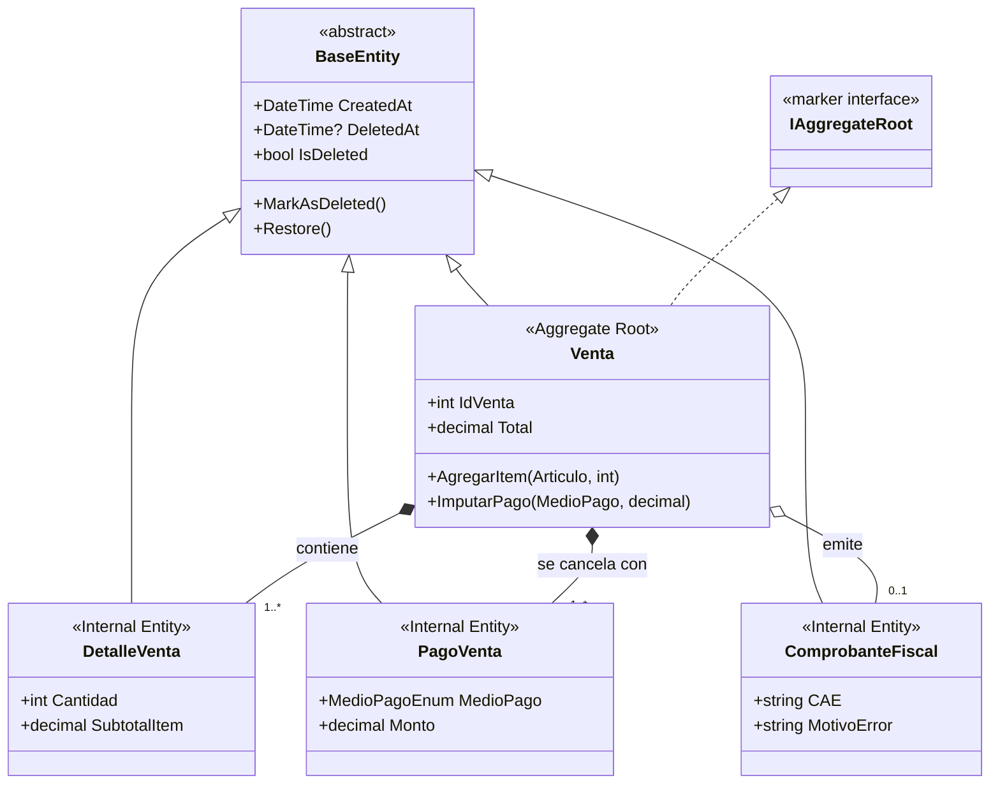

# Retail.Domain (Capa de Dominio / Core de Negocio)

`Retail.Domain` es el **núcleo puro de la lógica de negocio** del sistema Retail. Modela las entidades, enumeraciones, reglas comerciales, invariantes y excepciones de dominio basadas en el **Diagrama Entidad-Relación (DER)** y la **Especificación de Requisitos de Software (ERS v3.2)**.

---

## 📁 Estructura del Directorio

```text
src/Retail.Domain/
├── Entities/                            # Entidades de Negocio (Modelos del DER)
│   ├── Usuario.cs                       # Cuentas de usuario con hash de contraseña y rol
│   ├── Rol.cs                           # Cajero, Encargado, Gerente
│   ├── Cliente.cs                       # CUIT/DNI, Condición IVA y Cuenta Corriente
│   ├── CobranzaCliente.cs               # Cobro de deudas (efectivo, transferencia, tarjeta)
│   ├── TurnoCaja.cs                     # Apertura, cierre y balance de arqueo de efectivo
│   ├── MovimientoCaja.cs                # Ingresos extraordinarios y retiros de caja
│   ├── Categoria.cs                     # Clasificación de artículos
│   ├── Marca.cs                         # Fabricantes / Editoriales
│   ├── Articulo.cs                      # Productos físicos y artesanías (código nulable)
│   ├── Proveedor.cs                     # Distribuidores y datos fiscales (CUIT)
│   ├── CatalogoProveedor.cs             # Listas de costos importadas de distribuidores
│   ├── Venta.cs                         # Cabecera de venta cobrada
│   ├── DetalleVenta.cs                  # Ítems vendidos con subtotal
│   ├── PagoVenta.cs                     # Imputación de pagos (efectivo, tarjeta, QR, cta cte)
│   ├── Presupuesto.cs                   # Cotización temporal independiente (15 días de validez)
│   ├── DetallePresupuesto.cs            # Ítems cotizados con precio unitario congelado
│   ├── ComprobanteFiscal.cs             # Datos fiscales ARCA (CAE, PV, Número, motivo_error)
│   ├── Compra.cs                        # Facturas y remitos de distribuidores
│   └── DetalleCompra.cs                 # Ítems adquiridos y actualización de costos
├── Enums/                               # Enumeraciones del Negocio
│   ├── RolUsuarioEnum.cs                # Cajero, Encargado, Gerente
│   ├── EstadoTurnoEnum.cs               # ABIERTO, CERRADO
│   ├── TipoMovimientoCajaEnum.cs        # INGRESO, EGRESO
│   ├── EstadoPresupuestoEnum.cs         # PENDIENTE, CONVERTIDO, VENCIDO, CANCELADO
│   ├── EstadoFiscalEnum.cs              # EMITIDO, ERROR_FISCAL_REINTENTABLE, NO_APLICA
│   ├── TipoComprobanteFiscalEnum.cs     # FACTURA_A, FACTURA_B, NO_APLICA
│   ├── CondicionIvaEnum.cs              # RESPONSABLE_INSCRIPTO, MONOTRIBUTO, CONSUMIDOR_FINAL, EXENTO
│   ├── TipoDocumentoEnum.cs             # DNI, CUIT, CUIL, PASAPORTE
│   └── MedioPagoEnum.cs                 # EFECTIVO, TARJETA_DEBITO, TARJETA_CREDITO, TRANSFERENCIA_QR, CUENTA_CORRIENTE
├── Exceptions/                          # Excepciones que representan violaciones de reglas
│   ├── DomainException.cs               # Clase base abstracta de errores de dominio
│   ├── StockInsuficienteException.cs    # Intento de venta de stock negativo
│   ├── CajaCerradaException.cs          # Operación de cobro sin turno abierto
│   ├── PresupuestoVencidoException.cs   # Intento de cobrar presupuesto caducado (> 15 días)
│   └── LimiteCreditoExcedidoException.cs# Compra a cuenta corriente superior al límite
└── Common/                              # Abstracciones y tipos base de dominio
    ├── BaseEntity.cs                    # id, created_at, deleted_at (Soft Delete)
    └── IAggregateRoot.cs                # Marcador de raíz de agregado (DDD)
```

---

## 🏛️ Patrones Tácticos de Domain-Driven Design (DDD) y Modelo de Agregados

El diseño de `Retail.Domain` implementa formalmente los patrones tácticos de **Domain-Driven Design (Eric Evans)** para garantizar alta cohesión, bajo acoplamiento y consistencia transaccional estricta en el software de mostrador.

### 1. Jerarquía Base (`src/Retail.Domain/Common/`)

* **`BaseEntity.cs` (Clase Base Abstracta):**
  * Provee identidad común y auditoría cronológica (`CreatedAt` en UTC).
  * **Borrado Lógico (*Soft Delete*):** En sistemas comerciales y de facturación fiscal, **el borrado físico (`DELETE FROM ...`) está estrictamente prohibido**. Eliminar un producto, cliente o usuario destruiría la trazabilidad histórica de compras, ventas y balances fiscales pasados, violando restricciones de clave foránea.
  * Encapsula los métodos `MarkAsDeleted()` y `Restore()`. En la capa de infraestructura, Entity Framework Core aplica automáticamente un filtro global (`HasQueryFilter(e => !e.IsDeleted)`) para omitir los registros eliminados de las consultas habituales de mostrador sin perder su historia contable.

* **`IAggregateRoot.cs` (Interfaz Marcadora / *Marker Interface*):**
  * Es una interfaz vacía sin métodos ni miembros. Su función exclusiva en el sistema de tipos de C# 12 es **marcar en tiempo de compilación** qué entidades son **Raíces de Agregado**.
  * Actúa como restricción de tipo genérico en la persistencia:
    ```csharp
    public interface IRepository<T> where T : BaseEntity, IAggregateRoot
    ```
  * **Regla de Oro Arquitectónica:** *Únicamente las Raíces de Agregado pueden tener un Repositorio propio y ser recuperadas directamente de la base de datos*. Las entidades internas del agregado no tienen repositorio y solo pueden ser alteradas a través de su raíz.

---

### 2. Catálogo y Clasificación de Agregados del Sistema Retail



| Agregado | Raíz de Agregado (`IAggregateRoot`) | Entidades Internas Subordinadas | Invariante Principal Custodiada por la Raíz |
| :--- | :--- | :--- | :--- |
| **Venta** | `Venta.cs` | `DetalleVenta.cs`, `PagoVenta.cs`, `ComprobanteFiscal.cs` | El `Total` de la venta debe equivaler exactamente a la suma de `DetalleVenta.SubtotalItem` y a la suma de `PagoVenta.Monto`. No se puede alterar un ítem o pago sin recalcular el balance atómico de la venta. |
| **Presupuesto** | `Presupuesto.cs` | `DetallePresupuesto.cs` | Congela los precios pactados (`precio_unitario_pactado`) con vigencia estricta de 15 días. No descuenta stock físico hasta que el agregado `Venta` lo convierta. |
| **Compra** | `Compra.cs` | `DetalleCompra.cs` | Registra facturas de distribuidores, incrementa stock en góndola y dispara el recálculo automático del precio de venta por markup. |
| **Turno Caja** | `TurnoCaja.cs` | `MovimientoCaja.cs` | La caja custodia el saldo teórico de efectivo físico: $\text{SaldoTeorico} = \text{SaldoInicial} + \text{VentasEfectivo} + \text{CobranzasEfectivo} + \text{Ingresos} - \text{Egresos}$. |
| **Clientes** | `Cliente.cs` | — | Custodia el `LimiteCredito` comercial y el `SaldoCuentaCorriente`. Los cobros se registran mediante `CobranzaCliente`. |
| **Artículos** | `Articulo.cs` | — | Mantiene la fórmula de markup: $\text{PrecioVenta} = \text{CostoReposicion} \times (1 + \frac{\text{Markup}}{100})$. Custodia el stock actual y admite `CodigoBarras` nulo para artesanías. |
| **Usuarios** | `Usuario.cs` | — | Credenciales de acceso seguras con hash unidireccional y rol asignado. |
| **Proveedores**| `Proveedor.cs` | `CatalogoProveedor.cs` | Padrón de distribuidores y listas de costos importadas para actualización masiva. |

---

## 🧩 Invariantes Clave del Dominio

### 1. `Articulo.cs` (Artesanías y Recálculo Automático por Compras)
- **Código de Barras Nulable (`RF-04`):** Los productos artesanales y servicios tienen `CodigoBarras = null`. La unicidad solo aplica a códigos no nulos mediante índice filtrado.
- **Recálculo Automático en Compras (`RF-19`):**  
  El método de dominio `ActualizarCostoYRecalcularPrecio(decimal nuevoCosto)` actualiza `CostoReposicion` y automáticamente recalcula `PrecioVenta` preservando el `PorcentajeGanancia`:
  ```csharp
  public void ActualizarCostoYRecalcularPrecio(decimal nuevoCosto)
  {
      CostoReposicion = nuevoCosto;
      if (PorcentajeGanancia > 0)
      {
          PrecioVenta = Math.Round(nuevoCosto * (1m + (PorcentajeGanancia / 100m)), 2);
      }
  }
  ```

### 2. `CobranzaCliente.cs` y `Cliente.cs` (Cobro de Deudas Multimedio)
- Al registrarse una cobranza (`CobranzaCliente`), el método `Cliente.AcreditarPago(decimal monto)` reduce el `SaldoCuentaCorriente`.
- Si el medio de pago es `MedioPagoEnum.EFECTIVO`, la entidad se asocia a `TurnoCaja` para sumar al dinero físico; si es electrónico (`TRANSFERENCIA_QR`, `TARJETA_DEBITO`), se imputa al total de canales digitales del turno.

### 3. `Presupuesto.cs` (Vigencia y Conversión con Validación de Stock)
- Valida que `DateTime.UtcNow <= FechaVencimiento` (15 días).
- Al convertirse, pasa a `EstadoPresupuestoEnum.CONVERTIDO`.

