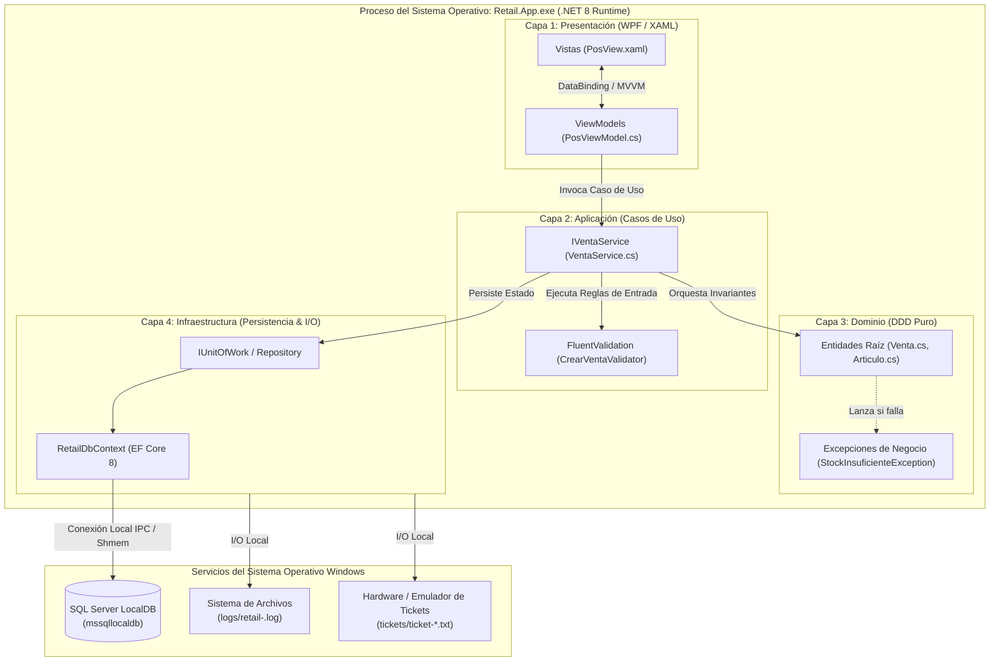

# Clean Desktop Monolith: Arquitectura de Mostrador de Alta Disponibilidad

### Módulo: 01. Fundamentos y Onboarding
**Audiencia:** Desarrolladores, estudiantes universitarios y mesa evaluadora de cátedra  
**Capa de Referencia:** Transversal a toda la solución `Retail.sln`  

---

## 1. 📖 Fundamento Teórico y Académico

### 1.1 ¿Qué es una Arquitectura Clean Desktop Monolith?
Una arquitectura **Clean Desktop Monolith** (Monolito Limpio de Escritorio) combina dos conceptos fundamentales de la ingeniería de software:

1. **Clean Architecture (Robert C. Martin - Uncle Bob):** Organización concéntrica del software donde las reglas de negocio (el Dominio) ocupan el centro y no dependen de ningún detalle tecnológico exterior (bases de datos, frameworks de interfaz o hardware).
2. **Monolito de Proceso Único (In-Process Monolith):** Todo el sistema se compila y ejecuta dentro de un único proceso de sistema operativo en la máquina del cliente, eliminando llamadas de red remotas entre capas.

```text
    ┌───────────────────────────────────────────────────────────────┐
    │                      Clean Architecture                       │
    │                                                               │
    │   [ Presentación (WPF) ] ───► [ Aplicación (Casos de Uso) ]   │
    │                                         │                     │
    │                                         ▼                     │
    │                             [ Dominio (DDD Puro) ]            │
    │                                         ▲                     │
    │                                         │                     │
    │   [ Infraestructura (EF Core / SQL) ] ──┘                     │
    └───────────────────────────────────────────────────────────────┘
                                   │
                                   ▼
              Ejecución en UN SOLO PROCESO (Retail.App.exe)
                       Latencia entre capas: < 0.001 ms
```

### 1.2 La Realidad Operativa del Comercio Minorista (Retail)
En una librería comercial o papelería de mostrador, el software atiende transacciones en tiempo real con clientes esperando en la fila. Las condiciones operativas imponen restricciones estrictas:

* **Latencia de Respuesta Crítica:** El escaneo de un código de barras y la actualización del subtotal deben tomar **$< 15\text{ ms}$**. Cualquier retraso perceptible deteriora la experiencia del cajero y la velocidad del mostrador.
* **Tolerancia a Caídas de Internet:** Una librería no puede frenar sus ventas ni suspender la emisión de tickets si se corta la conexión del proveedor de telecomunicaciones.
* **Las Falacias de la Computación Distribuida (L. Peter Deutsch):** La primera falacia afirma que *"la red es confiable"*, y la segunda que *"la latencia es cero"*. En una arquitectura web en la nube o en microservicios distribuidos, cada escaneo de código de barras o consulta de stock requiere un salto de red HTTP (con latencias habituales de $80\text{ ms}$ a $300\text{ ms}$ más fallas intermitentes de DNS o timeouts).

Por estas razones, la cátedra y la industria del retail prescriben un modelo de **alta disponibilidad local con base de datos embebida o local (LocalDB/Express)**.

---

## 2. 💻 Aplicación Concreta en el Proyecto Retail

En `Retail.sln`, el monolito se materializa a través de un único proceso ejecutable: [`Retail.App.exe`](file:///c:/Users/lucas/Proyectos/retail/src/Retail.App).

### 2.1 El Generic Host como Orquestador del Monolito
En [`src/Retail.App/App.xaml.cs`](file:///c:/Users/lucas/Proyectos/retail/src/Retail.App/App.xaml.cs), utilizamos el patrón moderno de .NET 8 `Microsoft.Extensions.Hosting.IHost` para resolver el ciclo de vida y la inyección de dependencias de todas las capas en memoria:

```csharp
// Fragmento pedagógico de App.xaml.cs
public partial class App : System.Windows.Application
{
    private readonly IHost _host;

    public App()
    {
        _host = Host.CreateDefaultBuilder()
            .ConfigureServices((context, services) =>
            {
                // 1. Capa de Aplicación (Casos de Uso, DTOs, Validadores)
                services.AddApplicationServices();

                // 2. Capa de Infraestructura (EF Core, LocalDB, Serilog, Hardware Mocks)
                services.AddInfrastructureServices(context.Configuration);

                // 3. Capa de Presentación (ViewModels y Ventanas WPF)
                services.AddPresentationServices();
            })
            .Build();
    }
}
```

### 2.2 Inyección de Dependencias sin Acoplamiento Tecnológico
Observa cómo se cumple la **Ley de Dependencia Estricta**:
* [`Retail.Domain`](file:///c:/Users/lucas/Proyectos/retail/src/Retail.Domain) no tiene referencias NuGet ni sabe qué base de datos existe.
* [`Retail.Application`](file:///c:/Users/lucas/Proyectos/retail/src/Retail.Application) define interfaces de persistencia como [`IRepository<T>`](file:///c:/Users/lucas/Proyectos/retail/src/Retail.Application/Interfaces/Persistence/IRepository.cs) y [`IUnitOfWork`](file:///c:/Users/lucas/Proyectos/retail/src/Retail.Application/Interfaces/Persistence/IUnitOfWork.cs).
* [`Retail.Infrastructure`](file:///c:/Users/lucas/Proyectos/retail/src/Retail.Infrastructure) implementa esas interfaces utilizando Entity Framework Core 8 y SQL Server LocalDB.
* [`Retail.App`](file:///c:/Users/lucas/Proyectos/retail/src/Retail.App) solo consume servicios de la capa de Aplicación a través de ViewModels; **jamás inyecta el `DbContext` directamente en una ventana XAML**.

---

## 3. 📊 Diagrama Explicativo: Topología de Ejecución



---

## 4. ⚖️ Decisiones de Diseño y Trade-offs

### ¿Por qué NO una Aplicación Web en la Nube (SaaS)?
* **Riesgo:** Si una tormenta o falla del ISP corta internet, la librería queda totalmente paralizada, sin poder cobrar ni facturar.
* **Hardware de Mostrador:** Una aplicación web en el navegador tiene restricciones severas de seguridad para comunicarse de forma directa y silenciosa con impresoras térmicas ESC/POS en puertos COM/USB o lectores de código de barras en modo emulación de teclado (HID).
* **Decisión:** La aplicación de escritorio nativa en WPF tiene control total sobre el hardware, garantiza respuesta sub-milisegundo y almacena datos localmente.

### ¿Por qué SQL Server LocalDB en vez de SQLite?
* **SQLite:** Es una base de datos mono-usuario basada en un archivo plano. Aunque es ligera, tiene limitaciones con concurrencia de transacciones concurrentes complejas, bloqueos a nivel de archivo y sintaxis T-SQL reducida.
* **SQL Server LocalDB:** Es un motor relacional completo de Microsoft SQL Server que se ejecuta como un proceso hijo local. Soporta el 100% de la semántica de SQL Server empresarial:
  * Índices filtrados avanzados (`Filtered Indexes`).
  * Concurrencia de aislamiento transaccional completa.
  * Facilidad de migración: Si en el futuro el comercio crece y requiere un servidor centralizado para 5 sucursales, solo se cambia la cadena de conexión en [`appsettings.json`](file:///c:/Users/lucas/Proyectos/retail/src/Retail.App/appsettings.json) hacia un servidor SQL Server sin tocar una sola línea de código C#.

### Trade-offs Asumidos
| Beneficio Obtenido | Costo o Desventaja Asumida | Mitigación Implementada |
| :--- | :--- | :--- |
| **Latencia $< 15\text{ ms}$ y disponibilidad sin internet.** | Requiere sistema operativo Windows 10/11 en la caja. | Paquete auto-contenido generado por CI/CD (`win-x64`) sin requerir preinstalación manual del SDK. |
| **Integridad de datos ACID robusta.** | El motor LocalDB consume más memoria RAM que SQLite. | Optimización con `.AsNoTracking()` y proyecciones directas en consultas para mantener el consumo total de la aplicación $\le 300\text{ MB}$ (`RNF-03`). |

---

## 5. 🎓 Preguntas de Examen de Cátedra (Autoevaluación)

### Pregunta 1: *"¿Por qué eligieron una arquitectura monolítica en lugar de microservicios, considerando las tendencias modernas?"*
> **Respuesta Modelo del Estudiante:**  
> "Adoptamos el principio de idoneidad contextual de la ingeniería de software: un software de punto de venta minorista tiene requerimientos de baja latencia ($< 15\text{ ms}$) y alta resiliencia local ante caídas de conectividad. Los microservicios introducen el costo de la red, consistencia eventual y complejidad distribuida que en un punto de venta físico generan lentitud de mostrador y puntos únicos de falla. Nuestro diseño es un **Monolito Modular con Clean Architecture**: está estrictamente desacoplado internamente mediante interfaces y capas DDD, lo que nos da la simplicidad de despliegue de un monolito y la mantenibilidad de un sistema modular."

### Pregunta 2: *"Si el cliente decide abrir una segunda caja registradora en el mismo local, ¿tienen que reescribir la aplicación?"*
> **Respuesta Modelo del Estudiante:**  
> "No. Gracias a la separación estricta entre la capa de Aplicación y la capa de Infraestructura, la lógica de negocio no sabe dónde está la base de datos. Para soportar múltiples cajas en el mismo local comercial, basta con instalar una instancia de SQL Server Express compartida en la red local y cambiar la cadena de conexión `RetailDbConnection` en el [`appsettings.json`](file:///c:/Users/lucas/Proyectos/retail/src/Retail.App/appsettings.json) de cada caja. Todo el código de dominio, casos de uso y vistas permanece 100% intacto."
