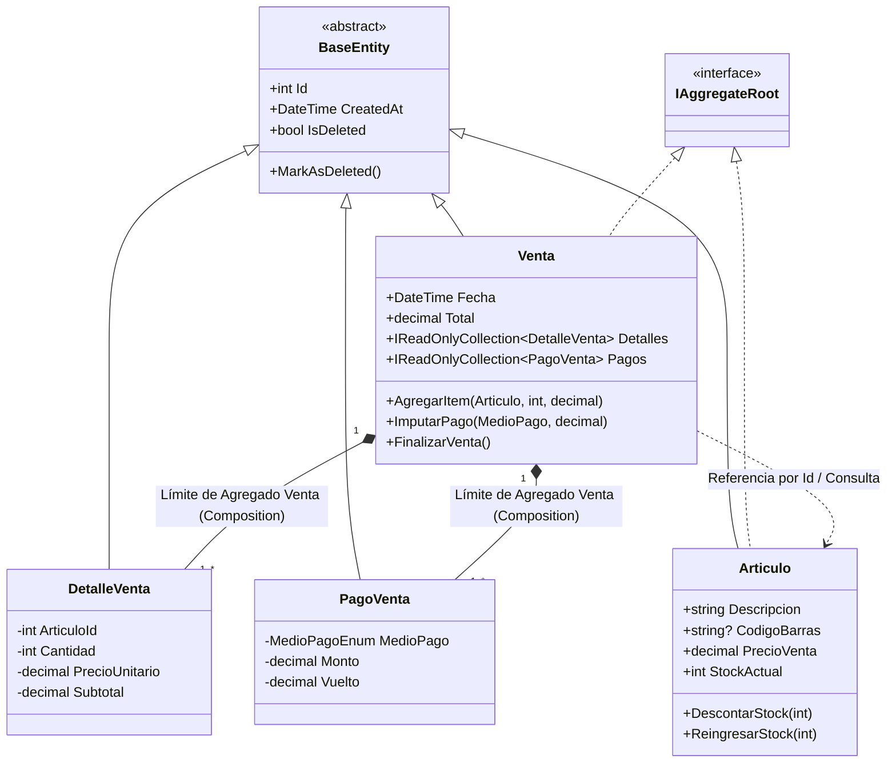

# Capa de Dominio: DDD Táctico, Entidades Ricas e Invariantes de Negocio

### Módulo: 02. Capas de Arquitectura (Clean Architecture)
**Audiencia:** Desarrolladores, estudiantes y mesa evaluadora de cátedra  
**Proyecto de Referencia:** [`src/Retail.Domain`](file:///c:/Users/lucas/Proyectos/retail/src/Retail.Domain)  
**Dependencias Externas:** Ninguna (0 paquetes NuGet, 0 referencias a base de datos, 0 dependencias de UI).

---

## 1. 📖 Fundamento Teórico y Académico

### 1.1 El Corazón del Software: Domain-Driven Design (DDD)
Según **Eric Evans** en su obra canónica *Domain-Driven Design: Tackling Complexity in the Heart of Software* (2003), el software complejo debe organizarse alrededor del modelo del negocio. La capa de dominio es el núcleo sagrado del sistema: contiene la lógica empresarial pura, las reglas de cálculo y las restricciones que existirían en la librería incluso si no hubiera computadoras ni software.

### 1.2 El Anti-Patrón del "Modelo de Dominio Anémico"
Martin Fowler identificó el **Modelo de Dominio Anémico (*Anemic Domain Model*)** como uno de los errores más comunes en la programación orientada a objetos:
* **El síntoma del modelo anémico:** Clases de entidad que son simples "bolsas de datos" (*Data Transfer Objects disfrazados*) con getters y setters públicos (`public int Cantidad { get; set; }`) sin comportamiento propio. Toda la lógica de validación se dispersa en servicios de aplicación, controladores o procedimientos almacenados de base de datos.
* **El Modelo de Dominio Rico (*Rich Domain Model*):** En Retail adoptamos un modelo rico. Las entidades encapsulan sus datos con propiedades privadas o protegidas (`private set;`) y exponen **métodos de negocio expresivos** (`AgregarItem(...)`, `ImputarPago(...)`, `DescontarStock(...)`). La entidad es la guardiana responsable de que jamás exista un objeto con estado inconsistente en memoria.

### 1.3 Bloques de Construcción Tácticos de DDD

| Concepto DDD | Definición Teórica | Aplicación en el Proyecto Retail |
| :--- | :--- | :--- |
| **Entidad (*Entity*)** | Objeto definido por su identidad única y continuidad temporal, no solo por sus atributos. Dos entidades con el mismo ID representan la misma cosa. | Clases que heredan de [`BaseEntity`](file:///c:/Users/lucas/Proyectos/retail/src/Retail.Domain/Common/BaseEntity.cs) con clave primaria `Id` (GUID o `int`). |
| **Raíz de Agregado (*Aggregate Root*)** | Es la entidad principal que actúa como puerta de enlace de un conjunto de entidades relacionadas (el Agregado). Garantiza la consistencia interna y define el límite transaccional. | Clases que implementan el marcador [`IAggregateRoot`](file:///c:/Users/lucas/Proyectos/retail/src/Retail.Domain/Common/IAggregateRoot.cs) (`Venta`, `Articulo`, `TurnoCaja`, `Cliente`, etc.). |
| **Entidad Interna** | Entidad que vive exclusivamente dentro del contexto de su raíz. El mundo exterior no puede interactuar con ella directamente. | [`DetalleVenta`](file:///c:/Users/lucas/Proyectos/retail/src/Retail.Domain/Entities/DetalleVenta.cs), [`PagoVenta`](file:///c:/Users/lucas/Proyectos/retail/src/Retail.Domain/Entities/PagoVenta.cs), [`MovimientoCaja`](file:///c:/Users/lucas/Proyectos/retail/src/Retail.Domain/Entities/MovimientoCaja.cs). |
| **Invariante de Negocio** | Regla o condición que debe mantenerse verdadera en todo momento durante el ciclo de vida del objeto. | Si el stock es 3, no se pueden vender 4 unidades; la suma de pagos debe ser $\ge \text{Total}$; el efectivo a retirar no puede superar el disponible en gaveta. |
| **Excepción de Dominio** | Excepción fuertemente tipada que señala la violación de una regla de negocio. | Las 16 clases que derivan de [`DomainException`](file:///c:/Users/lucas/Proyectos/retail/src/Retail.Domain/Exceptions/DomainException.cs). |

---

## 2. 💻 Aplicación Concreta en el Código de Retail

### 2.1 La Abstracción Base: Identidad, Auditoría y Soft Delete
Toda entidad del sistema hereda de [`src/Retail.Domain/Common/BaseEntity.cs`](file:///c:/Users/lucas/Proyectos/retail/src/Retail.Domain/Common/BaseEntity.cs):

```csharp
namespace Retail.Domain.Common;

public abstract class BaseEntity
{
    public int Id { get; protected set; }
    public DateTime CreatedAt { get; private set; } = DateTime.UtcNow;
    public DateTime? UpdatedAt { get; protected set; }
    
    // Soporte obligatorio de Soft Delete (Borrado Lógico)
    public bool IsDeleted { get; private set; }
    public DateTime? DeletedAt { get; private set; }

    public void MarkAsDeleted()
    {
        IsDeleted = true;
        DeletedAt = DateTime.UtcNow;
    }

    public void Restore()
    {
        IsDeleted = false;
        DeletedAt = null;
    }
}
```

### 2.2 La Interfaz Marcadora: `IAggregateRoot`
En [`src/Retail.Domain/Common/IAggregateRoot.cs`](file:///c:/Users/lucas/Proyectos/retail/src/Retail.Domain/Common/IAggregateRoot.cs):

```csharp
namespace Retail.Domain.Common;

/// <summary>
/// Interfaz marcadora para raíces de agregado.
/// Solo las entidades que implementan esta interfaz pueden tener Repositorio propio.
/// </summary>
public interface IAggregateRoot
{
}
```

Esta sencilla interfaz es una de las **reglas de oro de nuestra arquitectura**: el compilador de C# prohíbe que alguien cree un repositorio para entidades hijas:
```csharp
// Válido: Venta es IAggregateRoot
public class Venta : BaseEntity, IAggregateRoot { ... }
public interface IVentaRepository : IRepository<Venta> { ... }

// PROHIBIDO Y BLOQUEADO POR EL COMPILADOR: DetalleVenta NO es IAggregateRoot
// public interface IDetalleVentaRepository : IRepository<DetalleVenta> { ... } // Error CS0311
```

### 2.3 Modelo Rico: La Raíz de Agregado `Venta`
Analiza cómo la clase [`Venta.cs`](file:///c:/Users/lucas/Proyectos/retail/src/Retail.Domain/Entities/Venta.cs) protege sus invariantes con setters privados y colecciones de solo lectura:

```csharp
public class Venta : BaseEntity, IAggregateRoot
{
    private readonly List<DetalleVenta> _detalles = new();
    private readonly List<PagoVenta> _pagos = new();

    // Colecciones expuestas como IReadOnlyCollection (nadie puede hacer .Add() desde afuera)
    public IReadOnlyCollection<DetalleVenta> Detalles => _detalles.AsReadOnly();
    public IReadOnlyCollection<PagoVenta> Pagos => _pagos.AsReadOnly();

    public decimal Total { get; private set; }

    // Constructor privado para EF Core / Factory Methods
    protected Venta() { }

    public void AgregarItem(Articulo articulo, int cantidad, decimal precioUnitario)
    {
        if (cantidad <= 0)
            throw new DomainException("La cantidad debe ser mayor a cero.");

        if (articulo.StockActual < cantidad)
            throw new StockInsuficienteException(articulo.Id, articulo.Descripcion, articulo.StockActual, cantidad);

        var detalle = new DetalleVenta(this, articulo.Id, cantidad, precioUnitario);
        _detalles.Add(detalle);
        RecalcularTotal();
    }

    public void ImputarPago(MedioPagoEnum medioPago, decimal monto, decimal recargoDesc = 0)
    {
        if (monto <= 0)
            throw new MontoPagoInsuficienteException("El monto a imputar debe ser positivo.");

        var pago = new PagoVenta(this, medioPago, monto, recargoDesc);
        _pagos.Add(pago);
    }

    public void FinalizarVenta()
    {
        if (!_detalles.Any())
            throw new VentaVaciaException("No se puede registrar una venta sin artículos.");

        var totalPagado = _pagos.Sum(p => p.Monto);
        if (totalPagado < Total)
            throw new MontoPagoInsuficienteException($"El monto abonado (${totalPagado}) es menor al total (${Total}).");
    }

    private void RecalcularTotal() => Total = _detalles.Sum(d => d.Subtotal);
}
```

---

## 3. 📊 Diagrama Explicativo: Límites de Agregados y Transaccionalidad



---

## 4. ⚖️ Decisiones de Diseño y Trade-offs

### ¿Por qué NO validar en la capa de UI o en los Controladores?
* **Riesgo:** Si las reglas de negocio (ej. "el stock no puede ser negativo" o "el total debe coincidir con la suma de ítems") residen en la ventana de WPF, cualquier otro flujo (como la importación masiva de Excel, una prueba unitaria automatizada o un script de migración) se salteará esas reglas, corrompiendo la base de datos con inconsistencias contables.
* **Solución:** Al encapsular las invariantes en la propia entidad de Dominio, **es físicamente imposible en código C# crear una venta inválida**, independientemente de quién o qué llame al método.

### ¿Por qué prohibir los Repositorios para Entidades Internas?
* Si existiera un `DetalleVentaRepository.Delete(detalleId)`, un programador descuidado podría borrar un ítem de una venta ya cobrada desde una pantalla secundaria sin recalcular el campo `Total` ni ajustar el stock en la raíz `Venta`.
* En DDD, **toda mutación debe atravesar la raíz de agregado**, garantizando la consistencia atómica del agregado completo.

---

## 5. 🎓 Preguntas de Examen de Cátedra (Autoevaluación)

### Pregunta 1: *"¿Cuál es la diferencia conceptual entre una Entidad y un Value Object en DDD? Den un ejemplo de cada uno en su sistema."*
> **Respuesta Modelo del Estudiante:**  
> "Una **Entidad** se distingue por su identidad única y su ciclo de vida continuo: dos entidades con distintos IDs representan objetos diferentes aunque todos sus demás campos sean idénticos (por ejemplo, dos `Cliente` con el mismo nombre y apellido son personas distintas porque tienen diferente `Id` y CUIT).  
> En cambio, un **Value Object** se define exclusivamente por sus atributos estructurales: no tiene ID y es conceptualmente inmutable (dos Value Objects con idénticos valores son intercambiables). En nuestro sistema, el importe monetario o el desglose fiscal de una alícuota de IVA representan valores numéricos inmutables donde la equivalencia se basa en sus componentes y no en un identificador de base de datos."

### Pregunta 2: *"¿Por qué Retail.Domain no tiene ninguna referencia a Entity Framework Core ni usa anotaciones como `[Table]` o `[Key]`?"*
> **Respuesta Modelo del Estudiante:**  
> "Porque respetamos la **Regla de Dependencia de Clean Architecture** y el principio de **Persistencia Ignorante (*Persistence Ignorance*)**. El dominio representa la verdad del negocio de la librería y no debe acoplarse a los detalles del motor de base de datos ni a los paquetes de Microsoft. Las configuraciones de tablas, claves foráneas e índices se configuran enteramente por fuera, en la capa de `Retail.Infrastructure`, mediante la Fluent API de EF Core (`IEntityTypeConfiguration<T>`). Si mañana Microsoft lanza EF Core 9 o decidimos cambiar el ORM, el dominio permanece 100% puro e inalterado."
