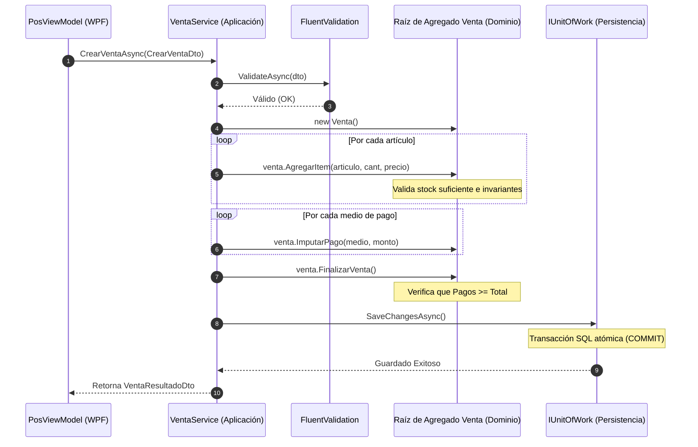

# Capa de Aplicación: Casos de Uso, DTOs Inmutables y FluentValidation

### Módulo: 02. Capas de Arquitectura (Clean Architecture)
**Audiencia:** Desarrolladores, estudiantes y docentes de cátedra  
**Proyecto de Referencia:** [`src/Retail.Application`](file:///c:/Users/lucas/Proyectos/retail/src/Retail.Application)  
**Dependencias:** Solo [`Retail.Domain`](file:///c:/Users/lucas/Proyectos/retail/src/Retail.Domain), `FluentValidation 11.11` y abstracciones de Microsoft Dependency Injection.  

---

## 1. 📖 Fundamento Teórico y Académico

### 1.1 El Rol de la Capa de Aplicación (Casos de Uso)
En la Clean Architecture de Robert C. Martin y el modelo hexagonal de Alistair Cockburn, la **Capa de Aplicación** alberga los **Casos de Uso (*Use Cases* o *Interactors*)**.

Su función esencial es la de un **director de orquesta**:
* **Qué HACE la Capa de Aplicación:**
  1. Recibe una intención del exterior (un DTO desde la UI o una prueba).
  2. Valida la estructura sintáctica de los datos de entrada (mediante `FluentValidation`).
  3. Carga las entidades de negocio requeridas usando abstracciones (`IRepository<T>`).
  4. Invoca los métodos mutacionales en las raíces de agregado del Dominio (`venta.AgregarItem(...)`, `caja.RegistrarMovimiento(...)`).
  5. Persiste el nuevo estado atómico coordinando la transacción (`IUnitOfWork.SaveChangesAsync()`).
  6. Transforma el resultado en un DTO de respuesta y lo retorna a la interfaz.
* **Qué NO HACE la Capa de Aplicación:**
  * **No contiene reglas de cálculo de negocio:** No calcula si un presupuesto venció, ni recalcula precios por markup, ni descuenta el saldo de cuenta corriente; esas reglas pertenecen con exclusividad a las entidades de [`Retail.Domain`](file:///c:/Users/lucas/Proyectos/retail/src/Retail.Domain).
  * **No sabe cómo se guardan los datos:** No escribe SQL ni sabe si la persistencia es SQL Server, Postgres o memoria.

### 1.2 Fronteras Inmutables: Data Transfer Objects (DTOs)
Uno de los errores más graves en arquitecturas multicapa es permitir que las entidades de la base de datos o del dominio "floten" hasta la capa de interfaz gráfica (WPF o web). Esto produce:
1. **Acoplamiento Indebido:** Un cambio en una columna de la tabla rompe los bindings de la vista XAML.
2. **Mutación Accidental:** Un control de la pantalla podría alterar directamente el estado de la entidad sin pasar por sus métodos protectores de dominio.

Para resolver esto, en Retail aplicamos **DTOs inmutables basados en `record class`** de C# 12.

---

## 2. 💻 Aplicación Concreta en el Código de Retail

### 2.1 DTOs Inmutables con Propiedades Calculadas
En [`src/Retail.Application/DTOs/`](file:///c:/Users/lucas/Proyectos/retail/src/Retail.Application/DTOs/), los modelos de transporte se definen como registros inmutables con semántica de valor:

```csharp
// Fragmento de AlertaStockDto.cs
public record class AlertaStockDto(
    int ArticuloId,
    string Descripcion,
    string? CodigoBarras,
    int StockActual,
    int StockMinimo)
{
    // Propiedad calculada pura, testeable y de solo lectura
    public bool StockCritico => StockActual == 0;
    public int UnidadesFaltantes => Math.Max(0, StockMinimo - StockActual);
}
```

### 2.2 Validación en Fronteras con FluentValidation
En lugar de dispersar sentencias `if (dto.Cantidad <= 0)` dentro del servicio, utilizamos validadores declarativos aislados:

```csharp
public class CrearVentaValidator : AbstractValidator<CrearVentaDto>
{
    public CrearVentaValidator()
    {
        RuleFor(x => x.TurnoCajaId)
            .GreaterThan(0).WithMessage("Debe existir un turno de caja abierto para registrar ventas.");

        RuleFor(x => x.Items)
            .NotEmpty().WithMessage("La venta debe contener al menos un artículo.");

        RuleForEach(x => x.Items).ChildRules(item =>
        {
            item.RuleFor(i => i.ArticuloId).GreaterThan(0);
            item.RuleFor(i => i.Cantidad).GreaterThan(0).WithMessage("La cantidad debe ser mayor a cero.");
        });

        RuleFor(x => x.Pagos)
            .NotEmpty().WithMessage("Debe especificarse al menos un medio de pago.");
    }
}
```

### 2.3 Orquestación Transaccional: `VentaService`
Observa la limpieza del servicio: orquesta entidades e interfaces sin ensuciarse con detalles de infraestructura:

```csharp
public class VentaService : IVentaService
{
    private readonly IRepository<Venta> _ventaRepository;
    private readonly IRepository<Articulo> _articuloRepository;
    private readonly IUnitOfWork _unitOfWork;
    private readonly IValidator<CrearVentaDto> _validator;

    public async Task<VentaResultadoDto> CrearVentaAsync(CrearVentaDto dto, CancellationToken ct = default)
    {
        // 1. Validación de entrada
        var validationResult = await _validator.ValidateAsync(dto, ct);
        if (!validationResult.IsValid)
            throw new ValidationException(validationResult.Errors);

        // 2. Creación de la Raíz de Agregado
        var venta = new Venta(dto.TurnoCajaId, dto.ClienteId);

        // 3. Orquestación con el Dominio
        foreach (var itemDto in dto.Items)
        {
            var articulo = await _articuloRepository.GetByIdAsync(itemDto.ArticuloId, ct)
                ?? throw new KeyNotFoundException($"Artículo {itemDto.ArticuloId} no encontrado.");

            // El dominio valida stock y crea el detalle internamente
            venta.AgregarItem(articulo, itemDto.Cantidad, articulo.PrecioVenta);
            
            // Mutación del stock en la entidad de catálogo
            articulo.DescontarStock(itemDto.Cantidad);
        }

        foreach (var pagoDto in dto.Pagos)
        {
            venta.ImputarPago(pagoDto.MedioPago, pagoDto.Monto, pagoDto.RecargoDescuento);
        }

        venta.FinalizarVenta();

        // 4. Persistencia Atómica ACID
        await _ventaRepository.AddAsync(venta, ct);
        await _unitOfWork.SaveChangesAsync(ct);

        return new VentaResultadoDto(venta.Id, venta.Total, venta.CreatedAt);
    }
}
```

---

## 3. 📊 Diagrama Explicativo: El Flujo de Orquestación



---

## 4. ⚖️ Decisiones de Diseño y Trade-offs

### ¿Por qué `FluentValidation` en vez de `DataAnnotations` (`[Required]`, `[Range]`)?
* **DataAnnotations:** Mezcla metadatos de validación en la definición de la clase, resultando en DTOs sobrecargados de atributos y con soporte muy limitado para reglas condicionales complejas (por ejemplo: *"Si el medio de pago es Cuenta Corriente, el ClienteId es obligatorio"*).
* **FluentValidation:** Permite escribir reglas en lenguaje fluido y fuertemente tipado en clases separadas, facilitando pruebas unitarias directas sobre los validadores sin instanciar servicios.

### Inversión de Dependencias: ¿Por qué las Interfaces viven en Aplicación?
* Siguiendo el **Principio de Inversión de Dependencias (DIP)** de SOLID:
  > *"Los módulos de alto nivel no deben depender de módulos de bajo nivel. Ambos deben depender de abstracciones."*
* La capa de Aplicación define el contrato de lo que necesita (`IRepository<T>`, `IUnitOfWork`, `IArcaClient`). La capa de Infraestructura es un mero proveedor de servicios que implementa esos contratos.

---

## 5. 🎓 Preguntas de Examen de Cátedra (Autoevaluación)

### Pregunta 1: *"¿Cuál es la diferencia conceptual entre una regla de negocio del Dominio y una validación de la capa de Aplicación?"*
> **Respuesta Modelo del Estudiante:**  
> "La **validación de Aplicación** evalúa la corrección sintáctica y estructural del mensaje de entrada antes de operar: que los campos obligatorios vengan informados, que el formato de un correo sea válido o que una lista no venga vacía.  
> En cambio, una **regla o invariante de Dominio** requiere contexto del estado del negocio y custodia la consistencia de las entidades: por ejemplo, verificar si el saldo disponible en la cuenta corriente del cliente alcanza para cubrir el fiado solicitado o si hay stock físico suficiente en góndola. Una validación de aplicación previene peticiones mal formadas; una regla de dominio previene transacciones de negocio ilegales."

### Pregunta 2: *"¿Por qué los métodos de los servicios de aplicación reciben y retornan DTOs en vez de entidades de dominio?"*
> **Respuesta Modelo del Estudiante:**  
> "Para garantizar el **desacoplamiento arquitectónico y la encapsulación**. Si un servicio retornara una entidad de dominio como `Venta` a la interfaz gráfica, la vista tendría acceso a los métodos mutacionales (`AgregarItem`, `ImputarPago`) y a las relaciones internas de la base de datos. Además, la vista podría intentar acceder a propiedades de navegación no cargadas provocando excepciones de *Lazy Loading*. Los DTOs inmutables actúan como una fotografía estática y segura de los datos, proyectada específicamente para lo que la pantalla necesita mostrar."
