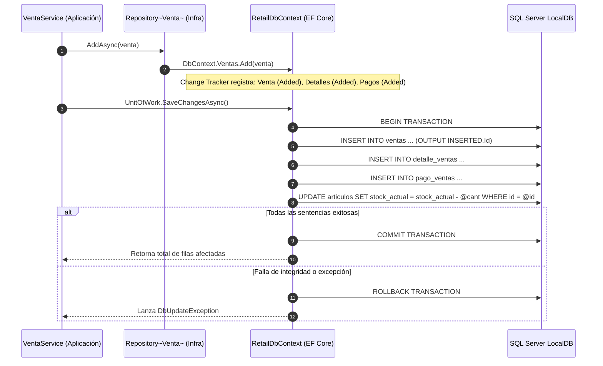

# Capa de Infraestructura: EF Core 8, Persistencia y Servicios Externos

### Módulo: 02. Capas de Arquitectura (Clean Architecture)
**Audiencia:** Desarrolladores, estudiantes y mesa evaluadora de cátedra  
**Proyecto de Referencia:** [`src/Retail.Infrastructure`](file:///c:/Users/lucas/Proyectos/retail/src/Retail.Infrastructure)  
**Tecnologías:** Entity Framework Core 8 | SQL Server LocalDB | MiniExcel | BCrypt.Net-Next  

---

## 1. 📖 Fundamento Teórico y Académico

### 1.1 El Rol de la Infraestructura en Clean Architecture
La **Capa de Infraestructura** contiene todos los detalles tecnológicos concretos y adaptadores hacia el mundo exterior (lo que Alistair Cockburn denomina *Driven Adapters* en la Arquitectura Hexagonal):

* El motor de base de datos relacional (SQL Server).
* El mapeo objeto-relacional (ORM) con Entity Framework Core.
* La comunicación con hardware local (impresoras térmicas ESC/POS).
* La comunicación HTTP con servicios externos (servidores fiscales de AFIP/ARCA).
* La criptografía y el hashing de contraseñas.

Esta capa implementa las interfaces definidas en [`Retail.Application`](file:///c:/Users/lucas/Proyectos/retail/src/Retail.Application), de modo que el resto del sistema **nunca depende de cómo se comunican las cosas con el sistema operativo ni de qué librería específica de persistencia se utiliza**.

---

## 2. 💻 Aplicación Concreta en el Código de Retail

### 2.1 Mapeo Fluent API Puro (Persistencia Ignorante)
En [`src/Retail.Infrastructure/Persistence/Configurations/`](file:///c:/Users/lucas/Proyectos/retail/src/Retail.Infrastructure/Persistence/Configurations/), configuramos cada tabla y columna sin colocar anotaciones en las entidades del dominio:

```csharp
// Fragmento de ArticuloConfiguration.cs
public class ArticuloConfiguration : IEntityTypeConfiguration<Articulo>
{
    public void Configure(EntityTypeBuilder<Articulo> builder)
    {
        builder.ToTable("articulos");
        builder.HasKey(a => a.Id);

        builder.Property(a => a.Descripcion)
            .IsRequired()
            .HasMaxLength(150);

        builder.Property(a => a.PrecioVenta)
            .HasPrecision(18, 2)
            .IsRequired();

        // INNOVACIÓN ARQUITECTÓNICA: Filtered Index para Artesanías (RF-04)
        // Permite múltiples artículos con NULL, pero si tiene código, debe ser estrictamente único.
        builder.HasIndex(a => a.CodigoBarras)
            .IsUnique()
            .HasFilter("[codigo_barras] IS NOT NULL");
    }
}
```

### 2.2 Borrado Lógico con Global Query Filters
En [`RetailDbContext.cs`](file:///c:/Users/lucas/Proyectos/retail/src/Retail.Infrastructure/Persistence/Context/RetailDbContext.cs), interceptamos todas las entidades que heredan de `BaseEntity` para aplicar un filtro global de borrado lógico:

```csharp
protected override void OnModelCreating(ModelBuilder modelBuilder)
{
    base.OnModelCreating(modelBuilder);
    modelBuilder.ApplyConfigurationsFromAssembly(typeof(RetailDbContext).Assembly);

    // Filtro global: jamás trae registros con IsDeleted == true a menos que se use .IgnoreQueryFilters()
    foreach (var entityType in modelBuilder.Model.GetEntityTypes())
    {
        if (typeof(BaseEntity).IsAssignableFrom(entityType.ClrType))
        {
            var parameter = Expression.Parameter(entityType.ClrType, "e");
            var isDeletedProperty = Expression.Property(parameter, nameof(BaseEntity.IsDeleted));
            var filter = Expression.Lambda(Expression.Not(isDeletedProperty), parameter);
            entityType.SetQueryFilter(filter);
        }
    }
}
```

### 2.3 Patrón Unit of Work y Transacciones ACID
El [`UnitOfWork.cs`](file:///c:/Users/lucas/Proyectos/retail/src/Retail.Infrastructure/Persistence/Repositories/UnitOfWork.cs) garantiza que operaciones críticas (como registrar una venta, descontar stock y asentar los pagos) se ejecuten bajo una transacción atómica única:

```csharp
public async Task<int> SaveChangesAsync(CancellationToken cancellationToken = default)
{
    return await _context.SaveChangesAsync(cancellationToken);
}
```
Si ocurre una excepción durante el proceso, EF Core descarta los cambios en memoria y la base de datos ejecuta un `ROLLBACK` automático, imposibilitando ventas a medio cobrar o stocks desfasados.

### 2.4 Dobles de Prueba y Mocks Integrados
Para permitir el desarrollo y pruebas locales sin hardware físico de mostrador ni certificados de AFIP:
* **`MockArcaClient.cs`:** Simula la autorización de comprobantes fiscales emitiendo un CAE determinístico de 14 dígitos en $< 10\text{ ms}$.
* **`FileDebugTicketPrinterService.cs`:** Genera un archivo `.txt` en la carpeta `tickets/` con el diseño exacto de 40 columnas de una impresora térmica EPSON/Hasar.

---

## 3. 📊 Diagrama Explicativo: Transacción de Persistencia ACID



---

## 4. ⚖️ Decisiones de Diseño y Trade-offs

### ¿Por qué Fluent API en vez de Data Annotations (`[Table]`, `[MaxLength]`)?
* **Pureza del Dominio:** Colocar atributos de Entity Framework en las clases de dominio contamina el núcleo con dependencias de persistencia. Fluent API centraliza toda la configuración relacional en la capa adecuada (`Retail.Infrastructure`).

### ¿Por qué Push-Down to SQL y `.AsNoTracking()`?
* **Push-Down to SQL:** Las consultas de búsqueda de artículos y filtrado se componen sobre `IQueryable` para que SQL Server ejecute el filtrado en su motor optimizado. Traer 10.000 artículos a la memoria de la aplicación con `.ToList()` para luego filtrar con C# saturaría la RAM y violaría el requisito de latencia de mostrador.
* **`.AsNoTracking()`:** En pantallas de consulta de catálogo o reportes de caja, no se requiere modificar las entidades. Desactivar el Change Tracker reduce a la mitad el consumo de memoria y la sobrecarga de CPU.

---

## 5. 🎓 Preguntas de Examen de Cátedra (Autoevaluación)

### Pregunta 1: *"¿Cómo resolvieron el conflicto entre la obligatoriedad de que el código de barras sea único y la existencia de productos artesanales que no traen código de fábrica?"*
> **Respuesta Modelo del Estudiante:**  
> "En un modelo relacional tradicional, un índice único estándar (`UNIQUE INDEX`) solo permite una única fila con valor `NULL`. Si dos artesanías no tuvieran código, la base de datos rechazaría la segunda por duplicado.  
> Para resolver este requerimiento comercial (`RF-04`), aprovechamos las capacidades de SQL Server configurando un **Índice Filtrado (*Filtered Index*)** mediante Fluent API:  
> `builder.HasIndex(a => a.CodigoBarras).IsUnique().HasFilter("[codigo_barras] IS NOT NULL");`  
> Esto le indica al motor relacional que la restricción de unicidad aplica única y exclusivamente a los registros que posean un código cargado. De este modo, el sistema permite infinitos artículos artesanales con valor nulo, pero si se escanea un código EAN-13 de fábrica, garantiza al 100% que no existan duplicados."

### Pregunta 2: *"¿Qué es el Change Tracker de Entity Framework Core y por qué es una buena práctica utilizar `.AsNoTracking()` en consultas de solo lectura?"*
> **Respuesta Modelo del Estudiante:**  
> "El Change Tracker es el componente de EF Core que mantiene instantáneas en memoria de las entidades cargadas para detectar qué propiedades fueron alteradas y generar los `UPDATE` correspondientes al invocar `SaveChangesAsync()`.  
> En operaciones de solo lectura (como llenar el DataGrid de búsqueda de catálogo con 200 resultados), el Change Tracker es innecesario y genera un overhead severo de asignación de memoria y recolección de basura. Al usar `.AsNoTracking()`, EF Core materializa los objetos de forma liviana sin retener referencias en su rastreador interno, reduciendo drásticamente el consumo de memoria RAM para cumplir con la meta de $\le 300\text{ MB}$ (`RNF-03`)."
