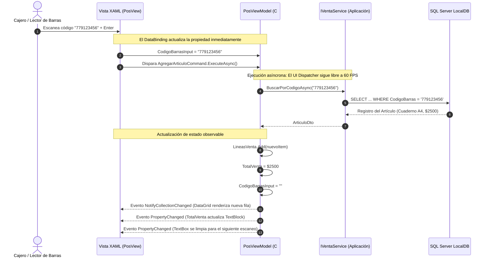

# Capa de Presentación: WPF, MVVM con Source Generators y UI Dispatcher

### Módulo: 02. Capas de Arquitectura (Clean Architecture)
**Audiencia:** Desarrolladores, estudiantes y evaluadores de cátedra  
**Proyecto de Referencia:** [`src/Retail.App`](file:///c:/Users/lucas/Proyectos/retail/src/Retail.App)  
**Tecnologías:** WPF (.NET 8) | C# 12 | `CommunityToolkit.Mvvm 8.3.2` | WPF-UI 3.0  

---

## 1. 📖 Fundamento Teórico y Académico

### 1.1 El Patrón MVVM (Model-View-ViewModel)
El patrón **MVVM** fue formulado en 2005 por **John Gossman y Ken Cooper** en Microsoft específicamente para plataformas basadas en XAML y Data Binding declarativo:

* **View (Vista):** Archivo XAML puramente declarativo. Define la estructura visual, colores, tipografía y disposición espacial de los controles. No contiene lógica de negocio ni cálculos.
* **ViewModel (Modelo de Vista):** Clase C# pura que expone el estado observable de la pantalla (propiedades) y las acciones que el usuario puede disparar (comandos `ICommand`). **No tiene referencias a controles visuales de WPF** (como `Button`, `TextBox` o `DataGrid`).
* **Model (Modelo):** Los datos y casos de uso subyacentes provistos por la capa de Aplicación (DTOs y servicios de negocio).

```text
    ┌───────────────────────┐                    ┌───────────────────────┐
    │     View (XAML)       │ ◄── Data Binding ──► │  ViewModel (C# Puro)  │
    │  (Sin lógica C#)      │                    │  (Sin referencias UI) │
    └───────────────────────┘                    └───────────┬───────────┘
                                                             │
                                                     Invoca Casos de Uso
                                                             │
                                                             ▼
                                                 ┌───────────────────────┐
                                                 │   Model / Application │
                                                 │   (Servicios & DTOs)  │
                                                 └───────────────────────┘
```

### 1.2 El Hilo de Interfaz (STA) y el UI Dispatcher
Las aplicaciones gráficas de Windows funcionan bajo el modelo de apartamento de subproceso único (**Single-Threaded Apartment - STA**):
* Existe **un único hilo principal de ejecución** (el hilo de UI) responsable de procesar la cola de mensajes del sistema operativo (eventos de ratón, pulsaciones de teclas del lector de código de barras, renderizado de píxeles a $60\text{ fps}$).
* **La Regla Inviolable del Dispatcher:** Si ese hilo se ocupa ejecutando una tarea lenta (como una consulta a la base de datos SQL o la lectura de un archivo Excel de 10.000 líneas), la cola de mensajes se detiene. El usuario experimenta que la aplicación "se congela", aparece la rueda de espera de Windows y el lector de código de barras pierde caracteres.
* Por ello, toda operación de I/O o cálculo pesado debe ser **rigurosamente asíncrona (`async/await`)** o delegarse a hilos del ThreadPool con `Task.Run`.

### 1.3 Revolución de Productividad: Source Generators de C#
Históricamente, MVVM sufría de un defecto severo: el exceso de código repetitivo (*boilerplate*). Para hacer que una propiedad notificara cambios a la vista, el desarrollador debía escribir:

```csharp
// ENFOQUE TRADICIONAL OBSOLETO (Boilerplate propenso a errores)
private string _codigo = string.Empty;
public string Codigo
{
    get => _codigo;
    set
    {
        if (_codigo != value)
        {
            _codigo = value;
            OnPropertyChanged(nameof(Codigo));
            OnPropertyChanged(nameof(TieneCodigo));
        }
    }
}
```

En Retail utilizamos **`CommunityToolkit.Mvvm`** con **Source Generators** en tiempo de compilación. Con un simple atributo `[ObservableProperty]`, el compilador de C# 12 genera automáticamente la propiedad pública, el almacenamiento privado y el despacho de eventos `INotifyPropertyChanged`.

---

## 2. 💻 Aplicación Concreta en el Código de Retail

### 2.1 Un ViewModel Moderno: `PosViewModel`
En [`src/Retail.App/ViewModels/`](file:///c:/Users/lucas/Proyectos/retail/src/Retail.App/ViewModels/), los ViewModels heredan de `ObservableObject` y aprovechan los generadores:

```csharp
public partial class PosViewModel : ObservableObject
{
    private readonly IVentaService _ventaService;
    private readonly IInventarioService _inventarioService;

    // 1. El Source Generator crea la propiedad pública "CodigoBarrasInput"
    //    y notifica automáticamente a la vista XAML ante cualquier cambio.
    [ObservableProperty]
    private string _codigoBarrasInput = string.Empty;

    [ObservableProperty]
    private decimal _totalVenta;

    // Colección observable que actualiza el DataGrid en tiempo real
    public ObservableCollection<DetalleVentaDto> LineasVenta { get; } = new();

    public PosViewModel(IVentaService ventaService, IInventarioService inventarioService)
    {
        _ventaService = ventaService;
        _inventarioService = inventarioService;
    }

    // 2. El Source Generator crea la propiedad "AgregarArticuloCommand" (IAsyncRelayCommand)
    //    gestionando automáticamente la deshabilitación del botón mientras se ejecuta.
    [RelayCommand]
    private async Task AgregarArticuloAsync()
    {
        if (string.IsNullOrWhiteSpace(CodigoBarrasInput))
            return;

        // Búsqueda asíncrona que NO bloquea el UI Dispatcher
        var articulo = await _inventarioService.BuscarPorCodigoAsync(CodigoBarrasInput);
        if (articulo != null)
        {
            LineasVenta.Add(new DetalleVentaDto(articulo.Id, articulo.Descripcion, 1, articulo.PrecioVenta));
            TotalVenta = LineasVenta.Sum(l => l.Subtotal);
            CodigoBarrasInput = string.Empty; // Limpia el input para el siguiente escaneo
        }
    }
}
```

### 2.2 Vinculación Declarativa en XAML
En la vista [`PosView.xaml`](file:///c:/Users/lucas/Proyectos/retail/src/Retail.App/Views/Pages/), los controles se conectan al ViewModel mediante Data Binding sin una sola línea de código en el *Code-Behind* (`PosView.xaml.cs` permanece vacío):

```xml
<!-- Enlace bidireccional del lector de código de barras -->
<TextBox Text="{Binding CodigoBarrasInput, UpdateSourceTrigger=PropertyChanged}"
         FontSize="18"
         FontFamily="{StaticResource CascadiaCodeFont}" />

<!-- Disparo de comando mediante botón o tecla Enter -->
<Button Content="Agregar (Enter)"
        Command="{Binding AgregarArticuloCommand}"
        Style="{StaticResource AccentButtonStyle}" />

<!-- Grilla de artículos vendidos -->
<DataGrid ItemsSource="{Binding LineasVenta}"
          AutoGenerateColumns="False">
    <DataGrid.Columns>
        <DataGridTextColumn Header="Descripción" Binding="{Binding Descripcion}" Width="*" />
        <DataGridTextColumn Header="Cant." Binding="{Binding Cantidad}" Width="60" />
        <DataGridTextColumn Header="Precio" Binding="{Binding PrecioUnitario, StringFormat='{}{0:C}'}" Width="100" />
        <DataGridTextColumn Header="Subtotal" Binding="{Binding Subtotal, StringFormat='{}{0:C}'}" Width="110" />
    </DataGrid.Columns>
</DataGrid>
```

### 2.3 Sistema de Tokens UI y Estilos Globales
Para cumplir con los lineamientos de diseño de Windows 11 Fluent y la identidad de marca de Retail, la capa de presentación centraliza sus recursos en diccionarios temáticos:
* [`Styles/Colors.xaml`](file:///c:/Users/lucas/Proyectos/retail/src/Retail.App/Styles/Colors.xaml): Paleta Borravino / Carmín (`#9D0F33`) como acento principal.
* [`Styles/Typography.xaml`](file:///c:/Users/lucas/Proyectos/retail/src/Retail.App/Styles/Typography.xaml): **Tipografía dual**:
  * `Cascadia Code` (monoespaciada) para importes monetarios, subtotales, totales y códigos numéricos (garantiza alineación decimal perfecta en columnas).
  * `Segoe UI Variable` para textos de interfaz general, etiquetas y navegación.
* [`Styles/Controls.xaml`](file:///c:/Users/lucas/Proyectos/retail/src/Retail.App/Styles/Controls.xaml): Estilos para los keycaps de acceso rápido (F1 a F12), badges de alerta de stock y tarjetas de resumen.

---

## 3. 📊 Diagrama Explicativo: Flujo de Eventos y Data Binding



---

## 4. ⚖️ Decisiones de Diseño y Trade-offs

### ¿Por qué MVVM en lugar del tradicional "Code-Behind" (`OnClick` en XAML.cs)?
* **Testeabilidad Automática:** Con Code-Behind, para probar la lógica de cobro hay que levantar físicamente la ventana gráfica de Windows. Con MVVM, el `PosViewModel` es una clase C# estándar que se instancia y prueba en milisegundos dentro de un test de xUnit (`tests/Retail.App.UnitTests/`) inyectando servicios simulados (*mocks*).
* **Mantenibilidad:** Separar la estética visual (XAML) de la lógica de presentación permite rediseñar pantallas sin tocar una sola línea de lógica C#.

### ¿Por qué WPF (.NET 8) y NO tecnologías como Electron o WebApps?
* **Electron:** Cada instancia de Electron empaqueta una copia completa del navegador Chromium y Node.js, consumiendo entre $200\text{ MB}$ y $500\text{ MB}$ de RAM antes de renderizar una sola pantalla. En máquinas de punto de venta modestas, este consumo es prohibitivo frente a nuestro requisito no funcional de $\le 300\text{ MB}$ (`RNF-03`).
* **WPF en .NET 8:** Es el framework de escritorio nativo para Windows más maduro, robusto y optimizado del mercado. Ofrece aceleración gráfica por hardware vía DirectX, interoperabilidad transparente con puertos serie/USB para impresoras de tickets y latencia de renderizado casi nula.

---

## 5. 🎓 Preguntas de Examen de Cátedra (Autoevaluación)

### Pregunta 1: *"¿Cómo garantiza el patrón MVVM la testeabilidad de la interfaz de usuario si las ventanas XAML no se pueden instanciar en pruebas unitarias headless?"*
> **Respuesta Modelo del Estudiante:**  
> "Precisamente desacoplando la lógica de la representación visual. En MVVM, la vista XAML es una cáscara declarativa que solo contiene bindings. Toda la lógica de interacción (qué pasa cuando se hace clic, el recálculo del vuelto, la habilitación de botones o la selección de medios de pago) reside en el ViewModel. Dado que el ViewModel no referencia ningún control visual de WPF (`System.Windows.Controls`), podemos instanciarlo directamente en nuestros proyectos de pruebas unitarias de xUnit, inyectarle dobles de prueba (*mocks*) de los servicios de aplicación y afirmar (`Assert`) que las propiedades observables y las colecciones se actualicen de manera correcta sin necesidad de renderizar ventanas en la GPU ni interactuar con el hilo STA."

### Pregunta 2: *"¿Qué sucede si un programador ejecuta un `Thread.Sleep(5000)` o una consulta síncrona a la base de datos dentro del hilo principal de WPF?"*
> **Respuesta Modelo del Estudiante:**  
> "En WPF, el hilo de la interfaz corre en un apartamento STA y ejecuta un bucle de despacho (`DispatcherFrame`) que procesa continuamente la cola de mensajes de Windows (`GetMessage`/`DispatchMessage`). Si ejecutamos una tarea bloqueante en ese hilo, el bucle se detiene: la ventana deja de responder a eventos del sistema operativo, el cursor se transforma en el ícono de carga, la pantalla se desvanece a blanco y Windows marca el proceso como *'No responde'*. Si un cajero está usando el lector de código de barras durante ese bloqueo, el búfer del teclado se satura o se pierden caracteres. Para evitar esto, en Retail todas las operaciones de I/O son asíncronas con `async/await`, delegando el trabajo al ThreadPool y regresando al hilo principal únicamente para actualizar las propiedades observables del ViewModel."
