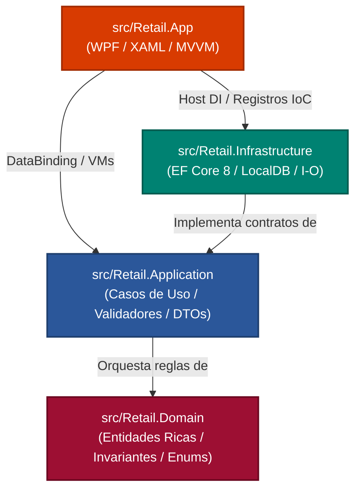

# 02. Capas de Arquitectura (Clean Architecture)

Este módulo desglosa en profundidad las cuatro capas concéntricas que componen la solución `Retail.sln`, analizando sus responsabilidades específicas, sus dependencias forzadas por el compilador y sus directivas de aislamiento:

---

## 🏛️ Topología y Regla de Dependencia Estricta

> [!IMPORTANT]
> **La Regla de Dependencia Inviolable (Ley 1 de AGENTS.md):**  
> Las dependencias apuntan exclusivamente hacia el centro:
> $$\text{Retail.App} \longrightarrow \text{Retail.Application} \longleftarrow \text{Retail.Infrastructure}$$
> $$\text{Retail.Application} \longrightarrow \text{Retail.Domain}$$
> `Retail.Domain` **no posee dependencias externas** (ni NuGet, ni EF Core, ni WPF).  
> `Retail.App` (UI) **jamás interactúa con `RetailDbContext`** ni ejecuta consultas SQL directas.

---

## 🧭 Catálogo de Capas Documentadas

| Capa Arquitectónica | Proyecto .NET | Rol y Principios de Diseño | Enlace al Artículo |
| :--- | :--- | :--- | :--- |
| **01. Capa de Dominio** | [`Retail.Domain`](file:///c:/Users/lucas/Proyectos/retail/src/Retail.Domain) | Modelo de Dominio Rico (*Rich Domain Model*), entidades que heredan de `BaseEntity`, raíces de agregado marcadas con `IAggregateRoot`, catálogo de 16 excepciones de negocio tipadas y pureza tecnológica absoluta (0 dependencias externas). | [Ver Artículo](01-dominio-ddd.md) |
| **02. Capa de Aplicación** | [`Retail.Application`](file:///c:/Users/lucas/Proyectos/retail/src/Retail.Application) | Orquestación de casos de uso sin lógica mutacional propia, modelos de transporte inmutables con `record class`, validación declarativa en frontera con `FluentValidation` e interfaces IoC (`IRepository<T>`, `IUnitOfWork`, `IArcaClient`). | [Ver Artículo](02-aplicacion-casos-de-uso.md) |
| **03. Capa de Infraestructura** | [`Retail.Infrastructure`](file:///c:/Users/lucas/Proyectos/retail/src/Retail.Infrastructure) | Persistencia con Entity Framework Core 8, mapeo relacional puro con Fluent API (Persistencia Ignorante), *Filtered Index* para artesanías, borrado lógico global (`!IsDeleted`), transacciones ACID y dobles de prueba (`MockArcaClient`, `FileDebugTicketPrinterService`). | [Ver Artículo](03-infraestructura-persistencia.md) |
| **04. Capa de Presentación** | [`Retail.App`](file:///c:/Users/lucas/Proyectos/retail/src/Retail.App) | Interfaz de escritorio Windows 11 Fluent con WPF y `WPF-UI`, patrón MVVM moderno con Source Generators (`CommunityToolkit.Mvvm`), custodia del hilo STA (`UI Dispatcher`) a 60 FPS y sistema de diseño con paleta Borravino `#9D0F33` y tipografía dual. | [Ver Artículo](04-presentacion-wpf-mvvm.md) |
