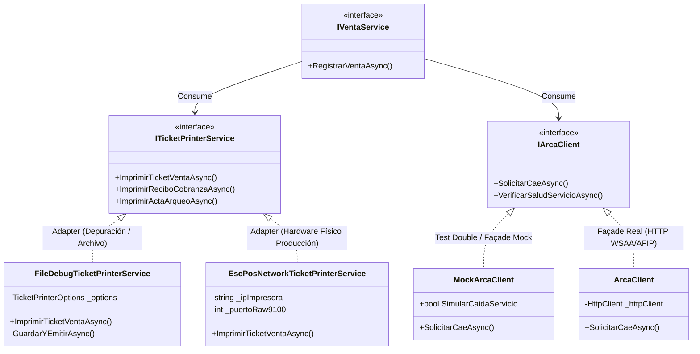

# Patrones Adapter y Façade: Aislamiento de Hardware POS y Servicios Fiscales

### Módulo: 03. Patrones de Diseño (GoF & DDD Táctico)
**Audiencia:** Desarrolladores, estudiantes y mesa evaluadora de cátedra  
**Patrones GoF Subyacentes:** *Adapter* (Envoltorio de interfaces incompatibles) y *Façade* (Fachada simplificada para subsistemas complejos)  
**Archivos de Código:**
* Hardware: [`ITicketPrinterService.cs`](file:///c:/Users/lucas/Proyectos/retail/src/Retail.Application/Interfaces/Infrastructure/ITicketPrinterService.cs) y [`FileDebugTicketPrinterService.cs`](file:///c:/Users/lucas/Proyectos/retail/src/Retail.Infrastructure/Hardware/FileDebugTicketPrinterService.cs)
* Facturación Fiscal: [`IArcaClient.cs`](file:///c:/Users/lucas/Proyectos/retail/src/Retail.Application/Interfaces/Infrastructure/IArcaClient.cs), [`ArcaClient.cs`](file:///c:/Users/lucas/Proyectos/retail/src/Retail.Infrastructure/ExternalServices/ArcaSdk/ArcaClient.cs) y [`MockArcaClient.cs`](file:///c:/Users/lucas/Proyectos/retail/src/Retail.Infrastructure/ExternalServices/ArcaSdk/MockArcaClient.cs)

---

## 1. 📖 Fundamento Teórico y Académico

### 1.1 El Patrón Adapter (*Wrapper*)
Definido por el **Gang of Four (GoF)**:
> *"Convierte la interfaz de una clase en otra interfaz que los clientes esperan. Permite que clases con interfaces incompatibles trabajen juntas."*

En un punto de venta minorista, los dispositivos físicos (impresoras térmicas ESC/POS EPSON o Hasar, lectores de códigos en puerto serie) operan mediante comandos binarios de bajo nivel, códigos de escape ANSI o controladores propietarios. El patrón Adapter envuelve esa complejidad bajo una interfaz amigable de alto nivel (`ImprimirTicketVentaAsync`), aislando a la aplicación del fabricante del hardware.

### 1.2 El Patrón Façade (*Fachada*)
También formulado por el **GoF**:
> *"Proporciona una interfaz unificada para un conjunto de interfaces en un subsistema. Define una interfaz de nivel más alto que hace que el subsistema sea más fácil de usar."*

La interacción con los servidores de facturación electrónica de AFIP/ARCA involucra autenticación previa con tokens criptográficos (WSAA), firma digital de payloads XML/JSON, resolución de puntos de venta fiscales y gestión de timeouts de red. El patrón Façade encapsula toda esa maraña protocolar en un único método limpio: `SolicitarCaeAsync(solicitud)`.

### 1.3 Dobles de Prueba (*Test Doubles*)
Según la taxonomía clásica de **Gerard Meszaros** (*xUnit Test Patterns*), un sistema con dependencias externas volátiles (impresoras de mostrador, webservices gubernamentales) requiere dobles de prueba:
* **Fakes / Mocks:** Implementaciones funcionales ligeras que permiten compilar, ejecutar y verificar el 100% de la lógica de negocio en máquinas de desarrollo o en runners de CI/CD (GitHub Actions) donde físicamente no existe una impresora conectada ni certificados fiscales oficiales.

---

## 2. 💻 Aplicación Concreta en el Código de Retail

### 2.1 El Adaptador de Impresión: `FileDebugTicketPrinterService`
En lugar de depender de que el desarrollador tenga una impresora EPSON TM-T20 en su escritorio, [`FileDebugTicketPrinterService.cs`](file:///c:/Users/lucas/Proyectos/retail/src/Retail.Infrastructure/Hardware/FileDebugTicketPrinterService.cs) implementa [`ITicketPrinterService`](file:///c:/Users/lucas/Proyectos/retail/src/Retail.Application/Interfaces/Infrastructure/ITicketPrinterService.cs) formateando el ticket con el ancho estricto de **40 columnas** y escribiéndolo en un archivo `.txt` en disco:

```csharp
public async Task ImprimirTicketVentaAsync(VentaResponseDto venta, CancellationToken ct = default)
{
    var sb = new StringBuilder();
    int ancho = _options.AnchoCaracteres; // 40 caracteres estándar térmico

    AgregarEncabezadoComercio(sb, ancho);
    sb.AppendLine($"{CentrarTexto("TICKET DE VENTA", ancho)}");
    sb.AppendLine($"{Separador('-', ancho)}");
    sb.AppendLine($"Comprobante: #{venta.IdVenta:D8}");
    sb.AppendLine($"Fecha/Hora:  {venta.FechaHora:dd/MM/yyyy HH:mm:ss}");
    
    // Formateo de columnas alineadas a derecha e izquierda
    foreach (var item in venta.Items)
    {
        sb.AppendLine($"{TruncarTexto(item.Descripcion, ancho)}");
        sb.AppendLine($"{AlinearDosExtremos($"  {item.Cantidad} x {item.PrecioUnitario:C}", item.SubtotalItem.ToString("C"), ancho)}");
    }

    // Emisión física simulada en disco
    string nombreArchivo = $"ticket_venta_{venta.IdVenta}_{DateTime.Now:yyyyMMdd_HHmmssfff}.txt";
    await GuardarYEmitirAsync(nombreArchivo, sb.ToString(), ct);
}
```

### 2.2 La Fachada Fiscal y su Doble: `MockArcaClient`
Para interactuar con el microservicio fiscal `arcasdk`, la aplicación consume la interfaz [`IArcaClient`](file:///c:/Users/lucas/Proyectos/retail/src/Retail.Application/Interfaces/Infrastructure/IArcaClient.cs). En desarrollo local, inyectamos [`MockArcaClient.cs`](file:///c:/Users/lucas/Proyectos/retail/src/Retail.Infrastructure/ExternalServices/ArcaSdk/MockArcaClient.cs):

```csharp
public class MockArcaClient : IArcaClient
{
    public bool SimularCaidaServicio { get; set; }
    public bool SimularExcepcionRed { get; set; }

    public async Task<RespuestaCaeDto> SolicitarCaeAsync(SolicitudCaeDto solicitud, CancellationToken ct = default)
    {
        if (SimularCaidaServicio)
        {
            return new RespuestaCaeDto
            {
                Exitoso = false,
                ResultadoArca = "R",
                MotivoError = "Microservicio fiscal arcasdk no responde (Simulación de contingencia RF-17)"
            };
        }

        // Genera CAE simulado determinístico de 14 dígitos
        string caeSimulado = $"74{solicitud.PuntoVenta:D4}{solicitud.IdVenta:D8}";
        
        return new RespuestaCaeDto
        {
            Exitoso = true,
            Cae = caeSimulado,
            FechaVtoCae = DateOnly.FromDateTime(solicitud.FechaComprobante.AddDays(10)),
            ResultadoArca = "A"
        };
    }
}
```

### 2.3 Selección Transparente por Inyección de Dependencias
En [`src/Retail.Infrastructure/DependencyInjection.cs`](file:///c:/Users/lucas/Proyectos/retail/src/Retail.Infrastructure/DependencyInjection.cs), la fábrica resuelve la implementación adecuada leyendo [`appsettings.json`](file:///c:/Users/lucas/Proyectos/retail/src/Retail.App/appsettings.json):

```csharp
// Selección transparente del cliente fiscal
if (configuration.GetValue<bool>("Fiscal:UseMockArca"))
{
    services.AddSingleton<IArcaClient, MockArcaClient>();
}
else
{
    services.AddHttpClient<IArcaClient, ArcaClient>(...);
}
```

---

## 3. 📊 Diagrama Explicativo: Topología de Adaptadores y Fachadas



---

## 4. ⚖️ Decisiones de Diseño y Trade-offs

### ¿Por qué simular el ticket con un formateador de 40 columnas y no un simple `Console.WriteLine`?
* Un ticket térmico comercial tiene un límite rígido de **40 caracteres por línea**.
* Si el texto de un artículo es muy largo (ej. *"Cuaderno Universitario Gloria Espiral Cuadriculado 100 Hojas"*), una impresora real cortará la línea o desplazará el precio hacia abajo, rompiendo la legibilidad fiscal.
* Nuestro adaptador [`FileDebugTicketPrinterService`](file:///c:/Users/lucas/Proyectos/retail/src/Retail.Infrastructure/Hardware/FileDebugTicketPrinterService.cs) implementa algoritmos de truncamiento inteligente (`TruncarTexto`), separadores dinámicos y alineación de tres columnas (`AlinearTresColumnas`). Esto permite verificar visualmente el diseño del ticket antes de gastar papel físico en la tienda.

---

## 5. 🎓 Preguntas de Examen de Cátedra (Autoevaluación)

### Pregunta 1: *"¿Cuál es la diferencia conceptual entre el patrón Adapter y el patrón Façade?"*
> **Respuesta Modelo del Estudiante:**  
> "La diferencia principal radica en su **propósito arquitectónico**:  
> * El **Adapter** resuelve un problema de **incompatibilidad de interfaces**: adapta una clase existente para que encaje en una interfaz específica que el cliente ya requiere (en nuestro caso, adapta la escritura de archivos en disco del sistema operativo a la interfaz `ITicketPrinterService`).  
> * La **Façade**, en cambio, resuelve un problema de **complejidad de un subsistema**: crea una interfaz nueva, limpia y simplificada para ocultar un conjunto complejo de llamadas, protocolos y serializaciones (en nuestro caso, `IArcaClient` actúa como fachada ocultando las peticiones HTTP, el manejo de tokens fiscales y los códigos de error del microservicio `arcasdk`)."

### Pregunta 2: *"¿Por qué la Ley 6 de AGENTS.md exige la existencia de estos Mocks para el pipeline de CI/CD?"*
> **Respuesta Modelo del Estudiante:**  
> "En un entorno de Integración Continua como GitHub Actions, las pruebas automatizadas se ejecutan en máquinas virtuales efímeras en la nube. Dichos servidores no disponen de puertos serie ni impresoras EPSON conectadas, ni poseen acceso a certificados fiscales privados de la AFIP.  
> Si la aplicación estuviera fuertemente acoplada al hardware físico o a servidores fiscales reales, la suite de pruebas fallaría sistemáticamente en CI. Gracias al patrón Façade y al uso de `MockArcaClient` y `FileDebugTicketPrinterService`, el pipeline compila, ejecuta las pruebas de integración y valida el flujo completo de cobro de forma hermética, rápida y determinística con código de retorno `0`."
