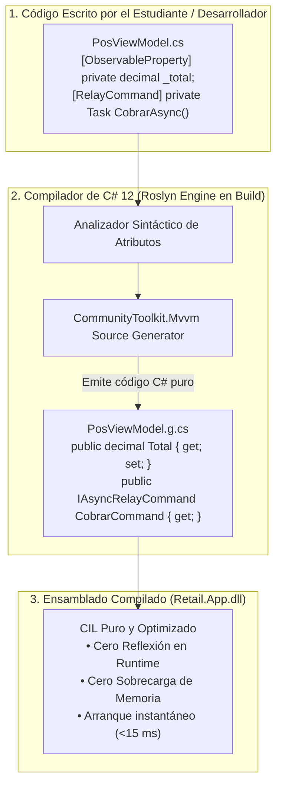

# MVVM Moderno con Source Generators: Eliminando Boilerplate sin Pérdida de Control

### Módulo: 03. Patrones de Diseño (GoF & DDD Táctico)
**Audiencia:** Desarrolladores, estudiantes universitarios y mesa examinadora de cátedra  
**Patrones GoF Subyacentes:** *Observer* (Notificación de cambios de propiedad) y *Command* (Encapsulación de acciones de UI)  
**Librería Principal:** `CommunityToolkit.Mvvm 8.3.2` (.NET Foundation)  

---

## 1. 📖 Fundamento Teórico y Académico

### 1.1 El Patrón MVVM y sus Raíces GoF
El patrón **Model-View-ViewModel (MVVM)** es una evolución del *Presentation Model* de Martin Fowler adaptado por Microsoft a entornos con motores de Data Binding declarativo (WPF, Avalonia, MAUI):
* **El Patrón Observer (GoF):** La interfaz `INotifyPropertyChanged` es la materialización directa del patrón *Observer*. La vista (XAML) se suscribe a los eventos del ViewModel. Cuando una propiedad del ViewModel cambia, notifica a los suscriptores (`PropertyChanged`), provocando que la UI redibuje únicamente el control afectado.
* **El Patrón Command (GoF):** La interfaz `ICommand` desacopla el botón visual (`Button`) de la acción que ejecuta. En lugar de cablear eventos `OnClick` con lógica acoplada, el botón se enlaza declarativamente a un comando (`Command="{Binding GuardarCommand}"`).

### 1.2 El Dilema Histórico: El "Impuesto de Boilerplate"
Durante años, implementar MVVM puro en C# requería escribir entre 15 y 25 líneas de código repetitivo (*boilerplate*) por cada propiedad y comando. Esto tentaba a los programadores a abandonar el patrón o recurrir a librerías de *IL Weaving* en tiempo de ejecución (como Fody.PropertyChanged o Castle DynamicProxy), que introducían complejidad oculta, dificultad de depuración y pérdida de rendimiento.

### 1.3 La Revolución de Roslyn: Source Generators en Tiempo de Compilación
Introducidos en .NET 5 y perfeccionados en .NET 8 / C# 12, los **Source Generators** son analizadores de código que se ejecutan **durante la compilación**. Inspeccionan los atributos del código fuente y generan automáticamente archivos `.g.cs` que se incorporan a la compilación final.
* **Cero costo en tiempo de ejecución:** No usan reflexión (*Reflection*) ni modifican el código binario (*IL Weaving*).
* **100% Depurables:** Se puede colocar un breakpoint dentro del código generado por el Source Generator.
* **Tipado Fuerte y Autocompletado:** IntelliSense reconoce las propiedades generadas al instante.

---

## 2. 💻 Aplicación Concreta en el Código de Retail

### 2.1 El Atributo `[ObservableProperty]` en Acción
En un ViewModel de Retail, el desarrollador solo declara el campo privado con prefijo de guion bajo:

```csharp
using CommunityToolkit.Mvvm.ComponentModel;
using CommunityToolkit.Mvvm.Input;

namespace Retail.App.ViewModels;

public partial class PosViewModel : ObservableObject
{
    // Campo privado anotado
    [ObservableProperty]
    private decimal _totalVenta;

    // Método parcial hookeable que se dispara automáticamente cuando cambia el total
    partial void OnTotalVentaChanged(decimal oldValue, decimal newValue)
    {
        // Lógica reactiva opcional (ej. verificar si aplica descuento por volumen)
    }
}
```

#### ¿Qué genera internamente el compilador de C# 12?
El Source Generator emite un archivo parcial `PosViewModel.g.cs` idéntico a este:

```csharp
// CÓDIGO GENERADO AUTOMÁTICAMENTE POR COMMUNITYTOOLKIT.MVVM (No se escribe a mano)
public partial class PosViewModel
{
    public decimal TotalVenta
    {
        get => _totalVenta;
        set
        {
            if (!EqualityComparer<decimal>.Default.Equals(_totalVenta, value))
            {
                OnTotalVentaChanging(value);
                OnTotalVentaChanging(default, value);
                _totalVenta = value;
                OnTotalVentaChanged(value);
                OnTotalVentaChanged(oldValue, value);
                OnPropertyChanged(nameof(TotalVenta));
            }
        }
    }
}
```

### 2.2 Comandos Asíncronos Seguros: `[RelayCommand]`
Para operaciones de mostrador que consultan la base de datos o imprimen tickets sin congelar la ventana, utilizamos `[RelayCommand]` sobre métodos `Task`:

```csharp
public partial class PosViewModel : ObservableObject
{
    private readonly IVentaService _ventaService;

    public PosViewModel(IVentaService ventaService)
    {
        _ventaService = ventaService;
    }

    [RelayCommand]
    private async Task CobrarVentaAsync(CancellationToken ct)
    {
        // 1. El comando deshabilita automáticamente el botón en la UI mientras procesa
        //    evitando el doble clic del cajero impaciente.
        var resultado = await _ventaService.RegistrarVentaAsync(..., ct);
        
        // 2. Limpieza reactiva del estado
        LimpiarVenta();
    }
}
```

El Source Generator genera la propiedad pública:
```csharp
public IAsyncRelayCommand CobrarVentaCommand { get; }
```
La vista XAML simplemente enlaza al comando generado:
```xml
<Button Content="Cobrar (F10)"
        Command="{Binding CobrarVentaCommand}"
        Style="{StaticResource AccentButtonStyle}" />
```

---

## 3. 📊 Diagrama Explicativo: El Pipeline de Generación Roslyn



---

## 4. ⚖️ Decisiones de Diseño y Trade-offs

### Comparativa: 3 Formas de Implementar MVVM en .NET

| Criterio | MVVM Tradicional (A mano) | IL Weaving (Fody.PropertyChanged) | Source Generators (Nuestra Elección) |
| :--- | :--- | :--- | :--- |
| **Volumen de Código** | Masivo (+80% boilerplate). | Mínimo. | Mínimo. |
| **Mecanismo** | Escritura manual de `OnPropertyChanged`. | Modificación binaria post-build del IL. | Generación de código C# en tiempo de compilación. |
| **Depurabilidad** | Fácil pero tediosa. | Muy difícil (código modificado a nivel ensamblador). | **Excelente:** Se puede depurar paso a paso el `.g.cs`. |
| **Rendimiento** | Rápido. | Rápido. | **Máximo rendimiento:** Equivalente al código manual optimizado. |
| **Soporte Oficial** | Estándar. | Librería comunitaria de terceros. | **Oficial:** Mantenido por Microsoft y .NET Foundation. |

### Trade-offs Asumidos
* **Requisito de Clases Parciales:** Las clases ViewModel que utilicen generadores deben declararse obligatoriamente como `public partial class`, para permitir que el compilador combine el archivo escrito por el programador con el archivo generado.

---

## 5. 🎓 Preguntas de Examen de Cátedra (Autoevaluación)

### Pregunta 1: *"¿Qué ventaja técnica tienen los Source Generators frente a la Reflexión en tiempo de ejecución para implementar Data Binding?"*
> **Respuesta Modelo del Estudiante:**  
> "La reflexión inspecciona los metadatos de los tipos en tiempo de ejecución buscando propiedades y métodos mediante llamadas como `GetType().GetProperty(...)`. Este mecanismo consume ciclos de CPU significativos, satura la memoria con objetos de metadatos e impide que el compilador detecte errores tipográficos hasta que la pantalla se abre y falla.  
> Los Source Generators trasladan todo ese trabajo al **tiempo de compilación**: generan código C# fuertemente tipado antes de emitir el binario final. En tiempo de ejecución, el acceso a las propiedades y el disparo de eventos `PropertyChanged` son llamadas directas a métodos sin ninguna intermediación reflexiva, garantizando la fluidez de mostrador y arranque instantáneo requerido por el sistema."

### Pregunta 2: *"¿Cómo evita `[RelayCommand]` que un cajero haga doble clic sobre el botón de cobro y envíe dos ventas duplicadas a la base de datos?"*
> **Respuesta Modelo del Estudiante:**  
> "Cuando anotamos un método asíncrono (`async Task`) con `[RelayCommand]`, el Source Generator crea una instancia de `AsyncRelayCommand`. Este comando implementa internamente la interfaz `IAsyncRelayCommand`, la cual monitorea el estado de la tarea en ejecución (`IsRunning`). Mientras la promesa asíncrona de cobro no finalice, el método `CanExecute()` del comando devuelve `false`. El motor de Data Binding de WPF escucha la notificación de cambio de `CanExecute` y **deshabilita visualmente el botón en la interfaz gráfica** de forma automática. Aunque el cajero intente presionar el botón repetidamente o pulsar la tecla rápida varias veces, el comando rechaza los eventos subsiguientes hasta que la primera venta finalice con éxito."
