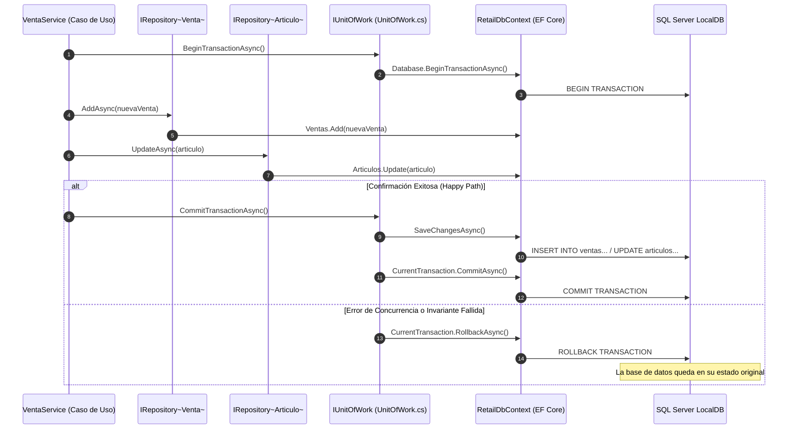

# Patrones Repository & Unit of Work: Persistencia Limpia, Límites de Agregados y Transacciones ACID

### Módulo: 03. Patrones de Diseño (GoF & DDD Táctico)
**Audiencia:** Desarrolladores, estudiantes universitarios y docentes evaluadores de cátedra  
**Archivos de Código:** 
* Interfaces: [`IRepository<T>.cs`](file:///c:/Users/lucas/Proyectos/retail/src/Retail.Application/Interfaces/Persistence/IRepository.cs) y [`IUnitOfWork.cs`](file:///c:/Users/lucas/Proyectos/retail/src/Retail.Application/Interfaces/Persistence/IUnitOfWork.cs)
* Implementaciones: [`Repository<T>.cs`](file:///c:/Users/lucas/Proyectos/retail/src/Retail.Infrastructure/Persistence/Repositories/Repository.cs) y [`UnitOfWork.cs`](file:///c:/Users/lucas/Proyectos/retail/src/Retail.Infrastructure/Persistence/Repositories/UnitOfWork.cs)

---

## 1. 📖 Fundamento Teórico y Académico

### 1.1 El Patrón Repositorio (*Repository Pattern*)
Formulado por **Martin Fowler** en *Patterns of Enterprise Application Architecture* (2002) y adoptado por **Eric Evans** en DDD:
> *"Un Repositorio media entre las capas de dominio y de mapeo de datos, actuando como una colección de objetos de dominio en memoria."*

En lugar de que los casos de uso escriban consultas SQL o manipulen directamente objetos de persistencia, interactúan con una interfaz que simula una lista en memoria (`AddAsync`, `GetByIdAsync`, `ListAllAsync`, `FindAsync`).

### 1.2 El Patrón Unidad de Trabajo (*Unit of Work*)
También definido por Fowler:
> *"Mantiene una lista de objetos afectados por una transacción de negocio y coordina la escritura de cambios y la resolución de problemas de concurrencia."*

El propósito del Unit of Work es garantizar la **atomicidad transaccional (la 'A' de ACID)**: cuando un caso de uso modifica tres agregados distintos (por ejemplo, crea una `Venta`, descuenta stock de dos `Articulo` y registra un movimiento en `TurnoCaja`), los tres cambios deben confirmarse juntos (`COMMIT`) o descartarse juntos (`ROLLBACK`) si ocurre cualquier error.

---

## 2. 💻 Aplicación Concreta en el Código de Retail

### 2.1 Restricción de Tipado Fuerte en la Interfaz: Solo Raíces de Agregado
En [`src/Retail.Application/Interfaces/Persistence/IRepository.cs`](file:///c:/Users/lucas/Proyectos/retail/src/Retail.Application/Interfaces/Persistence/IRepository.cs), aplicamos una restricción genérica (`where T : BaseEntity, IAggregateRoot`) que plasma la **Ley 2 de nuestra arquitectura**:

```csharp
namespace Retail.Application.Interfaces.Persistence;

/// <summary>
/// Contrato genérico de persistencia para Raíces de Agregado (DDD).
/// Restringido exclusivamente a entidades que implementan IAggregateRoot.
/// </summary>
public interface IRepository<T> where T : BaseEntity, IAggregateRoot
{
    Task<T?> GetByIdAsync(int id, CancellationToken cancellationToken = default);
    Task<IReadOnlyList<T>> ListAllAsync(CancellationToken cancellationToken = default);
    Task<IReadOnlyList<T>> FindAsync(Expression<Func<T, bool>> predicate, CancellationToken cancellationToken = default);
    Task<T> AddAsync(T entity, CancellationToken cancellationToken = default);
    Task UpdateAsync(T entity, CancellationToken cancellationToken = default);
    Task DeleteAsync(T entity, CancellationToken cancellationToken = default);
}
```

### 2.2 Implementación Genérica en Infraestructura: Integración con Soft Delete
En [`src/Retail.Infrastructure/Persistence/Repositories/Repository.cs`](file:///c:/Users/lucas/Proyectos/retail/src/Retail.Infrastructure/Persistence/Repositories/Repository.cs), observa cómo el método `DeleteAsync` no ejecuta un `DbSet.Remove`, sino que invoca el método protector de dominio `entity.MarkAsDeleted()`:

```csharp
public virtual Task DeleteAsync(T entity, CancellationToken cancellationToken = default)
{
    ArgumentNullException.ThrowIfNull(entity);
    
    // Cumple con la Ley 3: Soft delete automático
    entity.MarkAsDeleted();
    _dbSet.Update(entity);
    return Task.CompletedTask;
}
```

### 2.3 El Coordinador Transaccional: `UnitOfWork`
En [`src/Retail.Infrastructure/Persistence/Repositories/UnitOfWork.cs`](file:///c:/Users/lucas/Proyectos/retail/src/Retail.Infrastructure/Persistence/Repositories/UnitOfWork.cs), encapsulamos la transacción de Entity Framework Core garantizando la liberación de recursos (`IDisposable`):

```csharp
public class UnitOfWork : IUnitOfWork
{
    private readonly RetailDbContext _context;
    private IDbContextTransaction? _currentTransaction;

    public async Task<int> SaveChangesAsync(CancellationToken cancellationToken = default)
    {
        return await _context.SaveChangesAsync(cancellationToken);
    }

    public async Task CommitTransactionAsync(CancellationToken cancellationToken = default)
    {
        if (_currentTransaction == null)
            throw new InvalidOperationException("No hay una transacción activa para confirmar.");

        try
        {
            await _context.SaveChangesAsync(cancellationToken);
            await _currentTransaction.CommitAsync(cancellationToken);
        }
        catch
        {
            await RollbackTransactionAsync(cancellationToken);
            throw; // Re-lanza la excepción para que sea capturada por la capa superior
        }
        finally
        {
            _currentTransaction?.Dispose();
            _currentTransaction = null;
        }
    }
}
```

---

## 3. 📊 Diagrama Explicativo: Coordinación de Agregados y Transacción



---

## 4. ⚖️ Decisiones de Diseño y Trade-offs

### ¿Por qué envolver `DbContext` en `IUnitOfWork` si EF Core ya implementa estos patrones?
* **Objeción Típica:** En .NET, muchos argumentan que `DbContext` ya es un *Unit of Work* y cada `DbSet<T>` es un *Repository*. ¿Por qué crear una abstracción encima?
* **Nuestra Justificación Arquitectónica:**
  1. **Aislamiento de Capas:** Si usáramos `RetailDbContext` directamente en los servicios de `Retail.Application`, la capa de aplicación tendría que instalar el paquete NuGet `Microsoft.EntityFrameworkCore`, violando la Clean Architecture.
  2. **Testeabilidad Pura:** Con `IRepository<T>` e `IUnitOfWork`, las pruebas unitarias de casos de uso en `tests/Retail.Application.UnitTests/` pueden mockear fácilmente la persistencia con `NSubstitute` sin requerir una base de datos real.
  3. **Control DDD de Agregados:** Un `DbContext` estándar permite hacer `_context.DetalleVentas.Add(...)`. Nuestro `IRepository<T>` con restricción `IAggregateRoot` **bloquea físicamente en tiempo de compilación** que alguien manipule entidades secundarias fuera de su raíz.

---

## 5. 🎓 Preguntas de Examen de Cátedra (Autoevaluación)

### Pregunta 1: *"¿Por qué está estrictamente prohibido crear un `DetalleVentaRepository` en su arquitectura?"*
> **Respuesta Modelo del Estudiante:**  
> "En Domain-Driven Design, un Agregado es un clúster de objetos asociados que tratamos como una unidad para el cambio de datos. La entidad `DetalleVenta` es una entidad interna cuya existencia solo tiene sentido dentro de la raíz `Venta`. Si permitiéramos un repositorio independiente para `DetalleVenta`, un desarrollador podría invocar `_detalleRepo.DeleteAsync(item)` directamente desde una pantalla, lo cual provocaría una inconsistencia grave: el total de la venta no se recalcularía y el stock del artículo no se repondría. Al restringir los repositorios exclusivamente a `IAggregateRoot`, garantizamos que toda mutación pase por los métodos de negocio de la raíz (`Venta.AgregarItem` o `Venta.EliminarItem`), custodiando los invariantes del sistema."

### Pregunta 2: *"¿Qué sucede si se produce un corte de energía justo después de descontar el stock pero antes de imprimir el ticket fiscal?"*
> **Respuesta Modelo del Estudiante:**  
> "Gracias al patrón Unit of Work y al motor relacional SQL Server, la operación de cobro se ejecuta bajo una transacción atómica ACID (`BeginTransactionAsync`). El descuento de stock físico y la inserción del registro de venta forman parte de la misma transacción. Si el proceso se interrumpe abruptamente por corte de luz o falla de hardware, la transacción nunca llega a ejecutar el `CommitTransactionAsync`. El motor de SQL Server, al reiniciarse, detecta una transacción pendiente sin confirmar y ejecuta un `ROLLBACK` automático. El stock nunca se descuenta de forma huérfana y el estado de la base de datos permanece 100% íntegro."
