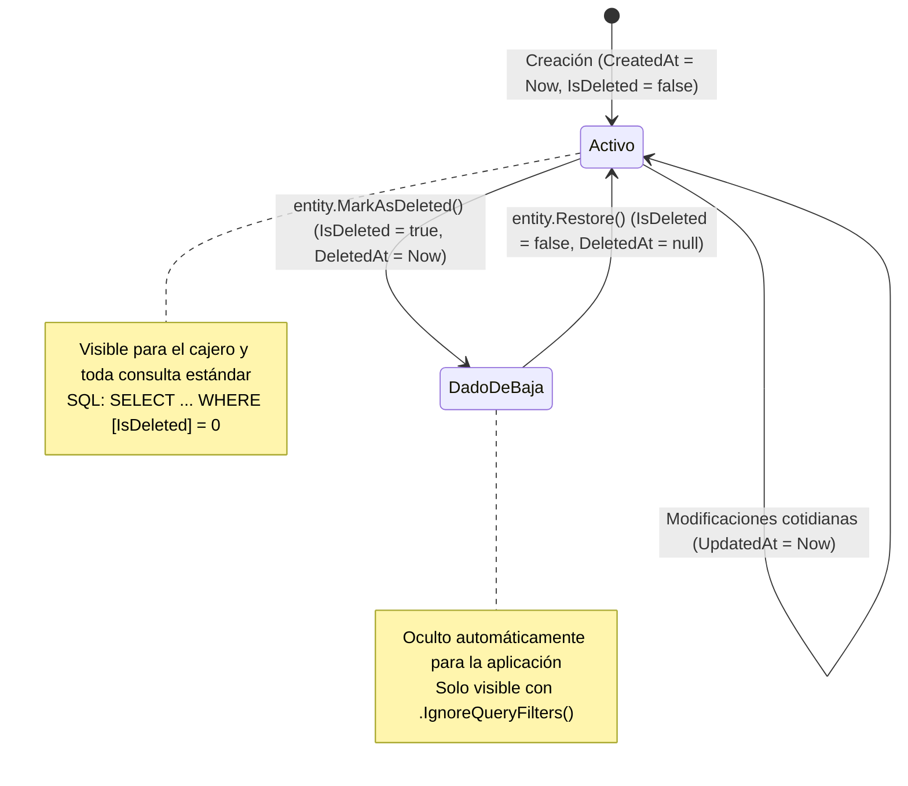

# Soft Delete y Global Query Filters: Auditoría Comercial sin Borrado Físico

### Módulo: 03. Patrones de Diseño (GoF & DDD Táctico)
**Audiencia:** Desarrolladores, estudiantes y mesa evaluadora de cátedra  
**Principio Fundamental:** Ley 3 de AGENTS.md (Borrado Lógico Obligatorio e Inalterabilidad Fiscal)  
**Archivos de Código:**
* [`BaseEntity.cs`](file:///c:/Users/lucas/Proyectos/retail/src/Retail.Domain/Common/BaseEntity.cs)
* [`RetailDbContext.cs`](file:///c:/Users/lucas/Proyectos/retail/src/Retail.Infrastructure/Persistence/Context/RetailDbContext.cs)
* [`Repository.cs`](file:///c:/Users/lucas/Proyectos/retail/src/Retail.Infrastructure/Persistence/Repositories/Repository.cs)

---

## 1. 📖 Fundamento Teórico y Académico

### 1.1 El Peligro del Borrado Físico (*Hard Delete*)
En la ingeniería de bases de datos tradicional, eliminar un registro implica ejecutar la instrucción SQL:
```sql
DELETE FROM articulos WHERE id = 42;
```
En un sistema comercial y de facturación fiscal, el borrado físico es un **grave error de diseño** por tres razones fundamentales:

1. **Destrucción de la Trazabilidad Contable:** La legislación impositiva y el Código de Comercio exigen conservar los libros contables y transacciones durante al menos 5 a 10 años. Si se borra un artículo del catálogo, las ventas pasadas pierden su relación histórica.
2. **Violación de Integridad Referencial:** La clave foránea de `detalle_ventas` hacia `articulos` impedirá el borrado (`FK Constraint Violation`), obligando al desarrollador a optar por el nefasto borrado en cascada (`ON DELETE CASCADE`), lo cual destruiría facturas y tickets emitidos previamente.
3. **Imposibilidad de Recuperación:** Si un usuario elimina por error un cliente o artículo, la información se pierde de forma irrecuperable salvo restaurando copias de seguridad completas de la base de datos.

### 1.2 El Patrón Soft Delete (Borrado Lógico)
El patrón **Soft Delete** convierte la eliminación en una **mutación de estado temporal**:
* El registro físico permanece intacto en la tabla de SQL Server.
* Se marcan las columnas de auditoría: `IsDeleted = 1` y `DeletedAt = DateTime.UtcNow`.
* La aplicación ignora estos registros en las operaciones cotidianas, pero conserva el 100% de la historia para reportes contables, conciliaciones fiscales y auditorías gerenciales.

### 1.3 Global Query Filters en ORMs Modernos
El riesgo histórico del borrado lógico era el **olvido del programador**: en cada consulta LINQ, el desarrollador debía acordarse de escribir `where !x.IsDeleted`. Si lo olvidaba en una sola pantalla, los artículos dados de baja aparecían en el punto de venta.  
Los **Filtros de Consulta Globales (*Global Query Filters*)** de Entity Framework Core resuelven este problema a nivel del motor relacional: inyectan automáticamente la cláusula `WHERE [IsDeleted] = 0` en todas las consultas SQL emitidas.

---

## 2. 💻 Aplicación Concreta en el Código de Retail

### 2.1 El Contrato Base: `BaseEntity`
En [`src/Retail.Domain/Common/BaseEntity.cs`](file:///c:/Users/lucas/Proyectos/retail/src/Retail.Domain/Common/BaseEntity.cs), toda entidad hereda el comportamiento protector:

```csharp
public abstract class BaseEntity
{
    public int Id { get; protected set; }
    public DateTime CreatedAt { get; private set; } = DateTime.UtcNow;
    public DateTime? UpdatedAt { get; protected set; }
    
    // Campos de auditoría de borrado lógico
    public bool IsDeleted { get; private set; }
    public DateTime? DeletedAt { get; private set; }

    public void MarkAsDeleted()
    {
        IsDeleted = true;
        DeletedAt = DateTime.UtcNow;
    }

    public void Restore()
    {
        IsDeleted = false;
        DeletedAt = null;
    }
}
```

### 2.2 La Trampa de Persistencia: `Repository.DeleteAsync`
En [`src/Retail.Infrastructure/Persistence/Repositories/Repository.cs`](file:///c:/Users/lucas/Proyectos/retail/src/Retail.Infrastructure/Persistence/Repositories/Repository.cs), el método de eliminación no borra la fila física:

```csharp
public virtual Task DeleteAsync(T entity, CancellationToken cancellationToken = default)
{
    ArgumentNullException.ThrowIfNull(entity);

    // En lugar de _dbSet.Remove(entity), marcamos la entidad lógicamente
    entity.MarkAsDeleted();
    _dbSet.Update(entity);
    return Task.CompletedTask;
}
```

### 2.3 Inyección Dinámica del Filtro en `RetailDbContext`
En [`RetailDbContext.cs`](file:///c:/Users/lucas/Proyectos/retail/src/Retail.Infrastructure/Persistence/Context/RetailDbContext.cs), usamos árboles de expresiones de C# (*Expression Trees*) para aplicar el filtro global a **todas las entidades del modelo** que hereden de `BaseEntity` sin tener que configurar una por una:

```csharp
protected override void OnModelCreating(ModelBuilder modelBuilder)
{
    base.OnModelCreating(modelBuilder);
    modelBuilder.ApplyConfigurationsFromAssembly(typeof(RetailDbContext).Assembly);

    // Itera automáticamente sobre todas las entidades de la base de datos
    foreach (var entityType in modelBuilder.Model.GetEntityTypes())
    {
        if (typeof(BaseEntity).IsAssignableFrom(entityType.ClrType))
        {
            var parameter = Expression.Parameter(entityType.ClrType, "e");
            var isDeletedProp = Expression.Property(parameter, nameof(BaseEntity.IsDeleted));
            var filter = Expression.Lambda(Expression.Not(isDeletedProp), parameter);
            
            // Inyecta WHERE [e].[IsDeleted] = 0 en toda consulta generada por EF Core
            entityType.SetQueryFilter(filter);
        }
    }
}
```

### 2.4 La Cláusula de Escape para Auditoría: `.IgnoreQueryFilters()`
Cuando un gerente o administrador necesita consultar el historial contable completo o restaurar un registro dado de baja, EF Core permite eludir el filtro global explícitamente:

```csharp
// Consulta que incluye tanto artículos activos como dados de baja para auditoría
var catalogoHistoricoCompleto = await _context.Articulos
    .IgnoreQueryFilters()
    .ToListAsync();
```

### 2.5 Convivencia con Índices Únicos: *Filtered Indexes*
Un problema común de Soft Delete surge al intentar reinsertar un registro con un valor único (por ejemplo, el código de barras de un artículo o el nombre de usuario) que ya existe en una fila dada de baja (`deleted_at IS NOT NULL`). En SQL Server, un índice `UNIQUE` tradicional fallaría porque la fila borrada lógicamente aún existe físicamente.

En [`ArticuloConfiguration.cs`](file:///c:/Users/lucas/Proyectos/retail/src/Retail.Infrastructure/Persistence/Configurations/ArticuloConfiguration.cs) resolvemos esta limitación aplicando un **Índice Filtrado**:

```csharp
builder.HasIndex(a => a.CodigoBarras)
    .IsUnique()
    .HasFilter("[codigo_barras] IS NOT NULL AND [deleted_at] IS NULL");
```
*Para ver el caso de uso completo y su justificación comercial, consultar [Flujo de Catálogo Propio y Alertas de Stock](../05-casos-de-uso-y-flujos/flujo-catalogo-y-alertas-stock.md).*

---

## 3. 📊 Diagrama Explicativo: Ciclo de Vida y Traducción SQL



---

## 4. ⚖️ Decisiones de Diseño y Trade-offs

### Comparativa: Hard Delete vs. Soft Delete

| Criterio | Hard Delete (`DELETE FROM`) | Soft Delete (`IsDeleted = 1`) |
| :--- | :--- | :--- |
| **Cumplimiento Legal y AFIP** | ❌ Ilegal para comprobantes contables. | ✅ 100% trazable y auditable. |
| **Integridad Referencial** | ❌ Requiere borrar en cascada o falla por FK. | ✅ Las claves foráneas históricas nunca se rompen. |
| **Recuperación ante Errores** | ❌ Requiere restaurar backups. | ✅ Se soluciona invocando `entity.Restore()`. |
| **Tamaño de la Base de Datos** | La tabla se reduce en disco. | La tabla acumula registros históricos (demanda indexación adecuada). |
| **Complejidad de Índices Únicos** | Unicidad directa estándar. | Requiere *Filtered Indexes* para no colisionar con registros borrados. |

---

## 5. 🎓 Preguntas de Examen de Cátedra (Autoevaluación)

### Pregunta 1: *"¿Por qué el borrado físico (`DELETE`) está prohibido por arquitectura en un sistema de gestión comercial?"*
> **Respuesta Modelo del Estudiante:**  
> "En un sistema comercial y de facturación fiscal, la integridad de los datos históricos es sagrada. Si permitiéramos el borrado físico de un artículo que fue vendido hace seis meses, la clave foránea en la tabla `detalle_ventas` impediría la operación, o peor aún, si estuviera configurado un borrado en cascada, se eliminaría el registro de la venta misma, falseando los balances contables, el arqueo de caja y las declaraciones juradas de IVA presentadas ante la AFIP.  
> Mediante el patrón **Soft Delete**, la entidad no desaparece de la base de datos: simplemente se marca como inactiva con fecha y hora (`MarkAsDeleted()`), impidiendo nuevas operaciones comerciales sobre ella pero preservando intacta la historia contable y jurídica del negocio."

### Pregunta 2: *"¿Cómo evita su diseño que un desarrollador olvide filtrar los registros eliminados al programar una nueva pantalla?"*
> **Respuesta Modelo del Estudiante:**  
> "Mediante la configuración automática de **Global Query Filters** en el método `OnModelCreating` de `RetailDbContext`. Utilizando *Expression Trees* de .NET, interceptamos todas las clases derivadas de `BaseEntity` y le instruimos al motor de Entity Framework Core que agregue automáticamente un predicado `WHERE [IsDeleted] = 0` a cualquier consulta SQL enviada a SQL Server.  
> El desarrollador no tiene que recordar escribir filtros manuales en sus queries LINQ: el ORM garantiza por diseño que los registros eliminados sean completamente invisibles para la interfaz de usuario, salvo en pantallas especiales de auditoría gerencial donde se invoque conscientemente el método `.IgnoreQueryFilters()`."
