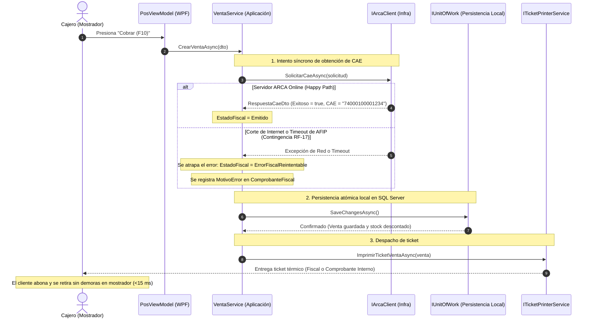

# Patrón Strategy y Contingencia Fiscal: Resiliencia de Mostrador ante Caídas Externas

### Módulo: 03. Patrones de Diseño (GoF & DDD Táctico)
**Audiencia:** Desarrolladores, estudiantes universitarios y mesa evaluadora de cátedra  
**Requisitos Vinculados:** `RF-16` (Facturación ARCA), `RF-17` (Contingencia Offline) y `RF-18` (Consola de Reintentos)  
**Archivos de Código:**
* [`EstadoFiscalEnum.cs`](file:///c:/Users/lucas/Proyectos/retail/src/Retail.Domain/Enums/EstadoFiscalEnum.cs)
* [`ComprobanteFiscal.cs`](file:///c:/Users/lucas/Proyectos/retail/src/Retail.Domain/Entities/ComprobanteFiscal.cs)
* [`FileDebugTicketPrinterService.cs`](file:///c:/Users/lucas/Proyectos/retail/src/Retail.Infrastructure/Hardware/FileDebugTicketPrinterService.cs)
* [`MockArcaClient.cs`](file:///c:/Users/lucas/Proyectos/retail/src/Retail.Infrastructure/ExternalServices/ArcaSdk/MockArcaClient.cs)

---

## 1. 📖 Fundamento Teórico y Académico

### 1.1 El Patrón Strategy (GoF)
Definido por el **Gang of Four (GoF)**:
> *"Define una familia de algoritmos, encapsula cada uno y los hace intercambiables. Strategy permite que el algoritmo varíe independientemente de los clientes que lo utilizan."*

En Retail, la estrategia de resolución y emisión de un comprobante depende de las condiciones del entorno operativo:
* **Estrategia Normal (Online):** Comunicación síncrona con el webservice fiscal (AFIP/ARCA), obtención inmediata del Código de Autorización Electrónico (CAE) e impresión del ticket fiscal con código de barras / QR.
* **Estrategia de Contingencia (Offline / Degraded Mode):** Ante cortes de internet o saturación de servidores gubernamentales, el sistema conmuta a un algoritmo de resiliencia: la venta se cobra, el stock se descuenta, se emite un comprobante interno no fiscal y la operación queda encolada en estado reintentable.

### 1.2 El Principio Arquitectónico "Offline-First" en Puntos de Venta
En la ingeniería de sistemas comerciales, existe una máxima inquebrantable:
> **"Un cliente con el dinero en la mano frente al mostrador jamás puede marcharse sin su compra porque un servicio externo en la nube esté caído."**

Los webservices fiscales de AFIP/ARCA experimentan caídas de mantenimiento, saturación en fechas de vencimiento impositivo y latencias impredecibles. Un software de mostrador no puede bloquearse esperando un timeout de HTTP de $30\text{ segundos}$ mientras se forma una fila en la librería. La aplicación debe ser capaz de operar localmente en modo contingencia y conciliar con el fisco cuando la conectividad se restablezca.

---

## 2. 💻 Aplicación Concreta en el Código de Retail

### 2.1 La Máquina de Estados Fiscal: `EstadoFiscalEnum`
En [`src/Retail.Domain/Enums/EstadoFiscalEnum.cs`](file:///c:/Users/lucas/Proyectos/retail/src/Retail.Domain/Enums/EstadoFiscalEnum.cs), modelamos el ciclo de vida fiscal mediante una enumeración fuertemente tipada:

```csharp
namespace Retail.Domain.Enums;

public enum EstadoFiscalEnum
{
    NoAplica = 0,                // Venta que no requiere fiscalización electrónica (ej. interna)
    Emitido = 1,                 // Autorizado con éxito por ARCA (posee CAE y fecha de vencimiento)
    ErrorFiscalReintentable = 2  // Contingencia: Se cobró en mostrador pero requiere reintento de envío
}
```

### 2.2 La Entidad de Respaldo Fiscal: `ComprobanteFiscal`
En [`src/Retail.Domain/Entities/ComprobanteFiscal.cs`](file:///c:/Users/lucas/Proyectos/retail/src/Retail.Domain/Entities/ComprobanteFiscal.cs), encapsulamos la respuesta del fisco o el motivo de fallo:

```csharp
public class ComprobanteFiscal : BaseEntity
{
    public int IdVenta { get; set; }
    public Venta? Venta { get; set; }

    public TipoComprobanteFiscalEnum TipoComprobante { get; set; }
    public int PuntoVenta { get; set; }
    public int NumeroComprobante { get; set; }

    // Datos provistos por ARCA ante autorización exitosa
    public string? Cae { get; set; }
    public DateTime? FechaVtoCae { get; set; }
    public string? ResultadoArca { get; set; }

    // Registro del error si entró en contingencia
    public string? MotivoError { get; set; }
    public DateTime FechaEmision { get; set; } = DateTime.UtcNow;
}
```

### 2.3 Resiliencia en el Adaptador de Impresión
En [`FileDebugTicketPrinterService.cs`](file:///c:/Users/lucas/Proyectos/retail/src/Retail.Infrastructure/Hardware/FileDebugTicketPrinterService.cs), el adaptador altera el encabezado del ticket según el estado fiscal:

```csharp
// Fragmento de emisión de ticket térmico
sb.AppendLine($"ESTADO FISCAL: {venta.EstadoFiscal}");

if (venta.EstadoFiscal == EstadoFiscalEnum.NoAplica || 
    venta.EstadoFiscal == EstadoFiscalEnum.ErrorFiscalReintentable)
{
    // Aclaración legal obligatoria por normativa de AFIP
    sb.AppendLine($"{CentrarTexto("* COMPROBANTE NO FISCAL *", ancho)}");
    sb.AppendLine($"{CentrarTexto("DOCUMENTO INTERNO DE VENTA", ancho)}");
}
```

### 2.4 Simulación y Verificación en Pruebas Unitarias
El componente [`MockArcaClient.cs`](file:///c:/Users/lucas/Proyectos/retail/src/Retail.Infrastructure/ExternalServices/ArcaSdk/MockArcaClient.cs) provee banderas booleanas para probar el comportamiento del sistema ante fallos de red sin depender de un corte de internet real:

```csharp
[Fact]
public async Task RegistrarVenta_CuandoArcaFalla_CompletaVentaEnContingencia()
{
    // Arrange: Forzamos la caída simulada del servicio fiscal
    _mockArcaClient.SimularCaidaServicio = true;

    // Act: El cajero ejecuta el cobro de la venta
    var resultado = await _ventaService.CrearVentaAsync(dtoVenta);

    // Assert: La venta NO se canceló; quedó asentada como reintentable
    resultado.EstadoFiscal.Should().Be(EstadoFiscalEnum.ErrorFiscalReintentable);
    
    // El stock se descontó correctamente
    var articulo = await _articuloRepo.GetByIdAsync(articuloId);
    articulo.StockActual.Should().Be(stockEsperado);
}
```

---

## 3. 📊 Diagrama Explicativo: Flujo de Autorización y Fallback de Contingencia



---

## 4. ⚖️ Decisiones de Diseño y Trade-offs

### ¿Por qué NO hacer un `ROLLBACK` de la venta si AFIP falla?
* **Pérdida Económica:** Si el sistema impidiera cobrar ante una caída de internet, la librería no podría vender durante horas, acumulando pérdidas comerciales y clientes descontentos.
* **Aspecto Legal:** La normativa de AFIP/ARCA contempla explícitamente el régimen de comprobantes de resguardo o emisión en contingencia, otorgando un plazo legal para transmitir los comprobantes emitidos en cuanto se reanude el servicio.
* **La Solución en Retail:** Las ventas con `ErrorFiscalReintentable` quedan listadas en la **Consola Gerencial de Reintentos (`RF-18`)**, donde el encargado puede enviar el lote completo con un solo clic una vez restablecida la conexión.

---

## 5. 🎓 Preguntas de Examen de Cátedra (Autoevaluación)

### Pregunta 1: *"¿Por qué la llamada a un servicio externo como AFIP/ARCA no debe formar parte de la transacción ACID de la base de datos local?"*
> **Respuesta Modelo del Estudiante:**  
> "Porque viola el principio de diseño de transacciones cortas en bases de datos relacionales. Si abriéramos una transacción SQL (`BEGIN TRANSACTION`) y luego realizáramos una petición HTTP remota a AFIP, los bloqueos relacionales sobre las filas de la base de datos local quedarían abiertos durante el tiempo de respuesta de la red (que puede variar de 1 a 30 segundos). Si la red se congela, toda la base de datos de la tienda podría sufrir bloqueos (*deadlocks* o esperas de bloqueo).  
> En nuestra arquitectura, la consulta a AFIP se ejecuta de forma asíncrona por fuera de la transacción local; una vez obtenida la respuesta (exitosa o con fallo capturado), se inicia y confirma la transacción en SQL Server en menos de $5\text{ ms}$, garantizando un uso eficiente de recursos y alta concurrencia."

### Pregunta 2: *"¿Cómo asegura el sistema que una venta emitida en contingencia sea regularizada legalmente ante las autoridades fiscales?"*
> **Respuesta Modelo del Estudiante:**  
> "A través del **Módulo de Consola Fiscal (`RF-18`)**. Toda venta cobrada bajo contingencia queda persistida con el estado explícito `EstadoFiscalEnum.ErrorFiscalReintentable` y su correspondiente entidad `ComprobanteFiscal` con el detalle del error de transporte.  
> La interfaz gerencial alerta al usuario sobre la existencia de comprobantes pendientes de emisión electrónica. Desde dicha consola, el encargado puede ejecutar el método `ReintentarLotePendientesAsync()`, el cual recorre las ventas pendientes y las transmite de forma ordenada y transaccional ante ARCA para obtener el CAE definitivo sin alterar los importes ni los stocks ya consolidados en la base de datos local."
