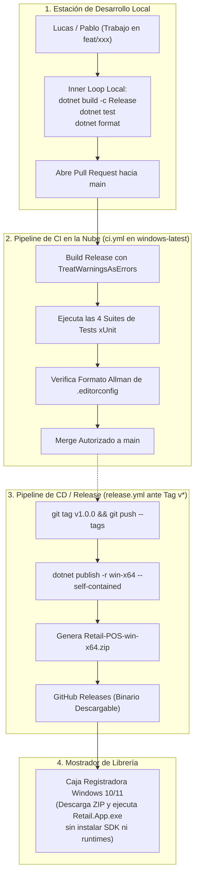

# Sistema de CI/CD: Automatización, Aduana de Calidad y Despliegue de Escritorio

### Módulo: 04. Sistemas Transversales
**Audiencia:** Desarrolladores, estudiantes universitarios y mesa evaluadora de cátedra  
**Manual Normativo de Referencia:** [`docs/SISTEMA_DE_CI_CD.md`](file:///c:/Users/lucas/Proyectos/retail/docs/SISTEMA_DE_CI_CD.md)  
**Tecnologías:** GitHub Actions | Windows Server Runner (`windows-latest`) | .NET 8 CLI  
**Workflows:** [`.github/workflows/ci.yml`](file:///c:/Users/lucas/Proyectos/retail/.github/workflows/ci.yml) y [`.github/workflows/release.yml`](file:///c:/Users/lucas/Proyectos/retail/.github/workflows/release.yml)  

---

## 1. 📖 Fundamento Teórico y Académico

### 1.1 Integración Continua (CI) y Entrega Continua (CD)
* **Integración Continua (Martin Fowler):** Práctica de desarrollo donde los miembros del equipo integran su trabajo frecuentemente (al menos una vez al día). Cada integración es verificada automáticamente por un servidor de compilación y pruebas para detectar errores de integración en cuestión de minutos.
* **Entrega Continua (Jez Humble & David Farley):** Disciplina que garantiza que el software pueda ponerse en manos de los usuarios en cualquier momento, de forma confiable, repetible y mediante procesos automatizados sin intervención manual propensa a fallos.

### 1.2 La Peculiaridad DevOps en Aplicaciones de Escritorio (WPF Desktop DevOps)
A diferencia de los entornos web o microservicios donde el despliegue actualiza un contenedor Docker en la nube:
* **El entregable es un binario físico:** Debe ejecutarse en hardware local de cliente bajo el sistema operativo Microsoft Windows.
* **Aislamiento de Entorno (*Self-Contained Packaging*):** En un comercio real (una librería de barrio), la computadora de mostrador suele ser operada por cajeros o encargados sin conocimientos técnicos de sistemas. Exigirles instalar manualmente el SDK de .NET 8 o configurar variables de entorno de Windows provocaría fricciones severas de adopción.
* Por ello, el pipeline de CD debe generar un **ejecutable auto-contenido (*Single-File Self-Contained*)** que incluya el runtime, las dependencias de WPF y el motor gráfico en un único paquete autocontenido.

---

## 2. 💻 Aplicación Concreta en el Código de Retail

### 2.1 El Pipeline de Integración Continua: `ci.yml`
Ubicado en [`.github/workflows/ci.yml`](file:///c:/Users/lucas/Proyectos/retail/.github/workflows/ci.yml), actúa como la **aduana de calidad automática** ante cada Pull Request hacia `main`:

```yaml
name: CI (Aduana de Calidad)

on:
  push:
    branches: [ main ]
  pull_request:
    branches: [ main ]

jobs:
  build-and-test:
    runs-on: windows-latest  # Obligatorio por WPF

    steps:
      - name: Descargar Código
        uses: actions/checkout@v4

      - name: Configurar SDK de .NET 8.0.x
        uses: actions/setup-dotnet@v4
        with:
          dotnet-version: '8.0.x'

      - name: Restaurar Dependencias NuGet
        run: dotnet restore Retail.sln

      - name: Compilación Release (Cero Advertencias)
        run: dotnet build Retail.sln --configuration Release --no-restore

      - name: Ejecutar Suites de Pruebas xUnit
        run: dotnet test Retail.sln --configuration Release --no-build --logger "trx"

      - name: Validar Estilo y Formato (.editorconfig)
        run: dotnet format Retail.sln --verify-no-changes
```
* **Tiempo Total de Ejecución:** Menos de $2\text{ minutos}$.
* Si una variable no se usa o un test falla, el pipeline se tiñe de rojo y **bloquea el botón de Merge**.

### 2.2 El Pipeline de Entrega y Publicación: `release.yml`
En [`.github/workflows/release.yml`](file:///c:/Users/lucas/Proyectos/retail/.github/workflows/release.yml), cuando el equipo crea una etiqueta Git de versión (`git tag v1.0.0`):

```yaml
name: CD (Publicación de Release de Mostrador)

on:
  push:
    tags:
      - 'v*'

jobs:
  publish-release:
    runs-on: windows-latest

    steps:
      - uses: actions/checkout@v4
      - uses: actions/setup-dotnet@v4
        with:
          dotnet-version: '8.0.x'

      # Publicación auto-contenida en un único archivo ejecutable
      - name: Publicar Ejecutable Auto-Contenido
        run: >
          dotnet publish src/Retail.App/Retail.App.csproj
          --configuration Release
          --runtime win-x64
          --self-contained true
          -p:PublishSingleFile=true
          -p:IncludeNativeLibrariesForSelfExtract=true
          -o ./publish

      # Empaquetado comprimido para distribución
      - name: Comprimir Entregable
        run: Compress-Archive -Path ./publish/* -DestinationPath ./Retail-POS-win-x64.zip

      # Creación de la Release oficial en GitHub con el binario adjunto
      - name: Publicar Release Oficial en GitHub
        uses: softprops/action-gh-release@v2
        with:
          files: ./Retail-POS-win-x64.zip
          draft: false
          prerelease: false
```

### 2.3 Gobernanza de Pareja: 100% Peer Review
Para garantizar que ambos desarrolladores dominen la totalidad del sistema:
* **Protección de `main`:** Ningún commit entra directo a `main`.
* Todo cambio se propone mediante Pull Request y requiere **aprobación humana explícita del compañero** (Lucas aprueba a Pablo y Pablo aprueba a Lucas) luego de que el CI automatizado finalice con éxito.

---

## 3. 📊 Diagrama Explicativo: Topología de Automatización



---

## 4. ⚖️ Decisiones de Diseño y Trade-offs

### ¿Por qué `windows-latest` y NO `ubuntu-latest` en GitHub Actions?
* Los runners basados en Linux (`ubuntu-latest`) son más económicos y rápidos de iniciar en GitHub Actions.
* Sin embargo, el proyecto [`Retail.App`](file:///c:/Users/lucas/Proyectos/retail/src/Retail.App) utiliza WPF (`<UseWPF>true</UseWPF>` y target `net8.0-windows`). WPF se compila contra las librerías nativas del subsistema gráfico de Microsoft Windows (`PresentationFramework.dll`, `PresentationCore.dll`). Un runner Linux carece de estas APIs y abortaría la compilación de forma inmediata.

### ¿Por qué empaquetado `--self-contained` si genera un archivo de ~80 MB?
* Si publicáramos en modo *Framework-Dependent*, el archivo ejecutable pesaría apenas $2\text{ MB}$, pero obligaría al dueño de la librería a descargar e instalar previamente el *.NET Desktop Runtime 8.0.x* en cada computadora.
* Al empaquetar de forma **auto-contenida**, el ejecutable incluye todo lo necesario para correr de inmediato en cualquier Windows 10 u 11 limpio, garantizando una instalación rápida y sin soporte técnico.

---

## 5. 🎓 Preguntas de Examen de Cátedra (Autoevaluación)

### Pregunta 1: *"¿Por qué el pipeline de GitHub Actions debe ejecutarse obligatoriamente sobre un runner Windows?"*
> **Respuesta Modelo del Estudiante:**  
> "Porque nuestra capa de presentación es una aplicación de escritorio nativa desarrollada en **WPF (.NET 8)** con el target `net8.0-windows`.  
> A diferencia de los proyectos de ASP.NET Core o bibliotecas de clases puras que son multiplataforma, WPF depende de ensamblados de Windows nativos y de la infraestructura gráfica de DirectX/DirectWrite (`milcore.dll`, `PresentationCore`). Si configuráramos `runs-on: ubuntu-latest`, el SDK de .NET en Linux rechazaría la compilación del proyecto `Retail.App` al no encontrar las referencias a la plataforma Windows."

### Pregunta 2: *"¿Qué diferencia existe entre una distribución Framework-Dependent y una Self-Contained en .NET?"*
> **Respuesta Modelo del Estudiante:**  
> "En una distribución **Framework-Dependent**, el binario compilado solo contiene el código de nuestra aplicación y espera que la máquina del usuario final ya tenga instalado el entorno de ejecución de .NET (el runtime) a nivel del sistema operativo.  
> En cambio, en una distribución **Self-Contained** (la que usamos para la Release de Retail), el compilador empaqueta dentro del archivo `.zip` tanto el código de nuestra solución como una copia completa y podada (*trimmed*) del runtime de .NET 8 y todas las bibliotecas base. Esto permite que el software funcione de forma inmediata en cualquier máquina Windows 10 u 11 sin requerir privilegios de administrador ni instalaciones externas previas."
