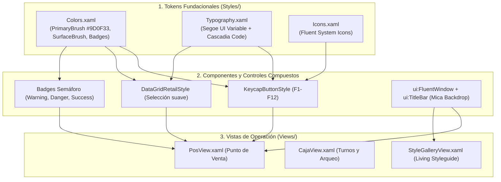

# Sistema de Diseño UI: Windows 11 Fluent, Tokens y Ergonomía de Mostrador

### Módulo: 04. Sistemas Transversales
**Audiencia:** Desarrolladores de interfaz, estudiantes y mesa evaluadora de cátedra  
**Principio Fundamental:** Ley 9 de AGENTS.md (Fidelidad Estética y Living Styleguide)  
**Manual Normativo:** [`docs/SISTEMA_DE_DISENO.md`](file:///c:/Users/lucas/Proyectos/retail/docs/SISTEMA_DE_DISENO.md)  
**Living Styleguide:** [`StyleGalleryView.xaml`](file:///c:/Users/lucas/Proyectos/retail/src/Retail.App/Views/Dev/StyleGalleryView.xaml)  
**Diccionarios XAML:** [`Colors.xaml`](file:///c:/Users/lucas/Proyectos/retail/src/Retail.App/Styles/Colors.xaml), [`Typography.xaml`](file:///c:/Users/lucas/Proyectos/retail/src/Retail.App/Styles/Typography.xaml) y [`Controls.xaml`](file:///c:/Users/lucas/Proyectos/retail/src/Retail.App/Styles/Controls.xaml)  

---

## 1. 📖 Fundamento Teórico y Académico

### 1.1 Ergonomía Cognitiva en Puntos de Venta (POS)
Un software de mostrador comercial no es una aplicación administrativa de oficina convencional:
* **Entorno de Alta Presión y Velocidad:** El cajero interactúa con clientes en fila, cuenta billetes, recibe pagos con tarjeta y escanea productos simultáneamente.
* **Reducción de la Carga Cognitiva (Ley de Hick y Fitts):** La disposición espacial debe guiar la mirada hacia los elementos críticos (el total acumulado a cobrar, la confirmación del pago y las alertas de stock insuficiente).
* **Operación Prioritaria por Teclado:** Un cajero experimentado no utiliza el mouse. Toda acción de mostrador debe poder ejecutarse mediante atajos de teclado y teclas de función (`F1` a `F12`), minimizando movimientos físicos de las manos.

### 1.2 Windows 11 Fluent Design y Arquitectura de Tokens
Adoptamos la biblioteca **WPF-UI 4.0.0** sobre .NET 8, integrando los contratos visuales modernos de Windows 11:
* Materiales avanzados como **Mica** (efecto de translucidez sutil acelerado por GPU).
* **Tokens Semánticos:** En lugar de pintar controles con colores hexadecimales fijos, se consumen recursos de pincel semánticos (`{DynamicResource PrimaryBrush}`). Esto permite cambiar la temática del sistema o adaptar contrastes sin alterar el código XAML de las pantallas.

---

## 2. 💻 Aplicación Concreta en el Código de Retail

### 2.1 Paleta de Identidad de Marca: Carmín / Borravino (`#9D0F33`)
Definida en [`src/Retail.App/Styles/Colors.xaml`](file:///c:/Users/lucas/Proyectos/retail/src/Retail.App/Styles/Colors.xaml):

```xml
<!-- Color principal de acento e identidad de la librería -->
<Color x:Key="PrimaryColor">#9D0F33</Color>
<SolidColorBrush x:Key="PrimaryBrush" Color="{StaticResource PrimaryColor}" />

<!-- Estados interactivos de botones y controles -->
<SolidColorBrush x:Key="PrimaryHoverBrush" Color="#850C2A" />
<SolidColorBrush x:Key="PrimaryPressedBrush" Color="#6B0720" />
<SolidColorBrush x:Key="PrimaryLightBrush" Color="#FDF2F4" />
```

### 2.2 Tipografía Dual de Alta Precisión
En [`src/Retail.App/Styles/Typography.xaml`](file:///c:/Users/lucas/Proyectos/retail/src/Retail.App/Styles/Typography.xaml), aplicamos una directiva inviolable:

1. **`Segoe UI Variable` (Proporcional):** Para títulos, menús, etiquetas de formularios y lectura general.
2. **`Cascadia Code` (Monoespaciada Obligatoria):** Utilizada en:
   * El total gigante de venta de mostrador (`TextBlockDisplayCurrency`).
   * Celdas de precios unitarios y subtotales en grillas (`DataGridCurrencyCell`).
   * Códigos de barras y números de comprobantes fiscales.
   * Pastillas de teclas de función (`TextBlockKeycap`).

```xml
<!-- Token tipográfico monoespaciado para importes -->
<FontFamily x:Key="FontFamilyMonospace">Cascadia Code, Consolas, Courier New</FontFamily>

<Style x:Key="TextBlockDisplayCurrency" TargetType="TextBlock">
    <Setter Property="FontFamily" Value="{StaticResource FontFamilyMonospace}" />
    <Setter Property="FontSize" Value="36" />
    <Setter Property="FontWeight" Value="Bold" />
    <Setter Property="Foreground" Value="{DynamicResource PrimaryBrush}" />
</Style>
```

### 2.3 Botonera de Mostrador con Keycaps (F1 a F12)
En [`src/Retail.App/Styles/Controls.xaml`](file:///c:/Users/lucas/Proyectos/retail/src/Retail.App/Styles/Controls.xaml), diseñamos componentes ergonómicos de acceso rápido:

```xml
<!-- Botón primario de cobro con pastilla F10 -->
<Button Style="{StaticResource PrimaryActionButtonStyle}"
        Command="{Binding CobrarVentaCommand}">
    <StackPanel Orientation="Horizontal">
        <Border Style="{StaticResource KeycapPrimaryBadgeStyle}">
            <TextBlock Text="F10" Style="{StaticResource TextBlockKeycapPrimary}" />
        </Border>
        <TextBlock Text="Cobrar Venta" Margin="10,0,0,0" VerticalAlignment="Center" />
    </StackPanel>
</Button>
```

### 2.4 Ventanas Nativas y Salvaguarda de Pantalla
Toda ventana hereda de `ui:FluentWindow` e implementa la barra de título nativa con **Snap Layouts** de Windows 11. Para evitar que la ventana se dibuje fuera de los bordes en monitores pequeños de 768p con escalado de Windows al 125%:

```csharp
public MainWindow()
{
    InitializeComponent();

    // Salvaguarda: limita dimensiones estrictamente al área de trabajo útil
    MaxHeight = SystemParameters.WorkArea.Height;
    MaxWidth = SystemParameters.WorkArea.Width;
}
```

---

## 3. 📊 Diagrama Explicativo: Jerarquía de Estilos y Consumo XAML



---

## 4. ⚖️ Decisiones de Diseño y Trade-offs

### ¿Por qué la Ley 1 prohíbe colores hexadecimales directos (`#...`) en los controles?
* Si un desarrollador escribe `Background="#9D0F33"` directamente en un botón de `PosView.xaml`, cuando la cátedra o el cliente soliciten un modo nocturno (*Dark Mode*) o un ajuste de contraste para cajeros con baja visión, ese botón quedará hardcodeado y requerirá modificar decenas de archivos a mano.  
* Al utilizar `{DynamicResource PrimaryBrush}`, el cambio de paleta se realiza modificando una sola línea en `Colors.xaml`.

### ¿Por qué `Cascadia Code` y no una fuente convencional en las columnas de números?
* En fuentes proporcionales estándar (como Arial o Segoe UI), el número `1` es mucho más estrecho que el número `8`.
* Si una columna lista importes como `$1.111,11` y `$8.888,88`, las comas decimales y los dígitos quedan desalineados horizontalmente, dificultando la lectura visual rápida al cajero.
* En **`Cascadia Code`**, todos los caracteres numéricos tienen exactamente el mismo ancho de píxeles, garantizando columnas contables perfectamente verticales.

---

## 5. 🎓 Preguntas de Examen de Cátedra (Autoevaluación)

### Pregunta 1: *"¿Qué es un Living Styleguide y para qué sirve `StyleGalleryView.xaml` en su proyecto?"*
> **Respuesta Modelo del Estudiante:**  
> "Un **Living Styleguide** (guía de estilos viva) es una pantalla interactiva dentro del propio ejecutable de desarrollo que reúne y renderiza todos los componentes visuales, botones, keycaps, tipografías y estados de la aplicación en tiempo real.  
> En nuestro proyecto, [`StyleGalleryView.xaml`](file:///c:/Users/lucas/Proyectos/retail/src/Retail.App/Views/Dev/StyleGalleryView.xaml) permite a los desarrolladores y evaluadores verificar la coherencia estética, la ergonomía de contrastes, los comportamientos de *hover/pressed* y las salvaguardas de escalado DPI sin tener que navegar por todo el flujo de ventas o crear registros de prueba en la base de datos."

### Pregunta 2: *"¿Cómo soporta la aplicación las funciones de ventana de Windows 11 como Snap Layouts?"*
> **Respuesta Modelo del Estudiante:**  
> "A través del uso de la biblioteca `WPF-UI` y la herencia de `ui:FluentWindow`. En lugar de dibujar una barra de título personalizada con botones XAML ordinarios, integramos el control `<ui:TitleBar ExtendsContentIntoTitleBar="True">`.  
> Este control se conecta directamente con la API nativa de DWM (Desktop Window Manager) de Windows 11, lo que permite que al posar el cursor sobre el botón de maximizar se despliegue automáticamente el menú flotante de **Snap Layouts** (organización de cuadrículas en pantalla) y se active el material translúcido **Mica** en el marco de la ventana."
