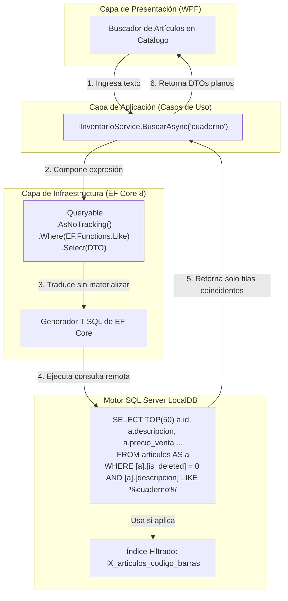

# Sistema de Persistencia: EF Core 8, LocalDB y Optimización Relacional

### Módulo: 04. Sistemas Transversales
**Audiencia:** Desarrolladores, estudiantes universitarios y mesa evaluadora de cátedra  
**Principios Rectores:** Ley 3 (Borrado Lógico) y Ley 8 (Push-down to SQL y Optimización de Persistencia) de AGENTS.md  
**Manual Normativo de Referencia:** [`docs/SISTEMA_DE_PERSISTENCIA.md`](file:///c:/Users/lucas/Proyectos/retail/docs/SISTEMA_DE_PERSISTENCIA.md)  
**Archivos de Código:** [`RetailDbContext.cs`](file:///c:/Users/lucas/Proyectos/retail/src/Retail.Infrastructure/Persistence/Context/RetailDbContext.cs), [`DbInitializer.cs`](file:///c:/Users/lucas/Proyectos/retail/src/Retail.Infrastructure/Persistence/Initialization/DbInitializer.cs) y [`Persistence/Configurations/`](file:///c:/Users/lucas/Proyectos/retail/src/Retail.Infrastructure/Persistence/Configurations/)  

---

## 1. 📖 Fundamento Teórico y Académico

### 1.1 Persistencia Relacional en Arquitecturas Limpias (Clean DDD)
En un sistema de gestión empresarial (ERP) y punto de venta de mostrador, la base de datos no es simplemente un almacén pasivo de bytes; es el garante de la **integridad transaccional ACID** (Atomicidad, Consistencia, Aislamiento y Durabilidad).

El diseño de persistencia de Retail implementa una frontera estricta:
* **El Dominio gobierna las reglas mutacionales:** Las invariantes de negocio (si hay saldo de crédito suficiente, el recálculo de precios por markup o el descuento de stock) residen exclusivamente en las raíces de agregado en C#.
* **El Motor Relacional gobierna el filtrado y agregación:** El motor SQL Server procesa la indexación, los bloqueos por fila, las sumatorias agregadas y las proyecciones de lectura.

### 1.2 La Regla "Push-Down to SQL" (Evaluación en Servidor vs. en Cliente)
Uno de los fallos de rendimiento más graves al utilizar ORMs como Entity Framework Core es la **materialización prematura en memoria**.
* **El Anti-patrón:** Invocar `.ToList()` sobre una tabla completa para luego ejecutar filtros o búsquedas con LINQ to Objects en C#. Si el catálogo tiene 15.000 artículos, la aplicación transferiría megabytes de datos por la red local, saturaría la memoria RAM y bloquearía la máquina de caja.
* **Push-Down to SQL:** Las consultas deben componerse sobre `IQueryable`. EF Core traduce las expresiones C# directamente a sentencias nativas SQL `SELECT ... WHERE ... ORDER BY ... OFFSET/FETCH`. Solo los registros estrictamente necesarios viajan desde la base de datos a la memoria de la aplicación.

---

## 2. 💻 Aplicación Concreta en el Código de Retail

### 2.1 Mapeo Fluent API Desacoplado y Convención de Tablas
Todas las tablas del sistema utilizan nombres en minúsculas (*snake_case*) y tipos de datos de alta precisión contable (`decimal(18,2)`):

```csharp
// Fragmento de VentaConfiguration.cs
public class VentaConfiguration : IEntityTypeConfiguration<Venta>
{
    public void Configure(EntityTypeBuilder<Venta> builder)
    {
        builder.ToTable("ventas");
        builder.HasKey(v => v.Id);

        builder.Property(v => v.Total)
            .HasPrecision(18, 2)
            .IsRequired();

        // Relación de agregación estricta con DetalleVenta
        builder.HasMany(v => v.Detalles)
            .WithOne()
            .HasForeignKey(d => d.VentaId)
            .OnDelete(DeleteBehavior.Cascade); // Cascada interna permitida SOLO dentro del mismo agregado
    }
}
```

### 2.2 La Innovación del Índice Filtrado (*Filtered Index*) para Artesanías y Soft Delete
En [`ArticuloConfiguration.cs`](file:///c:/Users/lucas/Proyectos/retail/src/Retail.Infrastructure/Persistence/Configurations/ArticuloConfiguration.cs), resolvemos dos restricciones críticas simultáneamente: los artículos de catálogo estándar tienen código de barras único obligatorio, pero los productos artesanales carecen de código de fábrica (`NULL`, `RF-04`), y los artículos borrados lógicamente (`deleted_at IS NOT NULL`) no deben bloquear el reingreso futuro del mismo código (`RF-06`):

```csharp
// Unicidad estricta para productos industriales activos, permitiendo infinitos NULL
// para artesanías y reutilización de códigos si el artículo anterior fue borrado lógicamente
builder.HasIndex(a => a.CodigoBarras)
    .IsUnique()
    .HasFilter("[codigo_barras] IS NOT NULL AND [deleted_at] IS NULL");
```
En SQL Server, este índice ocupa un espacio ínfimo porque solo indexa filas activas con código real, acelerando la búsqueda del lector láser a sub-milisegundos y previniendo falsas colisiones de unicidad.

### 2.3 Proyecciones de Lectura y Cero Sobrecarga con `.AsNoTracking()`
Para grillas y listados de solo lectura, la persistencia elude el Change Tracker de EF Core y proyecta directamente a DTOs:

```csharp
public async Task<IReadOnlyList<ArticuloListadoDto>> BuscarAsync(string terminoBusqueda, CancellationToken ct)
{
    return await _context.Articulos
        .AsNoTracking() // Desactiva el Change Tracker: reduce el consumo de RAM a la mitad
        .Where(a => EF.Functions.Like(a.Descripcion, $"%{terminoBusqueda}%") || a.CodigoBarras == terminoBusqueda)
        .Select(a => new ArticuloListadoDto(
            a.Id,
            a.Descripcion,
            a.CodigoBarras,
            a.PrecioVenta,
            a.StockActual,
            a.StockMinimo))
        .ToListAsync(ct);
}
```

### 2.4 Semillero Idempotente: `DbInitializer`
En [`Persistence/Initialization/DbInitializer.cs`](file:///c:/Users/lucas/Proyectos/retail/src/Retail.Infrastructure/Persistence/Initialization/DbInitializer.cs), el sistema garantiza que en el primer arranque en una máquina limpia se creen automáticamente las tablas y se pueblen los roles, el usuario `admin` con contraseña cifrada en BCrypt y un catálogo inicial de 20 artículos escolares para pruebas inmediatas.

---

## 3. 📊 Diagrama Explicativo: Pipeline de Persistencia y Consulta



---

## 4. ⚖️ Decisiones de Diseño y Trade-offs

### ¿Por qué SQL Server LocalDB en vez de SQLite o PostgreSQL?
1. **LocalDB vs. SQLite:** SQLite bloquea el archivo completo de base de datos durante escrituras concurrentes y tiene soporte limitado para tipos `decimal` y restricciones complejas. SQL Server LocalDB es el motor relacional estándar de Microsoft, con concurrencia por fila, soporte nativo de índices filtrados y total paridad con servidores de producción SQL Server.
2. **LocalDB vs. PostgreSQL:** Instalar PostgreSQL en una máquina de caja de Windows requiere configurar servicios de sistema operativo, puertos y usuarios externos. LocalDB se ejecuta bajo la cuenta del usuario de Windows de forma transparente sin requerir mantenimiento técnico por parte de los cajeros.

---

## 5. 🎓 Preguntas de Examen de Cátedra (Autoevaluación)

### Pregunta 1: *"¿Por qué la Ley 8 prohíbe el uso de `.ToList()` antes de componer filtros LINQ?"*
> **Respuesta Modelo del Estudiante:**  
> "Porque invocar `.ToList()` fuerza la materialización inmediata de la consulta en la memoria de la aplicación, ejecutando un `SELECT * FROM tabla` sin restricciones en el servidor relacional. Si la base de datos cuenta con miles de artículos o ventas históricas, transferir esa masa de datos a través de la red y convertirla en objetos de C# consume cientos de megabytes de memoria RAM y satura el recolector de basura, degradando el rendimiento de mostrador e incumpliendo el requisito de latencia $< 15\text{ ms}$ y consumo $\le 300\text{ MB}$ (`RNF-03`).  
> Al mantener la consulta sobre `IQueryable`, aplicamos el principio **Push-down to SQL**: los filtros `Where`, ordenamientos `OrderBy` y proyecciones `Select` se envían al motor relacional de SQL Server, el cual aprovecha sus índices B-Tree y ejecuta la operación en sub-milisegundos, retornando a la memoria del proceso únicamente el resultado final filtrado."

### Pregunta 2: *"¿Cómo se coordinan las migraciones de base de datos en los entornos de desarrollo y producción?"*
> **Respuesta Modelo del Estudiante:**  
> "En Retail utilizamos **EF Core Migrations** basadas en código C# (`Persistence/Migrations/`). Durante el ciclo de desarrollo, cuando se altera una entidad, se genera una migración tipada mediante la CLI de dotnet (`dotnet ef migrations add`).  
> En el arranque de la aplicación, el componente [`DbInitializer.cs`](file:///c:/Users/lucas/Proyectos/retail/src/Retail.Infrastructure/Persistence/Initialization/DbInitializer.cs) ejecuta `context.Database.Migrate()`, aplicando automáticamente cualquier migración pendiente sobre la base de datos LocalDB de forma atómica e idempotente antes de habilitar la interfaz de usuario."
