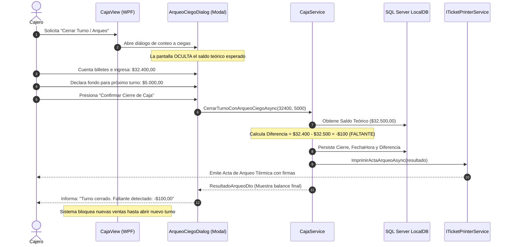

# Flujo de Caja y Arqueo Ciego: Custodia de Gaveta y Cierre sin Sesgos

### Módulo: 05. Casos de Uso y Flujos de Negocio de Punta a Punta
**Audiencia:** Desarrolladores, estudiantes universitarios y mesa evaluadora de cátedra  
**Requisitos Vinculados:** `RF-13` (Apertura de Turno), `RF-14` (Movimientos Justificados) y `RF-15` (Arqueo Ciego de Efectivo)  
**Archivos de Código:**
* Entidades: [`TurnoCaja.cs`](file:///c:/Users/lucas/Proyectos/retail/src/Retail.Domain/Entities/TurnoCaja.cs) y [`MovimientoCaja.cs`](file:///c:/Users/lucas/Proyectos/retail/src/Retail.Domain/Entities/MovimientoCaja.cs)
* Servicio: [`ICajaService.cs`](file:///c:/Users/lucas/Proyectos/retail/src/Retail.Application/Interfaces/Services/ICajaService.cs) y DTOs de Caja
* Excepciones: [`CajaCerradaException.cs`](file:///c:/Users/lucas/Proyectos/retail/src/Retail.Domain/Exceptions/CajaCerradaException.cs), [`TurnoYaAbiertoException.cs`](file:///c:/Users/lucas/Proyectos/retail/src/Retail.Domain/Exceptions/TurnoYaAbiertoException.cs) y [`SaldoCajaInsuficienteException.cs`](file:///c:/Users/lucas/Proyectos/retail/src/Retail.Domain/Exceptions/SaldoCajaInsuficienteException.cs)

---

## 1. 📖 Fundamento Teórico y Académico

### 1.1 El Control Interno del Dinero en Efectivo
En cualquier comercio con mostrador físico, el dinero en efectivo (*cash*) es el activo más líquido y vulnerable. Para garantizar el control interno y la rendición de cuentas, el sistema implementa una estricta **arquitectura de turnos de sesión**:
* **Apertura de Turno:** El cajero declara un fondo inicial de cambio (cambio chico para dar vuelto).
* **Custodia en Tiempo Real:** El sistema mantiene el cálculo continuo del **Saldo Teórico de Efectivo**:
  $$\text{Saldo Teórico} = \text{Saldo Inicial} + \text{Ventas Efectivo} + \text{Cobranzas Efectivo} + \text{Ingresos Extra} - \text{Egresos}$$
* **Movimientos Extraordinarios:** Entradas y salidas de gaveta que no son ventas (ej. compra de insumos de limpieza de librería, pago de flete o retiros parciales de seguridad a caja fuerte).

### 1.2 El Principio Anti-Fraude: "Arqueo Ciego" (*Blind Auditing*)
En los sistemas de punto de venta tradicionales existe un grave defecto de diseño:
* **El defecto del arqueo sesgado:** Al cerrar la caja, la pantalla le muestra al cajero: *"En gaveta debe haber $48.250,00"*. Si el cajero cuenta $48.500,00, puede verse tentado a quedarse con el sobrante de $250. O si faltan $500, puede intentar compensarlo alterando tickets antes de confirmar.
* **La Solución del Arqueo Ciego en Retail:** Al momento del cierre, la pantalla **NO muestra el saldo teórico**. El cajero debe contar físicamente los billetes y monedas en la gaveta e ingresar la cifra a ciegas (`SaldoDeclaradoEfectivo`).  
  Recién cuando el cajero confirma su conteo, el sistema compara contra el saldo teórico de la base de datos y calcula la diferencia de forma imparcial:
  $$\text{Diferencia} = \text{Saldo Declarado} - \text{Saldo Teórico}$$

---

## 2. 💻 Aplicación Concreta en el Código de Retail

### 2.1 La Raíz de Agregado `TurnoCaja`
En [`src/Retail.Domain/Entities/TurnoCaja.cs`](file:///c:/Users/lucas/Proyectos/retail/src/Retail.Domain/Entities/TurnoCaja.cs):

```csharp
public class TurnoCaja : BaseEntity, IAggregateRoot
{
    public int IdUsuario { get; set; }
    public DateTime FechaApertura { get; set; } = DateTime.UtcNow;
    public decimal SaldoInicial { get; set; }
    public DateTime? FechaCierre { get; set; }
    
    // Balances acumulados en tiempo de ejecución
    public decimal TotalVentasEfectivo { get; set; }
    public decimal TotalIngresosEfectivo { get; set; }
    public decimal TotalEgresosEfectivo { get; set; }
    public decimal SaldoTeoricoEfectivo { get; set; }
    
    // Resultados del Arqueo Ciego
    public decimal? SaldoDeclaradoEfectivo { get; set; }
    public decimal? DiferenciaEfectivo { get; set; }
    
    // Cobros electrónicos para cotejo de lotes POS
    public decimal TotalVentasElectronicas { get; set; }
    public decimal MontoRetenidoEnCaja { get; set; }
    
    public EstadoTurnoEnum Estado { get; set; } = EstadoTurnoEnum.Abierto;
}
```

### 2.2 Control de Retiros Extraordinarios: Prevención de Saldo Negativo
En [`CajaService.cs`](file:///c:/Users/lucas/Proyectos/retail/src/Retail.Application/), cuando se registra un egreso o retiro extraordinario, se custodia que el dinero físico en la gaveta sea suficiente:

```csharp
public async Task RegistrarMovimientoAsync(RegistrarMovimientoCajaDto dto, CancellationToken ct)
{
    var turno = await _turnoRepo.GetByIdAsync(dto.TurnoCajaId, ct)
        ?? throw new KeyNotFoundException($"Turno #{dto.TurnoCajaId} no encontrado.");

    if (turno.Estado != EstadoTurnoEnum.Abierto)
        throw new CajaCerradaException("No se pueden registrar movimientos en una caja cerrada.");

    if (dto.Tipo == TipoMovimientoCajaEnum.EgresoGasto || dto.Tipo == TipoMovimientoCajaEnum.RetiroEfectivo)
    {
        // INVARIANTE: No se puede retirar más efectivo del que realmente hay en gaveta
        if (dto.Monto > turno.SaldoTeoricoEfectivo)
        {
            throw new SaldoCajaInsuficienteException(
                $"No se puede retirar ${dto.Monto:N2}. El efectivo disponible en caja es ${turno.SaldoTeoricoEfectivo:N2}.");
        }

        turno.TotalEgresosEfectivo += dto.Monto;
    }
    else
    {
        turno.TotalIngresosEfectivo += dto.Monto;
    }

    turno.SaldoTeoricoEfectivo = turno.SaldoInicial 
        + turno.TotalVentasEfectivo 
        + turno.TotalIngresosEfectivo 
        - turno.TotalEgresosEfectivo;

    await _unitOfWork.SaveChangesAsync(ct);
}
```

### 2.3 Ejecución del Arqueo Ciego al Cierre de Turno
Cuando el cajero confirma su conteo en el diálogo modal `ArqueoCiegoDialog.xaml`:

```csharp
public async Task<ResultadoArqueoDto> CerrarTurnoConArqueoCiegoAsync(ArqueoCiegoDto dto, CancellationToken ct)
{
    var turno = await _turnoRepo.GetByIdAsync(dto.TurnoCajaId, ct)
        ?? throw new KeyNotFoundException("Turno no encontrado.");

    if (turno.Estado == EstadoTurnoEnum.Cerrado)
        throw new TurnoYaCerradoException("El turno ya se encuentra cerrado.");

    // 1. Asignación del conteo a ciegas declarado por el cajero
    turno.SaldoDeclaradoEfectivo = dto.MontoEfectivoDeclarado;
    turno.MontoRetenidoEnCaja = dto.MontoRetenidoProximoTurno;
    
    // 2. Cálculo imparcial de la diferencia
    turno.DiferenciaEfectivo = turno.SaldoDeclaradoEfectivo.Value - turno.SaldoTeoricoEfectivo;
    turno.FechaCierre = DateTime.UtcNow;
    turno.Estado = EstadoTurnoEnum.Cerrado;

    await _unitOfWork.SaveChangesAsync(ct);

    // 3. Impresión del Acta de Arqueo y Cierre
    var resultado = turno.ToResultadoArqueoDto();
    await _ticketPrinter.ImprimirActaArqueoAsync(resultado, ct);

    return resultado;
}
```

---

## 3. 📊 Diagrama Explicativo: Flujo de Arqueo Ciego e Impresión



---

## 4. ⚖️ Decisiones de Diseño y Trade-offs

### ¿Cómo se gestionan los cobros electrónicos (Tarjetas / QR) en el cierre?
* Las ventas cobradas con tarjeta de débito, crédito o billeteras virtuales (Mercado Pago / Transferencia) **no ingresan físicamente a la gaveta de billetes**.
* Por lo tanto, no forman parte de `SaldoTeoricoEfectivo`.
* Sin embargo, el agregado acumula `TotalVentasElectronicas`. En el acta de arqueo impresa, este total se discrimina por separado para que el encargado pueda cotejarlo contra el **ticket de cierre de lote (*Batch Close*) de la terminal POS física (Posnet / Clover)**.

---

## 5. 🎓 Preguntas de Examen de Cátedra (Autoevaluación)

### Pregunta 1: *"¿Por qué el arqueo de caja se implementó bajo la modalidad ciega en lugar de mostrarle al cajero lo que debe haber?"*
> **Respuesta Modelo del Estudiante:**  
> "Porque el arqueo ciego es un patrón fundamental de **control interno y auditoría anti-fraude**. Si el sistema muestra al cajero el total teórico antes de contar, se introduce un sesgo de confirmación: el cajero tiende a hacer coincidir su conteo con lo que indica la máquina. Si hubo un sobrante (por ejemplo, porque se cobró de más sin registrar o no se entregó un vuelto), el cajero podría apropiarse de la diferencia. Si hubo un faltante, podría buscar encubrirlo.  
> Al ocultar el saldo teórico, el cajero está obligado a realizar una declaración jurada del dinero real en gaveta. El cálculo de la diferencia se realiza a nivel de servidor de aplicación, quedando registrado en el acta física con firmas para auditoría gerencial."

### Pregunta 2: *"¿Qué ocurre si un cajero intenta registrar un retiro de efectivo por un valor superior al dinero disponible en la caja?"*
> **Respuesta Modelo del Estudiante:**  
> "La capa de aplicación aplica una invariante de guardia: si el monto solicitado en el egreso supera el `SaldoTeoricoEfectivo` actual del turno, la operación se interrumpe lanzando `SaldoCajaInsuficienteException`.  
> Esto impide que el saldo de efectivo de la gaveta caiga en valores negativos, lo cual constituiría una imposibilidad física en el mundo real y señalaría un desfasaje en los libros de caja. La interfaz gráfica captura el error y alerta al usuario que el monto a retirar supera el efectivo físico existente."
