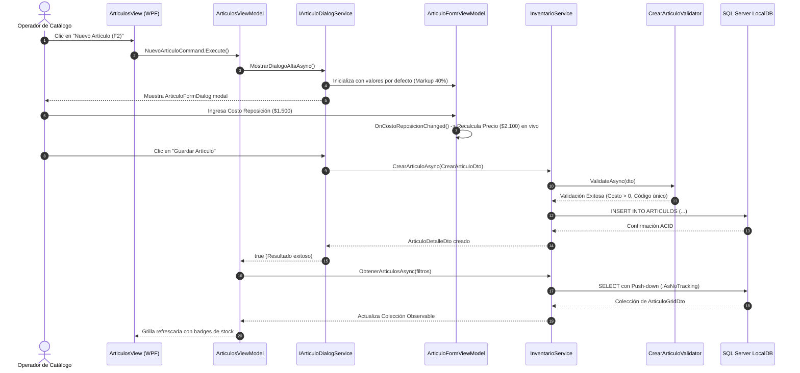
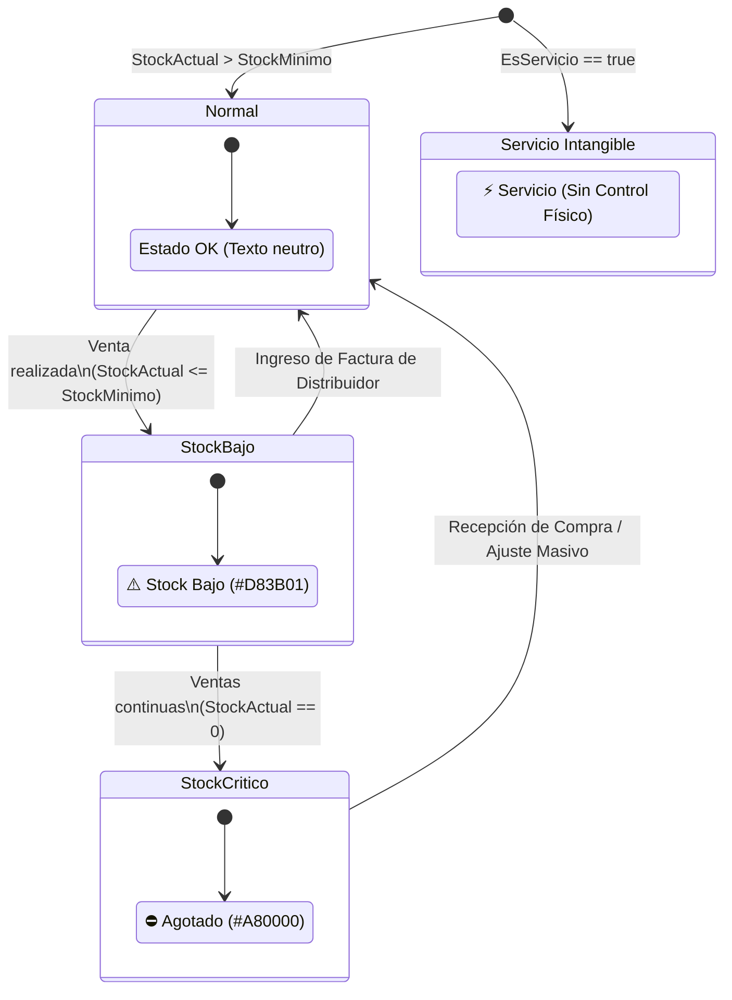

# Flujo de Catálogo Propio: Artículos, Markup Reactivo, Soporte de Artesanías y Alertas de Stock

### Módulo: 05. Casos de Uso y Flujos de Negocio de Punta a Punta
**Audiencia:** Desarrolladores, estudiantes universitarios y mesa evaluadora de cátedra  
**Requisitos Vinculados:** `RF-04` (Gestión de Catálogo Propio), `RF-06` (Búsqueda en Tiempo Real), `RF-08` (Alertas de Stock Mínimo y Crítico) y `RNF-03` (Memoria RAM $\le 300\text{ MB}$)  
**Archivos de Código:**
* Entidades: [`Articulo.cs`](file:///c:/Users/lucas/Proyectos/retail/src/Retail.Domain/Entities/Articulo.cs), [`Categoria.cs`](file:///c:/Users/lucas/Proyectos/retail/src/Retail.Domain/Entities/Categoria.cs) y [`Marca.cs`](file:///c:/Users/lucas/Proyectos/retail/src/Retail.Domain/Entities/Marca.cs)
* Caso de Uso y DTOs: [`IInventarioService.cs`](file:///c:/Users/lucas/Proyectos/retail/src/Retail.Application/Interfaces/Services/IInventarioService.cs), [`InventarioService.cs`](file:///c:/Users/lucas/Proyectos/retail/src/Retail.Application/Services/InventarioService.cs), [`CrearArticuloDto.cs`](file:///c:/Users/lucas/Proyectos/retail/src/Retail.Application/DTOs/Articulos/CrearArticuloDto.cs) y [`ActualizarArticuloDto.cs`](file:///c:/Users/lucas/Proyectos/retail/src/Retail.Application/DTOs/Articulos/ActualizarArticuloDto.cs)
* Validadores: [`CrearArticuloValidator.cs`](file:///c:/Users/lucas/Proyectos/retail/src/Retail.Application/Validators/Articulos/CrearArticuloValidator.cs) y [`ActualizarArticuloValidator.cs`](file:///c:/Users/lucas/Proyectos/retail/src/Retail.Application/Validators/Articulos/ActualizarArticuloValidator.cs)
* Persistencia: [`ArticuloConfiguration.cs`](file:///c:/Users/lucas/Proyectos/retail/src/Retail.Infrastructure/Persistence/Configurations/ArticuloConfiguration.cs)
* Presentación y Diálogos: [`ArticulosView.xaml`](file:///c:/Users/lucas/Proyectos/retail/src/Retail.App/Views/Pages/ArticulosView.xaml), [`ArticulosViewModel.cs`](file:///c:/Users/lucas/Proyectos/retail/src/Retail.App/ViewModels/Articulos/ArticulosViewModel.cs), [`ArticuloFormDialog.xaml`](file:///c:/Users/lucas/Proyectos/retail/src/Retail.App/Views/Dialogs/ArticuloFormDialog.xaml), [`ArticuloFormViewModel.cs`](file:///c:/Users/lucas/Proyectos/retail/src/Retail.App/ViewModels/Articulos/ArticuloFormViewModel.cs) e [`IArticuloDialogService.cs`](file:///c:/Users/lucas/Proyectos/retail/src/Retail.App/Services/IArticuloDialogService.cs)

---

## 1. 📖 Fundamento Teórico y Académico

### 1.1 La Fijación Comercial de Precios: *Markup* vs. Margen Bruto
En la gestión comercial minorista de librería y papelería, la determinación del precio final de venta al público (PVP) suele confundirse entre dos conceptos matemáticos y financieros distintos:
* **Margen Comercial (Gross Margin):** El porcentaje del precio de venta que representa ganancia sobre el total facturado:
  $$\text{Margen} = \frac{\text{PrecioVenta} - \text{Costo}}{\text{PrecioVenta}} \times 100$$
* **Recargo o Multiplicador (*Markup*):** El porcentaje que se adiciona **sobre el costo de reposición unitario** del proveedor para fijar el precio de venta en góndola:
  $$\text{PrecioVenta} = \text{CostoReposicion} \times \left(1 + \frac{\text{PorcentajeGanancia}}{100}\right)$$

En Retail adoptamos el modelo formal de **Markup sobre Costo de Reposición**. Cuando un distribuidor incrementa sus listas de precios debido a la inflación, el comerciante no recalcula manualmente cada uno de sus 10.000 artículos: el sistema actualiza el costo de reposición y proyecta automáticamente el nuevo precio de venta respetando el markup pactado para la categoría o producto.

### 1.2 El Punto de Reorden (ROP) y la Vigilancia de Inventario
El desabastecimiento de artículos de alta rotación (cuadernos, repuestos de hojas, bolígrafos) ocasiona pérdida directa de ventas y deterioro de la lealtad del cliente. En la teoría clásica de inventarios, el **Punto de Reorden (*Reorder Point - ROP*)** define el nivel mínimo de existencias en el cual debe emitirse una nueva orden de compra al distribuidor:
$$\text{ROP} = \text{Demanda esperada durante el tiempo de entrega (*Lead Time*)} + \text{Stock de Seguridad}$$

En el software de mostrador, el sistema debe advertir visualmente al operador sobre el estado del inventario mediante semáforos semánticos antes de que se produzca una rotura total de stock (`StockActual <= StockMinimo`).

### 1.3 Heterogeneidad del Catálogo: Productos Físicos, Artesanías y Servicios
Una librería comercial moderna no vende únicamente artículos con código de barras universal EAN-13 / UPC. Conviven tres tipologías de productos con comportamientos radicalmente divergentes:
1. **Artículos Industriales Estandard:** Poseen código de barras de fábrica irrepetible, control estricto de stock y reposición periódica.
2. **Productos Regionales y Artesanías:** Artículos de confección manual o regalería que **carecen de código de barras de fábrica** (`NULL`).
3. **Servicios e Intangibles:** Fotocopias, impresiones láser, plastificados y anillados (`EsServicio = true`). Poseen costo y precio, pero **no manejan stock físico ni deben disparar alertas de desabastecimiento**.

---

## 2. 💻 Aplicación Concreta en el Código de Retail

### 2.1 El Agregado `Articulo`: Encapsulamiento e Invariantes Puras
En [`src/Retail.Domain/Entities/Articulo.cs`](file:///c:/Users/lucas/Proyectos/retail/src/Retail.Domain/Entities/Articulo.cs), la entidad es una Raíz de Agregado (`IAggregateRoot`) que custodia celosamente la consistencia matemática de sus valores:

```csharp
public class Articulo : BaseEntity, IAggregateRoot
{
    public string? CodigoBarras { get; set; }
    public string Descripcion { get; set; } = string.Empty;
    public int IdCategoria { get; set; }
    public int IdMarca { get; set; }
    public decimal CostoReposicion { get; set; }
    public decimal PorcentajeGanancia { get; set; }
    public decimal PrecioVenta { get; set; }
    public int StockActual { get; set; }
    public int StockMinimo { get; set; }
    public bool EsServicio { get; set; }

    // Invariante de alerta: los servicios jamás tienen stock bajo
    public bool TieneStockBajo => !EsServicio && StockActual <= StockMinimo;

    // Regla matemática de dominio centralizada y reutilizable
    public static decimal CalcularPrecioVenta(decimal costoReposicion, decimal porcentajeGanancia)
    {
        if (costoReposicion < 0m)
            throw new ArgumentOutOfRangeException(nameof(costoReposicion), "El costo de reposición no puede ser negativo.");

        if (porcentajeGanancia < 0m)
            throw new ArgumentOutOfRangeException(nameof(porcentajeGanancia), "El porcentaje de ganancia no puede ser negativo.");

        return Math.Round(costoReposicion * (1m + (porcentajeGanancia / 100m)), 2);
    }

    public void ActualizarCostoYRecalcularPrecio(decimal nuevoCosto)
    {
        CostoReposicion = nuevoCosto;
        PrecioVenta = CalcularPrecioVenta(CostoReposicion, PorcentajeGanancia);
    }
}
```

### 2.2 Persistencia con Índice Filtrado (*Filtered Unique Index*) en SQL Server
En [`src/Retail.Infrastructure/Persistence/Configurations/ArticuloConfiguration.cs`](file:///c:/Users/lucas/Proyectos/retail/src/Retail.Infrastructure/Persistence/Configurations/ArticuloConfiguration.cs), se resuelve el desafío de unicidad condicional para artesanías y borrado lógico:

```csharp
// Unicidad estricta para productos industriales, permitiendo infinitos NULL (artesanías)
// y reutilización de códigos si el artículo anterior fue borrado lógicamente (Soft Delete)
builder.HasIndex(a => a.CodigoBarras)
    .IsUnique()
    .HasFilter("[codigo_barras] IS NOT NULL AND [deleted_at] IS NULL");
```
*Si dos productos artesanales se dan de alta sin código (`NULL`), SQL Server no genera colisión de clave única gracias a la cláusula `WHERE` del índice filtrado.*

### 2.3 Orquestación de Casos de Uso: `InventarioService`
En [`src/Retail.Application/Services/InventarioService.cs`](file:///c:/Users/lucas/Proyectos/retail/src/Retail.Application/Services/InventarioService.cs), el caso de uso implementa el principio **Push-down to SQL** (Ley 8 de AGENTS.md), buscando en el servidor con `EF.Functions.Like` y proyectando a DTOs sin sobrecarga de memoria:

```csharp
public async Task<IReadOnlyList<ArticuloGridDto>> ObtenerArticulosAsync(
    string? terminoBusqueda, int? idCategoria, bool soloStockBajo, CancellationToken ct)
{
    IQueryable<Articulo> query = _context.Articulos
        .AsNoTracking()
        .Include(a => a.Categoria)
        .Include(a => a.Marca);

    if (!string.IsNullOrWhiteSpace(terminoBusqueda))
    {
        var termino = terminoBusqueda.Trim();
        query = query.Where(a =>
            a.CodigoBarras == termino ||
            EF.Functions.Like(a.Descripcion, $"%{termino}%") ||
            EF.Functions.Like(a.Marca!.Nombre, $"%{termino}%"));
    }

    if (soloStockBajo)
    {
        query = query.Where(a => !a.EsServicio && a.StockActual <= a.StockMinimo);
    }

    return await query
        .OrderBy(a => a.Descripcion)
        .Select(a => new ArticuloGridDto(
            a.Id, a.CodigoBarras, a.Descripcion, a.Categoria!.Nombre, a.Marca!.Nombre,
            a.CostoReposicion, a.PorcentajeGanancia, a.PrecioVenta,
            a.StockActual, a.StockMinimo, a.EsServicio, a.TieneStockBajo))
        .ToListAsync(ct);
}
```

### 2.4 Reactividad en UI con MVVM y Diálogos Desacoplados
En [`src/Retail.App/ViewModels/Articulos/ArticuloFormViewModel.cs`](file:///c:/Users/lucas/Proyectos/retail/src/Retail.App/ViewModels/Articulos/ArticuloFormViewModel.cs), el cálculo de precio de venta reacciona inmediatamente mientras el usuario tipea el costo o el markup:

```csharp
partial void OnCostoReposicionChanged(decimal value) => RecalcularPrecio();
partial void OnPorcentajeGananciaChanged(decimal value) => RecalcularPrecio();

private void RecalcularPrecio()
{
    PrecioVentaCalculado = Articulo.CalcularPrecioVenta(CostoReposicion, PorcentajeGanancia);
}
```

Para abrir el diálogo modal sin violar el patrón MVVM, [`ArticulosViewModel`](file:///c:/Users/lucas/Proyectos/retail/src/Retail.App/ViewModels/Articulos/ArticulosViewModel.cs) no instancia ventanas de WPF directamente; consume la abstracción [`IArticuloDialogService`](file:///c:/Users/lucas/Proyectos/retail/src/Retail.App/Services/IArticuloDialogService.cs), permitiendo que la lógica sea 100% testeable en suites de pruebas unitarias xUnit sin abrir ventanas visuales.

---

## 3. 📊 Diagramas Explicativos

### 3.1 Diagrama de Secuencia: Alta de Artículo y Refresco de Grilla



### 3.2 Máquina de Estados: Semáforo y Alertas de Stock



---

## 4. ⚖️ Decisiones de Diseño y Trade-offs

### 1. ¿Por qué la fórmula de Markup reside en la Entidad `Articulo` y no en el ViewModel o en la Base de Datos?
* **Alternativa descartada (En el ViewModel):** Si el cálculo estuviera en `ArticuloFormViewModel`, la importación masiva de listas de distribuidores con MiniExcel (Módulo 2.2) y el ingreso de facturas de compras de proveedores (Módulo 4) tendrían que duplicar la fórmula o depender de la capa de UI.
* **Alternativa descartada (En columna calculada de SQL Server):** Si fuera una columna calculada `AS (costo * (1 + ganancia / 100)) PERSISTED`, el motor relacional no permitiría al sistema simular precios en memoria antes de persistir o congelar cotizaciones temporales en presupuestos.
* **Decisión adoptada:** La fórmula pertenece al **Núcleo de Dominio**. Es un método estático puro en [`Articulo.cs`](file:///c:/Users/lucas/Proyectos/retail/src/Retail.Domain/Entities/Articulo.cs), lo que permite probarlo con 14 casos unitarios sin dependencias de I/O ni de interfaz.

### 2. ¿Por qué utilizar un Diálogo Desacoplado con `IArticuloDialogService`?
* En aplicaciones WPF tradicionales, los desarrolladores suelen escribir `var dlg = new ArticuloFormDialog(); dlg.ShowDialog();` directamente en los eventos de la vista o en los comandos del ViewModel.
* Esto destruye la testeabilidad: **no se puede ejecutar un test unitario sobre `ArticulosViewModel` en un servidor de CI/CD sin pantalla gráfica** porque `ShowDialog()` intentaría instanciar un elemento de ventana de Windows, arrojando excepciones de Dispatcher.
* Con `IArticuloDialogService`, el ViewModel simplemente interactúa con una interfaz que en pruebas se sustituye con `NSubstitute`, simulando la aceptación o cancelación del modal sin levantar interfaces gráficas.

---

## 5. 🎓 Preguntas de Examen de Cátedra (Autoevaluación)

### Pregunta 1: *"¿Qué problema presenta un índice UNIQUE tradicional en SQL Server cuando una columna admite valores NULL y soft-delete, y cómo lo resolvieron?"*
> **Respuesta Modelo del Estudiante:**  
> "En el estándar ANSI SQL, dos valores `NULL` no son iguales entre sí, pero en el motor de Microsoft SQL Server el valor `NULL` se computa como un valor único. Por lo tanto, en un índice único convencional, si se inserta una segunda artesanía con `CodigoBarras = NULL`, el motor lanza una violación de clave única (`SqlException`). Además, si un artículo fue borrado lógicamente mediante Soft Delete (`deleted_at IS NOT NULL`), un índice único estándar impediría volver a registrar ese mismo código de barras en el futuro.  
> Lo resolvimos implementando un **Índice Filtrado (*Filtered Unique Index*)** en [`ArticuloConfiguration.cs`](file:///c:/Users/lucas/Proyectos/retail/src/Retail.Infrastructure/Persistence/Configurations/ArticuloConfiguration.cs) con la instrucción `.HasFilter("[codigo_barras] IS NOT NULL AND [deleted_at] IS NULL")`. De esta manera, SQL Server solo evalúa la unicidad sobre filas activas con código presente, ignorando registros borrados y permitiendo infinitas artesanías sin código."

### Pregunta 2: *"¿Por qué la propiedad `TieneStockBajo` de la entidad `Articulo` evalúa la condición `!EsServicio`?"*
> **Respuesta Modelo del Estudiante:**  
> "Porque los servicios (como fotocopias, impresiones o anillados) representan mano de obra o consumos intangibles de mostrador. Su stock físico en la base de datos se modela convencionalmente en 0 o no aplica.  
> Si no excluyéramos los servicios con `!EsServicio`, el sistema caería en el error de marcar permanentemente las fotocopias con alerta de 'Stock Agotado' o 'Stock Bajo' en la grilla y en los reportes de compra, falseando los pedidos a proveedores y confundiendo al operador."

### Pregunta 3: *"Si la grilla de artículos muestra miles de registros, ¿cómo garantiza su arquitectura que la memoria RAM del proceso no supere el límite de $300\text{ MB}$ exigido por el requisito RNF-03?"*
> **Respuesta Modelo del Estudiante:**  
> "Aplicamos tres técnicas combinadas:  
> 1. **Evaluación en Servidor (Push-down to SQL):** Las búsquedas y filtros por categoría o stock bajo se componen sobre `IQueryable` y se traducen a sentencias `WHERE` en SQL Server con `EF.Functions.Like`, evitando traer tablas completas a la memoria.  
> 2. **Proyección Directa a DTOs Inmutables:** El servicio no retorna entidades `Articulo` completas con sus colecciones de navegación pesadas, sino el DTO plano `ArticuloGridDto` con los campos estrictamente necesarios para la grilla.  
> 3. **Desactivación del Change Tracker (`.AsNoTracking()`):** Al tratarse de una operación de lectura, deshabilitar el seguimiento de cambios de EF Core reduce a la mitad la alocación de objetos en el Garbage Collector, asegurando un consumo de memoria estable e inferior a $150\text{ MB}$."
