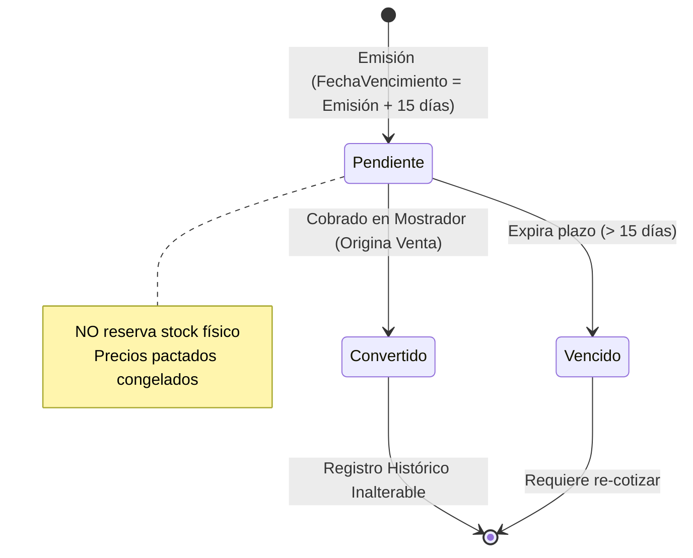
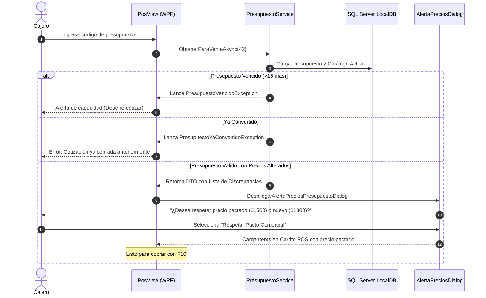

# Flujo de Presupuestos y Conciliación Adaptativa: Congelamiento y Conversión

### Módulo: 05. Casos de Uso y Flujos de Negocio de Punta a Punta
**Audiencia:** Desarrolladores, estudiantes universitarios y mesa evaluadora de cátedra  
**Requisitos Vinculados:** `RF-11` (Presupuestador Independiente) y `RF-12` (Conciliación Adaptativa al Cobrar)  
**Archivos de Código:**
* Entidades: [`Presupuesto.cs`](file:///c:/Users/lucas/Proyectos/retail/src/Retail.Domain/Entities/Presupuesto.cs) y [`DetallePresupuesto.cs`](file:///c:/Users/lucas/Proyectos/retail/src/Retail.Domain/Entities/DetallePresupuesto.cs)
* Servicio: [`IPresupuestoService.cs`](file:///c:/Users/lucas/Proyectos/retail/src/Retail.Application/Interfaces/Services/IPresupuestoService.cs)
* Excepciones: [`PresupuestoVencidoException.cs`](file:///c:/Users/lucas/Proyectos/retail/src/Retail.Domain/Exceptions/PresupuestoVencidoException.cs) y [`PresupuestoYaConvertidoException.cs`](file:///c:/Users/lucas/Proyectos/retail/src/Retail.Domain/Exceptions/PresupuestoYaConvertidoException.cs)

---

## 1. 📖 Fundamento Teórico y Académico

### 1.1 El Ciclo de Vida de las Cotizaciones Comerciales
En una librería comercial, instituciones (colegios, empresas) y clientes particulares solicitan listas de útiles o cotizaciones formales para evaluar presupuestos antes de realizar la compra:
* **Validez Temporal Estricta:** Un presupuesto congela los precios unitarios pactados durante una ventana fija de **15 días corridos**.
* **Invariante Crítica: Cero Afectación de Inventario:** Un presupuesto **NO descuenta ni reserva stock físico** en góndola. Si reservara stock, un cliente que solicita cotización de 50 cuadernos y no regresa inmovilizaría mercadería, impidiendo que otros compradores adquieran los artículos en el mostrador.
* **Deriva de Precios (*Price Drift*):** En contextos de inflación o reajustes de proveedores mayoristas, los precios del catálogo pueden aumentar mientras el presupuesto sigue vigente. Al momento de convertir la cotización en venta, el sistema debe conciliar los precios pactados contra el catálogo actual y advertir al operador.

---

## 2. 💻 Aplicación Concreta en el Código de Retail

### 2.1 La Raíz de Agregado `Presupuesto`
En [`src/Retail.Domain/Entities/Presupuesto.cs`](file:///c:/Users/lucas/Proyectos/retail/src/Retail.Domain/Entities/Presupuesto.cs), la cotización custodia su vigencia y estado:

```csharp
public class Presupuesto : BaseEntity, IAggregateRoot
{
    public int IdUsuario { get; set; }
    public int IdCliente { get; set; }
    public DateTime FechaEmision { get; set; } = DateTime.UtcNow;
    public DateTime FechaVencimiento { get; set; } = DateTime.UtcNow.AddDays(15);
    public EstadoPresupuestoEnum Estado { get; set; } = EstadoPresupuestoEnum.Pendiente;

    public ICollection<DetallePresupuesto> Detalles { get; set; } = new List<DetallePresupuesto>();

    public bool EstaVencido => DateTime.UtcNow > FechaVencimiento;

    public void ValidarParaConversion()
    {
        if (Estado == EstadoPresupuestoEnum.Convertido)
            throw new PresupuestoYaConvertidoException(Id, "Este presupuesto ya fue cobrado anteriormente.");

        if (EstaVencido)
            throw new PresupuestoVencidoException(Id, FechaVencimiento, "El plazo de validez de 15 días ha expirado.");
    }
}
```

### 2.2 Algoritmo de Conciliación Adaptativa al Cobrar
Cuando el cajero ingresa el número de presupuesto en el punto de venta (`PosViewModel`), el servicio [`PresupuestoService`](file:///c:/Users/lucas/Proyectos/retail/src/Retail.Application/) analiza las diferencias entre los precios pactados y el catálogo actual:

```csharp
public async Task<PresupuestoConciliacionDto> ObtenerParaVentaAsync(int presupuestoId, CancellationToken ct)
{
    var presupuesto = await _presupuestoRepo.GetByIdAsync(presupuestoId, ct)
        ?? throw new KeyNotFoundException($"Presupuesto #{presupuestoId} no encontrado.");

    // 1. Valida invariantes temporales y de estado
    presupuesto.ValidarParaConversion();

    var discrepancias = new List<DiscrepanciaPrecioDto>();

    // 2. Compara cada artículo pactado contra el catálogo en tiempo real
    foreach (var item in presupuesto.Detalles)
    {
        var articuloActual = await _articuloRepo.GetByIdAsync(item.IdArticulo, ct);
        if (articuloActual != null && articuloActual.PrecioVenta != item.PrecioUnitarioPactado)
        {
            discrepancias.Add(new DiscrepanciaPrecioDto(
                item.IdArticulo,
                item.Descripcion,
                item.PrecioUnitarioPactado,    // Precio pactado congelado
                articuloActual.PrecioVenta));  // Precio actual en catálogo
        }
    }

    return new PresupuestoConciliacionDto(presupuesto, discrepancias);
}
```

### 2.3 Resolución en Mostrador: Respetar Pacto o Actualizar
Si se detectan discrepancias de precio:
1. La UI despliega el diálogo modal `AlertaPreciosPresupuestoDialog.xaml`.
2. El sistema muestra la lista de artículos que subieron de precio desde la emisión de la cotización.
3. El cajero/encargado puede:
   * **Opción A (Respetar Precios Pactados - Por Defecto):** Honra el compromiso con el cliente durante los 15 días de validez.
   * **Opción B (Actualizar al Catálogo Vigente):** Aplica los precios nuevos si el cliente acepta o si la cotización sufrió modificaciones sustanciales.
4. Al confirmar la venta, el presupuesto transiciona a `EstadoPresupuestoEnum.Convertido` y se vincula su `Id` en la nueva `Venta.IdPresupuestoOrigen`.

---

## 3. 📊 Diagrama Explicativo: Máquina de Estados y Flujo de Conversión





---

## 4. ⚖️ Decisiones de Diseño y Trade-offs

### ¿Por qué NO reservar stock físico cuando se emite un presupuesto?
* En un comercio minorista con espacio físico de góndola limitado, reservar stock sin compromiso de pago congela el capital de trabajo.
* Si el cliente no regresa (lo que ocurre en más del 50% de las consultas informales), el comercio pierde oportunidades reales de venta con otros clientes presentes en el local.
* En el ticket del presupuesto impreso se incluye explícitamente la leyenda legal:  
  `* DOCUMENTO NO VÁLIDO COMO FACTURA * Precios pactados válidos por 15 días. No reserva ni garantiza stock físico.`

---

## 5. 🎓 Preguntas de Examen de Cátedra (Autoevaluación)

### Pregunta 1: *"¿Qué sucede si un cliente se presenta a pagar un presupuesto en el día 16 posterior a su emisión?"*
> **Respuesta Modelo del Estudiante:**  
> "Al intentar cargar el presupuesto en el punto de venta, el método `presupuesto.ValidarParaConversion()` evalúa la condición `DateTime.UtcNow > FechaVencimiento`. Al detectar que el plazo legal expiró, interrumpe el flujo lanzando inmediatamente `PresupuestoVencidoException`.  
> La interfaz gráfica notifica al cajero que la cotización está vencida y bloquea su conversión directa a venta. Para concretar la operación, el cajero debe generar una nueva cotización o cargar los productos directamente en el mostrador aplicando los precios vigentes del catálogo a la fecha."

### Pregunta 2: *"¿Cómo evita el sistema que un presupuesto sea cobrado dos veces por diferentes cajeros en el mismo día?"*
> **Respuesta Modelo del Estudiante:**  
> "Mediante la máquina de estados de la entidad `Presupuesto`. En cuanto una venta originada por presupuesto se confirma en la base de datos de forma atómica (`UnitOfWork`), la propiedad `Estado` del presupuesto se actualiza de `Pendiente` a `Convertido`.  
> Si otro cajero intenta ingresar el mismo número de presupuesto minutos más tarde, la validación `ValidarParaConversion()` detecta el estado `Convertido` y lanza `PresupuestoYaConvertidoException`, imposibilitando la reutilización fraudulenta o duplicada de cotizaciones ya saldadas."
