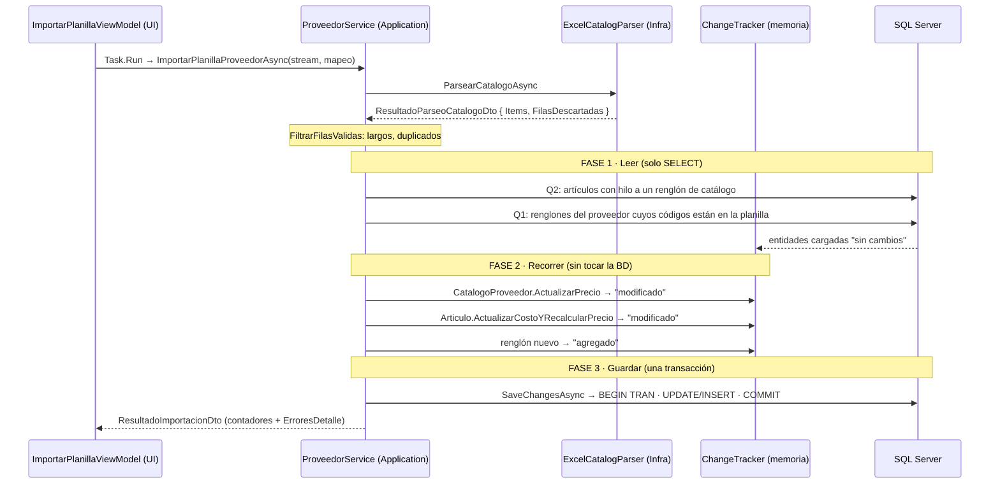
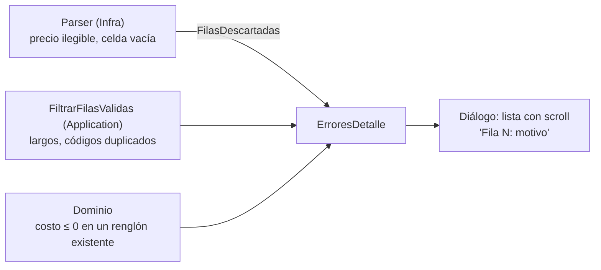
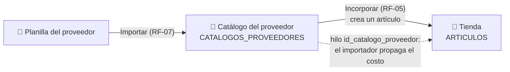

# Flujo de Importación Masiva: de la Planilla del Proveedor al Precio de Góndola

### Módulo: 05. Casos de Uso y Flujos de Negocio de Punta a Punta
**Audiencia:** Desarrolladores, estudiantes universitarios y mesa evaluadora de cátedra  
**Requisitos Vinculados:** `RF-05` (Catálogo de Proveedores), `RF-07` (Importador Masivo de Listas de Precios), `RNF-02` (< 3 s para 5.000 filas) y `RNF-03` (≤ 300 MB de RAM)  
**Principios Rectores:** Ley 4 (Responsividad de UI), Ley 8 (Push-down a SQL y reglas en el Dominio) y patrón Unit of Work  
**Tecnología Principal:** `MiniExcel 1.34.2` sobre `Task.Run`, EF Core 8  
**Archivos de Código:**
* Parser: [`IExcelCatalogParser.cs`](file:///c:/Users/lucas/Proyectos/retail/src/Retail.Application/Interfaces/Infrastructure/IExcelCatalogParser.cs) e [`ExcelCatalogParser.cs`](file:///c:/Users/lucas/Proyectos/retail/src/Retail.Infrastructure/ExternalServices/Excel/ExcelCatalogParser.cs)
* Caso de uso: [`ProveedorService.ImportarPlanillaProveedorAsync`](file:///c:/Users/lucas/Proyectos/retail/src/Retail.Application/Services/ProveedorService.cs)
* Entidades: [`CatalogoProveedor.cs`](file:///c:/Users/lucas/Proyectos/retail/src/Retail.Domain/Entities/CatalogoProveedor.cs) y [`Articulo.cs`](file:///c:/Users/lucas/Proyectos/retail/src/Retail.Domain/Entities/Articulo.cs)
* UI: [`ImportarPlanillaViewModel.cs`](file:///c:/Users/lucas/Proyectos/retail/src/Retail.App/ViewModels/Proveedores/ImportarPlanillaViewModel.cs) e [`ImportarPlanillaDialog.xaml`](file:///c:/Users/lucas/Proyectos/retail/src/Retail.App/Views/Dialogs/ImportarPlanillaDialog.xaml)
* Análisis y plan de trabajo: [`handoff-importador-precios-stock.md`](file:///c:/Users/lucas/Proyectos/retail/docs/auditorias/handoff-importador-precios-stock.md)

---

## 1. 📖 Fundamento Teórico y Académico

### 1.1 La Dinámica Comercial con Distribuidores Mayoristas
Una librería trabaja con varios distribuidores (papeleras, editoriales, Bic, Ledesma). Periódicamente cada uno envía una **planilla `.xlsx` o `.csv`** con su lista de precios. El sistema tiene que:
1. Guardar la lista del proveedor **sin tocar** el inventario de la tienda (`RF-07`).
2. Actualizar el costo y el precio de venta de los artículos de la tienda que **dependen** de esa lista (`RF-05`).
3. Hacerlo sin congelar la ventana de mostrador (Ley 4).

### 1.2 Las Dos Libretas: Catálogo y Tienda
La clave para entender el importador es que trabaja con **dos tablas distintas**:

| Libreta | Tabla | Qué guarda | Quién la escribe |
| :--- | :--- | :--- | :--- |
| 📒 **Catálogo del proveedor** | `CATALOGOS_PROVEEDORES` | Lo que *el proveedor vende*, con *su* código y *su* costo | El importador, cada vez que llega una planilla |
| 🏪 **Tienda (góndola)** | `ARTICULOS` | Lo que *la librería vende*, con su precio de venta y su stock | El usuario, al dar de alta o **incorporar** ítems del catálogo |

Entre las dos hay un **hilo**: la columna `id_catalogo_proveedor` de cada artículo indica de qué renglón del catálogo sale su costo. No todos los artículos tienen hilo (una artesanía no tiene proveedor), y no todos los renglones del catálogo tienen un artículo (hay productos que la tienda nunca incorporó).

### 1.3 Streaming contra DOM
Librerías como `ClosedXML` cargan la hoja completa como un árbol de objetos en memoria (modelo DOM). **MiniExcel** lee el archivo como un flujo hacia adelante (*forward-only*) y entrega las filas de a una, sin construir ese árbol.

> ⚠️ **Precisión importante para la defensa:** el *lector* de MiniExcel es streaming, pero nuestro parser **acumula las filas válidas en una lista** antes de procesarlas, y el Change Tracker de EF Core mantiene todas las entidades modificadas hasta el guardado. El consumo de memoria crece con el tamaño de la planilla (O(n)), aunque con objetos pequeños. Para 5.000 filas, el test de integración verifica < 3 s y < 50 MB de incremento. La medición contra el límite de `RNF-03` es la Fase 2 del handoff (hallazgo H-15).

---

## 2. 💻 Aplicación Concreta en el Código de Retail

### 2.1 Flujo Completo en Tres Fases



### 2.2 Las Dos Consultas (Q1 y Q2) y las Dos Agendas
Antes del recorrido, el servicio hace **dos consultas de lectura** y arma con cada una una "agenda" en memoria:

| | Pregunta | Tabla | Busca por | Agenda resultante |
| :--- | :--- | :--- | :--- | :--- |
| **Q1** | ¿Qué códigos de esta planilla ya están en el catálogo del proveedor? | 📒 | **Código** (texto de la planilla) | `código → renglón` (diccionario sin distinguir mayúsculas) |
| **Q2** | ¿Qué artículos de la tienda tienen hilo a un renglón de catálogo? | 🏪 | **Hilo** (`id_catalogo_proveedor`) | `renglón → [artículos]` (`ToLookup`) |

Durante el recorrido, cada fila salta de una agenda a la otra: **código → renglón → artículos**.

**¿Por qué consultar antes y no dentro del `foreach`?** Para evitar el problema **N+1**: consultar fila por fila serían 10.000 viajes a la base para 5.000 filas. Con Q1 y Q2 son 2 viajes, sin importar el tamaño de la planilla.

**¿Y el límite de 2.100 parámetros de SQL Server?** Q1 envía la lista de códigos con `codigoList.Contains(c.CodigoProveedor)`. EF Core 8 la manda como **un único parámetro JSON** que SQL Server desarma con `OPENJSON`. Está verificado contra LocalDB con 3.000 códigos en [`CatalogoProveedorQueryServiceTests.cs`](file:///c:/Users/lucas/Proyectos/retail/tests/Retail.Infrastructure.IntegrationTests/Services/CatalogoProveedorQueryServiceTests.cs). El supuesto de despliegue (compatibilidad de la base ≥ 130) está en [`SISTEMA_DE_PERSISTENCIA.md`](file:///c:/Users/lucas/Proyectos/retail/docs/SISTEMA_DE_PERSISTENCIA.md).

### 2.3 Ejemplo con Datos
Planilla de "Distribuidora Sur" (proveedor 7), con el encabezado en la fila 3 porque arriba hay un título:

| Fila Excel | Código | Descripción | Costo | Qué pasa |
| :--- | :--- | :--- | :--- | :--- |
| 4 | BIC-AZ | Birome azul x50 | 5.000 | Renglón 10: 4.500 → 5.000. Artículo 1 (ganancia 40 %): precio 6.300 → **7.000** |
| 5 | SOB-100 | Sobre manila x100 | 3.000 | Renglón 11: 2.800 → 3.000. Artículo 2 (ganancia 50 %): precio 4.200 → **4.500** |
| 6 | GOMA-1 | Goma de borrar | 200 | Código nuevo: se **crea** el renglón 13. Nadie tiene hilo: queda en el catálogo hasta que alguien lo incorpore |
| 7 | LAP-1 | Lápiz | abc | Descartada: *"Fila 7: el precio 'abc' no es un importe válido."* |

El precio lo calcula el propio artículo (Ley 8):

```csharp
// Articulo.cs (Dominio)
public void ActualizarCostoYRecalcularPrecio(decimal nuevoCosto)
{
    CostoReposicion = nuevoCosto;
    PrecioVenta = CalcularPrecioVenta(CostoReposicion, PorcentajeGanancia); // Costo × (1 + Ganancia/100)
}
```

`PreciosActualizados` cuenta solo los artículos cuyo costo **realmente cambia**: si el artículo ya tenía ese costo, no se modifica ni se cuenta.

### 2.4 Lectura de la Planilla y Reporte de Errores
El parser lee **sin cabecera automática** (`useHeaderRow: false`): cada fila llega como un diccionario `letra de columna → valor`. Eso permite tres cosas:
1. **Fila de encabezado configurable** (`MapeoColumnasDto.FilaEncabezado`): las filas anteriores (títulos, logos) se ignoran.
2. **Número de fila real** en cada ítem (`ItemCatalogoImportadoDto.NumeroFila`), el mismo que el usuario ve en Excel, también con filas en blanco intermedias.
3. **Encabezados tolerantes**: `"Código "`, `"CODIGO"` y `"codigo"` son la misma columna (se ignoran mayúsculas, acentos y espacios en los extremos).

Los errores se detectan en **tres capas** y llegan juntos al usuario:



Dos tipos de error se tratan distinto:

| Tipo | Ejemplo | Tratamiento |
| :--- | :--- | :--- |
| **De dato** (afecta una fila) | Precio `abc` en la fila 7 | Se descarta esa fila, se informa y se sigue con el resto |
| **De configuración** (afecta todas) | El mapeo dice `PRECIO` y la planilla no tiene esa columna | `InvalidDataException` con las columnas encontradas; no se importa nada. El ViewModel lo registra como *Warning*, no como *Error* |

### 2.5 Responsividad: `Task.Run` e `IProgress<int>`
El ViewModel delega la importación al ThreadPool (Ley 4) y recibe el avance con `IProgress<int>`, que el framework despacha al hilo de UI. Como con streaming **no se conoce el total de filas** por adelantado, la barra es **indeterminada** y el texto informa *"Leyendo planilla… (N filas leídas)"*.

### 2.6 Atomicidad: Todo o Nada
Hay un **único** `SaveChangesAsync` al final: EF Core abre una transacción implícita con todos los `UPDATE` e `INSERT`. Si algo falla al guardar o el usuario cancela, no queda ninguna importación a medias. Volver a importar la misma planilla es seguro: el upsert por código es idempotente.

---

## 3. 📊 Diagrama: Del Catálogo a la Tienda



* **Importar** escribe en el catálogo y propaga los costos por el hilo. Nunca crea artículos.
* **Incorporar** crea artículos a partir de renglones del catálogo. Si un renglón ya tiene artículo, se omite y se informa ("N incorporados, M omitidos").
* **Vincular** une un artículo existente a un renglón. Un renglón se vincula a **un solo** artículo: si ya tiene dueño, se rechaza con `DomainException`.

---

## 4. ⚖️ Decisiones de Diseño y Trade-offs

| Decisión | Alternativa descartada | Motivo |
| :--- | :--- | :--- |
| MiniExcel (streaming) | ClosedXML (DOM) | El modelo DOM carga la hoja completa como árbol de objetos |
| Q1 + Q2 antes del recorrido | Consultar dentro del `foreach` | Problema N+1: 2 consultas en lugar de miles |
| Un solo `SaveChanges` | Guardado por lotes con `ChangeTracker.Clear()` | Los lotes rompen la atomicidad, `Clear()` viola la Ley 1 desde Application y vacía un DbContext compartido por toda la app. Se reevalúa solo si la medición de RNF-03 lo exige (handoff, D-08) |
| `Contains` con OPENJSON | Partir la lista en bloques de 1.000 | El límite de 2.100 no aplica en EF Core 8; probado con un test de integración |
| Markup en `Articulo` | Stored Procedure | Ley 8: las reglas de negocio no viven en la base |
| Encabezado por letra de columna | `useHeaderRow: true` | Fija el encabezado en la fila 1 y oculta el número de fila real |
| Error de configuración = excepción | Reportar "falta la columna" en cada fila | Un error que afecta a todas las filas se informa una sola vez |

---

## 5. 🎓 Preguntas de Examen de Cátedra (Autoevaluación)

### Pregunta 1: *"¿En qué momento se escribe en la base de datos durante la importación?"*
> **Respuesta modelo:** "Solo en el `SaveChangesAsync` final. Antes hay dos consultas de lectura (Q1 y Q2) y después un recorrido que modifica objetos en memoria. El ChangeTracker guarda una 'foto' de cada entidad al cargarla y, al guardar, la compara con el estado actual para generar los `UPDATE` e `INSERT`. Es el patrón **Unit of Work**: se acumulan los cambios y se confirman juntos en una transacción."

### Pregunta 2: *"¿Por qué no consultan la base dentro del `foreach`?"*
> **Respuesta modelo:** "Por el problema **N+1**: con 5.000 filas serían miles de viajes a la base. Preguntamos todo antes con dos consultas y armamos dos agendas en memoria (`código → renglón` y `renglón → artículos`)."

### Pregunta 3: *"¿Un `Contains` con 3.000 códigos no supera el límite de 2.100 parámetros de SQL Server?"*
> **Respuesta modelo:** "No. EF Core 8 envía la lista como un único parámetro JSON que SQL Server desarma con `OPENJSON`. Lo verificamos con un test de integración contra LocalDB, que además nos protege si una actualización de EF Core cambia esa traducción. El supuesto es que la base tenga compatibilidad ≥ 130."

### Pregunta 4: *"¿El consumo de memoria es constante gracias al streaming?"*
> **Respuesta modelo:** "El lector de MiniExcel es streaming, pero nuestro parser acumula las filas válidas y el ChangeTracker retiene las entidades modificadas hasta el guardado, así que la memoria crece con la planilla. Para 5.000 filas lo acotamos con un test (< 50 MB de incremento). La medición formal contra `RNF-03` está planificada; si no se cumple, se evaluaría procesar por lotes dentro de una transacción explícita."

### Pregunta 5: *"¿Cómo saben que el número de fila del reporte de errores coincide con el que ve el usuario?"*
> **Respuesta modelo:** "El parser lee la hoja sin cabecera automática y cuenta las filas a medida que las recorre, incluidas las vacías. Tenemos tests de integración con filas de título y filas en blanco, en XLSX y en CSV, que verifican la numeración."

### Pregunta 6: *"¿Por qué la regla 'un renglón del catálogo, un artículo' está en Application y no en el Dominio?"*
> **Respuesta modelo:** "Porque para verificarla hay que mirar *otros* artículos, y un agregado solo conoce su propio estado. Es un invariante entre agregados. La validación en Application no alcanza ante dos usuarios simultáneos; por eso está planificado un índice único filtrado en la base (defensa en profundidad)."
