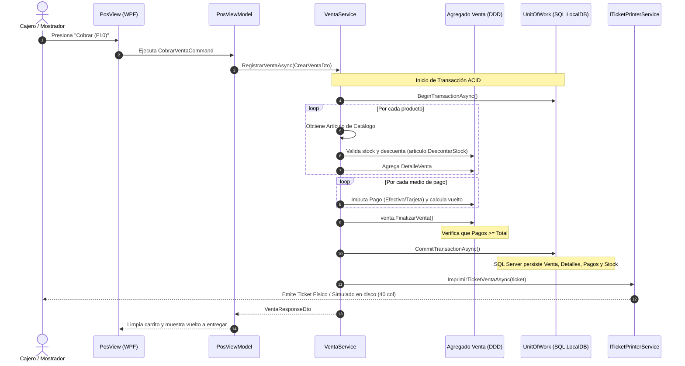

# Flujo de Venta en Mostrador: Cobro Multimedio, Descuento Atómico de Stock y Ticket

### Módulo: 05. Casos de Uso y Flujos de Negocio de Punta a Punta
**Audiencia:** Desarrolladores, estudiantes universitarios y mesa evaluadora de cátedra  
**Requisitos Vinculados:** `RF-09` (Punto de Venta y Cobro Multimedio) y `RF-10` (Descuento Atómico de Stock)  
**Archivos de Código:**
* Entidades: [`Venta.cs`](file:///c:/Users/lucas/Proyectos/retail/src/Retail.Domain/Entities/Venta.cs), [`DetalleVenta.cs`](file:///c:/Users/lucas/Proyectos/retail/src/Retail.Domain/Entities/DetalleVenta.cs) y [`PagoVenta.cs`](file:///c:/Users/lucas/Proyectos/retail/src/Retail.Domain/Entities/PagoVenta.cs)
* Caso de Uso: [`IVentaService.cs`](file:///c:/Users/lucas/Proyectos/retail/src/Retail.Application/Interfaces/Services/IVentaService.cs) y [`CrearVentaDto.cs`](file:///c:/Users/lucas/Proyectos/retail/src/Retail.Application/DTOs/Ventas/CrearVentaDto.cs)
* Excepciones: [`StockInsuficienteException.cs`](file:///c:/Users/lucas/Proyectos/retail/src/Retail.Domain/Exceptions/StockInsuficienteException.cs) y [`MontoPagoInsuficienteException.cs`](file:///c:/Users/lucas/Proyectos/retail/src/Retail.Domain/Exceptions/MontoPagoInsuficienteException.cs)

---

## 1. 📖 Fundamento Teórico y Académico

### 1.1 La Transacción Comercial Central del Retail
En un punto de venta, la formalización de una venta representa el caso de uso de mayor impacto operativo y contable. Involucra tres responsabilidades críticas que deben ejecutarse bajo una **transacción atómica (ACID)**:
1. **Consolidación del Carrito:** Fijar los ítems vendidos, sus cantidades y los precios unitarios vigentes al momento del cobro.
2. **Descuento Atómico de Inventario:** Restar las unidades físicas vendidas de la tabla de artículos en góndola. No puede haber ventas confirmadas con stock en negativo no autorizado.
3. **Imputación y Cancelación Financiera:** Registrar los medios de pago (efectivo, tarjetas, billeteras virtuales, cuenta corriente) garantizando la invariante:
   $$\sum \text{Monto de Pagos} \ge \text{Total de la Venta}$$
   Si el cliente abona en efectivo con un billete de mayor denominación, el sistema debe calcular con exactitud el vuelto a devolver y registrar únicamente el importe neto en el balance de caja.

---

## 2. 💻 Aplicación Concreta en el Código de Retail

### 2.1 La Entrada de Datos: `CrearVentaDto`
En [`src/Retail.Application/DTOs/Ventas/CrearVentaDto.cs`](file:///c:/Users/lucas/Proyectos/retail/src/Retail.Application/DTOs/Ventas/CrearVentaDto.cs), el caso de uso recibe una estructura inmutable que admite pagos mixtos (*Split Payments*):

```csharp
public record class CrearVentaDto(
    int TurnoCajaId,
    int UsuarioId,
    int? ClienteId,
    int? PresupuestoOrigenId,
    IReadOnlyList<CrearVentaItemDto> Items,
    IReadOnlyList<CrearVentaPagoDto> Pagos);
```

### 2.2 Validación de Invariantes en el Agregado `Venta`
Antes de persistir, la entidad [`Venta.cs`](file:///c:/Users/lucas/Proyectos/retail/src/Retail.Domain/Entities/Venta.cs) comprueba la suficiencia de stock e integridad de los pagos:

```csharp
public void FinalizarVenta()
{
    if (!Detalles.Any())
        throw new VentaVaciaException("No se puede registrar una venta sin artículos.");

    decimal totalAbonado = Pagos.Sum(p => p.Monto);
    if (totalAbonado < Total)
    {
        throw new MontoPagoInsuficienteException(
            $"El monto abonado (${totalAbonado:N2}) es insuficiente para cubrir el total (${Total:N2}).");
    }
}
```

### 2.3 Orquestación Transaccional en `VentaService`
El servicio coordina la lectura, mutación y guardado bajo una única transacción de base de datos:

```csharp
public async Task<VentaResponseDto> RegistrarVentaAsync(CrearVentaDto dto, CancellationToken ct)
{
    await _unitOfWork.BeginTransactionAsync(ct);
    try
    {
        var venta = new Venta
        {
            IdTurno = dto.TurnoCajaId,
            IdUsuario = dto.UsuarioId,
            IdCliente = dto.ClienteId ?? 1, // Consumidor Final por defecto
            FechaHora = DateTime.UtcNow
        };

        // 1. Procesar ítems y descontar stock
        foreach (var itemDto in dto.Items)
        {
            var articulo = await _articuloRepo.GetByIdAsync(itemDto.ArticuloId, ct)
                ?? throw new KeyNotFoundException($"Artículo {itemDto.ArticuloId} no encontrado.");

            // Valida disponibilidad física de góndola
            if (articulo.StockActual < itemDto.Cantidad)
            {
                throw new StockInsuficienteException(
                    articulo.Id, articulo.Descripcion, articulo.StockActual, itemDto.Cantidad);
            }

            articulo.DescontarStock(itemDto.Cantidad);
            venta.Detalles.Add(new DetalleVenta(venta, articulo.Id, itemDto.Cantidad, articulo.PrecioVenta));
        }

        venta.Subtotal = venta.Detalles.Sum(d => d.Subtotal);
        venta.Total = venta.Subtotal;

        // 2. Procesar cobro multimedio
        foreach (var pagoDto in dto.Pagos)
        {
            decimal vuelto = 0;
            if (pagoDto.MedioPago == MedioPagoEnum.Efectivo && pagoDto.MontoRecibido > pagoDto.MontoAImputar)
            {
                vuelto = pagoDto.MontoRecibido - pagoDto.MontoAImputar;
            }

            venta.Pagos.Add(new PagoVenta(venta, pagoDto.MedioPago, pagoDto.MontoAImputar, vuelto));
        }

        venta.FinalizarVenta();

        // 3. Persistencia atómica
        await _ventaRepo.AddAsync(venta, ct);
        await _unitOfWork.CommitTransactionAsync(ct);

        // 4. Impresión de ticket de mostrador
        await _ticketPrinter.ImprimirTicketVentaAsync(venta.ToResponseDto(), ct);

        return venta.ToResponseDto();
    }
    catch
    {
        await _unitOfWork.RollbackTransactionAsync(ct);
        throw;
    }
}
```

---

## 3. 📊 Diagrama Explicativo: Recorrido Completo de la Venta



---

## 4. ⚖️ Decisiones de Diseño y Trade-offs

### ¿Por qué soportar Cobro Multimedio (*Split Payments*) de forma nativa?
* En el comercio moderno, un cliente suele pedir: *"Cobrame $5.000 en efectivo y el resto ($12.400) con Mercado Pago o Tarjeta de Débito"*.
* Si el modelo tuviera una única columna `MedioPago` en la tabla `ventas`, el sistema no podría reflejar la realidad contable de la gaveta de dinero. Al modelar `PagoVenta` como una colección interna del agregado, el arqueo de caja de efectivo concilia de forma exacta sin desfasajes de centavos.

---

## 5. 🎓 Preguntas de Examen de Cátedra (Autoevaluación)

### Pregunta 1: *"¿Qué sucede si se intenta cobrar una venta donde uno de los artículos no tiene stock suficiente en la base de datos?"*
> **Respuesta Modelo del Estudiante:**  
> "El servicio detecta la inconsistencia antes de comprometer los cambios e interrumpe la operación lanzando una excepción tipada `StockInsuficienteException` con los datos del artículo, el stock disponible y la cantidad solicitada.  
> Esta excepción activa el bloque `catch`, el cual invoca `_unitOfWork.RollbackTransactionAsync()`. La base de datos descarta cualquier modificación previa, ningún artículo es descontado y no se genera registro de venta ni ticket. La excepción viaja al `PosViewModel`, el cual despliega una alerta visual clara al cajero sin congelar la aplicación ni perder los demás ítems del carrito."

### Pregunta 2: *"¿Por qué el cálculo del vuelto se realiza en el servidor de aplicación y se registra en la base de datos en lugar de dejar que la UI lo muestre de forma volátil?"*
> **Respuesta Modelo del Estudiante:**  
> "Porque el vuelto tiene implicancia contable directa en el balance de efectivo de la gaveta. Si un cliente paga un total de $3.000 con un billete de $10.000, ingresaron físicamente $10.000 a la caja pero egresaron $7.000 como vuelto.  
> Registrar el campo `Vuelto` en la entidad `PagoVenta` permite que el arqueo de caja (`TurnoCaja`) calcule el **Saldo Teórico de Efectivo** considerando con exactitud el flujo neto real de billetes, previniendo falsos sobrantes o faltantes al momento del cierre de turno."
