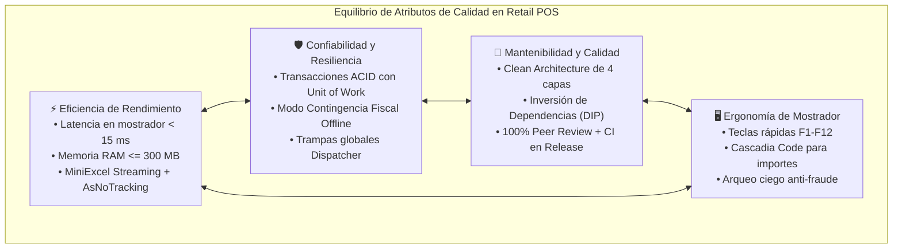

# Matriz de Trade-offs y Decisiones de Diseño Arquitectónico

### Módulo: 06. Vademécum para la Defensa Oral de Cátedra
**Audiencia:** Lucas Kruzolek, Pablo Fernandez y mesa evaluadora de cátedra  
**Marco Metodológico:** *Architecture Tradeoff Analysis Method (ATAM - Software Engineering Institute)* y *Estándar de Calidad ISO/IEC 25010*  
**Premisa Fundamental:** *"En la ingeniería de software no existen soluciones perfectas; existen únicamente compensaciones deliberadas entre trade-offs."*

---

## 1. 📖 Fundamento Teórico y Académico

### 1.1 El Método ATAM y la Evaluación de Atributos de Calidad
Según el **Software Engineering Institute (SEI)** de la Universidad Carnegie Mellon, la evaluación de una arquitectura no consiste en juzgar si una tecnología es "buena" o "mala" en abstracto, sino en analizar cómo responde ante los **atributos de calidad prioritarios** del sistema:

* **Eficiencia de Desempeño (Latencia $< 15\text{ ms}$, RAM $\le 300\text{ MB}$):** El software de mostrador no puede titubear frente al cliente.
* **Confiabilidad y Disponibilidad (Tolerancia a Caídas de Internet):** La tienda debe seguir vendiendo y registrando pagos aunque la nube no responda.
* **Mantenibilidad y Testeabilidad:** Código desacoplado, modular, testeable mediante pruebas unitarias sin dependencias externas.
* **Usabilidad y Ergonomía:** Operación fluida mediante teclado (F1-F12) y tipografía monoespaciada para balances contables exactos.

A continuación se presentan las **7 matrices comparativas formales** que sustentan las decisiones técnicas tomadas en `Retail.sln` frente a las alternativas evaluadas y descartadas.

---

## 2. ⚖️ Matrices Comparativas de Decisiones Técnicas

### Matriz 1: Estilo de Arquitectura General del Sistema

| Criterio de Evaluación | Clean Desktop Monolith (Nuestra Elección) | Microservicios en la Nube (AWS/Azure) | Cliente-Servidor Clásico (2 Capas Fat Client) |
| :--- | :---: | :---: | :---: |
| **Latencia entre Componentes** | **Sub-milisegundo ($<0.01\text{ ms}$)** en memoria. | $50\text{ ms} - 250\text{ ms}$ por llamada de red HTTP. | $5\text{ ms} - 20\text{ ms}$ por consulta remota. |
| **Operación sin Internet (Offline-First)** | ✅ **100% Operativo** con LocalDB local. | ❌ **Inoperable** (la caja se detiene). | ⚠️ Requiere conexión permanente a la LAN. |
| **Complejidad de Despliegue** | **Mínima:** Un solo binario `.zip` auto-contenido. | **Muy Alta:** Orquestación Docker, API Gateways, Service Bus. | **Media:** Requiere configurar ODBC y servidor SQL compartido. |
| **Límites Modulares y Testeabilidad** | **Alta:** 4 capas estrictas forzadas por compilador. | **Alta:** Desacoplamiento por servicio de red. | ❌ **Nula:** Lógica mezclada en stored procedures y formularios. |
| **Costo Operativo Mensual** | **$0 USD:** Corre en la máquina física existente. | $50 - $300 USD/mes de hosting cloud. | Costo de hardware de servidor local. |
| **Veredicto Arquitectónico** | ⭐ **Ganador Absoluto para Retail Minorista.** | ❌ Descartado por fragilidad ante caídas de red. | ❌ Descartado por obsolescencia técnica y deuda de código. |

---

### Matriz 2: Tecnología de Interfaz Gráfica y Plataforma

| Criterio de Evaluación | WPF .NET 8 (WPF-UI) (Nuestra Elección) | Web SPA (React / Angular) | Electron (Chromium + Node) | WinUI 3 / Windows App SDK |
| :--- | :---: | :---: | :---: | :---: |
| **Consumo de Memoria RAM** | **$< 120\text{ MB}$** (Cumple `RNF-03`). | Variable ($100 - 300\text{ MB}$ en navegador). | ❌ **$> 350\text{ MB}$** (Inicia Chromium entero). | $\approx 150 - 200\text{ MB}$. |
| **Comunicación con Hardware POS** | ✅ **Nativa y Directa:** Puertos COM, USB y spooler sin restricciones. | ❌ **Restringida:** Sandbox de navegador bloquea acceso directo a hardware. | ⚠️ Requiere módulos nativos C++ en Node.js. | ✅ Nativa. |
| **Madurez y Estabilidad de APIs** | **Excelente:** 18 años de madurez en Windows. | Alta en web, pero inestable para escritorio. | Alta, pero sobrecargada. | ⚠️ En evolución; bugs frecuentes de empaquetado MSIX. |
| **Estética Visual Moderna** | **Windows 11 Fluent:** Mica, bordes suaves y Snap Layouts con `WPF-UI`. | Dependiente de librerías CSS externas. | Requiere emular controles nativos de Windows. | Windows 11 nativo. |
| **Veredicto Arquitectónico** | ⭐ **Ganador:** Máximo rendimiento nativo y acceso total a hardware. | ❌ Descartado por aislamiento de seguridad de navegadores. | ❌ Descartado por consumo desmedido de RAM en cajas POS. | ❌ Descartado por inmadurez del ciclo de vida y despliegue. |

---

### Matriz 3: Motor de Base de Datos Relacional Local

| Criterio de Evaluación | SQL Server LocalDB (Nuestra Elección) | SQLite (Archivo Plano) | PostgreSQL Local |
| :--- | :---: | :---: | :---: |
| **Concurrencia de Escritura** | **Bloqueo por Fila (Row-Level Locking):** Múltiples lecturas y escrituras simultáneas. | ❌ **Bloqueo a nivel de archivo completo:** Falla ante transacciones concurrentes. | **MVCC Completo:** Alta concurrencia por fila. |
| **Soporte de Índices Filtrados** | ✅ **Nativo y Completo:** Permite `[codigo_barras] IS NOT NULL` (`RF-04`). | ⚠️ Parcial (soporta expresiones simples, sin T-SQL). | ✅ Nativo (`WHERE ...`). |
| **Tipos Decimales y Precisión Monetaria** | `decimal(18,2)` estándar bancario nativo. | ❌ No tiene tipo decimal nativo (usa REAL/punto flotante o strings). | `numeric(18,2)` nativo. |
| **Administración en Máquina de Caja** | **Zero-Admin:** Se ejecuta como proceso hijo bajo la cuenta del usuario. | **Zero-Admin:** Solo es un archivo en disco. | ❌ **Requiere Administrador:** Servicio de Windows, puerto 5432, postgres user. |
| **Escalabilidad a Servidor Central** | **Inmediata:** Misma sintaxis T-SQL que SQL Server Express/Standard. | ❌ Requiere migrar todo el esquema relacional. | Fácil hacia servidor Postgres remoto. |
| **Veredicto Arquitectónico** | ⭐ **Ganador:** Potencia empresarial sin sobrecarga de configuración. | ❌ Descartado por limitaciones en concurrencia y cálculos monetarios. | ❌ Descartado por fricción de instalación para usuarios comunes. |

---

### Matriz 4: Mapeo Objeto-Relacional y Persistencia

| Criterio de Evaluación | EF Core 8 con Fluent API (Nuestra Elección) | Dapper (Micro-ORM) | ADO.NET Puro (`SqlCommand`) |
| :--- | :---: | :---: | :---: |
| **Pureza de Dominio (Clean Architecture)** | ✅ **Absoluta:** Mapeo desacoplado en Infraestructura sin atributos en entidades. | ⚠️ Requiere DTOs planos o acopla nombres de columnas en queries. | ❌ Requiere mapeo manual imperativo fila por fila. |
| **Manejo de Transacciones Complejas** | **Automático:** Unit of Work y Change Tracker coordinan inserciones y claves foráneas. | ⚠️ Manual: El programador debe coordinar `SqlTransaction` paso a paso. | ❌ Muy complejo y propenso a fugas de transacciones sin commit/rollback. |
| **Migraciones de Esquema y Versionado** | ✅ **Nativo y Tipado:** `dotnet ef migrations` sincroniza la base de datos automáticamente. | ❌ Requiere scripts SQL manuales o librerías externas (DbUp/Flyway). | ❌ Totalmente manual. |
| **Velocidad en Consultas de Solo Lectura** | **Casi idéntica a Dapper** al utilizar `.AsNoTracking()` y proyecciones `.Select()`. | Máxima velocidad nativa en micro-benchmarks. | Máxima velocidad teórica. |
| **Veredicto Arquitectónico** | ⭐ **Ganador:** Productividad, migraciones seguras y pureza DDD. | 📌 Excelente micro-ORM, pero requiere excesivo SQL manual. | ❌ Descartado por alto costo de mantenimiento y código espagueti. |

---

### Matriz 5: Validación de Datos de Entrada

| Criterio de Evaluación | FluentValidation Desacoplado (Nuestra Elección) | DataAnnotations (`[Required]`, `[Range]`) | Validación en Interfaz / Code-Behind |
| :--- | :---: | :---: | :---: |
| **Reglas Condicionales Complejas** | ✅ **Nativo:** `When(x => x.MedioPago == CtaCte, () => RuleFor(...))`. | ❌ Muy complejo: Requiere crear atributos `ValidationAttribute` personalizados. | ⚠️ Sentencias `if/else` caóticas dispersas en la vista. |
| **Separación de Responsabilidades** | **Total:** Los DTOs son registros puros; los validadores son clases aisladas. | ❌ Mala: Contamina los DTOs con metadatos y lógica de validación. | ❌ Pésima: Acopla la validación a los eventos de los controles WPF. |
| **Testeabilidad Unitaria** | **Inmediata:** Se prueba el validador en milisegundos con `validator.TestValidate(dto)`. | Requiere instanciar `ValidationContext`. | ❌ Imposible sin levantar controles gráficos de Windows. |
| **Veredicto Arquitectónico** | ⭐ **Ganador:** Máxima expresividad, limpieza y facilidad de testing. | ❌ Descartado por rigidez ante reglas de negocio dinámicas. | ❌ Descartado por violar los principios básicos de Clean Code. |

---

### Matriz 6: Procesamiento de Planillas Masivas de Proveedores

| Criterio de Evaluación | MiniExcel Streaming (Nuestra Elección) | ClosedXML (Modelo DOM en Memoria) | Microsoft Office Interop Excel |
| :--- | :---: | :---: | :---: |
| **Consumo de Memoria (30.000 Filas)** | **Constante: $< 25\text{ MB}$** (Streaming Forward-Only). | ❌ **$> 450\text{ MB}$** (Carga árbol completo en RAM). | Variable, pero genera fugas de memoria COM severas. |
| **Velocidad de Lectura (10.000 Filas)** | **$< 2.5\text{ segundos}$**. | $8 - 15\text{ segundos}$. | ❌ $> 60\text{ segundos}$ (Llamadas inter-proceso COM lentas). |
| **Dependencias del Sistema Operativo** | **Cero:** Ensamblado .NET puro sin software externo. | Cero: Ensamblado .NET puro. | ❌ **Requiere Microsoft Excel instalado y con licencia activa.** |
| **Veredicto Arquitectónico** | ⭐ **Ganador:** Cumple la meta de RAM $\le 300\text{ MB}$ (`RNF-03`). | ❌ Descartado por riesgo de `OutOfMemoryException` en mostrador. | ❌ Descartado por ser inviable en computadoras comerciales de mostrador. |

---

### Matriz 7: Implementación del Patrón MVVM

| Criterio de Evaluación | Source Generators (CommunityToolkit) (Nuestra Elección) | MVVM Clásico Manual (`INotifyPropertyChanged`) | IL Weaving en Runtime (Fody.PropertyChanged) |
| :--- | :---: | :---: | :---: |
| **Volumen de Líneas de Código** | **Mínimo:** 2 líneas por propiedad (`[ObservableProperty]`). | ❌ **Masivo:** 15 a 20 líneas de boilerplate por propiedad. | Mínimo. |
| **Momento de Generación** | **Tiempo de Compilación (Roslyn):** Emite archivos `.g.cs`. | No hay generación (escritura manual). | Post-compilación modificando binarios IL. |
| **Sobrecarga en Tiempo de Ejecución** | **Cero (0 ms / 0 bytes heap):** Llamadas directas fuertemente tipadas. | Cero. | Mínima, pero altera el código ensamblado. |
| **Facilidad de Depuración (Debugging)** | **Excelente:** Se puede colocar breakpoints en el código generado. | Excelente. | ❌ Muy compleja (el stack trace no coincide con el archivo `.cs`). |
| **Veredicto Arquitectónico** | ⭐ **Ganador:** Máxima productividad con cero penalización en ejecución. | ❌ Descartado por sobrecarga de mantenimiento manual. | ❌ Descartado por introducir 'magia negra' no estándar en la cátedra. |

---

## 3. 📊 Diagrama Explicativo: Radar de Atributos de Calidad (ISO/IEC 25010)

---

## 4. 🎓 Conclusión para la Mesa Examinadora Universitaria

> **Argumento Final del Equipo (Lucas & Pablo):**  
> *"Cada tecnología, biblioteca y patrón en `Retail.sln` fue seleccionado respondiendo a una pregunta concreta de ingeniería de software: ¿Cómo garantizamos que el mostrador de una librería opere de forma ininterrumpida, con latencias imperceptibles, total integridad contable y máxima legibilidad de código para un equipo universitario?  
> El resultado es un **Clean Desktop Monolith** que no le teme a las caídas de internet, no satura la memoria de la máquina, no esconde deuda técnica y se encuentra 100% respaldado por pruebas automatizadas y documentación formal."*
