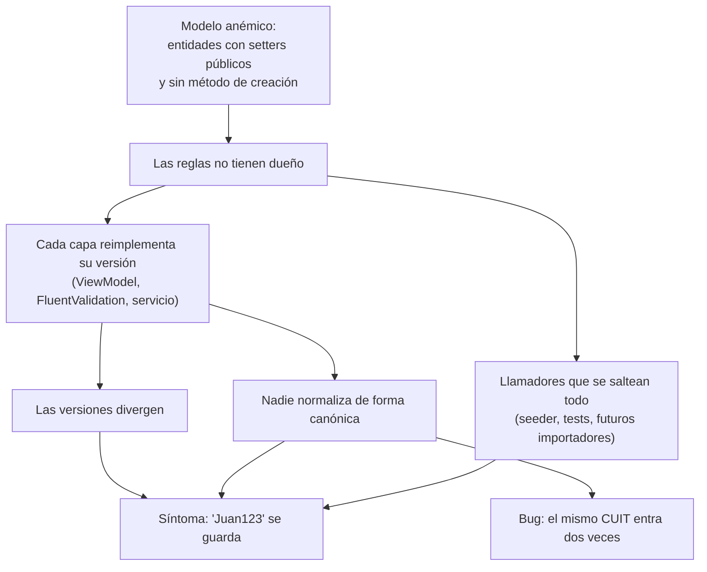
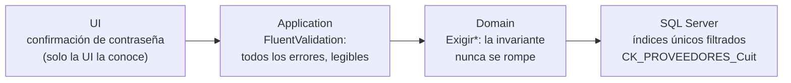
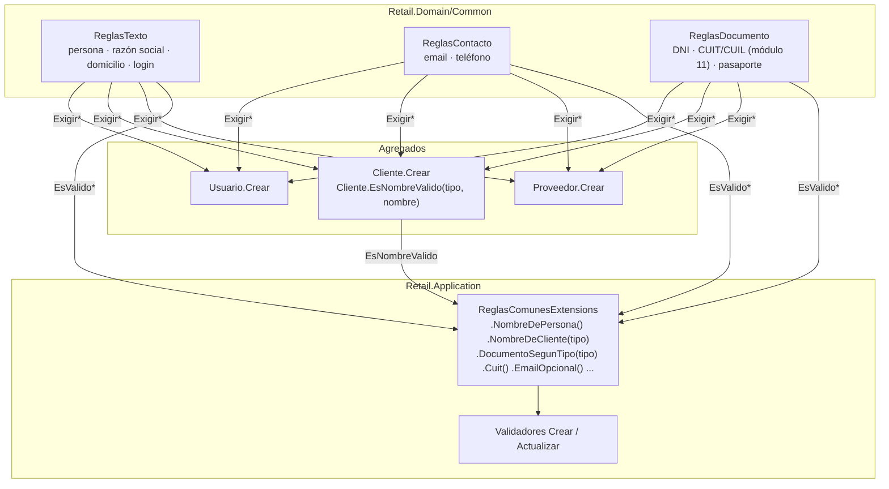
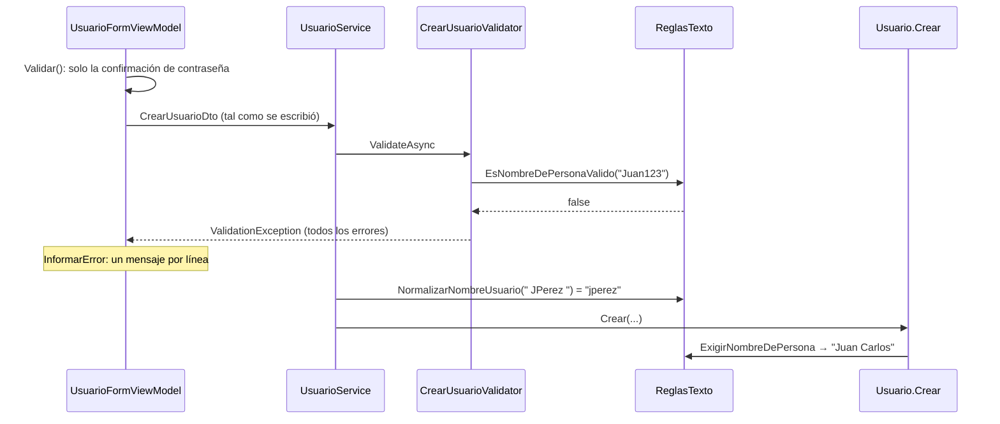
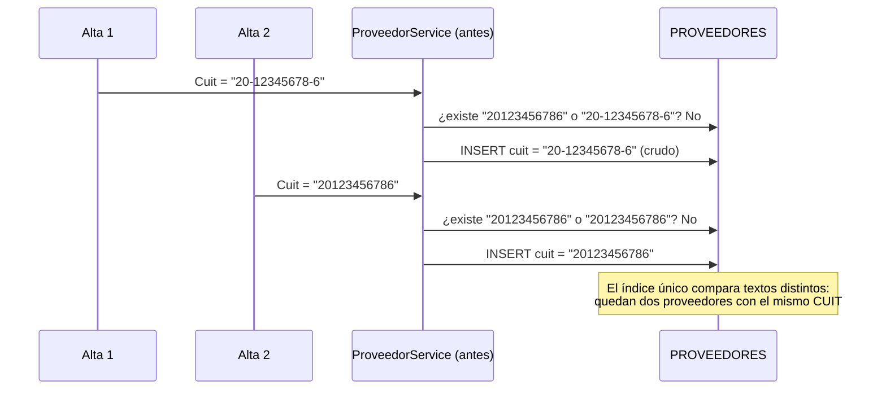

# Normalización y Validación de Datos Maestros

### Módulo: 06. Vademécum para la Defensa Oral de Cátedra
**Audiencia:** Lucas Kruzolek, Pablo Fernandez y mesa evaluadora de cátedra
**Origen:** crítica de la cátedra al ABM de usuarios: *"normalización incompleta de los datos y falta de validaciones (por ejemplo, pueden insertarse números en los nombres)"*
**Fecha:** 2026-10-09 · **Rama:** `feat/normalizacion-datos-maestros`
**Requisitos:** `RF-03` (Usuarios), `RF-20` (Clientes), `RF-05` / `RF-07` (Proveedores), `RNF-04` (criptografía)
**Premisa:** *"Un bug reportado describe un síntoma. Corregir solo el síntoma deja la causa esperando el próximo caso."*

---

## 1. Resumen ejecutivo

| Antes | Después |
| :--- | :--- |
| `"Juan123"`, `"@@@"` o `"😀"` se guardaban como nombres. | Se rechazan: los nombres de persona solo admiten letras Unicode, espacios, apóstrofo y guion. |
| Las reglas estaban copiadas en el ViewModel, en FluentValidation y en el servicio, y las copias no coincidían. | Cada regla está escrita **una sola vez**, en el Dominio. Las demás capas la reutilizan. |
| Las entidades tenían setters públicos y se creaban con `new X { ... }`: cualquier código podía saltear las reglas. | `Usuario`, `Cliente` y `Proveedor` se crean solo con `X.Crear(...)`, con setters privados. |
| `nombre_completo` era una sola columna. | `Usuario` tiene `Nombre` y `Apellido` (1FN); `NombreCompleto` es calculado (3FN). |
| `"12.345.678"` y `"12345678"` eran dos clientes distintos. | El documento se guarda en forma canónica (solo dígitos) y el duplicado se detecta. |
| **Bug real:** el mismo CUIT escrito con y sin guiones permitía dos proveedores. | El CUIT se guarda siempre como 11 dígitos, y además lo exige un `CHECK` en la base. |
| Un CUIT con dígito verificador incorrecto (`20-12345678-0`) se aceptaba. | Se valida el **dígito verificador módulo 11** y el prefijo (persona física o jurídica). |
| `"a@b"` era un email válido; el teléfono era texto libre. | Email con dominio completo y en minúsculas; teléfono con 8 a 15 dígitos (E.164). |
| No había tests de validadores de usuarios. | 1020 tests en verde (Release), incluidas tres migraciones probadas contra LocalDB. |

---

## 2. El problema: síntoma y causa raíz

La cátedra vio un **síntoma**: se podía cargar un nombre con números. Agregar una expresión regular en `CrearUsuarioValidator` lo habría "arreglado" solo para el alta de usuarios. La modificación, el ViewModel, el seeder, los clientes y los proveedores habrían seguido aceptando el mismo dato.



### Hallazgos de la auditoría

| ID | Hallazgo | Agregado |
| :--- | :--- | :--- |
| V-1 | El nombre aceptaba dígitos, símbolos y emojis. | Usuario, Cliente |
| V-5 | Las reglas estaban triplicadas y ya no coincidían. | Usuario, Cliente |
| V-6 / X-3 | El dominio no protegía sus invariantes (setters públicos, `new X { }`). | Los tres |
| N-2 | La unicidad del login dependía, sin que se viera, de la collation del servidor. | Usuario |
| V-3 | La contraseña no tenía máximo, y BCrypt ignora todo lo que pasa de 72 bytes. | Usuario |
| E-1 | `nombre_completo` no era atómico (1FN). | Usuario |
| C-1 | El documento no se normalizaba, así que había duplicados. | Cliente |
| C-2 | El documento no se validaba según su tipo. | Cliente |
| **P-1** | **El CUIT se guardaba tal como se escribía, y el duplicado no se detectaba.** | Proveedor |
| P-2 | El CUIT no se validaba con su dígito verificador. | Proveedor |
| X-1 / X-2 | Email aceptado con solo tener una `@`; teléfono como texto libre. | Cliente, Proveedor |

---

## 3. Fundamento teórico

### 3.1 Invariantes y modelo de dominio rico (DDD, Evans)
Una **invariante** es una condición que debe cumplirse *siempre*, sin importar quién modifique el objeto. En DDD, la **Raíz de Agregado** es responsable de custodiar sus invariantes. Si una entidad expone `{ get; set; }` públicos, en realidad no custodia nada: cualquier llamador puede dejarla en un estado inválido. A eso Fowler lo llama **modelo anémico**: un objeto que guarda datos pero no aplica reglas.

La solución aplicada combina dos patrones:
- **Encapsulación:** setters `private set` y constructor privado, que EF Core usa para materializar desde la base.
- **Método de creación (*Factory Method*):** `Usuario.Crear(...)`, `Cliente.Crear(...)` y `Proveedor.Crear(...)` son la **única** forma de obtener una instancia, y por eso toda instancia es válida desde que nace.

### 3.2 Dos significados de "normalización"
| Sentido | Definición | Dónde se aplicó |
| :--- | :--- | :--- |
| **Normalización de valores** (canonicalización) | Llevar valores equivalentes a una única representación: `" JPerez "` → `"jperez"`, `"20-12345678-6"` → `"20123456786"`. | Las tres entidades: es lo que hace que la unicidad funcione. |
| **Formas normales** (Codd) | 1FN: atributos atómicos. 3FN: ningún atributo depende de otro que no sea la clave. | `Usuario`: `nombre` + `apellido` (1FN); `NombreCompleto` no se persiste porque se deriva de los otros dos (3FN). |

> **Atomicidad (1FN):** un atributo es atómico *según cómo se lo usa*. Para un operador hace falta ordenar y mostrar por apellido, así que `nombre_completo` no era atómico. Para un cliente, el comprobante fiscal de ARCA pide **un único campo** "Apellido y Nombre o Razón Social", y el sistema nunca lo usa por partes. Por eso `RazonSocialONombre` **sí** es atómico y se mantuvo así (ver §7).

### 3.3 Defensa en profundidad
Cada capa protege lo que puede proteger, sin depender de que las otras no fallen:



### 3.4 DRY, SRP y CQS
- **DRY:** cada regla está escrita una sola vez; FluentValidation llama al predicado del Dominio con `.Must(ReglasTexto.EsNombreDePersonaValido)`.
- **SRP:** el Dominio *decide* si un valor es válido; Application *explica* al usuario qué corregir; la UI *muestra* el mensaje.
- **CQS (Meyer):** la modificación de un proveedor recibía `ProveedorDto`, que es el resultado de una consulta. Se creó `ActualizarProveedorDto` para que un campo agregado para la grilla no se vuelva editable sin querer.

---

## 4. La solución: una sola fuente de verdad

### 4.1 Dónde vive cada regla



### 4.2 Las tres funciones de cada regla

| Función | Devuelve | La usa | Ejemplo |
| :--- | :--- | :--- | :--- |
| `Normalizar*` | La forma canónica | El servicio, para buscar duplicados | `NormalizarNombreUsuario(" JPerez ")` → `"jperez"` |
| `EsValido*` | `true` / `false` | FluentValidation | `EsNombreDePersonaValido("Juan123")` → `false` |
| `Exigir*` | El valor normalizado o `DomainException` | El agregado | `ExigirNombreDePersona(" PÉREZ ", "apellido")` → `"Pérez"` |

**Detalle importante:** `EsValido*` **normaliza primero y valida después**. Así el validador de la frontera y el agregado juzgan exactamente el mismo texto. Sin eso, `" J.Perez "` podría pasar en una capa y fallar en la otra.

**¿Cuántas veces se normaliza un valor?** Dos por operación: una en la frontera (FluentValidation → `EsValido*`) y otra en el agregado (`Exigir*`). Esa repetición es buscada, porque el agregado no confía en que alguien haya validado antes. Dentro de cada llamada se normaliza **una sola vez**: `EsValido*` y `Exigir*` delegan en un helper privado `EsFormaCanonica*Valida(normalizado)` que valida el texto ya normalizado, y `Exigir*` devuelve ese mismo resultado. Repetir la normalización es inocuo porque las funciones son **puras** e **idempotentes**, `Normalizar(Normalizar(x)) == Normalizar(x)`, y hay tests que lo verifican.

### 4.3 Reglas por campo

| Campo | Normalización | Validación | Acepta | Rechaza |
| :--- | :--- | :--- | :--- | :--- |
| Nombre / Apellido | NFC, espacios colapsados, mayúscula inicial por palabra, partículas (`de`, `del`, `la`, `los`, `y`) en minúscula | `^\p{L}[\p{L}\p{M}]*(?:[ '\-]\p{L}[\p{L}\p{M}]*)*$`, de 2 a 50 | `María de los Ángeles`, `O'Connor`, `Ñandú` | `Juan123`, `@@@`, `a--b` |
| Login | `Trim` + `ToLowerInvariant` | Empieza con letra; `.` o `_` sin repetir ni al final; de 3 a 50 | `j.perez`, `caja_2` | `123`, `...`, `a..b`, `jpérez` |
| Contraseña | Ninguna | De 6 caracteres a **72 bytes UTF-8**; distinta del login | — | 40 `ñ` (80 bytes) |
| Razón social | NFC, espacios colapsados, **mayúsculas intactas** | Letras, dígitos y `. , & ' - ( ) / º ª °`; al menos una letra | `3M Argentina S.A.`, `López & Hnos.` | `12345`, `😀 S.A.` |
| DNI | Sin `.`, `-` ni espacios | 7 u 8 dígitos | `12.345.678` → `12345678` | `ABC1234` |
| CUIT / CUIL | Sin separadores | 11 dígitos, prefijo válido, **dígito verificador módulo 11** | `20-12345678-6` → `20123456786` | `20123456780`, `11111111111` |
| Pasaporte | Mayúsculas, sin separadores | 6 a 9 letras o dígitos | `aaa 123456` → `AAA123456` | `ab-12` |
| Email | `Trim` + minúsculas | `MailAddress.TryCreate`, dirección pura, dominio con punto, máximo 100 | `ventas@dist.com.ar` | `a@b`, `Nombre <a@b.com>` |
| Teléfono | Solo dígitos y un `+` inicial | 8 a 15 dígitos (E.164) | `(011) 4555-1234` → `01145551234` | `llamar a la tarde` |

> **¿Por qué `[0-9]` y no `\d`?** En .NET, `\d` acepta dígitos Unicode de cualquier alfabeto; por ejemplo, `٣٣٣٣٣٣٣٣` (el 3 arábigo) pasaría como teléfono. Hay un test que lo prueba.

### 4.4 El algoritmo módulo 11 (CUIT/CUIL)

```
Pesos:   5  4  3  2  7  6  5  4  3  2
CUIT:    2  0  1  2  3  4  5  6  7  8 | 6
         10+0 +3 +4 +21+24+25+24+21+16 = 148
148 % 11 = 5  →  11 − 5 = 6  ✔ coincide con el último dígito
```
Casos límite cubiertos por tests: si el resultado da **11**, el dígito es **0**; si da **10**, ningún dígito es válido, y por eso ARCA cambia el prefijo a 23, 24 o 33.

---

## 5. Cambios por agregado

### 5.1 Usuarios (`RF-03`)



- `Nombre` y `Apellido` en columnas separadas, con collation `Modern_Spanish_CI_AI` (búsqueda sin distinguir acentos y con la ñ como letra propia). `NombreCompleto` es una propiedad calculada; por eso el Shell, el POS y la sesión no cambiaron.
- El **login se guarda en minúsculas** y `AuthService` lo normaliza igual. Antes, la unicidad funcionaba "por casualidad", porque la collation del servidor no distingue mayúsculas.
- **Contraseña:** máximo 72 bytes, el límite de BCrypt. Se mide en bytes porque una `ñ` ocupa 2. Es la única regla que vive en Application y no en el Dominio, porque el agregado nunca ve la contraseña en texto plano, solo el hash.
- `DbInitializer` crea el `admin` con `Usuario.Crear` y **verifica que los ID de `ROLES` coincidan con `RolUsuarioEnum`**: una base mal sembrada falla al arrancar en lugar de dar permisos equivocados en silencio.
- **Interfaz:** campos Nombre y Apellido, "Confirmar contraseña" en el alta y modal de 520 × 620 según `SISTEMA_DE_DISENO.md`.

### 5.2 Clientes (`RF-20`)
- El nombre se valida **según el tipo de documento**. Esta regla sale del negocio y no de una heurística:

| Tipo de documento | ¿Qué identifica? | Regla del nombre |
| :--- | :--- | :--- |
| DNI, CUIL, Pasaporte | Siempre una persona física | Nombre de persona: `"Juan123"` se rechaza |
| CUIT | Persona física **o** empresa | Razón social: `"3M Argentina S.A."` se acepta |

- `Cliente.EsNombreValido(tipo, nombre)` toma la decisión **dentro del agregado**, y el validador la reutiliza.
- El documento se guarda en forma canónica y `ClienteService` busca el duplicado con esa misma forma (corrige C-1).
- La cuenta corriente se habilita con `HabilitarCuentaCorriente`, que custodia su propia invariante (límite no negativo).

### 5.3 Proveedores (`RF-05`): el bug P-1



**Corrección:** el agregado guarda siempre los 11 dígitos, y la búsqueda queda en **una sola comparación**. Además se agregó `CK_PROVEEDORES_Cuit` (`LEN = 11` y solo dígitos), que rechaza aunque alguien inserte con un script que saltee la aplicación.

---

## 6. Persistencia y migraciones

| Migración | Qué hace | Lección |
| :--- | :--- | :--- |
| `SepararNombreApellidoUsuarios` | Agrega `nombre` y `apellido`, los completa cortando `nombre_completo` en el último espacio y pasa los login a minúsculas. | El scaffold de EF **borraba la columna vieja antes de completar las nuevas**, y el `admin` quedaba con nombre vacío. Se reordenó a mano: agregar → completar → borrar. |
| `NormalizarDocumentosYContactoClientes` | Solo datos: documento, email y teléfono a su forma canónica. | Sin esta migración, un `"12.345.678"` guardado antes no coincidiría con la búsqueda nueva. **No normaliza una fila si chocaría con otro cliente activo**, porque el índice único abortaría la migración y la app no arrancaría. Elegir cuál conservar es una decisión de negocio. |
| `NormalizarCuitProveedoresYCheck` | Normaliza los CUIT y crea el `CHECK`. | El scaffold verificaba las filas existentes. El `CHECK` se crea `WITH NOCHECK`: valida todo `INSERT`/`UPDATE` nuevo sin bloquear el arranque por una fila histórica. |

**Cómo se probaron:** cada una tiene un test xUnit contra LocalDB que (1) migra hasta la versión **anterior**, (2) inserta filas con el **esquema viejo** usando SQL y (3) aplica la migración y verifica el resultado. El de proveedores además comprueba que la base rechace un `INSERT` manual con guiones. No dimos por bueno el SQL porque "compila": lo verificamos contra el motor real.

> **Alternativa descartada:** `CHECK ([nombre_usuario] = LOWER([nombre_usuario]))` **siempre da verdadero**, porque la collation `CI` compara sin distinguir mayúsculas. Para que funcione habría que forzar `COLLATE Latin1_General_BIN`. Como el Dominio ya garantiza la regla, no se justificó.

---

## 7. Decisiones y alternativas descartadas

| Decisión | Alternativa descartada | Por qué |
| :--- | :--- | :--- |
| Encapsular el agregado y concentrar las reglas en clases estáticas del Dominio (**opción B**) | Solo FluentValidation (A) | No corrige la causa raíz: el agregado sigue anémico y el seeder sigue salteando las reglas. |
| (idem) | Value Objects `NombrePersona`, `Cuit` (C) | Es lo más "de libro", pero para dos o tres campos por entidad agrega `ValueConverter` de EF sin dar más garantías que el agregado encapsulado (YAGNI). |
| Separar `Nombre`/`Apellido` en **Usuario** | Separarlos también en **Cliente** | Una empresa no tiene apellido, y ARCA pide un único campo. En Cliente el valor es atómico para el uso que tiene. |
| **No** agregar email a Usuario | Agregarlo para recuperar contraseñas | Ningún RF lo pide; la app es offline y no tiene SMTP; RF-03 ya define la recuperación (la hace el Gerente). Ley 25.326, art. 4: datos "adecuados, pertinentes y no excesivos". |
| Capitalización determinística | Respetar lo que escribió el usuario | Lo predecible gana a lo ingenioso. Limitación conocida: `McDonald` queda `Mcdonald`. |
| Dígito verificador en el Dominio | Calcularlo en un `CHECK` de SQL | Sería lógica de negocio en la base, prohibida por la Ley 6 de persistencia. El `CHECK` solo controla la forma física. |
| La UI solo controla la confirmación de contraseña | Mantener `Validar()` con las reglas en el ViewModel | Era la tercera copia, ya divergente (V-5). La confirmación queda en la UI porque no viaja en el DTO. |
| Rama apilada sobre `fix/importador-lote-cancelado` | Rebasear sobre `main` | `CLAUDE.md` prohíbe reescribir historia sin pedido explícito, y los tests corrieron sobre esa base. |

---

## 8. Estrategia de pruebas

| Nivel | Qué se prueba | Archivos nuevos o ampliados |
| :--- | :--- | :--- |
| Dominio | Las reglas como **especificación ejecutable** (cada `[InlineData]` es un caso de negocio) e invariantes de los agregados, incluido "no queda a medio actualizar". | `ReglasTextoTests`, `ReglasContactoTests`, `ReglasDocumentoTests`, `UsuarioTests`, `ClienteTests`, `ProveedorDomainTests` |
| Aplicación | Mensajes, casos de borde (72 bytes, `CascadeMode.Stop`) y regresiones de C-1, P-1 y V-8 (login con mayúsculas). | `UsuarioValidatorTests`, `ProveedorValidatorTests` (nuevos), `ClienteValidatorTests`, servicios |
| Infraestructura | Migraciones con datos reales sobre el esquema anterior, y el `CHECK`. | `MigracionSepararNombreApellidoTests`, `MigracionNormalizarClientesTests`, `MigracionNormalizarProveedoresTests` |
| UI | Que el ViewModel no replique reglas y muestre bien los errores. | `UsuarioFormViewModelTests`, `ClienteFormViewModelTests` |

**Resultado final:** 1020 de 1020 en Release (Dominio 361, Aplicación 261, App 290, Integración 108), 0 advertencias y `dotnet format` limpio.

**Un efecto colateral que conviene contar:** al encapsular, dejaron de compilar más de 70 lugares de los tests que construían entidades con `new X { ... }`, y varios usaban CUIT inventados (`30-11223344-5`) que no pasan el módulo 11. **Los tests mismos estaban cargando los datos inválidos que la cátedra criticó.** Se corrigieron y se agregó `TestData/ClientesDePrueba`, que genera CUIT válidos y distintos.

---

## 9. Limitaciones conocidas y trabajo pendiente

| Tema | Estado | Próximo paso sugerido |
| :--- | :--- | :--- |
| Campos de cuenta corriente de `Cliente` (`SaldoCuentaCorriente`, `LimiteCredito`) | Siguen con setters públicos (fuera de alcance). | Encapsularlos; ya existen los métodos de negocio (`DebitarCuentaCorriente`, `AcreditarCobranza`). |
| Coherencia condición de IVA ↔ documento | No se valida (un Responsable Inscripto debería tener CUIT). | Regla en `Cliente.ActualizarDatos` y en su validador. |
| Listado de usuarios ordenado en memoria (O-1) | Sin cambios: `IRepository<T>` no tiene operaciones para ordenar. | Una consulta proyectada a DTO (Ley 8). |
| CUIT en la grilla de proveedores | Se muestra como `20123456786`. | Un `IValueConverter` de presentación para mostrarlo como `20-12345678-6`. |
| Filas que las migraciones no pudieron normalizar | Son duplicados reales; quedan como estaban. | Revisarlas a mano y después `ALTER TABLE PROVEEDORES WITH CHECK CHECK CONSTRAINT CK_PROVEEDORES_Cuit`. |
| Datos viejos con otros errores de formato | No se migran: el agregado los rechaza al editarlos, y eso obliga a corregirlos. | — |

---

## 10. Lo aprendido

1. **Encapsular también sirve para diseñar:** al poner los setters privados, el compilador mostró cada lugar que se salteaba las reglas.
2. **La unicidad requiere una forma canónica.** Un índice único compara textos; si el mismo dato puede escribirse de dos formas, el índice no protege nada (P-1).
3. **Validar todo antes de asignar.** La primera versión de `Usuario.ActualizarDatos` asignaba el nombre y después fallaba con el apellido; el agregado quedaba a medio modificar. Lo detectó un test.
4. **Una migración no es correcta porque EF la generó.** El scaffold perdía datos o podía impedir el arranque; solo un test sobre el esquema anterior lo demuestra.
5. **Los tests también pueden cargar datos inválidos**, y conviene tratarlos con el mismo rigor que al código de producción.

---

## 11. Preguntas de defensa (con respuesta modelo)

**1. "Si `Usuario.Crear` ya valida, ¿para qué está `CrearUsuarioValidator`? ¿No es duplicar?"**
No es la misma responsabilidad. El agregado garantiza la invariante y corta en el primer error, porque su función es que nunca exista un usuario inválido. El validador junta *todos* los errores con mensajes para el usuario. La regla está escrita una sola vez: el validador llama al mismo predicado del Dominio.

**2. "¿Por qué el nombre del cliente no se separa en nombre y apellido, si eso hicieron con el usuario?"**
Porque la atomicidad depende del uso. El comprobante de ARCA pide un único campo "Apellido y Nombre o Razón Social", una empresa no tiene apellido, y el sistema nunca usa el valor por partes. En el operador sí se ordena y se muestra por apellido.

**3. "¿Cómo saben que un CUIT es válido?"**
Con el algoritmo módulo 11 sobre los 10 primeros dígitos (pesos 5-4-3-2-7-6-5-4-3-2), más el prefijo: 20/23/24/27 para personas y 30/33/34 para empresas. Un CUIL solo admite prefijos de persona.

**4. "¿Por qué la contraseña se limita en bytes y no en caracteres?"**
Porque BCrypt trunca a los 72 bytes UTF-8: dos contraseñas que compartan esos 72 bytes darían el mismo hash. Una `ñ` ocupa 2 bytes, así que 40 `ñ` superan el límite aunque sean 40 caracteres.

**5. "¿Qué pasa si alguien inserta un proveedor directamente por SQL?"**
El Dominio no lo puede impedir; para eso está `CK_PROVEEDORES_Cuit`, que exige 11 dígitos. El dígito verificador no se controla en SQL porque sería lógica de negocio en la base (Ley 6). Es defensa en profundidad: cada capa protege lo que puede.

**6. "¿Por qué el CHECK es `WITH NOCHECK`? ¿No es hacer trampa?"**
Valida todo `INSERT` y `UPDATE` nuevo. Lo que no hace es verificar las filas históricas, porque si quedara una sin normalizar (un duplicado real), la migración fallaría y la aplicación no arrancaría. SQL Server lo marca como "no confiable" hasta que una persona resuelva esos casos y lo reactive con `WITH CHECK`.

**7. "¿Por qué `ToLowerInvariant` y no `ToLower`?"**
`ToLower` depende del idioma del sistema operativo; el caso típico es la `I` turca, que pasa a `ı`. Un login tiene que dar lo mismo en cualquier máquina.

**8. "¿Por qué no usaron Value Objects?"**
Los evaluamos (opción C). Para dos o tres campos por entidad agregan mapeo de EF sin dar más garantías que el agregado encapsulado, porque nadie puede construir ni modificar la entidad sin pasar por las reglas. Si las reglas crecieran (por ejemplo, un `Cuit` que se use en muchos agregados), migrar a Value Object sería directo, porque la lógica ya está concentrada en `ReglasDocumento`.

**9. "¿Cómo saben que la migración no rompe los datos?"**
No lo suponemos. Hay un test por migración que parte del esquema anterior, inserta filas viejas con SQL, aplica la migración y verifica el resultado contra LocalDB. Uno de esos tests detectó que el scaffold original perdía datos.

**10. "Si el usuario escribe `JUAN PÉREZ`, ¿qué se guarda?"**
`Juan Pérez`. La normalización compone Unicode (NFC), colapsa espacios y aplica mayúscula inicial por palabra, con las partículas en minúscula (`María de los Ángeles`). Es determinística: la misma entrada siempre da la misma salida.

---

## 12. Mapa de archivos

| Capa | Archivos principales |
| :--- | :--- |
| Dominio | [`Common/ReglasTexto.cs`](../../src/Retail.Domain/Common/ReglasTexto.cs), [`Common/ReglasContacto.cs`](../../src/Retail.Domain/Common/ReglasContacto.cs), [`Common/ReglasDocumento.cs`](../../src/Retail.Domain/Common/ReglasDocumento.cs), [`Entities/Usuario.cs`](../../src/Retail.Domain/Entities/Usuario.cs), [`Entities/Cliente.cs`](../../src/Retail.Domain/Entities/Cliente.cs), [`Entities/Proveedor.cs`](../../src/Retail.Domain/Entities/Proveedor.cs) |
| Aplicación | [`Validators/Common/ReglasComunesExtensions.cs`](../../src/Retail.Application/Validators/Common/ReglasComunesExtensions.cs), validadores de `Usuarios/`, `Clientes/` y `Proveedores/`, [`DTOs/Proveedores/ActualizarProveedorDto.cs`](../../src/Retail.Application/DTOs/Proveedores/ActualizarProveedorDto.cs), `UsuarioService`, `AuthService`, `ClienteService`, `ProveedorService` |
| Infraestructura | `UsuarioConfiguration`, `ProveedorConfiguration`, `DbInitializer`, migraciones `SepararNombreApellidoUsuarios`, `NormalizarDocumentosYContactoClientes`, `NormalizarCuitProveedoresYCheck` |
| UI | `UsuarioFormViewModel`, `UsuarioFormDialog.xaml`, `ClienteFormViewModel`, `ProveedorFormViewModel` |
| Documentación | `MAPA_DEL_PROYECTO.md`, `DER.mmd`, `SISTEMA_DE_PERSISTENCIA.md` |

**Commits:** `2512aa9` (Fase A: reglas de dominio) · `a8ef1fd` (Fases B y C: Usuarios y Clientes) · `1a913b2` (Fase D: Proveedores) · `72b4a2b` (este informe) · más el ajuste que normaliza una sola vez por llamada.
