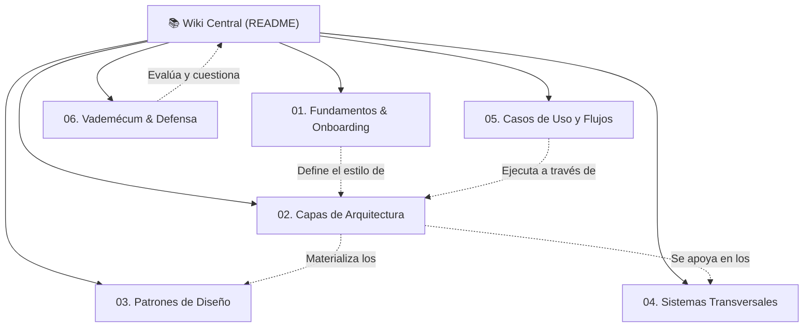

# 📚 Wiki del Proyecto Retail (Portal de Ingeniería y Aprendizaje)

### Sistema ERP & Punto de Venta para Librería
**Cátedra:** Taller de Programación — Proyecto Universitario de Software  
**Equipo de Desarrollo:** Lucas Kruzolek & Pablo Fernandez  
**Plataforma Tecnológica:** .NET 8 LTS | C# 12 | WPF (Windows) | Entity Framework Core 8 | SQL Server LocalDB  

---

## 🎯 Manifiesto y Propósito Pedagógico (Anti-Vibecoding)

En una era donde los agentes de Inteligencia Artificial pueden generar código a gran velocidad, este proyecto asume una postura explícita: **el desarrollo de software es un ejercicio de comprensión rigurosa, modelado formal y toma consciente de decisiones de diseño**. 

Esta Wiki existe para **combatir la atrofia cognitiva del desarrollador (*vibecoding*)**. Su objetivo es que ningún colaborador, estudiante o docente vea el código como una "caja negra mágica", sino como la materialización deliberada de principios de ingeniería de software:

* **Dominio Teórico y Académico:** Entender *por qué* existe un patrón (DDD, Clean Architecture, MVVM, Unit of Work) antes de aplicarlo.
* **Trazabilidad en Código Real:** Cada concepto teórico se conecta directamente con archivos, líneas e interfaces de la solución `Retail.sln`.
* **Visualización Dinámica:** Diagramas Mermaid de clases, secuencia y arquitectura para internalizar el flujo de datos.
* **Preparación para la Defensa de Cátedra:** Cuestionarios y justificación de *trade-offs* para responder con solidez frente a una mesa examinadora.

---

## 🔮 Cómo utilizar esta Wiki con Obsidian

Esta wiki está redactada en **Markdown Estándar (CommonMark / GitHub Flavored Markdown)** para evitar el bloqueo de plataforma (*Zero Lock-in*). Puede leerse directamente en GitHub o en cualquier editor (VS Code, Rider, Visual Studio), pero está optimizada para ser explorada visualmente como una **Bóveda de Conocimiento (*Vault*) en [Obsidian](https://obsidian.md/)**.

### Guía de Configuración en Obsidian (Paso a Paso)
1. **Descargar e Instalar Obsidian:** Disponible de forma gratuita en [obsidian.md](https://obsidian.md/).
2. **Abrir la Carpeta como Bóveda:**
   * Inicia Obsidian y selecciona **"Open folder as vault"** (Abrir carpeta como bóveda).
   * Selecciona la carpeta `retail/wiki` de este repositorio.
3. **Configuración de Enlaces y Compatibilidad:**
   * En Obsidian, ve a **Settings ➔ Files and links**:
     * Desactiva la opción *"Use [[Wikilinks]]"* si deseas que los enlaces creados sigan el estándar Markdown universal `[Texto](ruta/archivo.md)`.
     * En *"New link format"*, selecciona *"Relative path to file"*.
4. **Herramientas Clave de Aprendizaje en Obsidian:**
   * **Graph View (`Ctrl + G`):** Explora visualmente la red neuronal del sistema: cómo las capas se conectan con los patrones y los sistemas transversales.
   * **Mermaid Nativo:** Todos los diagramas de secuencia y flujo se renderizan automáticamente en tiempo real.
   * **Canvas:** Puedes crear pizarras libres arrastrando artículos y notas para estudiar flujos complejos de cobro y caja.

---

## 🧭 Mapa de Contenidos de la Wiki (MOC - Map of Contents)

### [01. 🚀 Fundamentos y Onboarding](01-fundamentos-y-onboarding/clean-desktop-monolith.md)
* [**Clean Desktop Monolith:**](01-fundamentos-y-onboarding/clean-desktop-monolith.md) ¿Por qué un monolito de escritorio en .NET 8 y WPF para un comercio minorista? Latencia $< 15\text{ ms}$, resiliencia sin internet y evaluación de microservicios.
* [**Entorno de Desarrollo Local:**](01-fundamentos-y-onboarding/entorno-desarrollo-local.md) Requisitos previos, SDK .NET 8, LocalDB y configuración de Visual Studio / Rider / VS Code.
* [**Convenciones y Calidad:**](01-fundamentos-y-onboarding/convenciones-y-calidad.md) Estilo Allman, Cero Tolerancia a Advertencias (`TreatWarningsAsErrors`), Nullable Reference Types y nomenclatura BDD en xUnit.

### [02. 🏛️ Capas de Arquitectura (Clean Architecture)](02-capas-de-arquitectura/01-dominio-ddd.md)
* [**01. Capa de Dominio (DDD Puro):**](02-capas-de-arquitectura/01-dominio-ddd.md) Entidades ricas, Value Objects, Raíces de Agregado (`IAggregateRoot`), invariantes inquebrantables y catálogo de excepciones de negocio.
* [**02. Capa de Aplicación (Casos de Uso):**](02-capas-de-arquitectura/02-aplicacion-casos-de-uso.md) Orquestación de servicios, inmutabilidad con DTOs `record class`, validación declarativa con `FluentValidation` y contratos IoC.
* [**03. Capa de Infraestructura (Persistencia & I/O):**](02-capas-de-arquitectura/03-infraestructura-persistencia.md) Entity Framework Core 8, Fluent API, Filtered Indexes, Unit of Work, cliente fiscal ARCA y lector MiniExcel en streaming.
* [**04. Capa de Presentación (WPF & MVVM):**](02-capas-de-arquitectura/04-presentacion-wpf-mvvm.md) `CommunityToolkit.Mvvm`, Source Generators, el hilo STA (`UI Dispatcher`), Data Binding bidireccional y diseño Windows 11 Fluent.

### [03. 🧩 Patrones de Diseño (GoF & DDD)](03-patrones-de-diseno/repository-and-unit-of-work.md)
* [**Repository & Unit of Work:**](03-patrones-de-diseno/repository-and-unit-of-work.md) Aislamiento del motor relacional, límites de agregados y atomicidad transaccional ACID.
* [**MVVM con Source Generators:**](03-patrones-de-diseno/mvvm-con-source-generators.md) Eliminación de boilerplate con `[ObservableProperty]` y `[RelayCommand]`.
* [**Adapter & Façade:**](03-patrones-de-diseno/adapter-y-facade.md) Abstracción de hardware con `FileDebugTicketPrinterService` y simulación fiscal con `MockArcaClient`.
* [**Soft Delete & Global Query Filters:**](03-patrones-de-diseno/soft-delete-y-global-filters.md) Auditoría comercial obligatoria mediante `BaseEntity.MarkAsDeleted()` y `HasQueryFilter`.
* [**Strategy & Contingencia Fiscal:**](03-patrones-de-diseno/strategy-y-contingencia.md) Manejo de estados fiscales (`AUTORIZADO`, `ERROR_FISCAL_REINTENTABLE`) y emisión de comprobantes en contingencia.

### [04. ⚙️ Sistemas Transversales](04-sistemas-transversales/sistema-de-persistencia.md)
* [**Sistema de Persistencia:**](04-sistemas-transversales/sistema-de-persistencia.md) LocalDB, convenciones Fluent API, estrategia de índices filtrados para códigos de barra nulables y evaluación en servidor (Push-down to SQL).
* [**Sistema de Diseño UI:**](04-sistemas-transversales/sistema-de-diseno-ui.md) Identidad visual Windows 11 Fluent, paleta Borravino (#9D0F33), tipografía dual (`Cascadia Code` / `Segoe UI Variable`) y keycaps F1-F12.
* [**Sistema de Logging y Resiliencia:**](04-sistemas-transversales/sistema-de-logging-y-errores.md) Serilog rotativo (`logs/retail-.log`), trampas globales en hilo STA y diálogo amigable `UnhandledExceptionDialog`.
* [**Sistema de CI/CD y Empaquetado:**](04-sistemas-transversales/sistema-de-ci-cd.md) Workflows de GitHub Actions, Quality Gates de Release y empaquetado auto-contenido win-x64.

### [05. 🔄 Casos de Uso y Flujos de Punta a Punta](05-casos-de-uso-y-flujos/flujo-venta-y-descuento-stock.md)
* [**Venta en Mostrador y Descuento Atómico de Stock:**](05-casos-de-uso-y-flujos/flujo-venta-y-descuento-stock.md) Del escaneo de código de barras al cobro multimedio, persistencia ACID e impresión de ticket.
* [**Presupuestos y Conciliación Adaptativa:**](05-casos-de-uso-y-flujos/flujo-conciliacion-presupuesto.md) Congelamiento de precios por 15 días, conversión a venta y detección de variaciones de costo.
* [**Apertura de Caja y Arqueo Ciego:**](05-casos-de-uso-y-flujos/flujo-caja-y-arqueo-ciego.md) Custodia del efectivo en mostrador, retiros extraordinarios y conciliación ciega contra saldo teórico.
* [**Importación Masiva de Listas de Precios:**](05-casos-de-uso-y-flujos/flujo-importador-excel.md) Streaming de bajo consumo de memoria ($\le 300\text{ MB}$) con MiniExcel delegado a `Task.Run`.

### [06. 🎓 Vademécum de Examen y Defensa Técnica](06-vademecum-defensa-tecnica/preguntas-trampa-de-profesores.md)
* [**Preguntas Trampa de Profesores:**](06-vademecum-defensa-tecnica/preguntas-trampa-de-profesores.md) Justificación rigurosa de decisiones complejas para la mesa de evaluación oral.
* [**Matriz de Trade-offs y Decisiones de Diseño:**](06-vademecum-defensa-tecnica/matriz-tradeoffs-arquitectura.md) Cuadros comparativos de alternativas consideradas y descartadas (WPF vs Web, EF Core vs Dapper, LocalDB vs SQLite).

---

## 📐 Estructura Canónica de cada Artículo de la Wiki

Para preservar la coherencia pedagógica, cada página nueva debe estructurarse conforme a la siguiente plantilla de 5 secciones:

1. **📖 Fundamento Teórico y Académico:** Definición formal del concepto según autores clásicos (Evans, Martin, Fowler, GoF).
2. **💻 Aplicación Concreta en el Código de Retail:** Enlace directo a los archivos de `src/`, con fragmentos de código comentados pedagógicamente.
3. **📊 Diagrama Explicativo (Mermaid):** Representación visual clara (secuencia, estados o arquitectura).
4. **⚖️ Decisiones de Diseño y Trade-offs:** Análisis de "¿Por qué no de otra forma?" y consecuencias de soluciones ingenuas.
5. **🎓 Preguntas de Examen de Cátedra:** 2 o 3 preguntas desafiantes de evaluación oral con su respuesta argumentada.

---

## ⚖️ Frontera Documental: `wiki/` vs. `docs/`

| Dimensión | `wiki/` (Este Portal) | `docs/` (Directorio Técnico Normativo) |
| :--- | :--- | :--- |
| **Audiencia** | Estudiantes, docentes, desarrolladores humanos. | Agentes de código (IA), linters, CI/CD, arquitectura formal. |
| **Tono y Enfoque** | Didáctico, reflexivo, contextualizado, explicativo. | Normativo, contractualmente tipado, prescriptivo, sintético. |
| **Consumo** | Lectura reflexiva, onboarding y preparación de exámenes. | Ingesta *Just-in-Time* guiada por [`docs/MAPA_DEL_PROYECTO.md`](../docs/MAPA_DEL_PROYECTO.md). |
